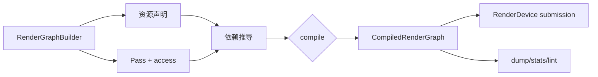
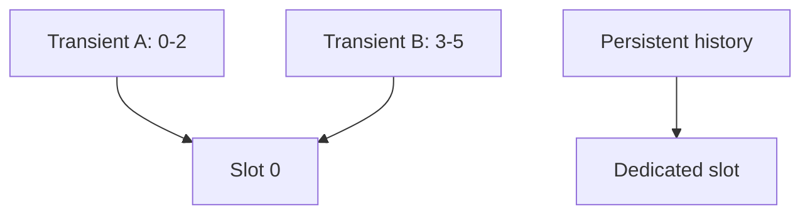

---
related_code:
  - zircon_runtime/src/render_graph
implementation_files:
  - zircon_runtime/src/render_graph/builder.rs
  - zircon_runtime/src/render_graph/builder/compile.rs
  - zircon_runtime/src/render_graph/graph.rs
plan_sources:
  - docs/wiki/graphics/render-graph.md
tests:
  - zircon_runtime/src/render_graph/tests
doc_type: api-reference
---

# RenderGraph 构建与编译 API

RenderGraph 是声明式的帧资源计划器。调用方描述 pass、资源和访问意图，编译器推导依赖、版本、资源状态、队列同步与 transient alias；后端只执行 `CompiledRenderGraph`。图中每个箭头表示数据或访问依赖，不是 Rust 借用关系。



## 建图顺序

```rust
// 调用上下文片段：color_desc、depth_desc 与 builder 所属 render frame 已准备好。
use zircon_runtime::render_graph::{RenderGraphBuilder, QueueLane};

let mut graph = RenderGraphBuilder::new("main-frame");
let color = graph.create_texture(color_desc);
let depth = graph.create_texture(depth_desc);
let gbuffer = graph.add_pass("gbuffer", QueueLane::Graphics);
let lighting = graph.add_pass("lighting", QueueLane::AsyncCompute);
graph.write_texture(gbuffer, color)?;
graph.write_texture(gbuffer, depth)?;
graph.read_texture(lighting, color)?;
graph.add_dependency(gbuffer, lighting)?;
let compiled = graph.compile()?;
```

`create_texture`/`create_buffer` 返回 opaque handle，只能在同一个 builder 中使用。`RenderPassId`、`RgTextureHandle` 和 `RgBufferHandle` 内部带 generation；跨 builder 混用会在访问校验阶段失败。

## Pass API

| API | 用途 | 注意 |
| --- | --- | --- |
| `add_pass(name, queue)` | 声明 pass 与默认队列 | name 用于 dump 与诊断 |
| `add_pass_with_executor` | 附加执行器 id 字符串 | id 只用于运行时注册与诊断，不是闭包 |
| `set_pass_flags` | 标记可剔除或 side effect | side effect pass 不会被无条件 cull |
| `set_compute_workload` | 声明 dispatch 维度 | 必须与 binding schema 相容 |
| `set_compute_pass_metadata` | 声明 shader、pipeline family | metadata 供验证与 fallback |
| `add_dependency(a,b)` | 手工补充顺序 | 仅在资源推导不足时使用 |

默认情况下，写后读、读后写和写后写会自动建立依赖。手工 dependency 不能制造资源版本，也不能绕过 cycle 检查。

## 访问意图与版本

访问方法分为 `read_*`、`write_*`、`access_*` 及其 `*_from_version` 变体。`write_*_versioned` 返回新版本 token，读者必须选择正确版本，否则编译器报告未定义版本。

```rust
// 调用上下文片段：pass_a/pass_b/pass_c、graph 与 color handle 属于同一个 builder。
let v1 = graph.write_texture_versioned(pass_a, color)?;
graph.read_texture_from_version(pass_b, v1)?;
graph.write_storage_texture(pass_c, color)?;
```

`RenderGraphResourceAccessIntent` 区分 sampled、storage、attachment、copy source/destination 等 intent；shader stage 与 subresource range 会参与 barrier 推导。访问范围过宽会产生额外同步，范围过窄则可能被验证器拒绝。

## 外部资源与 present

`import_external_resource*` 将 swapchain、历史纹理或宿主资源纳入图。present 资源应使用 `import_present_external_resource` 或带 binding 的专用方法，确保终端 pass 的 store/load contract 明确。

```rust
// 调用上下文片段：graph、final_pass 与 surface 尺寸由 present 阶段提供。
use zircon_runtime::rhi::{TextureDesc, TextureFormat, TextureUsage};
use zircon_runtime::render_graph::{
    RenderGraphAttachmentOps, RenderGraphExternalResourceBinding,
};

let swap = graph.import_present_external_texture_with_binding(
    "surface",
    TextureDesc::new(
        "surface",
        surface_width,
        surface_height,
        TextureFormat::Bgra8UnormSrgb,
        TextureUsage::RENDER_ATTACHMENT | TextureUsage::PRESENT,
    ),
    RenderGraphExternalResourceBinding::required_texture(),
);
graph.write_external_with_ops(final_pass, swap, RenderGraphAttachmentOps::load_store())?;
```

`import_present_external_texture_with_binding` 的真实签名是
`(&mut self, name, texture_desc, external_binding) -> ExternalResource`，不会返回
`Result`，也不接收单独的 `TextureUsage` 参数。`TextureDesc` 描述外部纹理的物理
尺寸、格式和 usage；`RenderGraphExternalResourceBinding` 只描述 graph 侧的资源
类型与 `ReportOnly`/`Required` 要求。方法内部会自动加入 `present` usage 角色，
但 descriptor 仍应声明后端实际需要的 `RENDER_ATTACHMENT`/`PRESENT` 位。

外部资源的所有权仍在调用方；graph 只保存 binding 元数据和访问记录。不得在图编译后销毁外部对象或复用旧 device generation。

## transient、persistent 与 alias

默认资源为 transient。`mark_persistent` 禁止其被别的资源复用物理 allocation，适合跨帧 history；`mark_readback` 要求保留 copy source 能力并可能增加 staging 开销。`create_texture_view_alias` 允许同一根资源的 mip/aspect 视图，但 alias 访问必须声明不重叠或显式顺序。



编译结果中的 `CompiledRenderGraphTransientAllocationPlan` 可用 `slot_for`、`size_bytes_for`、`validate_transient_allocation_intervals` 检查 alias 是否安全。

## compile 结果

`CompiledRenderGraph` 公开查询：`name`、`passes`、`resource_declarations`、`resource_lifetimes`、`access_metadata`、`resource_state_plan`、`transient_allocation_plan`、`external_access_packet`、`stats`、`dump`。这些对象是只读快照，不提供再次修改图的方法。

```rust
// 调用上下文片段：compiled 是刚完成 compile 的只读图快照。
let dump = compiled.dump();
println!("{}", dump.to_text());
for transition in compiled.resource_state_plan().transitions() {
    tracing::debug!(resource=?transition.resource, "state transition");
}
```

## 错误与否定案例

`RenderGraphError` 覆盖重复名称、未知 handle、版本不匹配、访问冲突、非法 attachment、cycle、外部 binding 缺失、unsupported queue/workload 等。编译失败时整个 graph 无效；不要执行部分 `CompiledRenderGraph`。

```rust
// 伪代码/负面测试：graph 与两个 pass 已在同一 builder 中创建。
// 错误：同一图形成 cycle。
graph.add_dependency(pass_a, pass_b)?;
graph.add_dependency(pass_b, pass_a)?;
assert!(graph.compile().is_err());
```

高频问题是把 transient handle 存入跨帧缓存、把 storage 写入声明为 sampled 读取、或使用错误 mip 版本。解决方案是把跨帧对象提升为 persistent/history external，并在每一帧重新导入。

## 队列与同步

`QueueLane::{Graphics, AsyncCompute, AsyncCopy}` 描述逻辑队列。不同 lane 之间的资源边会生成 `CompiledRenderGraphResourceStateTransition`；`crosses_queue()` 为真时，后端必须保证 timeline/fence 可见性。MVP 后端可以把多个 lane 合并到同一 native queue，但不能删除 graph 依赖。

## 性能检查

- 用 `stats()` 关注 pass 数、资源数、transient slot 和 queue lane 计数。
- 用 store lint 检查 attachment bandwidth 与无效 store。
- 对大纹理声明精确 subresource range，减少 barrier。
- 只有真正跨帧的资源才 `mark_persistent`。
- 在 debug 构建保存 `dump.to_text()`，生产只采样统计。

## 线程与生命周期

Builder 通常由单个 render-prepare 线程拥有；构建期间不可并发修改。编译完成后，`CompiledRenderGraph` 可以通过 `Arc` 传给提交线程，但其中外部 binding 必须仍与同一 `DeviceId`/generation 匹配。执行结束后 transient allocation 由后端回收。

## 当前状态

资源依赖、版本、transient alias、queue metadata、compute workload 与 dump/lint 已实现并有单元测试。更复杂的异步多队列调度、自动 barrier 合并和 GPU-driven scheduling 仍属演进方向；文档中的 queue lane 不等于每个后端都会创建独立 native queue。

## 验收清单

- [ ] 所有外部资源都有 binding 与 usage。
- [ ] 每个写入的后续读取指定正确版本。
- [ ] compile 错误被记录并阻止提交。
- [ ] transient 计划通过 interval 校验。
- [ ] cycle、alias、subresource 与 culling 测试覆盖关键图。

## Public type 逐项说明

### `RenderPassId`

由 builder 分配的 pass identity。字段不公开，调用者只能复制、比较并传回 builder。它携带 generation，因此不能跨图使用。`Debug` 输出只用于日志，不应被解析为稳定数字。

### `RgTextureHandle` 与 `RgBufferHandle`

分别代表图内逻辑 texture/buffer。它们不是 RHI handle，也不保证有独立物理 allocation。编译器可能把两个不重叠 lifetime 的 handle 映射到同一 transient slot。

### `ExternalResource`

描述由 graph 外部拥有的资源根。基础导入只需 name；需要物理纹理/缓冲区校验时再提供 descriptor、binding、usage 和 requirement。graph 销毁不会释放外部对象。present external 还需要 terminal store contract。

### `RenderGraphResourceVersionToken`

写访问产生的新版本标识。token 仅对同一资源根和同一 builder 有效。把 token 存入跨帧缓存会造成 stale version，应在下一帧重新导入资源并重新写入。

### `RenderGraphResourceLifetime`

记录 first use、last use、persistent/readback 属性，供 alias planner 与调试 dump 使用。生命周期不是 Rust drop 时间，也不代表 GPU 已完成时间。

### `RenderGraphResourceUsageFlags`

`RenderGraphResourceUsageFlags` 是记录 `present`、`readback`、`persistent` 三个图生命周期角色的布尔结构；它不是 RHI 的 bit flag，也没有未知 bit。角色决定 cull root、readback 保留和跨帧保留策略；资源的 sampled/storage/copy/attachment intent 由 `RenderGraphResourceAccessIntent` 记录，不能靠 usage 角色推断。

### `RenderGraphAttachmentOps`

组合 load/store 操作。`Load` 要求上一状态内容有效，`Discard` 允许 backend 丢弃内容；该中立类型不携带具体 clear color。对历史或外部纹理误用 `Discard` 会出现未定义画面。

### `BindingSchemaEntry`

将 binding number、资源名、`ComputeBindingKind` 与 mip/buffer range 绑定。schema 是 compute workload validation 的依据，必须与 shader reflection 同步。

### `RenderGraphComputeWorkload`

描述 pipeline label、dispatch extent、workgroup size 与 `RenderGraphComputePipelineFallbackPolicy`。若选择 last-good fallback，只适合同一 interface generation；generation 改变时必须重新 admission。

### `CompiledRenderPass`

编译后 pass 的只读记录，包含 queue、flags、访问 id 和执行元数据。它不提供动态增删依赖的 API；变更必须回到 builder 重新 compile。

### `CompiledRenderGraphStats`

统计 pass 数、资源数、边数、slot 数、queue lane 计数等。统计是 compile-time 结果，不等于 GPU 实测；实测要结合 RHI diagnostic query。

### `CompiledRenderGraphResourceStatePlan`

按资源版本列出状态转换；跨 queue 的 transition 通过 `crosses_queue()` 标记。backend 可合并相邻 barrier，但不能删除跨 queue 可见性要求。

### `CompiledRenderGraphTransientAllocationPlan`

列出 allocation id、slot、字节数和 lifetime 区间。调用 `validate_transient_allocation_intervals` 可在 debug/CI 阶段捕获重叠 alias。

## 编译前检查顺序

1. 校验所有 handle generation 与 builder generation。
2. 校验资源 descriptor 的 extent、format、usage 和 alias group。
3. 校验 pass name、queue、flags 与 executor 元数据。
4. 校验每个 read/write access 的版本、range、shader stage。
5. 推导资源依赖并检测 cycle。
6. 计算 lifetime、state transition 与 transient slot。
7. 生成 compute binding/dispatch packet 与 external access packet。
8. 输出 compiled graph、stats、dump 和 lint report。

## 典型 graph 模板

```rust
// 调用上下文片段：g 与 descriptor/pass 由当前 frame 的 graph authoring 代码提供。
let mut g = RenderGraphBuilder::new("post-frame");
let hdr = g.create_texture(hdr_desc);
let ldr = g.create_texture(ldr_desc);
let tone = g.add_pass("tone-map", QueueLane::Graphics);
g.read_texture(tone, hdr)?;
g.write_texture(tone, ldr)?;
let present = g.import_present_external_resource("swapchain");
g.write_external(tone, present)?;
let graph = g.compile()?;
assert_eq!(graph.name(), "post-frame");
```

## 失败恢复模板

编译失败时保存 builder 输入摘要（资源名、pass 名、访问 intent），向上层返回 typed error，并跳过本帧提交。下一帧重新构建，不要尝试修补已失败的 compiled graph。若失败原因是 capability，可切换 quality profile 后重建；若是 stale generation，应等待设备重建完成。

## 调试输出约定

`RenderGraphDump::to_text` 适合 CI artifact；日志应包含 graph name、frame id、device generation。不要把完整 WGSL 或二进制资源写入每帧日志，改为按错误采样保存。dump 中的 allocation slot 仅是诊断编号，不能当成永久资源 id。
