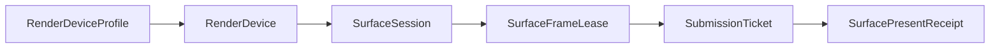
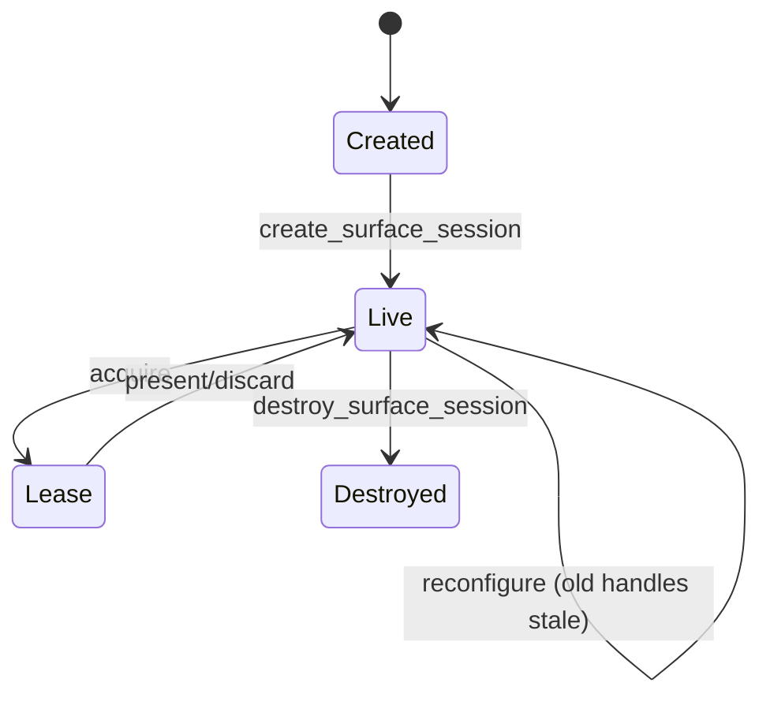
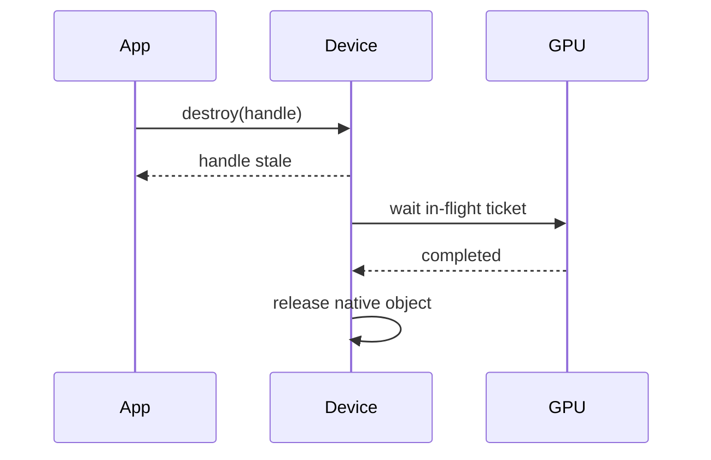

---
related_code:
  - zircon_runtime/crates/zr_rhi/src/device
  - zircon_runtime/crates/zr_rhi/src/surface.rs
  - zircon_runtime/crates/zr_rhi_wgpu/src/device
implementation_files:
  - zircon_runtime/crates/zr_rhi/src/device/render_device.rs
  - zircon_runtime/crates/zr_rhi/src/surface.rs
  - zircon_runtime/crates/zr_rhi_wgpu/src/device/construction.rs
plan_sources:
  - docs/wiki/graphics/rhi-and-wgpu.md
tests:
  - zircon_runtime/crates/zr_rhi/src/tests
  - zircon_runtime/crates/zr_rhi_wgpu/src/tests/surface_lifecycle.rs
doc_type: api-reference
---

# RHI 设备与 Surface 会话

`zr_rhi` 定义跨后端的资源、命令、提交和原生 Surface 合同；`zr_rhi_wgpu` 负责把它映射到 wgpu。RHI 的核心设计是 device-qualified opaque handle：对象必须属于同一 `DeviceId` 与 `DeviceGeneration`，防止设备重建后误用旧资源。



## RenderDevice trait

最小公开能力：

```rust
// 签名摘录：省略 use 列表与其余 RenderDevice 方法，仅展示核心合同。
pub trait RenderDevice: Send + Sync {
    fn caps(&self) -> &RenderBackendCaps;
    fn device_id(&self) -> DeviceId;
    fn generation(&self) -> DeviceGeneration;
    fn create_buffer(&self, desc: &BufferDesc) -> Result<BufferHandle, RhiError>;
    fn create_texture(&self, desc: &TextureDesc) -> Result<TextureHandle, RhiError>;
    fn create_command_list(&self, queue: RenderQueueClass, label: &str)
        -> Result<Box<dyn CommandList>, RhiError>;
    fn enqueue_submission_packet(&self, packet: RhiSubmissionPacket)
        -> Result<SubmissionTicket, RhiError>;
}
```

完整 trait 还包含 desc 查询、destroy、view/sampler/bind group/pipeline 构建、submission poll、diagnostic plan、Surface session 与 readback。具体实现必须先调用 `require_operation` 检查 capability matrix。

## 设备选择

`RenderAdapterCatalog` 收集 adapter facts，`AdapterSelectionPolicy` 描述偏好，`catalog.select(&policy)` 返回带有选中项和拒绝原因的 `AdapterSelectionReceipt`。之后由 `RenderDeviceRequestPolicy::negotiate` 对支持的 feature 集合做必需/可选能力协商；设备 profile 和原生 WGPU context 由 backend 启动流程组装。

```rust
// 调用上下文片段：catalog、supported_features 与 backend context 由启动层提供。
use zr_rhi::{AdapterSelectionPolicy, RenderDeviceRequestPolicy};

let selection = catalog.select(&AdapterSelectionPolicy::default())?;
let policy = RenderDeviceRequestPolicy::mvp_baseline();
let negotiation = policy.negotiate(&supported_features)?;
let adapter = selection.selected();
// backend 使用 adapter、negotiation 和原生 device context 构造 RenderDeviceProfile。
```

上例为调用形状；当前构造入口由 runtime backend 封装。应用不要自行猜测 adapter 名称或强制 feature，应该读取 `RenderBackendCaps`。

## Surface session

```rust
// 调用上下文片段：device、窗口句柄、尺寸与当前 generation 已由宿主提供。
use zr_rhi::{
    PresentMode, RenderDevice, RenderNativeSurfaceTarget, RenderPassColorAttachmentDesc,
    RenderPassColorLoadOp, RenderPassStoreOp, RenderPassTextureViewDesc, RenderQueueClass,
    RenderSurfaceDescriptor, SurfaceAcquireOutcome, SurfaceSessionCreateOutcome, SwapchainDesc,
    TextureFormat, RenderClearColor,
};

let descriptor = RenderSurfaceDescriptor::new(
    "main",
    RenderNativeSurfaceTarget::Win32 { hwnd, hinstance: None },
    SwapchainDesc {
        width,
        height,
        present_mode: PresentMode::Fifo,
        format: TextureFormat::Bgra8UnormSrgb,
    },
);
let created = device.create_surface_session(&descriptor)?;
let session = match created {
    SurfaceSessionCreateOutcome::Renderable(receipt)
    | SurfaceSessionCreateOutcome::NonRenderable(receipt) => receipt.session(),
};
match device.acquire_surface_frame(session)? {
    SurfaceAcquireOutcome::Acquired(frame) => {
        let mut commands = device.create_command_list(RenderQueueClass::Graphics, "surface-clear")?;
        commands.begin_render_pass(
            "surface-clear-pass",
            vec![RenderPassColorAttachmentDesc::new(
                frame.target(),
                RenderPassColorLoadOp::Clear(RenderClearColor::BLACK),
                RenderPassStoreOp::Store,
            )
            .with_view(RenderPassTextureViewDesc::new(frame.target())
                .with_registered_view(frame.default_view()))],
            None,
        );
        commands.end_render_pass();
        let ticket = device.submit(commands)?;
        device.present_surface_frame(frame, ticket)?;
    }
    SurfaceAcquireOutcome::Retryable { session: _, reason } => {
        tracing::debug!(?reason, "surface acquire is retryable");
    }
    SurfaceAcquireOutcome::ReconfigureRequired { session, reason } => {
        tracing::info!(?session, ?reason, "surface must be reconfigured");
    }
    SurfaceAcquireOutcome::NonRenderable { session } => {
        tracing::debug!(?session, "surface has zero extent or is disabled");
    }
}
```

一帧最多一个 lease。`present_surface_frame` 不提交 native queue；它只消费已经 Submitted/Completed 的 ticket。发生 cull、设备丢失或 pre-submit 错误时必须 `discard_surface_frame`。

## resize 与设备世代

`reconfigure_surface_session(session, swapchain)` 会使旧 session 与 outstanding leases 立即失效，再返回新 session receipt。窗口尺寸 0 不会被夹紧；得到 non-renderable session 后，渲染循环应跳过 acquire。



## 提交服务

提交采用 immutable packet：`create_submission_packet(queue, command_lists)`、`enqueue_submission_packet`、`flush_submissions`、`poll_submissions`。同一 packet 的 command lists 共享一个 `SubmissionTicket`；不同 queue class 不得混入同一 packet。

```rust
// 调用上下文片段：lists 是同一 RenderQueueClass 的已完成 CommandList 列表。
let packet = device.create_submission_packet(RenderQueueClass::Graphics, lists)?;
let ticket = device.enqueue_submission_packet(packet)?;
device.flush_submissions()?;
while !device.submission_status(ticket)?.is_terminal() {
    let _poll = device.poll_submissions()?;
}
```

## 错误状态

| 错误 | 说明 | 恢复 |
| --- | --- | --- |
| `RhiError::ResourceHandle(RenderResourceHandleError::WrongDevice { .. })` | handle 来自另一设备 | 丢弃缓存并重新创建 |
| `RhiError::ResourceHandle(RenderResourceHandleError::WrongGeneration { .. })` | 设备重建后的旧资源 | 重新上传资源 |
| `RhiError::ResourceHandle(StaleHandle)` / `RhiError::SurfaceHandle(StaleHandle)` | 资源或 surface 身份已释放 | 丢弃旧身份并重新创建 |
| `SurfaceAcquireOutcome::Retryable { reason, .. }` | 临时 acquire 失败（`Timeout`/`Occluded`） | 延迟到下一帧 |
| `RhiError::DeviceAdmission(DeviceAdmissionError::Faulted { .. })` | backend fault/removed 后禁止继续录制 | 关闭提交服务并重建 |
| `RhiError::UnsupportedOperation { .. }` | caps 不支持命令 | 选择降级路径 |

## 线程约束

trait 对象是 `Send + Sync`，但 Surface 的 native target 与窗口事件通常要求宿主线程；命令录制可在 worker 线程完成，packet 入队由设备内部服务串行化。不要在 worker 中直接调用窗口 API，也不要跨线程持有可变 `CommandList`。

## 后端差异

WGPU 后端把资源映射到 wgpu 资源和 bind group；它可以合并逻辑队列，但必须保留 RHI 的 ticket 顺序。WebGPU 限制可能拒绝 storage texture format、timestamp query 或 indirect draw；通过 caps 与 `require_operation` 观察，不要依赖平台名称。

## 最佳实践

- 把 `DeviceId`/generation 写入资源缓存键。
- 所有 `Result` 都记录 label 与 diagnostic id。
- resize 时先停止新帧，再 reconfigure，再恢复提交。
- 用 `submit_packet` 共享 ticket，避免每个 command list 生成独立 fence。
- Surface lease 使用 RAII 终止策略，确保异常路径 discard。

## 验收清单

- [ ] zero extent、重配置、stale handle 有测试。
- [ ] 不支持 operation 会在录制前失败。
- [ ] packet queue class 一致且 ticket 可查询。
- [ ] device fault 后不会接受旧 generation packet。

## 设备合同的逐项约束

### `caps()`

返回 backend 能力快照。快照在同一 device generation 内不可变；设备重建后必须重新读取。调用方不应缓存 `&RenderBackendCaps` 超过设备生命周期。

### `device_id()` 与 `generation()`

`DeviceId` 标识逻辑设备所有者，`DeviceGeneration` 标识一次创建/重建周期。二者共同组成资源缓存命名空间。只比较 raw integer 不能替代 typed identity 检查。

### `require_operation()`

在录制命令前验证 `RenderOperation`。它返回结构化 support/reason；失败应在 CPU 阶段处理，避免 backend validation 才发现。

### `create_*` / `destroy_*`

create 只登记并返回 handle；destroy 使 handle 对新命令立即无效，底层释放可延迟到 in-flight ticket 完成。重复销毁必须返回错误，不能依赖 native API 的幂等性。

### `create_command_list()`

命令列表绑定逻辑 queue class 与 label。列表录制完成后转移 `Box<dyn CommandList>` 所有权给 packet；调用方不应继续修改或复用同一列表。

### `create_submission_packet()`

要求所有 command list 属于同一 queue class，并自动写入当前 device id/generation。packet 是 immutable，便于提交服务验证和跨线程传递。

### `enqueue_submission_packet()`

只接受与设备身份匹配的 packet。成功表示 Accepted，不表示已提交到 native queue。服务可能在后续 `flush_submissions` 中合批。

### `flush_submissions()` 与 `poll_submissions()`

flush 推送当前已接受 packet；poll 更新 service-observed status。两者都不应在 UI 线程忙等，建议由 render loop 固定节奏调用。

## Surface 类型详解

`RenderSurfaceDescriptor` 组合 native target 与 `SwapchainDesc`。`SurfaceSession` 是长生命周期会话；`SurfaceFrameLease` 是单帧短租约；`SurfacePresentReceipt` 是消费结果。lease 不能复制成第二个可消费身份。

### acquire 结果

`SurfaceAcquireOutcome::Acquired` 表示可呈现目标；`Retryable { session, reason }` 表示当前 session 仍有效但本次 acquire 应稍后重试；`ReconfigureRequired { session, reason }` 表示应使用同一 session 调用 `reconfigure_surface_session`；`NonRenderable { session }` 表示 zero extent 或禁用窗口。`Retryable` 应退避，`NonRenderable` 应停止 acquire，直到收到 resize。

### present 前置条件

frame lease、submission ticket、device id、generation、target binding 必须一致。ticket 处于 Failed/Cancelled 时只能 discard；不能用另一个 viewport 或旧 generation 的 ticket 代替。

### reconfigure 原子性

重配置先终止旧 lease，再安装新 swapchain。调用方应在锁外更新窗口状态，避免在回调中再次 acquire。失败时保留旧会话是否可用由 backend contract 决定，应用应重新创建并重新绑定。

## 资源回收时间线



## 负面测试建议

```rust
// 伪代码：old_handle 来自旧 device generation，recreate_device 由宿主 backend 实现。
let new_device = recreate_device();
assert!(matches!(
    new_device.destroy_buffer(old_handle),
    Err(RhiError::ResourceHandle(RenderResourceHandleError::WrongGeneration { .. }))
));
```

还应覆盖双 acquire、present 后再次 present、reconfigure 后 discard、foreign allocator、zero extent 和 device fault 后 enqueue。
