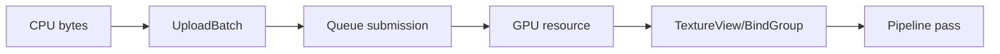

---
related_code:
  - zircon_runtime/crates/zr_rhi/src/descriptors.rs
  - zircon_runtime/crates/zr_rhi/src/device
implementation_files:
  - zircon_runtime/crates/zr_rhi/src/descriptors.rs
  - zircon_runtime/crates/zr_rhi/src/device/render_device.rs
  - zircon_runtime/crates/zr_rhi/src/descriptors/pipeline.rs
plan_sources:
  - docs/wiki/graphics/rhi-and-wgpu.md
tests:
  - zircon_runtime/crates/zr_rhi/src/tests/descriptors.rs
  - zircon_runtime/crates/zr_rhi_wgpu/src/tests/device_contract
doc_type: api-reference
---

# RHI 资源、视图与管线描述符

RHI 描述符是可序列化、可验证的值对象；创建后只返回不透明 handle。描述符负责意图，后端负责具体分配。不要把 `BufferHandle`、`TextureHandle` 当作 `wgpu` 原生对象或跨设备共享。

## Buffer

```rust
// 调用上下文片段：device 与 vertex_bytes 由资源上传系统提供。
use std::sync::Arc;
use zr_rhi::{BufferDesc, BufferUpload, BufferUploadBatch, BufferUsage, RenderDevice};

let desc = BufferDesc::new(
    "mesh-vertices",
    vertex_bytes.len() as u64,
    BufferUsage::VERTEX | BufferUsage::COPY_DST,
);
let handle = device.create_buffer(&desc)?;
// BufferUpload owns an Arc<[u8]> so the caller's temporary slice is not
// borrowed by the asynchronous submission service.
let payload: Arc<[u8]> = Arc::from(vertex_bytes);
let upload = BufferUpload::from_payload(handle, 0, payload);
let mut batch = BufferUploadBatch::new();
batch.push(upload);
let ticket = device.write_buffer_batch(batch)?;
```

`BufferUsage` 支持 `VERTEX`、`INDEX`、`UNIFORM`、`STORAGE`、`INDIRECT`、`COPY_SRC/DST` 与 staging 位。未知 bits 会被 `has_unknown_bits` 拒绝。`size_bytes == 0` 通常是 invalid descriptor；对齐要求由 backend validation 报告。

`RenderDevice::write_buffer` 是单次上传的便捷封装，签名为
`write_buffer(handle, offset, data) -> Result<SubmissionTicket, RhiError>`；它内部把
`&[u8]` 复制为 `Arc<[u8]>`，再转成一个 `BufferUploadBatch`。需要在同一提交票据
下合并多个写入时，应显式构造 batch。`BufferUpload::new` 可用来提交拥有的
`Arc<[u8]>` 的一个有效 `Range<usize>`，无效范围返回 `None`。

## Texture

```rust
// 调用上下文片段：device 已按当前 generation 创建；descriptor 变量用于演示。
let desc = TextureDesc::new(
    "albedo",
    1024,
    1024,
    TextureFormat::Rgba8UnormSrgb,
    TextureUsage::SAMPLED | TextureUsage::COPY_DST,
);
let texture = device.create_texture(&desc)?;
let view_desc = TextureViewDesc::new("albedo-view", texture, TextureViewDimension::D2);
let view = device.create_texture_view(&view_desc)?;
```

支持 D1、D2、D2Array、D3、Cube；格式包含 UNORM、float、depth/stencil。`TextureFormat::supports_write_only_storage` 与 `supports_alternate_view_format` 可在提交前做便携性检查。present texture 必须同时声明 `PRESENT` usage。

## Sampler 与视图

`SamplerDesc` 定义 address mode、mag/min filter、mipmap filter、lod clamp、compare 和 anisotropy。视图描述符定义 format reinterpretation、aspect、base mip/layer 与 dimension。视图生命周期依赖根 texture；不再录制相关命令后先销毁 bind group，再销毁 texture view，最后销毁根 texture。sampler 与 texture view 相互独立，可按各自 cache 生命周期回收。

```rust
// 调用上下文片段：device、layout_desc 与前一节创建的 view 由调用方提供。
let sampler_desc = SamplerDesc::linear_mipmap_linear("albedo-sampler")
    .with_lod_clamp(0.0, 12.0);
let sampler = device.create_sampler(&sampler_desc)?;
let layout = device.create_bind_group_layout(&layout_desc)?;
let group_desc = BindGroupDesc::new(
    "albedo-bind-group",
    layout,
    vec![
        BindGroupEntryDesc::new(
            0,
            BindGroupEntryResource::TextureView(view),
        ),
        BindGroupEntryDesc::new(1, BindGroupEntryResource::Sampler(sampler)),
    ],
);
let group = device.create_bind_group(&group_desc)?;
```

## Bind group

`BindGroupLayoutDesc` 声明 binding number、shader stage 与 `BindingResourceType`；`BindGroupDesc` 提供实际 buffer range、texture view、sampler 或 storage texture。binding number 缺失、类型不匹配、buffer range 越界会返回 `RhiError`。

`BindGroupDesc::new(label, layout, entries)` 的 `entries` 是显式的
`Vec<BindGroupEntryDesc>`，不会根据 layout 自动补齐。常见 sampled-texture layout
与上面资源的完整声明如下；binding 编号必须与 shader 反射结果一致：

```rust
// 调用上下文片段：device 与 layout handle 已由前一段创建流程提供。
let layout_desc = BindGroupLayoutDesc::new(
    "albedo-layout",
    vec![
        BindGroupLayoutEntryDesc::new(
            0,
            BindingResourceType::SampledTexture {
                sample_type: TextureSampleType::Float { filterable: true },
                view_dimension: TextureViewDimension::D2,
                multisampled: false,
            },
            vec![ShaderStage::Fragment],
        ),
        BindGroupLayoutEntryDesc::new(
            1,
            BindingResourceType::Sampler(SamplerBindingType::Filtering),
            vec![ShaderStage::Fragment],
        ),
    ],
);
let layout = device.create_bind_group_layout(&layout_desc)?;
```

## Shader 与 pipeline

```rust
// 调用上下文片段：device、layout、WGSL source 与 target format 已由 pipeline builder 提供。
let vertex_shader = device.create_shader_module(&ShaderModuleDesc::new(
    "pbr-vertex",
    ShaderStage::Vertex,
    "vs_main",
    vertex_wgsl_source,
))?;
let fragment_shader = device.create_shader_module(&ShaderModuleDesc::new(
    "pbr-fragment",
    ShaderStage::Fragment,
    "fs_main",
    fragment_wgsl_source,
))?;
let pipeline_layout = device.create_pipeline_layout(&PipelineLayoutDesc::new(
    "pbr-layout",
    vec![layout],
))?;
let pipeline = device.create_pipeline(
    &PipelineDesc::new("pbr", PipelineKind::Raster)
        .with_layout(pipeline_layout)
        .with_vertex_shader(vertex_shader)
        .with_fragment_shader(fragment_shader)
        .with_raster_state(RasterPipelineStateDesc::single_color(
            TextureFormat::Rgba8UnormSrgb,
        )),
)?;
```

`ShaderModuleDesc::new(label, stage, entry_point, source)` 为每个 stage 创建独立
模块；`PipelineDesc::new(label, PipelineKind)` 再通过 `with_layout`、
`with_vertex_shader`、`with_fragment_shader`、`with_compute_shader` 与
`with_raster_state` 组合。Raster pipeline 必须提供 vertex/fragment shader 和
`RasterPipelineStateDesc`；Compute pipeline 则提供 `with_compute_shader`，不需要
`raster_state`。管线由 shader、layout、vertex input、primitive、depth/stencil、blend
和 color target 共同定义。descriptor 应保持 immutable；热重载通过销毁或替换
pipeline handle，不能修改已提交对象。

## 资源状态与上传

RHI upload API（`BufferUploadBatch`、`TextureUploadBatch`）把 CPU 数据提交到设备服务。
`RenderDevice::write_buffer_batch` 与 `write_texture_batch` 返回
`SubmissionTicket`；后端以 ticket 管理提交、完成、取消和诊断。公共 upload 类型
持有 `Arc<[u8]>`，因此不会保留调用者短生命周期的 `&[u8]`；批量合并小上传仍可
减少 queue submit 次数。不要直接绕过 `RenderDevice` 调用 backend 的 native queue。



## 销毁与 stale handle

`destroy_*` 使 handle 立即不可用于新命令；若资源仍被 in-flight submission 引用，backend 延迟释放底层对象。再次 destroy 会返回 `RhiError::ResourceHandle(RenderResourceHandleError::StaleHandle)`、对应的 `Unknown*` 或其他 typed lifetime error，不存在统一的 `InvalidHandle` 变体。纹理若仍有 live view 会返回 `RhiError::TextureHasLiveViews`，必须先释放 view。应用应在资产卸载时集中回收，并保存 ticket 直到资源安全释放。

## 错误分类

| 类别 | 例子 |
| --- | --- |
| Descriptor | 维度为零、未知 usage、格式不支持 |
| Binding | layout 缺失、binding type mismatch、range 越界 |
| Pipeline | shader 编译、vertex layout、attachment format 不匹配 |
| Lifetime | stale/foreign handle、generation mismatch |
| Capability | backend 不支持 storage/indirect/timestamp |

## 线程与所有权

描述符通常 `Clone + Send`，可在 asset worker 构建。真正的 create/destroy/submit 由 `RenderDevice` 服务同步处理。不要把 `&[u8]` 的短借用封装进异步 upload；使用拥有的 `Vec<u8>` 或 API 要求的生命周期。

## 最佳实践

- 为每个资源提供稳定 label，便于 RenderDoc 与 capture 日志定位。
- 预先验证 format/usage，避免在帧内首次创建失败。
- 复用 sampler、bind group layout 与 pipeline layout。
- 按资源类别维护 generation-local cache。
- 用 `buffer_desc`/`texture_desc` 做调试核对，而非依赖内部 wgpu 对象。

## 负面案例

```rust
// 伪代码：texture/device 来自前文生命周期示例；这里只展示错误顺序。
// 错误：把 storage 写纹理声明为 Rgba8UnormSrgb。
let bad = TextureFormat::Rgba8UnormSrgb;
assert!(!bad.supports_write_only_storage());

// 错误：根 texture 仍有 live view 时直接销毁。
assert!(device.destroy_texture(texture).is_err());
// 正确顺序是先释放 view，再释放根 texture。
device.destroy_texture_view(view)?;
device.destroy_texture(texture)?;
```

## 验收清单

- [ ] 所有 descriptor 通过未知 bit、零尺寸和格式限制测试。
- [ ] bind group range 与 layout 在单元测试中覆盖。
- [ ] 资源销毁后旧 handle 会稳定失败。
- [ ] 上传 batch 在设备 fault 时可取消并重试。

## Public descriptor 字段解释

### `BufferDesc`

`label` 用于诊断；`size_bytes` 是逻辑大小，必须满足 backend 对齐；`usage` 决定可执行命令。size 不应根据当前 frame 动态缩放，ring buffer 应预留容量并通过 range 绑定。

### `TextureDesc`

描述 dimension、extent、array layers、mip levels、sample count、format、residency 与 usage。extent 与 mip chain 必须数学一致；Cube 要求方形面并以六层为一个 face group（cube array 可为六的倍数），且需满足 backend 维度限制。

### `TextureViewDesc`

通过 base mip/layer、count、aspect、dimension、alternate format 构成逻辑 view。view 不能声明根 texture 未支持的格式或 aspect；sRGB reinterpretation 只允许 `supports_alternate_view_format` 返回 true 的组合。

### `SamplerDesc`

所有 filter/address/compare 参数都参与 pipeline/bind group cache key。动态修改 sampler 应创建新 handle，不能修改正在使用的 descriptor。

### `PipelineDesc`

包含 pipeline kind、layout、shader modules，以及 Raster pipeline 的 `RasterPipelineStateDesc`。后者再承载 vertex input、primitive、depth/stencil、blend、targets 与 sample count。render target format、sample count、depth format 是硬约束，不匹配会在 create 或 graph admission 阶段失败。

## 资源状态矩阵

| 命令 | 必需 usage | 典型 graph intent |
| --- | --- | --- |
| vertex draw | `VERTEX` | vertex read |
| indexed draw | `INDEX` | index read |
| sampled texture | `SAMPLED` | shader sampled |
| storage write | `STORAGE` | shader storage write |
| copy out | `COPY_SRC` | readback |
| copy in | `COPY_DST` | upload |
| present | `PRESENT` | terminal external write |

声明多余 usage 会扩大状态转换/内存开销；声明不足会被验证器拒绝。`ALL` 适合测试，不应作为生产默认。

## Bind group 验证顺序

1. layout handle 与 device generation 匹配。
2. binding number 唯一且在 layout 中声明。
3. resource kind 与 `BindingResourceType` 相同。
4. buffer offset/size 满足 alignment 与 bounds。
5. texture view aspect/format/usage 满足 shader stage。
6. sampler compare/filter 与 shader 采样类型相容。

## CommandList ownership

`CommandList` 录制阶段独占 `&mut`；finish/入队后转移到 immutable packet。命令列表 label、queue class、required operation 都会参与 admission。一个列表不能同时进入两个 packet；重复入队应返回 stale/already-submitted 错误。

## 资源别名与缓存

RHI handle allocator 的 diagnostic id 只用于日志。资源缓存 key 应包括 descriptor hash、device id、generation 和 asset version；不要只以 label 做 key。transient graph allocation 可复用底层对象，但 RHI 视图仍需在对应 frame 结束前有效。

## 内存与上传预算

通过 `GpuMemorySnapshot`、`GpuMemoryBudget` 观察 heap class、resident、pending upload 与 budget headroom。超过预算时优先降低 texture mip、shadow atlas、probe cache，再考虑拒绝新资源；不要在 OOM 后继续创建大量 fallback。

## Rust 负面示例

```rust
// 伪代码：device 与 desc 来自当前 device-generation 的资源工厂。
let texture = device.create_texture(&desc)?;
let view = device.create_texture_view(&TextureViewDesc::new(
    "stale-view",
    texture,
    TextureViewDimension::D2,
))?;
// 有 live view 时 destroy_texture 会返回 TextureHasLiveViews；先释放 view。
device.destroy_texture_view(view)?;
device.destroy_texture(texture)?;
// 释放后的 opaque handle 不能再查询 descriptor。
assert!(device.texture_view_desc(view).is_err());
```
