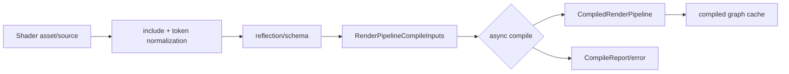

---
related_code:
  - zircon_runtime/src/graphics/pipeline
  - zircon_runtime/src/graphics/feature/compute_pass_descriptor
  - zircon_runtime/crates/zr_rhi/src/descriptors/pipeline.rs
implementation_files:
  - zircon_runtime/src/graphics/pipeline/async_compile.rs
  - zircon_runtime/src/graphics/pipeline/compiled_graph_cache.rs
  - zircon_runtime/src/render_graph/types.rs
plan_sources:
  - docs/wiki/graphics/shaders.md
tests:
  - zircon_runtime/src/graphics/pipeline/render_pipeline_asset/compile_tests
  - zircon_runtime/crates/zr_rhi_wgpu/src/tests/pipeline.rs
doc_type: api-reference
---

# Shader 编译、反射与管线缓存

ZirconEngine 将 shader source、binding schema、render feature contract 与 backend pipeline 分离。资产层生成可缓存的编译输入，RHI 层只接收 `ShaderModuleDesc`/`PipelineDesc`。当前 WGPU 路径以 WGSL 为主；SPIR-V、DXIL 等属于后端演进方向。



## ShaderModuleDesc

RHI 导出 `ShaderModuleDesc` 与 `ShaderStage`。创建时应提供稳定 label、stage 与 source；成功返回 `ShaderModuleHandle`。

```rust
// 调用上下文片段：device 与 source 由 graphics shader loader 提供。
let desc = ShaderModuleDesc::new(
    "tonemap-fragment",
    ShaderStage::Fragment,
    "fs_main",
    source,
);
let shader = device.create_shader_module(&desc)?;
```

`ShaderModuleDesc::new(label, stage, entry_point, source)` 是当前
`zr_rhi` 的唯一中立构造器；WGSL source 以 `String` 持有，entry point 也由
descriptor 明确指定。创建通过 `RenderDevice::create_shader_module(&desc)` 完成，
成功返回绑定当前 device generation 的 `ShaderModuleHandle`；编译或校验失败返回
`RhiError`，不会返回可部分使用的 handle。下文出现的 `compile_service`、
`reflection` 等名称是 graphics 层状态机的伪代码，不是 `zr_rhi` 的公开类型。

## include 与确定性

graphics 内部的 `material/shading_models/include_sources.rs` 负责 include 展开与 token hoist；该模块是 runtime implementation detail，不是对外稳定 crate API。输入应先规范化换行、宏顺序和 feature key，再计算 cache key。不要将绝对路径、随机 UUID 或时间戳注入 source，否则每次启动都会 miss cache。

## 反射合同

反射结果至少包含 binding number、resource type、stage visibility、buffer range 与 texture sample/storage 类型。它必须与 `BindGroupLayoutDesc` 一致；schema mismatch 在 pipeline admission 阶段被拒绝。

```rust
// graphics 层把反射结果验证后，转换为 RHI 的显式 layout entries。
// 调用上下文片段：device 已绑定当前 generation。
let layout_desc = BindGroupLayoutDesc::new(
    "material-layout",
    vec![BindGroupLayoutEntryDesc::new(
        0,
        BindingResourceType::UniformBuffer,
        vec![ShaderStage::Vertex, ShaderStage::Fragment],
    )],
);
let layout = device.create_bind_group_layout(&layout_desc)?;
```

`zr_rhi` 不提供 `from_reflection` 或可变 `layout.add` 方法；反射器属于
graphics/pipeline 层，最终必须生成一个完整且 immutable 的
`BindGroupLayoutDesc`，再交给 `RenderDevice::create_bind_group_layout`。

## Render feature 合同

`RenderFeatureDescriptor`/`RenderFeaturePassDescriptor` 声明 pass 资源、external input、terminal schema 与 capability requirement。内置 feature（deferred geometry、lighting、HZB、post process、UI 等）通过 descriptor 进入 pipeline asset，而不是在 backend 中硬编码 pass 顺序。

## Async compile 与 last-good

`pipeline::async_compile` 允许在非渲染线程生成编译任务。提交线程只接纳已通过 validation 的结果；失败时使用同一 family 的 last-good pipeline。

```rust
// 伪代码：compile_service/CompileStatus 属于 graphics 层调度器，不是 zr_rhi 公共 API。
let request = compile_service.request(inputs);
match request.poll()? {
    CompileStatus::Ready(pipeline) => viewport.set_pipeline(pipeline),
    CompileStatus::UsingLastGood(old) => viewport.set_pipeline(old),
    CompileStatus::Failed(report) => log_compile(report),
    CompileStatus::Pending => {}
}
```

这段代码描述状态机，具体 service 类型由 graphics runtime 提供。禁止在 frame 中阻塞等待编译完成。

## Cache key

缓存 key 应覆盖 source hash、include hash、feature set、adapter capability fingerprint、pipeline layout generation、target formats、shader quality 与 engine interface generation。`compiled_graph_cache` 只缓存可重建数据，不缓存跨 device generation 的 native handle。

## 错误诊断

| 错误 | 常见根因 | 处理 |
| --- | --- | --- |
| parse/validation | WGSL 语法、类型或 binding 错误 | 展开 source，记录行号 |
| reflection mismatch | shader 与 layout 不一致 | 更新 descriptor 或 shader |
| target mismatch | color/depth format 不匹配 | 按 viewport target 重新编译 |
| capability denied | storage、indirect 或 timestamp 不支持 | 降级 feature |
| cache stale | generation/interface 变化 | 丢弃旧条目重编译 |

## 线程与资源所有权

source、reflection 和 compile report 可在线程间传递；`ShaderModuleHandle` 与 `PipelineHandle` 绑定 device generation。编译任务取消时应释放 CPU 中间表示，GPU handle 由提交服务回收。

## 最佳实践

- 在 CI 中固定 shader source 与 reflection snapshot。
- 让每个 binding 有人类可读 label 和 feature owner。
- 将编译错误作为结构化 report 保存，避免只打印 backend 字符串。
- 预热常用 pipeline，但限制并发以免占满设备内存。
- 热重载先编译、验证，再原子替换 last-good。

## 负面案例

```rust
// 伪代码/编译失败示意：变量与 metrics/cache facade 省略，不作为可直接运行样例。
// 错误：编译输入使用随机 label，导致缓存永远 miss。
let label = format!("shader-{}", rand::random::<u64>());

// 错误：反射声明 write-only storage texture，却绑定 sampled view。
let entry = BindingResourceType::StorageTexture(
    StorageTextureBindingDesc::write_only(
        TextureFormat::Rgba8Unorm,
        TextureViewDimension::D2,
    ),
);
let resource = BindGroupEntryResource::TextureView(sampled_view);
```

## 验收清单

- [ ] source normalization 和 include 有确定性测试。
- [ ] reflection/layout mismatch 在编译前可诊断。
- [ ] cache key 包含 adapter 与 interface generation。
- [ ] compile 失败保持 last-good，不阻塞主循环。
- [ ] 不同 target format 会生成独立 pipeline 条目。

## 类型与方法补充

`ShaderStage` 区分 vertex、fragment、compute 可见性；同一 binding 在不同 stage 的声明必须可合并。`PipelineKind` 选择 render 或 compute；不要通过空 vertex layout 模拟 compute pipeline。

`RenderPipelineCompileOptions` 是当前 graphics 编译入口的不可变选项值，公开字段包括启用/禁用的内置 feature、禁用的 plugin feature、已启用 capability、是否允许 async compute、HZB occlusion、半分辨率透明度及其 sigma、可选 graph MSAA sample count、shader quality、AO source、post-process stack 与 environment IBL bake request。options 应参与 cache key；改变任一字段都必须产生新 compile request。debug defines 和具体 target formats 由对应的 shader/material 或 graph contract 携带，不是该 struct 的公开字段。

`RenderPipelineCompileReport` 的公开字段是 `pipeline: CompiledRenderPipeline` 与 `diagnostics: Vec<RendererFeatureContractDiagnostic>`；它提供按 feature、material、source、severity 和 shader 分组的查询方法。source hash、耗时和 backend 文本若要记录，应由上层编译 telemetry 扩展，不能假定 report 自带这些字段。

`CompiledRenderPipeline` 只读暴露 pipeline handle/name、renderer name、required extract sections、capability requirements、history bindings、环境 IBL 请求，并通过 `graph()`、`enabled_features()`、`pass_stage()` 和 `writes_resource()` 查询编译结果。它不是 RHI `PipelineHandle` 的替代品，后者仍由 device generation 管理；内部 validation generation 与 runtime flags 不属于稳定公开字段。

## 变体与容量

材质/质量变体数量按 `feature set x target format x sample count x shader quality` 乘积增长。应用应限制 variant budget、延迟低优先级变体，并记录 evicted/last-good 次数。超过 budget 时返回 admission failure，而不是无限启动编译线程。

## CI 负面测试

```rust
// 伪代码：compile_fixture 与 report 查询属于测试 harness，不是运行时公开 API。
#[test]
fn reflection_rejects_missing_binding() {
    let report = compile_fixture("missing-binding");
    assert!(report.errors().iter().any(|e| e.is_interface_mismatch()));
}
```

还应测试错误行号、include 循环、重复 binding、storage format 不支持、cache generation 过期和并发取消。
