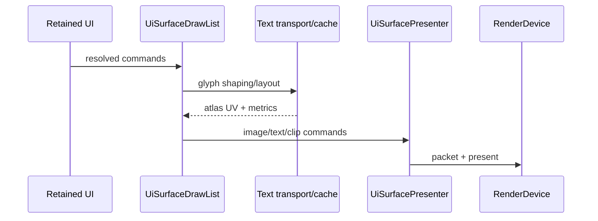

---
related_code:
  - zircon_runtime/crates/zr_rhi/src/ui_surface.rs
  - zircon_runtime/crates/zr_rhi_wgpu/src/ui_surface
  - zircon_runtime/src/graphics/text_transport
implementation_files:
  - zircon_runtime/crates/zr_rhi/src/ui_surface.rs
  - zircon_runtime/crates/zr_rhi_wgpu/src/ui_surface/presentation.rs
  - zircon_runtime/crates/zr_rhi_wgpu/src/ui_surface/text.rs
plan_sources:
  - docs/wiki/graphics/ui-rendering.md
tests:
  - zircon_runtime/crates/zr_rhi/src/ui_surface/tests.rs
  - zircon_runtime/crates/zr_rhi_wgpu/src/ui_surface/tests
  - zircon_runtime/src/graphics/text_transport/tests.rs
doc_type: api-reference
---

# UI Surface 与文本渲染桥

UI 渲染通过 `UiSurfacePresenter` 将 retained draw list 转换为 RHI command。UI surface 拥有自己的 image resource table、style handle、text atlas/cache 与 present stats。由 `RenderFramework` 创建的 presenter（包括使用 `headless` descriptor 的实例）共享 framework 的 device context、submission service 和 device generation；只有直接调用 WGPU presenter 构造器（例如 `WgpuUiSurfacePresenter::new`）的独立实现才自行管理 backend context。



## 核心类型

| 类型 | 作用 |
| --- | --- |
| `UiSurfaceDescriptor` | extent、native target 与 GPU timing 开关 |
| `UiSurfaceDrawList` | 按 z-order 排列的 resolved command |
| `UiSurfaceCommand` | z-index、矩形、可选 clip 与 `UiSurfaceCommandKind` |
| `UiSurfaceImageResourceTable` | `(resource_key, generation)` 到拥有的 RGBA/image payload 的表 |
| `UiSurfaceStyleHandle` | immutable style/brush 句柄 |
| `UiSurfaceTextStyle` | `Regular`/`Strong`/`Emphasis`/`StrongEmphasis` 文本样式枚举 |
| `UiSurfacePresentStats` | draw、text prepare、image cache、clip、submission 统计 |

## Presenter 生命周期

```rust
// 调用上下文片段：framework、trace_stats 与 log_retry 由宿主 runtime 提供。
use zircon_runtime::core::framework::render::RenderFramework;
use zr_rhi::{
    UiSurfaceCommand, UiSurfaceCommandKind, UiSurfaceDescriptor, UiSurfaceDrawList,
    UiSurfacePresentOutcome, UiSurfaceRect, UiSurfaceTextStyle,
};

// 无 native window 的离屏 surface；native surface 使用
// UiSurfaceDescriptor::native(label, width, height, RenderNativeSurfaceTarget)。
let descriptor = UiSurfaceDescriptor::headless("editor-ui", 1280, 720);
let mut presenter = framework.create_ui_surface_presenter(descriptor)?;
let draw_list = UiSurfaceDrawList::new(
    (1280, 720),
    None,
    vec![UiSurfaceCommand {
        z_index: 0,
        frame: UiSurfaceRect::new(24.0, 24.0, 320.0, 32.0),
        clip: None,
        kind: UiSurfaceCommandKind::Text {
            text: "资产加载失败".to_string(),
            color: [255, 255, 255, 255],
            font_family: Some("Inter".to_string()),
            font_weight: 400,
            font_size: 16.0,
            line_height: 20.0,
            style: UiSurfaceTextStyle::Regular,
        },
    }],
);
let stats = presenter.present(&draw_list)?;
match stats.outcome {
    // trace_stats/log_retry 是宿主 telemetry facade；RHI 只返回 stats。
    UiSurfacePresentOutcome::Submitted => trace_stats(stats),
    UiSurfacePresentOutcome::RetryableNoSubmit => log_retry(),
    _ => log_retry(), // UiSurfacePresentOutcome 标记为 non_exhaustive，保留未来变体。
}
```

native surface 只需替换 descriptor，target 类型由 `zr_rhi` 定义（当前平台实现提供
`RenderNativeSurfaceTarget::Win32`）：

```rust
// 调用上下文片段：framework 由已创建的 RenderFramework 实例提供。
use zr_rhi::{RenderNativeSurfaceTarget, UiSurfaceDescriptor};

let descriptor = UiSurfaceDescriptor::native(
    "editor-ui",
    width,
    height,
    RenderNativeSurfaceTarget::Win32 { hwnd, hinstance: None },
);
let mut presenter = framework.create_ui_surface_presenter(descriptor)?;
```

`RenderFramework::create_ui_surface_presenter` 接收值类型的
`UiSurfaceDescriptor` 并返回 `Box<dyn UiSurfacePresenter>`；presenter 的 trait 方法是
`present(&UiSurfaceDrawList) -> Result<UiSurfacePresentStats, RhiError>`。结果状态位于
`UiSurfacePresentStats::outcome`，只有 `Submitted` 与 `RetryableNoSubmit` 两个变体，
不是 `Presented/Skipped` 枚举。`RetryableNoSubmit` 不推进 presenter 的
`presented_frame_count`，调用方应保留 draw list 并在下一帧重试。

## 文本传输

`graphics::text_transport` 负责将上层文本 DTO 转换为 UI surface 可消费的 glyph runs。流程包含 UTF-8 校验、字体 fallback、脚本 shaping、双向文本、line break、DPI 缩放和 atlas 分配。布局缓存 key 应包含文本 hash、字体资源版本、尺寸、语言/方向与 scale。

```rust
let command = UiSurfaceCommand {
    z_index: 10,
    frame: UiSurfaceRect::new(24.0, 24.0, 320.0, 32.0),
    clip: None,
    kind: UiSurfaceCommandKind::Text {
        text: "资产加载失败".to_string(),
        color: [255, 255, 255, 255],
        font_family: Some("Inter".to_string()),
        font_weight: 400,
        font_size: 16.0,
        line_height: 20.0,
        style: UiSurfaceTextStyle::Regular,
    },
};
```

`UiSurfaceTextStyle` 是四值样式枚举，不携带字体或尺寸；字体族、权重、字号、行高和
颜色都直接存放在 `UiSurfaceCommandKind::Text`。上层 text transport 负责 shaping 和
fallback，然后把拥有 `String` 的命令写入 draw list。

## 图像与裁剪

`UiSurfaceCommandKind::Image` 携带 `UiSurfaceImagePayload`，其中的
`resource_key`、`resource_generation`、尺寸、RGBA bytes 和可选 `atlas_uv` 由 producer
拥有。native presenter 可通过外部 image provider 将同一 generation 解析为共享 GPU
texture；否则使用 presenter 自己的 image cache。`UiSurfaceCommand::clip` 是该命令的
矩形裁剪条件，与 surface damage 求交；它不是一个 push/pop 栈。`Clip` command kind
仍可作为显式的可见性/统计标记，但没有额外的栈 API。

## 错误与降级

| 情况 | 行为 |
| --- | --- |
| stale image resource | provider 返回 `None` 时回到普通 image cache；记录 key/generation |
| atlas allocation full | image/text prepare 返回错误或统计失败计数，由上层决定 eviction/降级 |
| unsupported color space | 由 backend 返回 `RhiError`，调用方选择目标格式或降级 |
| zero extent descriptor | `UiSurfaceDescriptor::validate` 返回 `InvalidSurfaceDescriptor`；draw list 尺寸会钳制到至少 1 |
| malformed text | RHI 只接收已拥有的 `String`，解析/fallback 由上层 text transport 负责 |
| generation mismatch | 丢弃旧 generation 的 image/provider 结果并重新准备 |

## 线程与所有权

UI tree/layout 可在 UI 线程；text shaping 可在 worker；`UiSurfaceDrawList` 在提交前必须冻结。presenter/native surface 通常要求窗口线程或 render service。不要在 draw list 中保存 UI 控件的可变引用，使用 copy-on-write 的 resolved payload。

## 性能实践

- 在保持输入 z-order 的前提下按材质/纹理合批，避免为了排序破坏覆盖关系。
- 合并相邻 glyph run 与同纹理 image，控制 draw count。
- 为常用字体预热 atlas，滚动列表使用 layout cache。
- 监听 `UiSurfacePresentStats` 的 `text_prepare_failure_count`、`image_cache_admission_reject_count`、`clip_count`、`draw_calls` 与 `submission`。
- 高 DPI 变化时批量重建，而不是逐 glyph 重新分配。

## 负面案例

```rust,compile_fail
// 伪代码/compile-fail 示例：frame_id 省略，仅验证 String 所有权规则。
let temporary = format!("frame {frame_id}");
let command = UiSurfaceCommand {
    z_index: 0,
    frame: UiSurfaceRect::new(0.0, 0.0, 100.0, 20.0),
    clip: None,
    kind: UiSurfaceCommandKind::Text {
        text: temporary,
        color: [255, 255, 255, 255],
        font_family: None,
        font_weight: 400,
        font_size: 14.0,
        line_height: 18.0,
        style: UiSurfaceTextStyle::Regular,
    },
};
drop(temporary); // 编译错误：value moved into command
```

异步 present 前应让 draw list 拥有文本和 image payload；若生产者仍需保留原字符串，
使用 `temporary.clone()` 或在上层 DTO 完成 copy-on-write，而不是向 RHI 暴露借用。

## 当前与规划

RHI UI surface、WGPU retained cache、外部 image copy、文本 atlas 与测试已实现。复杂富文本编辑、GPU path text、跨窗口共享 atlas 属于规划能力，调用方应检查 capability/status，而不是假设存在。

## 验收清单

- [ ] command z-order、每命令 clip 求交和 UV 范围有验证。
- [ ] 文本 fallback、双向脚本和 DPI 变化有测试。
- [ ] generation 重建会清理 atlas 与 image table。
- [ ] present stats 能定位 draw、文本准备、image cache 和 submission 状态。
- [ ] zero extent 不提交空 Surface frame。
