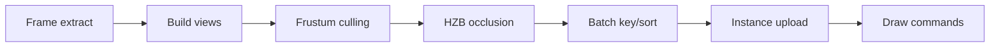
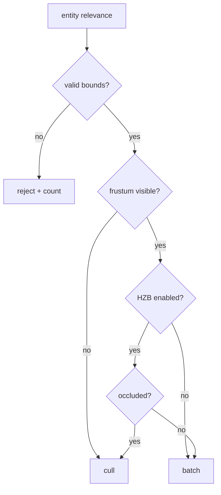

---
related_code:
  - zircon_runtime/src/graphics/visibility
  - zircon_runtime/src/graphics/visibility/culling
implementation_files:
  - zircon_runtime/src/graphics/visibility/context
  - zircon_runtime/src/graphics/visibility/planning/build_draw_commands.rs
  - zircon_runtime/src/graphics/visibility/occlusion/hzb_builder.rs
plan_sources:
  - docs/wiki/graphics/scene-renderer.md
tests:
  - zircon_runtime/src/graphics/tests/visibility
  - zircon_runtime/src/graphics/visibility/context/from_extract_with_history/construct/tests.rs
doc_type: api-reference
---

# 场景可见性、裁剪与批处理

visibility 子系统将 frame extract 转换为 view、relevance、batch 和 draw command。它同时支持 perspective/orthographic frustum、BVH 更新、HZB occlusion、GPU instancing、particle upload 与 virtual geometry frontier。当前 API 主要是 runtime 内部类型，应用通过 `RenderFramework` 或 render feature descriptor 间接使用。



## View 与历史

`VisibilityContext::from_extract*` 根据 camera、viewport region、history snapshot 构造视图。history 记录 previous transform、motion vectors、occlusion confidence 与 virtual geometry feedback；viewport 尺寸、camera projection 或 device generation 改变时必须清理不兼容历史。

```rust
let context = VisibilityContext::from_extract_with_history(
    extract, previous_history, frame_id,
);
let views = context.views();
```

该代码表示当前内部构造形状；应用不应自行实例化 context，而应通过标准 render frame prepare 路径提供 extract。

## Frustum culling

`is_mesh_visible` 对 bounds 执行 perspective 或 orthographic 测试。bounds 可为 AABB/sphere；结果至少区分 outside、intersecting、inside，以便选择粗粒度或精确路径。非有限 transform、负半径和反向 near/far 是输入错误。

## BVH 更新

`VisibilityBvhUpdatePlan` 记录新增、删除、移动实例。静态对象应复用 static index，动态对象按 frame budget 分批更新。更新计划生成后，draw planning 读取同一快照，避免一半旧、一半新空间索引。

## HZB occlusion

HZB builder 从深度层级生成 max/min reduction。遮挡查询需要 conservative bias，防止 thin geometry 闪烁；相机剪裁面或 render scale 改变会使历史 HZB 失效。禁用 HZB 时仍保留 frustum culling，不能把所有实体直接提交 GPU。

## Batching 与 draw commands

`VisibilityBatchKey` 通常包含 pipeline/material/mesh layout、depth/blend state、view mask 与 instance format。排序应先减少 pipeline/bind group 切换，再保持透明物体深度顺序。`VisibilityDrawCommand` 引用 mesh/material backing，不拥有资源。

```rust
for command in plan.draw_commands() {
    if command.instance_count == 0 { continue; }
    encoder.draw_indexed(command.index_range, command.instance_range);
}
```

调用形状仅用于解释 ownership；实际 encoder 由 backend executor 注入。

## Virtual geometry

虚拟几何路径根据可见 cluster 构建 page frontier、排序与 upload plan。反馈包含 missing page、priority、screen error 与 generation。page 未 resident 时可降级到 parent cluster；严禁在同一帧递归等待所有 page。

## 错误与负面案例

| 情况 | 结果 |
| --- | --- |
| stale history generation | 清理 history，使用全量可见性 |
| invalid bounds | 丢弃实体并计数，不提交 NaN 矩阵 |
| HZB 不兼容 | 禁用 occlusion 一帧并重建 |
| missing mesh backing | 生成 fallback draw 或跳过 |
| batch key 冲突 | 验证阶段报错，避免错误合批 |

```rust
// 错误：把上一 viewport 的 history 用于不同尺寸视图。
assert!(!history.is_compatible(&new_viewport_key));
```

## 线程与数据流

extract 可在 simulation/editor 线程生成 immutable snapshot；visibility context 与 planning 在 render prepare worker；GPU upload/execute 在 device submission service。不要从 worker 直接读取 ECS 可变组件，也不要让 draw command 借用会被下一帧修改的 Vec。

## 性能建议

- 先粗裁剪再 HZB，避免对不可见对象做材质解析。
- 保持 `VisibilityBatchKey` 紧凑，预留容量减少 reallocation。
- 以 viewport 级别复用 history/HZB，resize 时明确 invalidation。
- 对 virtual geometry 设置 page budget 和 feedback 上限。
- 使用 visibility tests 中的 capacity、frontier、occlusion 场景做回归。

## 当前与规划

frustum、BVH plan、HZB、batch、instancing、virtual geometry 的数据结构和测试已存在；跨帧 GPU-driven compaction、完全 bindless 材质和多视图共享 culling 仍可能处于骨架/演进阶段。页面不承诺所有 feature 默认开启。

## 验收清单

- [ ] camera/viewport/device generation 变化会使 history 失效。
- [ ] NaN bounds、空 mesh、missing page 有可观测计数。
- [ ] 透明排序与 opaque batching 分离。
- [ ] HZB 关闭时画面仍由 frustum culling 正确渲染。
- [ ] visibility plan 不持有跨帧可变借用。

## Public 数据结构字段

### `VisibilityBounds`

包含 local/world AABB、sphere 半径与 validity 标记。world bounds 必须在 transform 更新后重新计算；invalid bounds 进入 rejected 计数，不应转成无限大包围盒。

### `VisibilityRelevanceEntry`

记录 entity、mesh/material identity、view mask、render layer、visibility flags 与 history key。relevance 是筛选结果，不拥有 ECS entity 或 GPU resource。

### `VisibilityBatchKey`

组合 pipeline、material variant、mesh layout、blend/depth state、view mask。字段应只包含影响 draw compatibility 的值；把 transform、entity id 放入 key 会破坏 batching。

### `VisibilityBatch`

保存同 key 的 draw members、instance range 与 upload plan。batch 生成后不可与下一帧 mutable vector 共享；使用 snapshot 或 owned buffer。

### `VisibilityHistorySnapshot`

保存上帧可见性、motion、occlusion 与 virtual geometry feedback。snapshot 只在 compatibility key 相同的情况下复用。

### `VisibilityDrawCommand`

引用 pipeline/material/mesh backing、index range、instance range 和 view id。command 不负责资源销毁；资源失效时 planner 应过滤或替换 fallback。

## 裁剪决策树



## 预算与退化

当 BVH update、HZB query、instance upload 或 virtual page budget 超限时，planner 可按 priority 截断。截断必须产生统计与 feedback，下一帧继续处理；不能随机丢实体导致不可重现闪烁。

## 测试案例

最低测试集应包含：空场景、单实体、frustum 边界相交、反向 winding、NaN transform、HZB stale、透明排序、相同 material 多 mesh、virtual cluster missing page、viewport resize 和 history generation mismatch。

```rust
#[test]
fn nan_bounds_are_rejected() {
    let plan = build_visibility_plan(bounds_with_nan());
    assert_eq!(plan.rejected_invalid_bounds(), 1);
}
```
