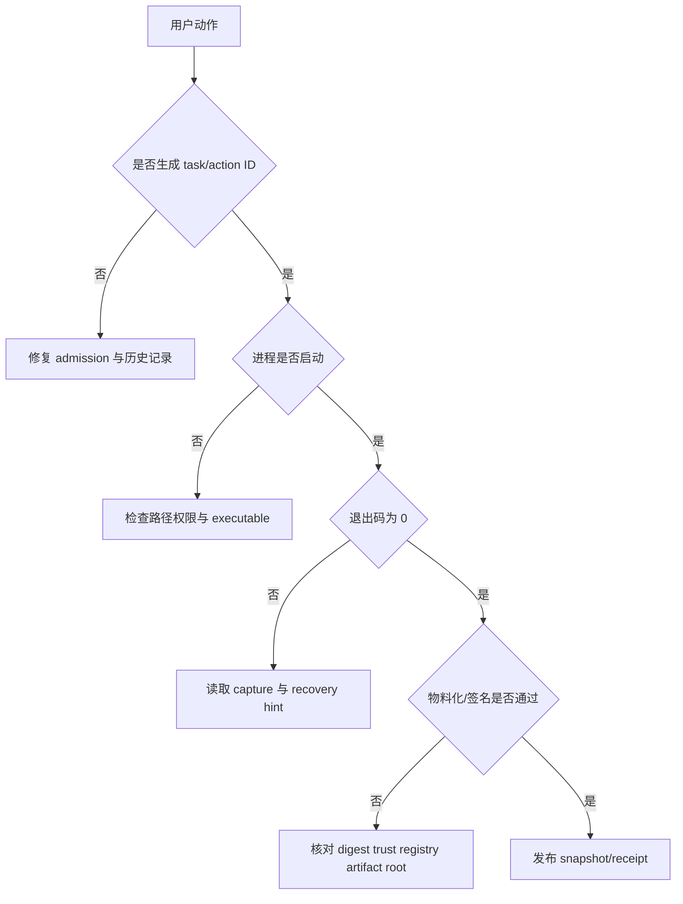

---
related_code:
  - zircon_hub/src/service/storage/receipt.rs
  - zircon_hub/src/service/storage/path_guard.rs
  - zircon_hub/src/process/child_supervisor.rs
  - zircon_hub/src/build/runner.rs
  - tools/cargo-zircon/src/build/receipt
implementation_files:
  - zircon_hub/src/service/storage
  - zircon_hub/src/process
  - tools/cargo-zircon/src/build/receipt
plan_sources:
  - docs/plans/optimize/zircon_tooling/26-security-principal-credential-trust-capability-cryptography-supply-chain-audit-review.md
tests:
  - zircon_hub/src/service/storage
  - zircon_hub/src/process
  - tools/cargo-zircon/src/build/receipt
doc_type: operations-guide
---

# 工具链故障排查、安全与可观测性

Hub 和工具链会读写项目文件、启动子进程、访问本地服务并处理签名物料。排障的第一原则是保留结构化证据：action/task ID、退出码、message ID、capture 目录、receipt digest 和 toolchain 版本。不要通过删除缓存、重置仓库或打印 secret 来“快速修复”。

## 故障定位路径



## 文件与路径安全

项目、包和服务 API 必须使用常规文件检查、绝对路径规范化和 root containment。`path_guard` 应拒绝 `..` 逃逸、符号链接绕过、空根和不允许的文件类型。任何“输出目录在项目内”的错误都应在创建目录前返回。

```text
untrusted path
  -> normalize/canonicalize
  -> root containment
  -> regular file/type check
  -> operation-specific allowlist
  -> read/write
```

日志中使用 `project_filesystem_path_key` 或脱敏路径；不要把完整用户目录、凭据目录和 token 参数写入遥测。

## 子进程安全

`BuildCommand`、`EditorLaunchCommand` 和 `OpenFolderCommand` 都返回程序与参数数组。使用 `Command::new(program).args(args).current_dir(cwd)`，不要把参数拼成 shell 字符串。启动前检查 executable；运行中交给 child supervisor 管理进程树；结束后收集退出状态和有限日志摘要。

## 幂等与 receipt

storage receipt API 包含：

```rust
pub fn validate_id(operation_id: &str) -> Result<(), ServiceError>;
pub fn fingerprint<T: Serialize>(payload: &T) -> Result<String, ServiceError>;
pub fn replay<T: DeserializeOwned>(... ) -> Result<Option<T>, ServiceError>;
pub fn commit<T: Serialize>(... ) -> Result<(), ServiceError>;
pub fn lookup(... ) -> Result<..., ServiceError>;
```

实际泛型和连接参数以 `receipt.rs` 为准。动作开始前校验 ID，写入前计算 fingerprint；相同 operation ID 只能返回相同结果或明确冲突，不能重复安装、重复发布或重复撤销。

## 观测字段

| 字段 | 来源 | 用途 |
| --- | --- | --- |
| `task_id` | `TaskCancellationToken`/TaskStatus | 取消和进度关联 |
| `action_id` | Hub action record | 幂等、历史和 UI 定位 |
| `message_id` | `HubMessageId` | 稳定分类与本地化 |
| `exit_code` | child report | 进程失败分类 |
| `capture_dir` | BuildExecutionReport | 日志回溯 |
| `receipt_id`/digest | product receipt | 发布物审计 |
| toolchain/profile | build record | 复现构建 |

敏感字段清单：refresh token、nonce、私钥、cookie、完整环境变量、带 query 的 URL、未脱敏用户路径。它们不能出现在 snapshot、action history、CLI 输出或普通日志。

## 错误分层

| 层 | 证据 | 恢复 |
| --- | --- | --- |
| 参数 | usage/输入错误 | 修正命令或字段 |
| 配置 | `AccountError::Configuration` | 修正 JSON/URL/路径 |
| 路径 | `HubMessageId` + recovery | 选择受控目录 |
| 进程 | exit code + excerpt | 修复 toolchain/参数后重试 |
| 签名 | `ProductReceiptError` | 修正 signer/trust/digest |
| 服务 | operation receipt | replay 或人工处理 |

## 常见症状

### Hub 打开项目失败

先运行 `validate_project_root`，再检查 manifest 是否为常规文件和格式版本。不要删除最近项目历史；修复后调用 `RecentProject::refresh_summary`。

### 构建按钮不可用

检查 `HubScope::can_build`、当前项目和 engine binding。不要仅凭 UI 选中状态启动 `BuildCommand`；staged engine 和 output root 必须来自权威 snapshot。

### 插件 check 漂移

运行 `sync-manifest` 生成投影，审阅 diff，再运行 `check-manifest` 和 `validate`。不要直接编辑 generated `plugin.toml`。

### Receipt 无法验证

确认 draft handoff SHA-256、trust registry signer、artifact root 和相对路径。verify 失败时保留原 receipt 与 artifact，不覆盖为“已验证”文件。

## 与 Unreal/Godot 的对照

Unreal AutomationTool 通常通过日志、退出码和 manifest 诊断 cook/package；Godot 导入器常通过项目缓存重建恢复。Zircon 采用 operation receipt、结构化 recovery hint 和受控路径，强调“可重放且可审计”，因此恢复动作必须显式。

## 运行手册清单

- [ ] 收集 task/action/receipt ID 与时间。
- [ ] 保存 capture、stderr、命令参数的脱敏副本。
- [ ] 检查退出码、message ID 和 recovery hint。
- [ ] 验证路径 containment、权限和平台 guard。
- [ ] 确认没有 token/private key 泄漏。
- [ ] 修复后执行最小重试，再执行完整验证 lane。

## 相关页面

- [进程、任务与状态协调](process-state.md)
- [账户与本地服务](account-service.md)
- [发布 Receipt](packages-receipts.md)
- [测试与平台验证](../../testing-platform/index.md)
