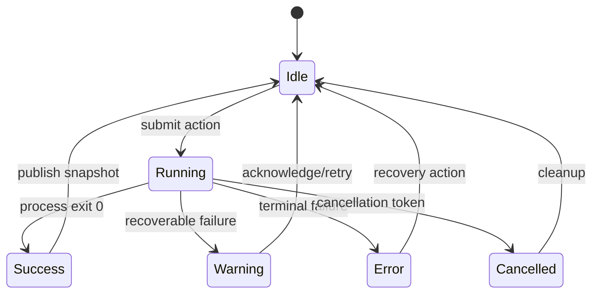

---
related_code:
  - zircon_hub/src/process/mod.rs
  - zircon_hub/src/process/editor_launch.rs
  - zircon_hub/src/process/open_folder.rs
  - zircon_hub/src/state/mod.rs
  - zircon_hub/src/state/task_status.rs
  - zircon_hub/src/state/hub_snapshot.rs
implementation_files:
  - zircon_hub/src/process
  - zircon_hub/src/state
plan_sources:
  - docs/plans/zircon_tooling/session_coordinator
tests:
  - zircon_hub/tests/app_error_recovery_contract.rs
  - zircon_hub/tests/project_quick_actions_contract.rs
doc_type: api-reference
---

# 进程、任务与 Hub 状态协调

Hub 将“请求一个动作”和“动作正在执行”分开。`process` 负责构造编辑器、文件夹和目录选择进程；`state` 负责作用域、页面、快照、进度、取消和历史。调用者必须先更新任务状态，再启动外部进程，并在所有出口写入终态。

## 状态流



## `TaskStatus`

```rust
pub enum TaskSeverity { Info, Warning, Error }
pub enum TaskOperationKind { /* current variants are source-owned */ }

impl TaskStatus {
    pub fn idle() -> Self;
    pub fn running(label: impl Into<String>, detail: HubMessage) -> Self;
    pub fn running_operation(...); // see task_status.rs for exact generic shape
    pub fn success(label: impl Into<String>, detail: HubMessage) -> Self;
    pub fn warning(label: impl Into<String>, detail: HubMessage,
                   recovery: HubMessage) -> Self;
    pub fn cancelled(...);
    pub fn error(label: impl Into<String>, detail: HubMessage,
                 recovery: HubMessage) -> Self;
    pub fn with_task_id(self, task_id: u64) -> Self;
    pub fn with_cancellable(self) -> Self;
    pub fn with_progress_percent(self, percent: u8) -> Self;
    pub fn set_progress_percent(&mut self, percent: u8);
    pub fn operation_summary(&self) -> String;
}
```

进度必须保持 0 到 100 的语义；不确定进度时不要伪造百分比，应使用运行中状态和日志摘要。`with_task_id` 让 UI 能关联取消操作，`with_cancellable` 只是声明能力，不会自动创建令牌。

## 取消协议

```rust
pub struct TaskCancellationToken;
pub enum TaskExecutionOutcome<T> { Completed(T), Cancelled }

impl TaskCancellationToken {
    pub fn new(task_id: u64) -> Self;
    pub fn task_id(&self) -> u64;
    pub fn request_cancellation(&self);
    pub fn is_cancellation_requested(&self) -> bool;
}
```

长任务应在创建进程前、复制文件循环中、等待进程时和提交结果前检查令牌。返回 `Cancelled` 时清理“本次动作拥有”的临时输出，不得删除调用者已有文件。

## 编辑器启动

```rust
pub enum EditorLaunchRequest {
    OpenProject { project_path: PathBuf },
    CreateProject { request: CreateProjectRequest },
}

impl EditorLaunchRequest {
    pub fn open_project(path: impl Into<PathBuf>) -> Result<Self, HubError>;
    pub fn create_project(request: CreateProjectRequest) -> Result<Self, HubError>;
    pub fn intent(&self) -> &ProjectLaunchIntent;
}

impl EditorLaunchCommand {
    pub fn new(... ) -> Self;
    pub fn from_staged_engine(... ) -> Self;
    pub fn command_line(&self) -> Vec<String>;
    pub fn with_hub_handshake(self, token: HubSessionToken) -> Self;
}
```

`command_line` 返回参数数组，不是可执行字符串。启动前验证项目根、staged editor executable 和可选 handshake；handshake token 不得写入普通日志。`staged_editor_executable` 与 `staged_editor_executable_exists` 仅检查约定的 staged 路径。

## 文件夹选择与打开

```rust
let request = FolderPickerRequest::new("Select project", Some(initial_dir));
let selected = pick_folder(&request)?;
if let Some(path) = selected {
    validate_project_root(path);
}

let command = OpenFolderCommand::new(path);
let child = open_folder(&command)?;
```

Windows 使用原生 picker；非 Windows 目标提供受限实现或 `None`。`open_folder` 应只接收已验证路径，不能把用户输入直接作为命令行拼接。

## `HubSnapshot` 与作用域

`HubSnapshot::scope()` 返回当前 `HubScope`；`filtered_recent_projects()` 根据作用域过滤历史。`HubScope::resolve` 解决所选项目、引擎和 stale selection，`selected_or_latest_project` 是 UI 的回退选择，`can_build` 是构建按钮的门控事实。

```text
HubActionRequest
  -> action admission
  -> TaskStatus::running
  -> state mutation / child process
  -> action history + HubSnapshot
  -> localized HubMessage
```

不要让 React 自己推断 `can_build`，也不要从 `TaskStatus.label` 反推业务状态。界面应消费 snapshot 和结构化 message ID。

## 消息与可恢复错误

`HubMessageId::as_str`、`from_str_id`、`param_count`、`template` 定义稳定的消息协议；`HubMessage::new`、`with_params`、`raw_text`、`render_with_recovery` 负责构造和显示。跨进程传输应使用 ID 与参数，`raw_text` 仅适合受信任的诊断摘要。

## 观察性

每个后台动作至少记录 task ID、action ID、项目路径 key、开始/结束时间、终态、退出码和 capture 路径。禁止记录 token、refresh token、完整环境变量和用户凭据。历史记录使用 `HubActionStatus::succeeded()` 统一判断成功。

## 与 Unreal/Godot 的对照

Unreal 的 Editor Utility/Launcher 通常以异步任务和通知面板呈现构建结果；Zircon Hub 将相同模式显式化为 `TaskStatus + TaskCancellationToken + HubMessage`。Godot 的编辑器启动较轻量，Zircon 的 staged engine 和 handshake 使 Hub 能管理源码引擎构建与编辑器进程生命周期。

## 故障恢复清单

1. 子进程无法启动：写入 Error，保留命令参数和恢复 hint。
2. 启动后立即退出：检查 staged executable、项目 manifest 和 capture 日志。
3. 取消不生效：确认动作在等待和复制循环中读取同一 token。
4. stale 项目：清除选择并使用 `selected_or_latest_project`。
5. UI 卡死：检查是否在 Tauri 主线程同步等待外部进程。

## 测试要求

测试必须覆盖取消前不 spawn、进程非零退出、状态终态发布、消息参数数量、路径作用域隔离和 stale 选择回退。涉及 Windows picker 的测试应使用平台门控，不以 Linux 空实现推断 Windows 行为。

## 相关页面

- [Session Coordinator](../session-coordinator.md)
- [Hub 状态与命令](hub-state-commands.md)
- [UI 与动态 ABI 交接机制](../../mechanisms/ui-render-and-dynamic-abi-handoff.md)
