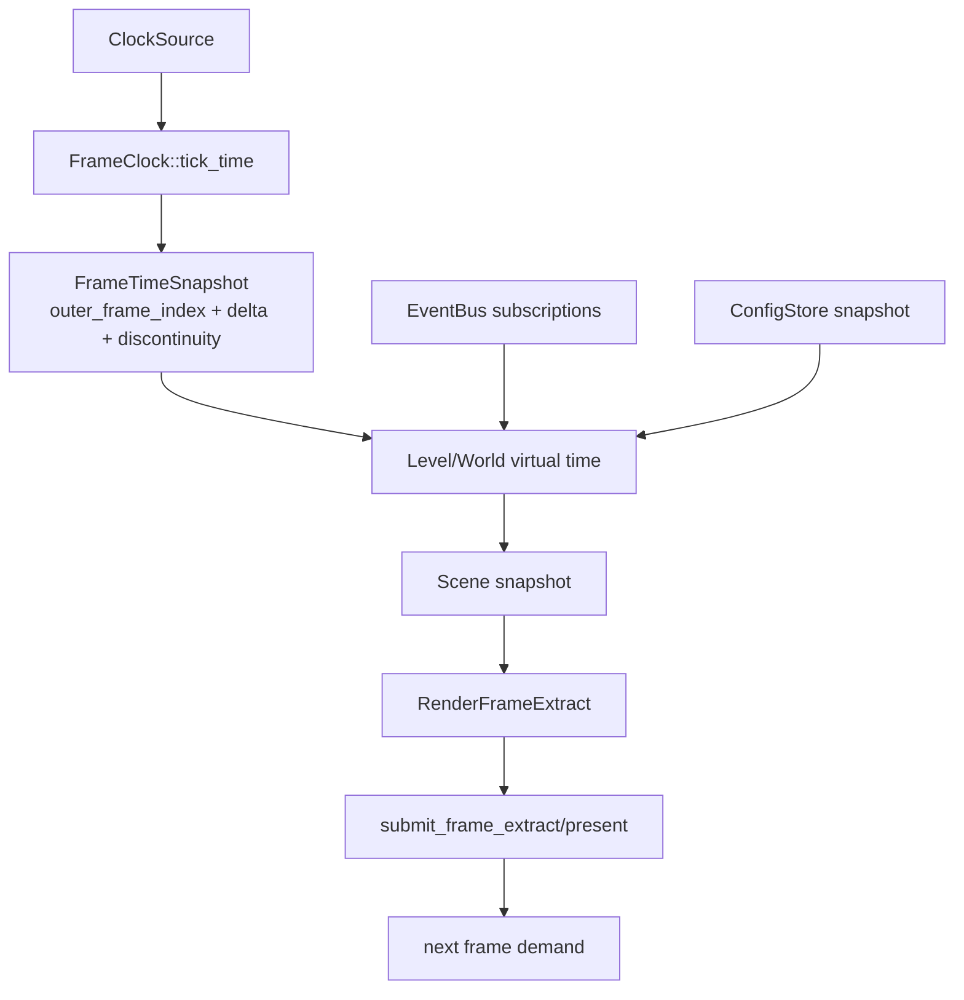

---
related_code:
  - zircon_runtime/src/core/runtime/frame_clock.rs
  - zircon_runtime/src/core/runtime/time.rs
  - zircon_runtime/src/core/runtime/events
  - zircon_runtime/src/core/framework/events.rs
  - zircon_runtime/src/core/framework/render/frame_extract.rs
implementation_files:
  - zircon_runtime/src/core/runtime/runtime.rs
  - zircon_runtime/src/core/runtime/handle/events.rs
  - zircon_runtime/src/core/framework/render/frame_extract/view.rs
plan_sources:
  - user: 2026-09-09 构建 ZirconEngine 机制 Wiki
  - docs/wiki/core-runtime/events-config-and-time.md
tests:
  - zircon_runtime/src/core/runtime/tests/events
  - zircon_runtime/src/tests/time.rs
  - zircon_runtime/src/core/framework/tests/framework_surfaces.rs
doc_type: mechanism-guide
---

# 帧数据、事件与时间流

Core 的 outer frame 是跨模块的时间边界：它产生 `FrameTimeSnapshot`，驱动场景/脚本更新，并最终把场景快照转换为 renderer 可消费的 `RenderFrameExtract`。EventBus 和 config store 参与同一帧的控制输入，但都不是渲染线程的隐式共享状态。



## 时间快照的权威边界

`CoreRuntime::tick_time(max_fixed_steps)` 从注入的 `ClockSource` 取 monotonic 时间；`advance_time_by` 只用于调用方已经计算好 delta 的场景。快照记录 outer frame index、raw real delta、real elapsed、fixed-step budget 和可选 `FrameTimeDiscontinuity`。World 的 pause、time scale 和 fixed-step debt 由 `LevelSystem` 管理，不能把 Core snapshot 当作 World 的 virtual time。

应用前后台切换或 surface 重建时调用 `submit_clock_discontinuity(ClockDiscontinuity)`。返回的 `FrameClockRebaseReceipt` 带 generation；rebase 原因只在下一次快照出现一次，防止恢复帧重复消费。

```rust
let receipt = runtime.submit_clock_discontinuity(
    ClockDiscontinuity::ApplicationLifecycle(ClockLifecycleTransition::Resumed),
);
let frame = runtime.tick_time(4);
assert!(frame.outer_frame_index > 0);
```

上例中的 `4` 是调用方选择的 fixed-step 上限；它不是引擎全局常量。

## 事件与配置的帧内使用

事件以 topic + `serde_json::Value` 投递。`Lossless`、`BoundedDropOldest` 和 `Latest` 分别表达完整控制流、有限历史流和当前值流；订阅返回 `Arc<EngineEvent>`，消费者不应修改 payload。配置通过 `store_config_value` 写入内存，typed `load_config<T>` 只做反序列化，不代表 Foundation 磁盘持久化已经完成。

```rust
let subscription = runtime.subscribe_events(
    "scene.changed",
    EngineEventDeliveryPolicy::Latest,
);
runtime.publish_event("scene.changed", serde_json::json!({"entity": 42}));
let latest = subscription.try_recv()?;
```

事件只在发布后可见；不要把 subscriber queue 当作跨进程日志。高频 topic 应选择有界策略，并通过 `event_bus_diagnostics()` 检查 dropped/queued 计数。

## 抽取与提交的所有权

World/scene 更新阶段写入快照；抽取阶段构造 `RenderFrameExtract`，渲染阶段只读该 owned packet。`RenderFrameExtract::from_snapshot` 复制或共享明确标注的场景域，而 view、timing 等提交信息保持 submission-local。渲染回调不得回写 World 或 UI 树。

### 错误与重试

- 时钟 discontinuity：收到 receipt 后丢弃依赖旧 delta 的一次性积分，等待下一 snapshot。
- EventBus drop：若业务必须完整处理，改用 `Lossless` 或从 domain snapshot 重建，而不是假设队列无损。
- 配置解析失败：保留旧 typed 配置并报告 `CoreError`；修正 JSON 后再次 `load_config`。
- 抽取失败：保持上一帧可消费 packet，并在下一帧从最新 snapshot 重建；不要让半成品跨线程发布。

### 排查清单

- 是否把 outer real delta 错当成 World virtual delta？
- 应用 resume、暂停和 surface 重建是否都提交了 discontinuity？
- 高频事件是否观察到 `dropped > 0` 或 queue age 增长？
- 渲染线程是否只消费 extract，而没有访问可变 scene/UI 对象？
- frame timing 是否区分 extract、renderer call 和 readback/present？

## 参考实现与测试

- 实现：`zircon_runtime/src/core/runtime/frame_clock.rs`、`core/framework/render/frame_extract`。
- 相关概念页：[事件、配置与时间](../core-runtime/events-config-and-time.md)、[渲染架构](../graphics/architecture.md)。
- 测试覆盖 discontinuity/rebase、事件投递策略和 extract round-trip。
