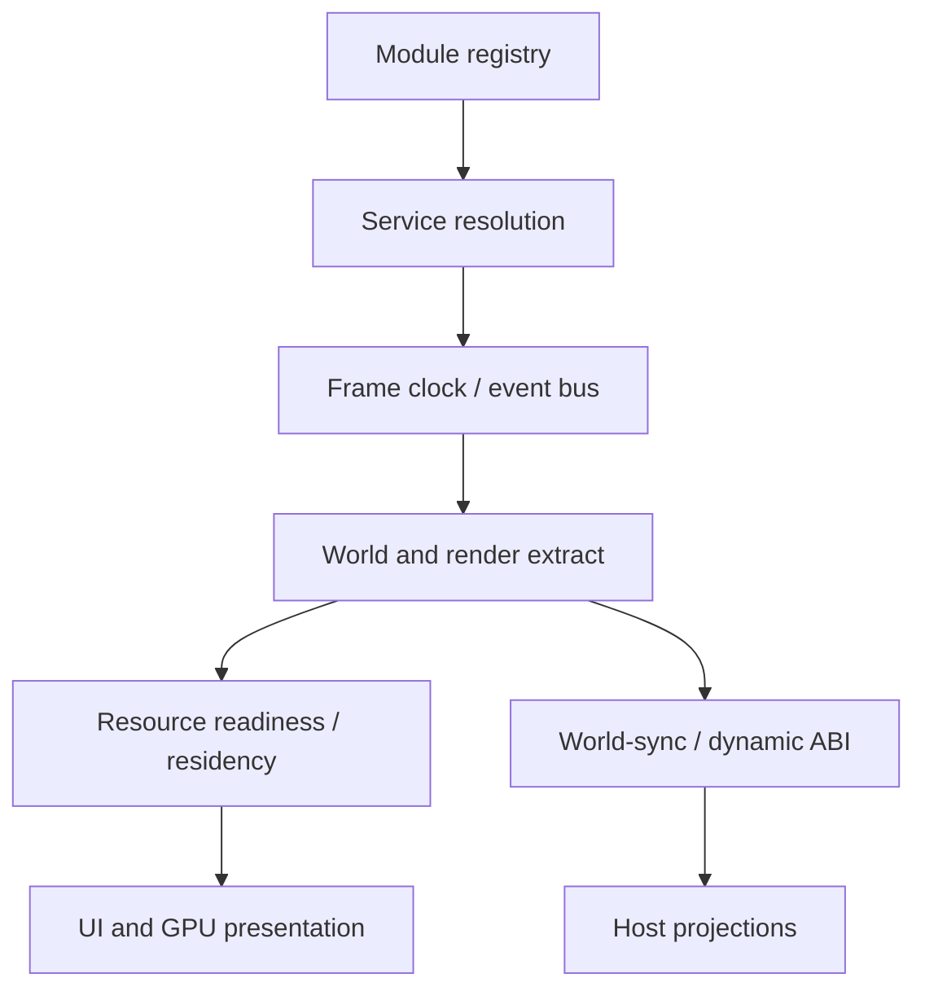

---
related_code:
  - zircon_runtime/src/core/runtime
  - zircon_runtime/src/asset
  - zircon_runtime/src/graphics
  - zircon_runtime/src/ui
  - zircon_runtime_interface/src
implementation_files:
  - zircon_runtime/src/core/runtime
  - zircon_runtime/src/asset
  - zircon_runtime/src/graphics
  - zircon_runtime/src/ui
plan_sources:
  - user: 2026-09-09 扩展 ZirconEngine Wiki 教程与机制说明
  - docs/wiki/architecture/system-overview.md
tests:
  - zircon_runtime/src/tests
  - zircon_runtime_interface/src/tests
doc_type: category-index
---

# 引擎机制指南

本分区解释“看起来只是一次调用”背后的状态机、所有权和跨层数据流。它是教程与 API 参考之间的桥梁：教程告诉你怎么做，机制页告诉你为什么必须这样做。

## 机制总图

每条路径都有自己的 generation 或 identity。跨路径组合时，使用中性 DTO、handle、lease 或 receipt，而不是把某一层的内部引用泄漏给另一层。

## 按问题查找

| 问题 | 机制页 | 核心不变量 |
| --- | --- | --- |
| 模块为什么不能随时插入，服务为何会 stale？ | [模块激活与服务解析](module-activation-and-service-resolution.md) | 先冻结图，再按依赖激活；调用必须参加 drain |
| 一帧的时间、事件和渲染数据如何对齐？ | [帧、事件与时间流](frame-data-event-time-flow.md) | 时间由 clock authority 推进，渲染只消费抽取结果 |
| 资产何时真的可用，为什么 handle 不等于驻留？ | [资产导入、就绪与驻留](asset-import-readiness-residency.md) | 根资产、直接依赖、递归依赖和 GPU 驻留分开判断 |
| UI 如何进入渲染帧，ABI 如何交接结果？ | [UI 渲染与动态 ABI](ui-render-and-dynamic-abi-handoff.md) | authority 留在 owner，跨边界只传 bounded DTO/owned buffer |

## 读图约定

- **实线箭头**：同一进程内的拥有或调用关系。
- **虚线/回环**：异步重试、失效通知或恢复路径。
- **generation**：内容或对象版本；版本变化时旧结果必须丢弃。
- **identity**：session、runtime、service 或 world 的归属；identity 不匹配时不能“猜测迁移”。
- **receipt**：一次动作的结构化结果，包含阶段、预算、错误和可继续动作。

## 机制页的使用方式

1. 先定位当前调用所在的 owner 层。
2. 读状态机的入口和终态，确认你的调用属于哪个阶段。
3. 按错误表选择重试、重新发现、完整刷新或终止，不要用 `unwrap` 隐藏边界。
4. 将清单转换为测试断言或诊断字段；只记录“成功”不足以证明 generation 和所有权正确。

相关专题：[系统总览](../architecture/system-overview.md)、[产品生命周期](../product-lifecycle.md)、[Rust API 约定](../rust-api.md)。
