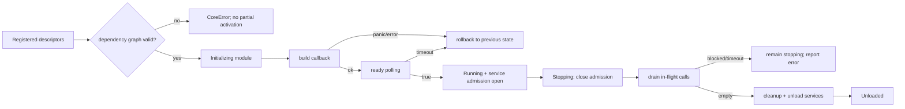

---
related_code:
  - zircon_runtime/src/core/runtime/runtime.rs
  - zircon_runtime/src/core/runtime/handle/activation.rs
  - zircon_runtime/src/core/runtime/handle/resolution.rs
  - zircon_runtime/src/core/runtime/descriptors/module_descriptor.rs
implementation_files:
  - zircon_runtime/src/core/runtime/runtime.rs
  - zircon_runtime/src/core/runtime/handle/activation.rs
  - zircon_runtime/src/core/runtime/handle/resolution.rs
plan_sources:
  - user: 2026-09-09 构建 ZirconEngine 机制 Wiki
  - docs/wiki/core-runtime/runtime-and-module-lifecycle.md
tests:
  - zircon_runtime/src/core/runtime/tests/activation
  - zircon_runtime/src/core/runtime/tests/resolution
  - zircon_runtime/src/tests/runtime_absorption/service_registry_lifecycle.rs
doc_type: mechanism-guide
---

# 模块激活与服务解析机制

模块激活解决“哪些模块可以运行、按什么顺序运行”的问题；服务解析解决“调用方何时得到一个可用实例”的问题。两条路径共享同一份 registry 状态，因此模块生命周期、服务工厂、依赖图和卸载 admission 必须一起理解。

## 两阶段状态机

注册阶段只收集 `ModuleDescriptor`，包含 `InitLevel`、`ModuleDependencySpec` 以及 driver/manager/plugin 描述符。`CoreRuntime::activate_registered_modules` 触发图冻结后的批量激活；`activate_module` 则从目标模块递归激活依赖闭包。



不变量：依赖先于使用者；生命周期回调不在 module/service registry lock 内执行；激活失败必须恢复到调用前状态。停机时先关闭服务 admission，再等待现有 `ServiceCallGuard` 释放，避免新调用在 cleanup 期间进入。

## 惰性服务解析

`CoreHandle::resolve_manager`、`resolve_driver` 和 `resolve_plugin` 先按规范化名字查找服务并校验 kind。若 `instance` 已存在，直接返回 `Arc<T>`；否则由当前线程取得唯一 initialization claim，递归解析服务依赖，再调用 factory。其他线程等待 resolution condition；同线程重入或 resolution stack 重复会报告 dependency cycle。

```rust
use zircon_runtime::core::CoreRuntime;

let runtime = CoreRuntime::try_new()?;
runtime.activate_registered_modules()?;
let manager = runtime.resolve_manager::<MyManager>("Game.Manager.Main")?;
```

上例中的 `MyManager` 和名字必须来自实际注册的 `ManagerDescriptor`；文档只展示调用形状，不承诺该名字在所有 profile 存在。

需要跨帧或跨线程保存引用时使用 `resolve_manager_handle`。`ServiceHandle::enter` 会验证 `RegisteredServiceIdentity` 的 index/generation，并返回持有 in-flight 计数的 `ServiceCallGuard`：

```rust
let handle = runtime.resolve_manager_handle::<MyManager>("Game.Manager.Main")?;
{
    let manager = handle.enter()?;
    manager.update();
} // guard drop 让 shutdown drain 继续
```

旧模块重新激活会产生新 generation；旧 handle 不会“复活”，而是返回 `CoreError::StaleServiceHandle`。这条规则阻止卸载后悬挂的 `Arc` 绕过 admission。

## 错误与重试

| 阶段 | 典型错误 | 正确动作 |
| --- | --- | --- |
| 注册/冻结 | 缺失依赖、重复服务、非法 kind | 修正 descriptor 后重新构造 runtime；不要在冻结后追加注册 |
| build/ready | factory 错误、callback panic、ready 超时 | 等待外部依赖后用 timeout API 重试激活；失败时检查回滚状态 |
| resolve | `MissingService`、`ServiceDowncast`、`DependencyCycle` | 核对 canonical name 和类型；周期依赖必须拆分 |
| 调用/停机 | `StaleServiceHandle`、`ServiceUnavailable`、drain timeout | 重新 resolve 当前 generation；缩短调用范围并释放 guard |

### 排查清单

- 是否在所有 builtin/plugin descriptor 注册完后才调用激活？
- 服务名的 module/kind 前缀是否与 descriptor 一致？
- factory 是否可能再次解析当前服务，形成同线程 cycle？
- 停机错误是否来自 active dependent 或仍未释放的 `ServiceCallGuard`？
- 是否把 `CoreWeak` 存在 registry-owned 服务中，避免强引用环？

## 参考实现与测试

- 实现：`zircon_runtime/src/core/runtime/handle/activation.rs`、`handle/resolution.rs`。
- 相关概念页：[运行时与模块生命周期](../core-runtime/runtime-and-module-lifecycle.md)、[服务注册表与依赖](../core-runtime/service-registry-and-dependencies.md)。
- 测试覆盖并发激活、factory 重试、依赖 cycle、stale identity、卸载阻塞和 drain timeout。
