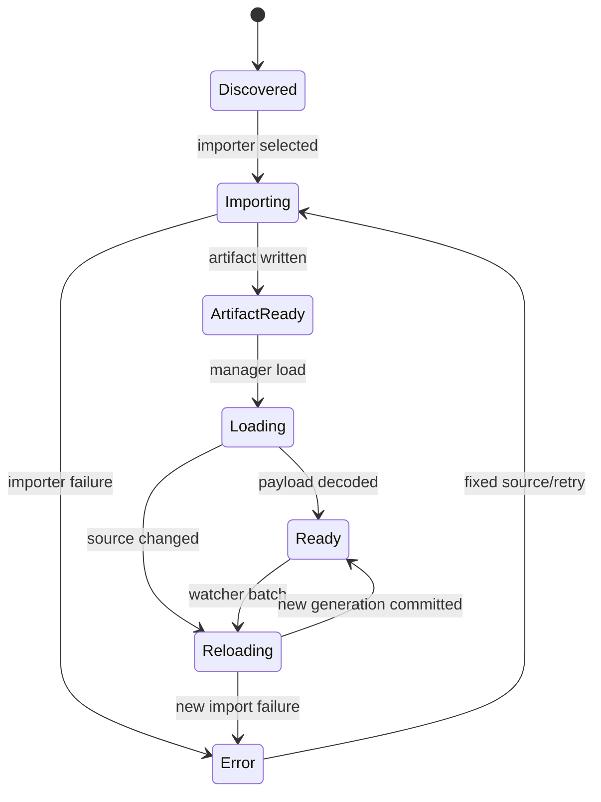

---
related_code:
  - zircon_runtime/src/asset/pipeline
  - zircon_runtime/src/asset/facade/readiness.rs
  - zircon_runtime/src/asset/watch
  - zircon_runtime/src/core/resource
implementation_files:
  - zircon_runtime/src/asset/pipeline/manager
  - zircon_runtime/src/asset/watch
  - zircon_runtime/src/asset/facade
plan_sources:
  - docs/wiki/scene-assets/project-assets.md
tests:
  - zircon_runtime/src/asset/tests/project
  - zircon_runtime/src/asset/tests/watcher.rs
  - zircon_runtime/src/asset/tests/pipeline
doc_type: mechanism-case-study
---

# 资产 generation、readiness 与热重载

资产管线把磁盘 source、`.zmeta`、artifact、运行时 payload 和 GPU residency 分成不同阶段。`ProjectAssetManager` 的 readiness facade 只提供当前 generation 的事实；调用方必须明确自己需要根 payload、直接依赖、递归依赖还是 GPU 可用。



## readiness 四层

| 层 | API | 语义 |
| --- | --- | --- |
| 根资源 | `load_state(handle)` | 当前 typed payload 是否 loaded |
| 直接依赖 | `dependency_load_state(handle)` | manifest 直接引用是否可用 |
| 递归依赖 | `recursive_dependency_load_state(handle)` | 完整依赖闭包是否可用 |
| 聚合 | `load_states(handle)` | 同时返回三类状态与失败原因 |

`is_loaded_with_dependencies` 不能被解释为 GPU 驻留；上传、descriptor bind 和 residency 由 renderer/resource manager 继续确认。错误 state 要读 `failure_reason`，不要从 NotLoaded 推测具体原因。

## 导入与 watcher

`ProjectManager::scan_and_import` 产生一次可审计的导入报告；watcher 通过 `AssetWatchBatch` 折叠重复文件事件，忽略 `.zmeta` sidecar 的伪变化，并按 URI 映射。批次提交时为每个资源分配 generation，异步 worker 必须把 generation 回传给 commit 阶段。

```rust
let manager = ProjectManager::open(paths.clone())?;
let report = manager.scan_and_import()?;
for asset in report.assets() {
    let states = assets.load_states(asset.handle());
    if states.is_loaded_with_dependencies() {
        consume(asset.handle());
    }
}
```

示例只表达调用形状；生产代码应订阅 asset events，并在事件 gap 时重新读取 snapshot。

## 热重载提交规则

1. watcher 产生 URI change set。
2. importer 读取 source 和当前 `.zmeta`，生成 candidate artifact。
3. manager 分配 candidate generation，不立即替换 active payload。
4. 完成根 payload 与依赖验证后原子提交；失败只影响 candidate generation。
5. renderer/UI 收到 reload fact，按 generation 刷新 cache。

如果导入期间 source 再次变化，旧 candidate 只能被标记 stale，不能覆盖最新 generation。编辑器的视图 projection 也必须携带 generation，避免把旧属性写回新对象。

## 故障注入与恢复

- importer 返回错误：资源进入 `Error`，保留旧 Ready payload（若策略允许），修复 source 后重新导入。
- `.zmeta` uuid 冲突：拒绝提交并报告 duplicate identity；不能自动生成新 uuid 破坏引用。
- 依赖 artifact 缺失：根状态可能 Ready，但 aggregate 不是 Ready；等待依赖完成。
- 热重载竞态：提交前比较 generation；不匹配则丢弃 candidate 并排队重试。
- watcher 丢事件：清空本地 queue，重新 `scan_and_import` 或读取 manager snapshot。

## 不变量与预算

- 逻辑 AssetId 稳定，内容 generation 单调递增。
- Ready 必须同时满足记录状态与 typed payload 存在。
- 任何依赖状态异常都不能伪造 aggregate Ready。
- artifact commit 原子化，失败 candidate 不污染 active generation。
- watcher 批次有界；导入 worker 和 renderer 不共享可变 payload。

建议单次 watcher batch 在 16 ms 内完成折叠；导入在后台线程执行，首帧只等待 profile 声明的关键资产。大型场景使用递归 readiness 查询和分批 residency，记录 queue depth、bytes、generation age、failed count。

## 生产检查清单

- [ ] source、meta、artifact 的 identity 可追踪。
- [ ] importer capability report 与 extension 匹配。
- [ ] 根/直接/递归/GPU readiness 分开显示。
- [ ] reload commit 前后校验 generation。
- [ ] event gap 有 snapshot 重建路径。
- [ ] 失败保留原因与上一个成功 generation。
- [ ] 资源 lease 与 GPU residency 有独立预算。

## 参考与验证

- 源码：`asset/pipeline/manager`、`asset/facade/readiness.rs`、`asset/watch`、`core/resource`。
- 测试：`asset/tests/project/manager/full_generation.rs`、`restore_failure_migration.rs`、`asset/tests/watcher.rs`、`asset/facade/load_state.rs`。
- 对照：Unreal Asset Registry/Derived Data Cache、Godot ResourceLoader reload、Fyrox ResourceManager；Zircon 额外暴露根与依赖分层状态。

## 场景变体 A：shader 依赖材质

材质根资源 Ready 不代表 shader variant 和 texture dependency Ready。渲染器应先查询 `load_states`，再检查 variant cache/residency；若 shader 正在 Reloading，提交旧 pipeline 或 placeholder，而不是阻塞全场景。新 variant commit 必须带 source generation 和 feature key。

## 场景变体 B：大型场景渐进式加载

场景 root 可先进入 Loaded，层级子资产保持 Loading。编辑器 hierarchy 可以显示节点，但 viewport 只绘制递归依赖 Ready 的实体。通过 subtree/asset watch 收到局部 invalidation 后，只刷新受影响分支，避免全场景重建。

## readiness 决策表

| 状态组合 | 视图可见性 | 可否写入 |
| --- | --- | --- |
| root Loaded + deps Loaded | 完整功能 | 是 |
| root Loaded + deps Loading | placeholder/禁用操作 | 仅元数据 |
| root Loading | 不显示 payload | 否 |
| root Error + old payload | 显示旧版本和错误 | 谨慎，需明确策略 |
| root Reloading | 显示旧版本/进度 | 新写入需 generation check |

## importer 合同

importer 应声明 source suffix、meta schema、依赖提取器和 artifact kind。导入报告要区分 discovered、skipped、imported、failed、stale；“没有变化”不等于失败。`.zmeta` 更新必须与 artifact manifest 原子替换，避免崩溃后出现 uuid 与 payload 不一致。

## 热重载窗口

watcher 的文件系统事件可能重复、乱序或只报告目录。`AssetWatchBatch` 先按 canonical URI 折叠，再读取当前 source timestamp/hash，最后由 manager 分配 generation。不要把 notify event 的顺序当作内容顺序。

## 恢复剧本

导入失败时保留上一个成功 artifact，UI 显示 failure reason 和 retry action。若依赖失败，根资源状态应明确为 aggregate incomplete；依赖修复后从失败节点重新计算闭包。事件丢失时执行 bounded full scan，扫描完成后重新建立本地 generation map。

## 资源预算

为每个 wave 设置 source bytes、artifact bytes、decoded bytes、GPU bytes 和并发 worker 上限。导入峰值不可只看文件大小；压缩纹理解码和 mip 生成可能放大内存。观测 `queue_depth`、`in_flight_bytes`、`generation_age`、`reload_count`、`stale_commit_count`、`failure_count`。

## 失败演练

1. 复制 `.zmeta` 产生 uuid 冲突，确认导入拒绝且旧记录不被改写。
2. 依赖 artifact 删除，确认 aggregate readiness 非 Ready。
3. 连续快速保存同一 source，确认 watcher 折叠且只提交最新 generation。
4. 在 commit 前插入第二次变化，确认第一候选标记 stale。
5. 断开 watcher channel，确认全量扫描恢复。

## 验证矩阵

| 测试 | 覆盖 |
| --- | --- |
| `project/manager/full_generation.rs` | generation 递增与提交 |
| `project/manager/restore_failure_migration.rs` | 失败恢复与旧 artifact |
| `watcher.rs` | 重复事件折叠、sidecar 忽略 |
| `facade/load_state.rs` | readiness 投影矩阵 |
| `pipeline/worker_pool` | 并发与 backpressure |

新增 AssetKind 必须同时定义 root/dependency/recursive readiness 和失败恢复策略。

## API 参数审查

| 参数 | 来源 | 校验 |
| --- | --- | --- |
| `Handle<TAsset>` | asset registry | id 与类型匹配 |
| `AssetUri` | project manifest/watcher | canonical、UTF-8、长度 |
| generation | manager | 单调递增、不可回退 |
| `ResourceState` | resource registry | 与 runtime payload 一致 |
| dependency list | importer | 无重复、无环 |
| event receiver | manager | 订阅 owner 可追踪 |

调用 `load` 前应确认项目已 open；调用 readiness facade 时应容忍 NotLoaded、Loading、Reloading、Failed 四类状态。对失败资源读取 `failure_reason`，对成功资源仍检查递归依赖和 residency。

## 运维 runbook

发现资源显示旧版本时，记录 asset id、URI、active generation、last event generation 和 watcher batch id。若 candidate generation 小于 active，判定为 stale；若 active 没有变化，检查 importer 是否未选中或 `.zmeta` 被锁定。恢复动作是重新扫描单个 URI，再执行 bounded import，而不是删除 cache。

当导入队列持续增长时，先限制低优先级 watcher batch，再观察 in-flight bytes 和 worker saturation。若 bytes 正常但 queue age 高，增加 IO worker；若 bytes 超预算，降低并发或分片 artifact。任何调整都写入 profile diagnostics，方便回滚。

## 反例对照

- 反例：收到文件 modified 就直接替换 payload。后果：重复/乱序事件破坏 generation。
- 反例：看到 root Loaded 就绘制场景。后果：依赖 shader/texture 缺失导致黑屏。
- 反例：失败后清空 failure reason。后果：无法区分 source 错误与 provider 错误。
- 反例：用新的 uuid 修复复制冲突。后果：外部引用断裂。
- 反例：每帧全量 scan。后果：IO 抢占 frame budget。

## 章节验收

- [ ] 文档示例能指出 API owner 和失败返回。
- [ ] 每个状态都有进入、退出和重试条件。
- [ ] 热重载有旧 candidate 丢弃案例。
- [ ] watcher 丢事件有全量扫描恢复。
- [ ] readiness 与 residency 没有混为一谈。
- [ ] 资源预算包含 source、artifact、decoded、GPU 四种 bytes。
- [ ] 测试矩阵覆盖正常、竞态、失败和恢复。

## 交叉模块契约

asset manager 只负责资源事实；renderer 决定 GPU residency，editor 决定展示与写入，world-sync 负责 generation 失效通知。任何跨层调用都应通过 facade/DTO，不读取 manager 私有 map。导入完成后同时发布 resource event 与 diagnostic measurement，二者 generation 必须一致。

## 版本升级注意

升级 importer schema 时保留旧 artifact reader，先迁移 `.zmeta` 再切换 active generation。若迁移失败，恢复旧 schema 和旧 artifact；不要删除 source 旁的 meta 文件作为“清理”。
