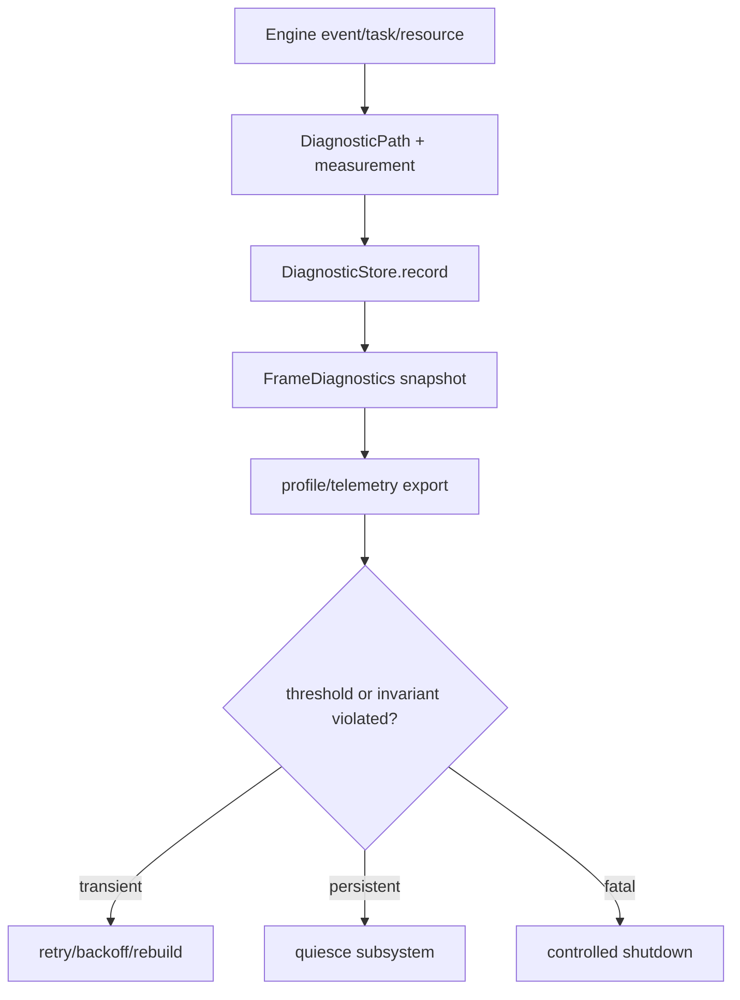

---
related_code:
  - zircon_runtime/src/core/runtime/diagnostics
  - zircon_runtime/src/core/runtime/tasks/diagnostics
  - zircon_runtime/src/diagnostic_log
  - zircon_runtime/src/dynamic_api/session/profile.rs
implementation_files:
  - zircon_runtime/src/core/runtime/diagnostics/store.rs
  - zircon_runtime/src/core/runtime/diagnostics/snapshot.rs
  - zircon_runtime/src/core/runtime/tasks/report.rs
  - zircon_runtime/src/diagnostic_log/sink
plan_sources:
  - docs/wiki/core-runtime/diagnostic-log.md
  - docs/wiki/app-runtime-api/reference/profiling-diagnostics.md
tests:
  - zircon_runtime/src/core/runtime/diagnostics
  - zircon_runtime/src/core/runtime/tasks/diagnostics
  - zircon_runtime/src/diagnostic_log/sink/tests
doc_type: mechanism-case-study
---

# 诊断、可观测性与恢复：从症状到证据

诊断系统的目标不是“多打日志”，而是把 frame、模块、任务、资源、ABI 和 renderer 的状态压缩为可关联的证据。恢复路径依赖这些证据选择重试、降级、重建或终止。



## DiagnosticStore 契约

`DiagnosticPath` 是稳定层级键，例如 `runtime.tasks.worker.queued` 或 `render.present.latency_us`。`DiagnosticStore::record(path, frame_index, value, unit, tags)` 写入序列，`snapshot` 产生只读快照。路径、单位和 tags 必须保持稳定，便于跨版本 dashboard 聚合。

```rust
runtime.record_diagnostic(
    "runtime.asset.import.queue_depth",
    frame.outer_frame_index,
    queue_depth as f64,
    Some("items"),
    ["asset", "import"],
);
let snapshot = runtime.diagnostic_store_snapshot();
```

不要把用户数据、路径明文或大 payload 写入高频 measurement；大对象应写引用和摘要。

## FrameDiagnostics 与 profile

`FrameDiagnostics` 为 animation、physics、render 等域提供统一 status；runtime snapshot 可同时取得当前 measurement、last error 和 provider availability。profiling recorder 记录 span、frame、counter，`snapshot()` 再由动态 API 的 `profile_control` 按预算导出。

任务图和 asset worker pool 通过 `record_diagnostics` 将 queued/running/completed/failed/cancelled、worker join 和 bytes pressure 注入 store。日志 sink 额外记录 critical backpressure、dropped warn/error、queue age 和 output writes。

## 恢复决策表

| 证据 | 判定 | 动作 |
| --- | --- | --- |
| queue 短时升高、无失败 | transient pressure | 限制 admission、退避 |
| generation gap | stale projection | snapshot 重建 |
| repeated factory panic | provider fault | 隔离插件、禁用 capability |
| GPU present error | device/surface fault | 重建 surface/device |
| task drain timeout | ownership leak | 关闭 scope，报告 guard |
| ABI shape mismatch | deployment fault | 选择匹配 BuildSet，终止加载 |

恢复动作必须记录 cause path、attempt、backoff、remaining budget 和结果，避免只记录“retry”。

## 故障注入

- 人为阻塞 diagnostic sink：验证 critical 记录触发 backpressure 计数，不能无限增长。
- 让 worker task 持续失败：snapshot 应显示 failed/last error，恢复策略停止热循环。
- 写入重复/未知 DiagnosticPath：检查 dashboard schema 校验与告警。
- profile export 输出超限：prepare/register 失败后不消费队列。
- runtime shutdown 中断：保留最终 snapshot 和 incomplete worker census。

## 不变量

- measurement 的 frame index 与产生它的 outer frame 一致。
- path、unit、tags 的语义稳定，数值异常不会改变键名。
- 诊断写入不能改变业务状态，也不能反向持有 runtime owner。
- backpressure 是可观测状态；critical 事件不得静默丢失。
- 恢复动作有最大尝试次数或绝对 deadline。

## 性能预算

热路径 counter 写入应接近无分配；高频 span 使用线程局部 recorder，再批量 snapshot。每帧诊断快照限制条目数和 encoded bytes，UI 面板按采样率刷新。推荐将诊断开销控制在 frame CPU budget 的 2% 以内，sink flush 异步化，critical admission 单次等待不得超过 profile 配置。

## 生产检查清单

- [ ] 每个跨层错误都有 DiagnosticPath 和阶段。
- [ ] frame index、runtime/session identity、generation 可关联。
- [ ] queue、backpressure、drop、retry、timeout 都有计数。
- [ ] profile/telemetry 输出有上限和 rollback。
- [ ] 恢复动作不形成无限重试环。
- [ ] shutdown 能导出最终 snapshot 和 census。
- [ ] dashboard schema 对 path/unit/tags 做版本管理。

## 参考与验证

- 源码：`core/runtime/diagnostics/store.rs`、`snapshot.rs`、`tasks/report.rs`、`diagnostic_log/sink`、`dynamic_api/session/profile.rs`。
- 测试：`core/runtime/diagnostics`、`core/runtime/tasks/diagnostics`、`diagnostic_log/sink/tests/{backpressure,critical}`、`dynamic_api/tests/profile_control.rs`。
- 对照：Unreal Insights、Bevy tracing/diagnostic plugins、Godot profiler、Graphics frame debugger；Zircon 将诊断纳入 runtime-owned recovery budget。

## 场景变体 A：线上帧率回退

当 `render.present.latency_us` 和 `runtime.tasks.worker.queued` 同时升高时，先比较 GPU/CPU domain。若 GPU present 变慢，降低 render demand 或重建 surface；若 worker queue 增长，限制低优先级 asset/UI 任务。诊断路径要能区分两者，避免把所有卡顿都归因于 renderer。

## 场景变体 B：编辑器导入失败

Asset worker pool 记录 failed count、queue age、in-flight bytes 和最后错误；editor 根据 generation 和 failure reason 决定重试、回滚旧 artifact 或触发完整 scan。重复失败达到阈值后暂停该 URI，等待用户修复，而不是每帧自动重试。

## 证据分层

| 层 | 内容 | 保留策略 |
| --- | --- | --- |
| Counter | queue、bytes、drops | 长期聚合 |
| Span | frame/extract/present | 短期采样 |
| Snapshot | 当前状态/last error | 直到下次成功 |
| Event | 状态转移/恢复动作 | 审计保留 |
| Payload | 大型 dump/frame | 显式请求、限时 |

## 告警去抖

告警应使用连续窗口和恢复阈值，例如 queue p95 连续 10 帧超过 budget 才触发，恢复到阈值以下持续 30 帧才清除。每次 retry/backoff 要增加 attempt 字段；相同错误不能无限刷屏。

## 恢复状态机

`Healthy -> Suspect -> Mitigating -> Recovered`；若 mitigation 无效进入 `Degraded`，超过绝对 deadline 则 `Failed`。状态机只消费诊断快照，不直接修改被观测模块内部锁。恢复动作通过公开 admission/rebuild API 执行，并产生新的证据。

## 故障演练

1. 将 sink 延迟提升到预算以上，验证 critical backpressure 计数。
2. 注入 worker panic，确认 failure snapshot 和一次性 retry。
3. 让 DiagnosticPath 单位改变，schema 校验应拒绝 dashboard 发布。
4. 让 profile output 超限，确认 queue rollback。
5. shutdown 时保持 running task，确认最终 snapshot 标记 incomplete。

## 观测字段规范

最小字段集合：`timestamp/frame_index`、`runtime_id`、`session_id`、`module`、`subsystem`、`generation`、`path`、`value`、`unit`、`tags`、`error_kind`、`attempt`、`remaining_budget`。PII、绝对路径和动态 payload 只能在显式 debug profile 中采集。

## 性能预算

counter/span 记录走线程局部或无锁 fast path；snapshot/export 在后台执行。单个 frame 的 measurement 条目和编码 bytes 都有限制。critical 日志可短暂阻塞，但必须有超时和 backpressure 计数；普通日志在压力下允许按策略 drop。

## 验证矩阵

| 测试 | 事实 |
| --- | --- |
| `diagnostics/store.rs` tests | path、unit、snapshot 语义 |
| `diagnostics/profiling` tests | span/frame/counter snapshot |
| `tasks/diagnostics` tests | task census 记录 |
| `diagnostic_log/sink/tests/backpressure.rs` | drop/backpressure 指标 |
| `dynamic_api/tests/profile_control.rs` | 有界 profile 输出 |

新增诊断域必须提供正常、压力、恢复三种快照测试，并声明保留和采样预算。

## API 前置条件与后置条件

| API | 前置条件 | 成功后 | 失败/边界 |
| --- | --- | --- | --- |
| `record_diagnostic` | path/unit/tags 合法 | 新 measurement | 采样/限额丢弃 |
| `diagnostic_store_snapshot` | store 可访问 | 只读快照 | runtime stopped |
| `FrameDiagnostics::frame_diagnostics_status` | provider 实现 trait | status projection | unavailable |
| profiling `record_span` | recorder active | span 入线程缓存 | sampling drop |
| profiling `snapshot` | budget 足够 | bounded profile DTO | output limit |
| task `record_diagnostics` | census 可读 | queue/worker metrics | scope closed |

## 从症状到根因的案例

### 首帧超时

先比较 `activation.ready_elapsed_us`、`asset.queue_depth` 和 `render.first_present_us`。若 ready 超时，检查 module/provider；若 ready 正常而 first present 慢，检查 shader prewarm、surface bind 和 extract bytes。恢复动作应只重试具体阶段，不要重复创建整个进程。

### 编辑器卡顿

比较 UI layout、world-sync drain、command commit 和 save IO spans。若 queue age 只在 save 期间增加，降低保存并发；若 world invalidation rollback 增多，切换分页或完整 snapshot。所有 mitigation 都需记录 attempt 和结果。

## 采样与保留策略

开发 profile 可采集每帧 span；产品 profile 只采样 p95/p99 和错误帧。错误 snapshot 保留到下一次成功，critical 日志持久化，debug payload 限时过期。路径 schema 与 dashboard 版本一起发布，避免升级后同名指标含义漂移。

## 恢复动作表

| 触发器 | 第一步 | 第二步 | 终止条件 |
| --- | --- | --- | --- |
| queue pressure | close low-priority admission | 合并/退避 | deadline |
| stale generation | discard result | snapshot rebuild | owner gone |
| repeated panic | isolate provider | restart composition | retry limit |
| GPU present error | stop demand | recreate surface/device | recovery budget |
| sink backpressure | drop debug | block critical with timeout | sink failure |

## 观测实现守则

测量写入不得调用可能阻塞的文件 IO；异步 sink 负责 flush。计数器使用单调递增，状态快照使用显式 generation。错误字段保留结构化 enum/string key，用户消息另行本地化。指标聚合不要读取 mutable module internals。

## 演练与验收

每个季度执行一次：worker panic、GPU lost、asset flood、ABI output overflow、shutdown stuck 五项演练。验收标准是：15 秒内找出 owner、generation、budget 和下一步动作；恢复后没有 orphan task、allocation 或 stale watch。

## 交付前审查问题

- 是否能把一条告警关联到 runtime/session/frame？
- 是否能区分 transient pressure 与 persistent leak？
- 所有 retry 是否有限次并携带 backoff？
- snapshot/export 是否有 bytes/items 限制？
- shutdown 是否保存 incomplete census？
- dashboard 是否检查单位、tags 和 schema version？

## 反例对照

- 反例：错误只写自然语言。后果：自动恢复无法分类。
- 反例：每帧导出全量 profile。后果：诊断本身造成卡顿。
- 反例：critical 与 debug 共用无界队列。后果：内存失控。
- 反例：恢复动作没有最大尝试次数。后果：热循环。
- 反例：指标单位在版本间变化但 path 不变。后果：dashboard 误判。

## 章节验收

- [ ] counter/span/snapshot/event/payload 分层明确。
- [ ] 帧率回退和导入失败两个变体覆盖。
- [ ] 所有恢复动作有 retry/deadline。
- [ ] 采样、保留、PII 和 bytes 限制明确。
- [ ] shutdown 最终 snapshot 可定位 incomplete owner。

## 交叉模块契约

诊断 path 的 owner 分别是 runtime、task、asset、render、UI、dynamic session；共享字段只使用 frame/session/generation/identity。恢复动作通过各模块公开 API 执行，诊断层不直接修改 registry、queue 或 GPU state。

## 版本升级注意

新增 measurement path 需要 schema、unit、tags 和保留策略；修改单位或聚合语义应使用新 path。迁移 dashboard 时保留旧 path 一段窗口，避免升级期间丢失趋势。
