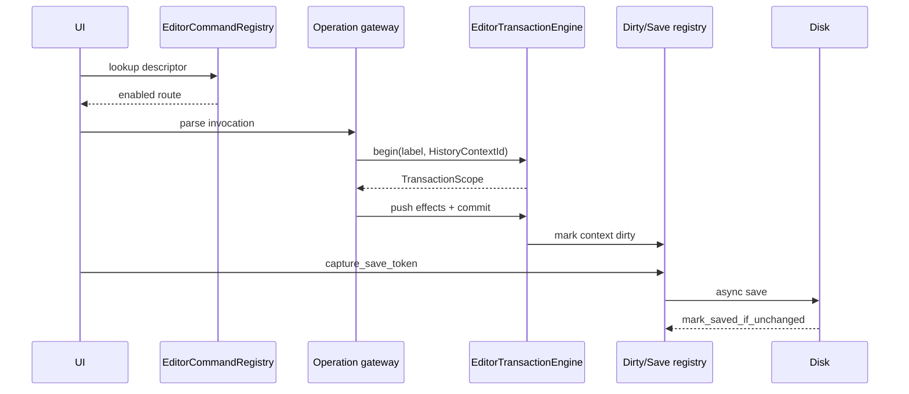

---
related_code:
  - zircon_editor/src/core/editing/engine
  - zircon_editor/src/core/commands
  - zircon_editor/src/core/asset/dirty
  - zircon_editor/src/core/context
implementation_files:
  - zircon_editor/src/core/editing
  - zircon_editor/src/core/asset/dirty
  - zircon_editor/src/core/commands/execution.rs
plan_sources:
  - docs/wiki/editor/commands-transactions.md
tests:
  - zircon_editor/src/tests/editing/transaction_engine
  - zircon_editor/src/tests/editing/node_ops/gateway_recovery.rs
  - zircon_editor/src/tests/workbench/project/document_roundtrip.rs
doc_type: mechanism-case-study
---

# 编辑器事务、命令网关与保存标记

编辑器修改必须经过 command descriptor、operation route、transaction scope 和 dirty/save registry。这样 undo/redo、文档隔离、play-session 隔离以及磁盘保存可以共享同一条可恢复路径。



## 命令 descriptor 与网关

`EditorCommandDescriptor::operation(EditorOperationPath)` 描述可路由操作；`EditorCommandRegistry::default_workbench` 提供 builtin commands。调用前必须通过 `EditorCommandRegistry::ensure_enabled` 或等价上下文判断项目、selection、play mode 和 capability 条件。`EditorOperationPath::parse` 与 `EditorOperationInvocation::parse` 负责规范化路径和参数，未知路径应返回结构化错误。

```rust
let registry = EditorCommandRegistry::default_workbench();
let operation = EditorOperationPath::parse("file.project.save")?;
let invocation = EditorOperationInvocation::parse("file.project.save")?;
let descriptor = registry.find(&operation).ok_or("missing command")?;
```

示例是调用形状，具体 `find` 辅助方法以当前 crate 导出为准。不要直接调用 view widget 改变 document；所有修改都进入 gateway。

## transaction scope

`EditorTransactionEngine::begin(label, HistoryContextId)` 创建 scope。scope 收集 participant、command effect 和 world/document identity；`commit` 才将一组 effect 写入历史。drop 未提交 scope 应取消，不得留下 dirty 标记。嵌套 scope 按 history context 归并，跨 document 或 play session 混用会报 routing error。

历史上下文常见值：`Global`、`Document(DocumentId)`、`PlaySession(instance)`。undo/redo 必须传同一 context；不能让全局 undo 撤销另一个文档的操作。

## 保存标记的 compare-and-mark

保存前调用 `capture_save_token(context)`，异步 IO 完成后调用 `mark_saved_if_unchanged(context, token)`。若保存期间产生新 transaction，token 不匹配，不能清除 dirty。保存失败保留 dirty 和具体错误，供重试/另存为流程处理。

## 故障注入与恢复

- command path 拼写错误：返回 `MissingCommand`，不创建空 transaction。
- descriptor disabled：返回 context error，UI 保留当前 selection。
- participant apply 失败：事务回滚已应用 effect，历史不增加记录。
- undo effect 失败：历史进入 recovery 状态，禁止继续 redo，显示修复提示。
- 磁盘写入失败：保存 token 不被消费，稍后重试或切换目标路径。
- world-sync generation 过期：拒绝写入，重新 query transform/fields 后重建 transaction。

## 不变量

- 一个用户意图对应一个可见历史记录；批量修改不可拆成不可逆的多个隐式记录。
- commit 之前不改变 dirty/history；commit 之后 undo/redo 可重放相同 participant。
- save token 只在内容未变化时清除 dirty。
- gateway 是 editor UI 与 runtime/world authority 的唯一写入口。
- 失败事务不留下部分 document/world 状态。

## 性能预算

command lookup 和 path parse 应小于 1 ms；transaction scope 不在 UI 线程执行大规模序列化。大型多选修改使用一个 scope 和批量 effect，限制单记录 payload 大小。异步保存要有队列容量、取消策略和 progress diagnostics，不能阻塞 frame loop。

## 生产检查清单

- [ ] 所有修改都有 operation path 和 history context。
- [ ] descriptor enabled 条件覆盖 project/play/selection。
- [ ] scope commit/rollback 生命周期有测试。
- [ ] participant identity 与 world generation 一致。
- [ ] save token 采用 compare-and-mark。
- [ ] undo/redo 失败进入可恢复状态。
- [ ] dirty、save queue、write error 可观测。

## 参考与验证

- 源码：`core/editing/engine`、`core/commands`、`core/asset/dirty`、`commands/execution.rs`。
- 测试：`tests/editing/transaction_engine/{scope,routing,recovery}.rs`、`node_ops/gateway_recovery.rs`、`workbench/project/document_roundtrip.rs`。
- 对照：Unreal Transaction Buffer、Godot UndoRedo、Fyrox command stack；Zircon 额外按 document/play-session 隔离 history context。

## 场景变体 A：多选 Inspector 修改

Inspector 将同一字段修改应用到多个 entities，但只创建一个 transaction。每个 participant 先验证 entity、component type、writable 和 world generation；任一 participant 失败则整个 scope rollback。成功 commit 后 dirty registry 只增加一个历史记录，undo 可以原子地恢复全部 entities。

## 场景变体 B：Play 模式临时修改

Play session 使用 `HistoryContextId::PlaySession(instance)`，与编辑文档 history 隔离。运行时 transform/gizmo 修改只写 play world；停止 play 时丢弃 play history，除非用户显式执行 apply-to-document 操作。跨 context 直接 push 应返回 routing error。

## gateway 入口检查

网关执行顺序建议固定为：parse path -> lookup descriptor -> evaluate `WhenClause`/capability -> decode bounded args -> resolve world/document identity -> begin transaction -> apply participants -> commit -> publish event。任何早期失败都不能创建 dirty record。

## save 状态机

| 状态 | 允许动作 | 终态 |
| --- | --- | --- |
| Clean | begin edit/save | Dirty |
| Dirty | capture token/save | Saving |
| Saving | new edit | Dirty (token stale) |
| Saving | write success + unchanged | Clean |
| Saving | write error | Dirty + error |
| Dirty | discard/undo | Clean 或 Dirty |

保存队列需要按 document context 去重；同一文档已有 Saving 时，新请求可合并最新 snapshot，但不能复用旧 token 清除 dirty。

## 故障演练

1. participant 在第三个 entity 失败，确认前两个 effect rollback。
2. undo apply 失败，确认 history status 标记 recovery，redo 被禁用。
3. save 期间再次编辑，确认旧 token 无法 mark saved。
4. document 被关闭后异步 save 完成，确认结果不会写入新 document id。
5. command descriptor 被插件撤销，确认已有 invocation 返回 missing/disabled 而不 panic。

## 观测指标

记录 `operation_path`、`history_context`、`participant_count`、`effect_bytes`、`commit_latency_us`、`rollback_count`、`undo_depth`、`save_token`、`save_queue_depth`、`write_elapsed_ms` 和 `stale_save_count`。恢复面板应能按 transaction id 展示 apply/undo/redo 的错误阶段。

## 性能预算

单次 descriptor lookup + parse 小于 1 ms；多选 transaction 的 effect 应批量编码，避免每 participant 分配 JSON。保存 IO 在 editor job system 中异步执行，UI 线程只处理 progress/status。历史记录大小达到阈值时触发 compaction，但不能丢失当前 save token 语义。

## 生产决策

- 需要可撤销的用户意图：使用 transaction。
- 纯 UI selection/focus：不要污染 history。
- 自动修复/导入迁移：使用专用 history context，并在 UI 标记来源。
- 跨文档操作：使用 Global context + 明确 participant identity，不能偷偷写入任意 document。

## 验证矩阵

| 测试 | 事实 |
| --- | --- |
| `transaction_engine/scope.rs` | nesting、capacity、commit/drop |
| `transaction_engine/recovery.rs` | apply/revert failure |
| `node_ops/gateway_recovery.rs` | gateway rollback 与重试 |
| `workbench/project/document_roundtrip.rs` | save token compare-and-mark |
| `asset/dirty/save_job_adapter/tests.rs` | save queue/shutdown |

新增 editor operation 必须补 descriptor enabled、participant rollback、save token 三类测试。

## API 前置条件与后置条件

| 接口 | 前置条件 | 成功后 |
| --- | --- | --- |
| `EditorOperationPath::parse` | 字符串有界 | canonical path |
| registry lookup/ensure enabled | command 已注册、context 满足 | 可执行 descriptor |
| `EditorTransactionEngine::begin` | history context 有效 | active scope |
| scope participant/push | identity/generation 有效 | effect staged |
| scope `commit` | 所有 effect 成功 | history + dirty |
| `capture_save_token` | context 存在 | immutable token |
| `mark_saved_if_unchanged` | write 成功且 token 相同 | clear dirty |

## 运维 runbook

undo 卡住时读取 history context、active transaction、last failed participant 和 recovery state。保存一直 dirty 时比较 captured token 与 current revision；若不同，这是正常并发编辑而非写盘失败。网关返回 missing command 时检查插件贡献是否已卸载。

## 反例对照

- 反例：widget 直接修改 document。后果：undo/dirty 丢失。
- 反例：多选修改建立多个 transaction。后果：用户无法一次撤销。
- 反例：保存成功就无条件 clear dirty。后果：覆盖保存期间的新修改。
- 反例：Play history 写入 Document context。后果：运行时修改污染资产。
- 反例：undo 失败后继续 redo。后果：历史状态不可证明。

## 章节验收

- [ ] operation 从 parse 到 commit 全链路可追踪。
- [ ] document/global/play history 明确隔离。
- [ ] apply/revert 失败具有恢复状态。
- [ ] save token 处理并发编辑。
- [ ] 所有写入经过 gateway。

## 交叉模块契约

gateway 连接 world-sync snapshot、runtime service handle、asset dirty registry 和 UI command registry。它是唯一可以把“用户意图”转成可撤销 effect 的层；任何 plugin command 也必须进入同一 registry 与 transaction engine。

## 版本升级注意

新增 effect 类型要定义序列化版本、undo/revert 行为和失败恢复。旧历史记录无法反序列化时，应标记 migration required，不要静默跳过 effect。
