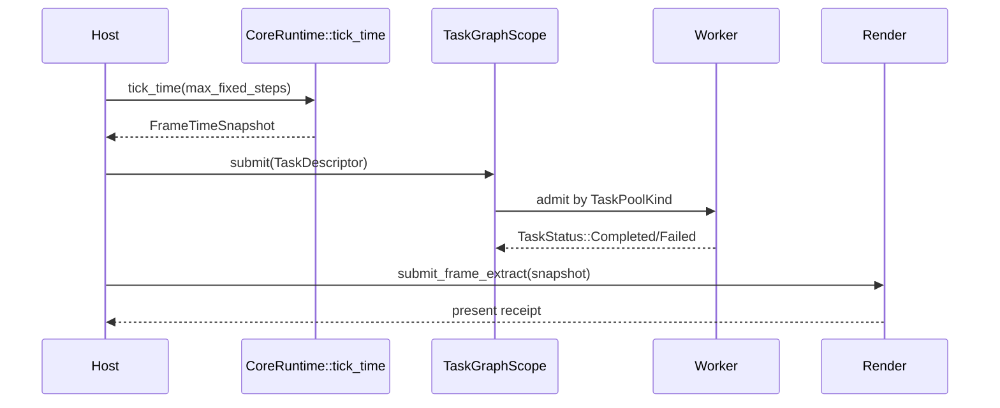

---
related_code:
  - zircon_runtime/src/core/runtime/frame_clock.rs
  - zircon_runtime/src/core/runtime/time.rs
  - zircon_runtime/src/core/runtime/tasks/task_graph
  - zircon_runtime/src/core/runtime/tasks/job_scheduler.rs
implementation_files:
  - zircon_runtime/src/core/runtime/runtime.rs
  - zircon_runtime/src/core/runtime/tasks/task_graph/scope.rs
  - zircon_runtime/src/core/framework/events.rs
plan_sources:
  - docs/wiki/core-runtime/events-config-and-time.md
tests:
  - zircon_runtime/src/core/runtime/tests/events
  - zircon_runtime/src/core/runtime/tests/tasks.rs
  - zircon_runtime/src/core/runtime/tasks/task_graph/scope/tests
doc_type: mechanism-case-study
---

# 帧时钟与任务调度：确定性外框、并发内层

外层 frame 由 `FrameClock` 唯一推进，任务图只消费快照和显式依赖。这样可以让 gameplay、asset import、UI extract 和 renderer 在不同线程执行，同时保持同一个 outer-frame 边界。



## 时间权威

`tick_time(max_fixed_steps)` 从注入的 `ClockSource` 读取 monotonic delta；`advance_time_by` 用于测试或外部时间源。快照中的 real delta、elapsed、outer-frame index 和 fixed-step budget 不等同于世界 virtual time。暂停、time scale 和 fixed debt 属于上层 world policy。

应用恢复、窗口重建或时钟跳变时调用 `submit_clock_discontinuity`。返回的 `FrameClockRebaseReceipt` 带 generation；恢复逻辑应丢弃依赖旧 delta 的积分，只在下一个快照重新开始。

## 任务图与 scope admission

`CoreRuntime::create_task_graph_scope(TaskGraphScopeDescriptor)` 创建 owner-scoped admission。`TaskDescriptor` 包含 `TaskId`、`TaskPoolKind`、label 和 `TaskCancellationPolicy`。`submit_after` 要求依赖 handle 属于同一 graph，依赖失败会在 prelaunch 阶段取消后继而不执行用户回调。

```rust
let scope = runtime.create_task_graph_scope(
    TaskGraphScopeDescriptor::new("scene.extract"),
)?;
let parse = scope.submit(
    TaskDescriptor::new(TaskId::new(7), TaskPoolKind::Worker, "parse scene"),
    |_cancel| {},
)?;
let upload = scope.submit_after(
    &[parse],
    TaskDescriptor::new(TaskId::new(8), TaskPoolKind::Io, "upload"),
    |_cancel| {},
)?;
```

调用方必须持有 `TaskHandle` 直到依赖链需要它；scope drop 会关闭 admission。`CancelOnDrop`、`DetachOnDrop`、`FinishOnShutdown` 表达不同退出语义，不能把默认策略当作所有任务都适合。

## 帧内排序建议

| 阶段 | 推荐任务 kind | 输入 | 输出 |
| --- | --- | --- | --- |
| 收集输入 | `Main` | host events | immutable input snapshot |
| 世界更新 | `Worker`/`Compute` | previous world | world generation |
| 资源导入 | `Io` | file URI | artifact/readiness |
| 抽取 | `Render` | world snapshot | `RenderFrameExtract` |
| 呈现 | renderer owner | extract + surface | present receipt |

依赖通过 `submit_after` 表达；不要依赖线程执行顺序或 sleep。跨 scope 提交会得到 `DependencyOwnerMismatch`，这是为了避免两个 runtime 的 task census 相互污染。

## 故障注入

- 固定 clock source 返回超大 delta：检查 discontinuity/rebase 和 fixed-step 上限，不能让单帧无限追赶。
- scope capacity 设置为 0：验证 `ScopeCapacityReached`，调用方应丢弃可重建任务并记录队列压力。
- 依赖任务 panic：后继任务不应执行用户代码，且 `TaskStatus` 要带 failure message。
- drop `CancelOnDrop` handle：确认 queued 任务在 close admission 的锁内被标记取消。
- shutdown deadline 极短：读取 `TaskGraphShutdownReport`，报告 queued/running/worker join 状态，稍后继续绝对 deadline。

## 不变量

- 每个 outer frame 只有一个 clock authority。
- 任务执行域由 graph owner 选择，业务代码不能私建 worker 逃逸 census。
- `TaskId` 在 scope 活跃期唯一，terminal 发布后才 retire。
- scope 关闭后不再接受提交；queued/running 为零才 quiescent。
- 依赖失败不执行后继闭包。

## 性能预算

常规 frame 的 clock tick 和 scope admission 应小于 1 ms。任务容量按峰值内存预算设置；诊断需监控 `queued`, `running`, `failed`, `cancelled` 及每个 worker domain 的 join 延迟。避免提交大量单元素任务，使用 `parallel_for` 或批量 descriptor 降低调度开销。

## 生产检查清单

- [ ] clock source 与 task deadline 时钟未混用。
- [ ] fixed-step 上限由调用方按 profile 选择。
- [ ] 每个长期任务有明确 cancellation policy。
- [ ] 依赖只使用同一 graph 的 handle。
- [ ] scope close 先于 runtime shutdown。
- [ ] panic 与 cancellation 都进入 terminal status。
- [ ] shutdown report 被写入诊断，而不是只返回 bool。

## 参考与验证

- 源码：`core/runtime/frame_clock.rs`、`tasks/task_graph/scope.rs`、`tasks/task_status.rs`。
- 测试：`core/runtime/tests/events`、`core/runtime/tests/tasks`、`task_graph/scope/tests/{ownership,cancellation,dependency_scale}.rs`。
- 对照：Bevy schedule/TaskPool，Unreal TaskGraph，Godot WorkerThreadPool；Zircon 的 scope admission 额外提供 owner 和 drain 语义。

## 场景变体 A：固定步长物理

物理系统使用 `FrameTimeSnapshot` 的 fixed-step budget，在一个 outer frame 内运行零到多个固定 tick。每次 tick 消费同一 frame 的输入快照；当 accumulator 超过 `max_fixed_steps` 时保留 debt 并记录诊断，不能无限追赶导致 spiral of death。render extract 只读取本帧最终 world snapshot。

## 场景变体 B：异步资产导入

asset importer 在 `Io` pool 提交，解析完成后通过 `submit_after` 连接 dependency artifact 和 GPU upload。source change 触发新 generation；旧 task 可 `CancelOnDrop`，已写入的 artifact commit 则使用 generation compare。UI 只订阅 readiness event，不直接等待 worker join。

## 任务状态与回调语义

`TaskStatus` 的 `Pending -> Running -> Completed/Failed/Cancelled` 是唯一终态路径。依赖失败的后继在 prelaunch 阶段进入 Failed/Cancelled，不调用用户 closure。panic 被捕获为 failure message；任务 graph 只有在 terminal 状态发布后才从 scope census retire。

## 调度反模式

- 在任务中调用 `std::thread::spawn`：逃逸 graph census，shutdown 无法等待。
- 用 `sleep` 等待依赖：浪费 worker 且不表达 owner。
- 让所有任务使用 `FinishOnShutdown`：退出预算不可控。
- 每帧生成成千上万个单元素任务：调度开销吞噬 frame budget。
- 用 wall-clock 代替 outer frame delta：前后台切换后产生巨大积分。

## 预算分配示例

假设 16.6 ms 帧预算：输入 0.5 ms、world update 5 ms、asset completion 2 ms、extract 3 ms、render submission 1 ms，余量用于 GPU present。task graph admission 不应超过 0.5 ms；单个 scope capacity 依据峰值 bytes 和 worker count 计算，不用无限 `usize::MAX`。

## 背压与降级

当 scope 返回 `ScopeCapacityReached`，优先合并可重建任务（例如同一 asset 的最新 source），再降低低优先级 UI/telemetry 工作。`FinishOnShutdown` 任务不应被新请求无限追加；关闭 admission 后只处理已承诺的任务。

## 观测指标

每个 scope 记录 owner、capacity、submitted、queued、running、completed、failed、cancelled；每个 worker domain 记录 queue age、worker count、join elapsed。frame 层记录 clock delta、fixed steps、debt、task admission time、dependency wait time。

## 失败演练

1. 使用手写 clock 产生 5 秒 delta，验证 fixed-step 上限和 discontinuity。
2. 提交跨 graph dependency，确认 `DependencyOwnerMismatch`。
3. scope 关闭后提交任务，确认 `ScopeClosed`。
4. dependency panic，确认后继 closure 未执行。
5. 让 worker 永不结束，确认 shutdown report 可定位 running task。

## 验证矩阵

| 测试族 | 关键断言 |
| --- | --- |
| `core/runtime/tests/tasks` | scheduler、status、cancellation |
| `task_graph/scope/tests/ownership.rs` | scope/graph owner 隔离 |
| `scope/tests/cancellation.rs` | close admission 的取消竞态 |
| `scope/tests/dependency_scale.rs` | 依赖规模和 capacity |
| `core/runtime/tests/events` | clock/event frame 边界 |

任何新增 TaskPoolKind 都必须补 worker census、shutdown 和 dependency owner 测试。

## API 参数审查

| 参数 | 约束 |
| --- | --- |
| `max_fixed_steps` | 调用方预算，不能无限追赶 |
| `TaskGraphScopeDescriptor::owner` | 稳定诊断标签 |
| `task_capacity` | 按 bytes/并发峰值设置 |
| `TaskDescriptor::id` | scope 内唯一 |
| `TaskPoolKind` | 必须有 graph-owned worker domain |
| dependency handles | 必须属于同一 graph |

提交前检查 scope accepting、capacity 和 owner；提交后保存 handle 直到依赖或状态读取完成。`TaskCancellationToken` 只表达取消请求，不保证任务已经停止；必须等待 terminal status。

## 运维 runbook

帧抖动时先比较 clock delta 与 worker queue age。若 delta 异常，检查 clock source/rebase；若 queue age 高，检查 scope capacity、dependency wait 和 worker join。不要通过增大 fixed steps 掩盖 worker 饥饿。

关闭卡住时读取每个 scope census，优先处理 running 的 FinishOnShutdown 任务和未释放的 TaskHandle。若 deadline 过期，保留报告并继续绝对 deadline；禁止重新创建 scope 逃避旧任务。

## 反例对照

- 反例：用线程顺序代替 `submit_after`。后果：竞态依赖。
- 反例：任务内部创建私有线程。后果：graph 无法 census。
- 反例：所有任务 `DetachOnDrop`。后果：shutdown 不可证明。
- 反例：外部 wall clock 直接驱动物理。后果：resume 后大步跳跃。
- 反例：取消后立即释放输入 buffer。后果：任务仍可能读取。

## 章节验收

- [ ] clock 与 task deadline 的时钟边界已说明。
- [ ] scope owner/capacity/terminal status 可观测。
- [ ] dependency owner mismatch 有示例。
- [ ] fixed-step debt 有上限和诊断。
- [ ] shutdown report 包含 worker join 状态。
- [ ] 正常、panic、取消、超时测试齐全。

## 交叉模块契约

clock snapshot 是 runtime 到 world/render 的只读边界；task graph 是 runtime 到 worker 的 admission 边界；event bus 只承载控制消息，不承载大 payload。asset/UI/renderer 需要把 frame index 写入自己的诊断，以便把异步完成映射回提交帧。

## 版本升级注意

新增 cancellation policy 或 worker domain 时保持旧默认语义，先增加 migration/profile 配置，再更新 descriptor。不能通过改变默认 policy 让历史任务在 shutdown 中突然 detach。
