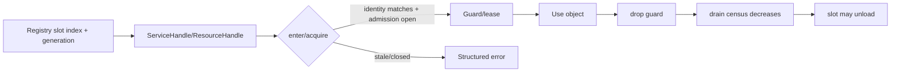

---
related_code:
  - zircon_runtime/src/core/runtime/handle/resolution.rs
  - zircon_runtime/src/core/runtime/state/service_entry.rs
  - zircon_runtime/src/core/resource
implementation_files:
  - zircon_runtime/src/core/runtime/handle
  - zircon_runtime/src/core/resource/mod.rs
plan_sources:
  - docs/wiki/core-runtime/service-registry-and-dependencies.md
tests:
  - zircon_runtime/src/core/runtime/tests/resolution/behavior
  - zircon_runtime/src/asset/tests
doc_type: mechanism-case-study
---

# Handle、generation 与 admission：拒绝悬挂引用

ZirconEngine 的服务和资源对象都可能经历卸载、重载或 world replacement。裸 `Arc` 只能表达内存所有权，不能证明对象仍属于当前 runtime。handle identity、generation 和 in-flight admission 组合起来，才构成可安全调用的资格。



## identity 组成

服务 identity 通常包括 owner runtime、slot/index、generation 和 service kind。资源 handle 以 `ResourceId`/asset id 识别逻辑对象，但 readiness 和 runtime payload 仍由当前 generation 判定。identity 不匹配时严禁猜测迁移，因为两个 runtime 可能有相同的数值 id。

`ServiceHandle::enter` 是 service 调用的 admission 边界；成功后返回 guard（或等价的受保护引用），drop 才会让 shutdown drain 继续。资源侧 `Assets::acquire`/lease 表达驻留意图；`load_state` 只描述 readiness，不自动增加 GPU residency。

```rust
let handle = runtime.resolve_manager_handle::<MyManager>("Foundation.Config")?;
{
    let manager = handle.enter()?;
    manager.update();
}
```

不要把 `Arc<MyManager>` 存在跨生命周期缓存中替代 handle；这样会绕过 admission，导致 cleanup 后仍可执行。

## generation 变化案例

1. 模块首次激活：slot generation = 1，resolve 得到 handle A。
2. 模块 deactivation：关闭 admission，等待 A 的 guard，释放实例。
3. 模块重新激活：同 slot generation = 2，得到 handle B。
4. A 再次 `enter`：返回 `CoreError::StaleServiceHandle`；B 才是有效入口。

资源热重载采用同样思路，但通常保留逻辑 `AssetId`，只递增内容 generation；异步导入结果必须带 generation，过期结果丢弃。

## admission 与 drain

关闭顺序固定为：`accepting = false` -> 取消可取消工作 -> 等待 queued/running/guard census -> cleanup。`deactivate_module_with_drain_timeout` 的 timeout 是整个调用的预算；嵌套服务不能重新开始一份完整 timeout。

| 失败 | 诊断 | 恢复 |
| --- | --- | --- |
| slot generation 不匹配 | `StaleServiceHandle` | 重新 resolve |
| admission 已关闭 | `ServiceUnavailable` | 等待重激活或终止调用 |
| guard 泄漏 | drain timeout + owner | 缩短作用域、修复缓存 |
| 资源 lease 超预算 | residency census | 降级纹理/释放 lease |
| identity 跨 session | owner mismatch | 丢弃请求，重建 session 映射 |

## 故障注入

- 在 guard 存活时调用 deactivation，验证阻塞而非 use-after-free。
- deactivation 后保存旧 handle，重新激活后确认旧 handle 不可用。
- 让资源 generation 在导入期间递增，确认旧 artifact 不会覆盖新内容。
- 注入跨 runtime handle，验证 owner mismatch 错误。
- 让 lease 计数永不归零，检查 shutdown census 能指向持有者。

## 不变量

- handle 只提供“尝试进入”的资格，不提供永久对象生命周期。
- generation 单调递增；旧结果/旧 handle 永不复活。
- admission 关闭后禁止新调用，但允许已有调用在预算内完成。
- guard/lease drop 必须可观察，不能依赖最终izer 或线程退出。
- identity 错误优先于类型 downcast，避免把错误对象当正确对象使用。

## API 与性能

常规 `enter/acquire` 应为无分配、短锁路径；不要在 guard 内执行磁盘 IO 或等待 GPU。高频资源查询应缓存 `AssetId`，每帧只读取 readiness snapshot；跨帧工作使用 generation 比较而不是深拷贝 payload。诊断记录 active guards、stale attempts、lease bytes、drain age。

## 生产检查清单

- [ ] 所有跨帧引用都是 handle/lease，而非裸引用。
- [ ] handle owner/session identity 在边界校验。
- [ ] generation 写入异步任务输出和日志。
- [ ] deactivation 关闭 admission 后才 cleanup。
- [ ] stale 错误包含 expected/actual generation。
- [ ] lease 使用有容量和超时策略。

## 参考与验证

- 源码：`core/runtime/handle/resolution.rs`、`core/resource` registry 与 readiness facade。
- 测试：`resolution/behavior/reactivation.rs`、`resolution/behavior/exact_dependency_resolution.rs`、资源 lease/readiness 测试。
- 对照：Unreal `TWeakObjectPtr`/package generations、Fyrox resource state、Bevy asset handles；Zircon 额外把 service admission 与 shutdown census 绑定。

## 场景变体 A：编辑器 service 重载

编辑器重载 AssetManager 时，旧 `ServiceHandle` 可能仍被 inspector、import queue 和 UI panel 持有。系统先关闭 manager admission，再等待所有 `ServiceCallGuard`，发布 generation + 1 的新 manager，最后通过 world-sync invalidation 通知 panel 重新 resolve。panel 不能把旧 `Arc` 直接塞回新 registry。

## 场景变体 B：资源内容热替换

纹理逻辑 AssetId 保持稳定，但 payload generation 递增。material cache 保存 `(AssetId, generation)`；当 generation 不匹配时丢弃旧 bind group，并等待新 residency。这样可以在不改变场景引用的情况下替换内容，同时阻止旧异步上传覆盖新纹理。

## 引用类型选择

| 需求 | 推荐类型 | 原因 |
| --- | --- | --- |
| 同一调用栈短期使用 | guard/reference | admission 与 drop 同步 |
| 跨帧重新查找 | handle | 可验证 generation |
| 可选 owner | weak handle | owner 消失返回 unavailable |
| GPU/asset 驻留 | lease | 统计 bytes 和释放意图 |
| 只读快照 | owned DTO | 不持有 authority |

## stale 处理准则

stale 不等于 transient error：它表示调用方掌握的 identity 已经不再属于当前 owner。业务层应重新获取最新 handle 或 snapshot；不得自动重试同一个 handle，因为这会形成无效热循环。写操作还需要比较 world/resource generation，失败时返回冲突信息。

## 泄漏定位

drain timeout 时输出 guard owner label、创建 frame、thread id、service name、generation 和 elapsed。资源 lease 额外输出 asset id、bytes、acquire site。测试中可用 barrier 保持 guard 存活，验证 shutdown report 能定位，而不是只返回总数。

## 失败演练

1. 保存旧 handle，deactivate/reactivate，确认 `StaleServiceHandle`。
2. 在 cleanup 中尝试新 resolve，确认 admission 已关闭。
3. 让 lease 不释放，确认 residency census 与 drain timeout 一致。
4. 使用不同 runtime 的同数值 ResourceId，确认 owner mismatch。
5. 让旧 generation upload 晚于新 generation commit，确认结果被丢弃。

## 性能与内存决策

`enter/acquire` 路径应保持短锁和零临时分配；复杂操作在 guard 外准备数据。高频 cache 只保留轻量 id/generation，不保存大 payload。lease 上限用 bytes 而非对象个数，因为一张 4K 纹理和一个小 mesh 的成本不同。

## 观测指标

记录 `active_handles`、`stale_attempts`、`admission_rejects`、`guard_age_p95`、`lease_bytes`、`generation_bumps`、`owner_mismatch`、`drain_timeout_count`。在重载报告中关联旧/新 generation，便于确定是否有迟到结果。

## 验证矩阵

| 测试 | 事实 |
| --- | --- |
| `resolution/behavior/reactivation.rs` | generation bump/stale handle |
| `resolution/behavior/dependency_cycles.rs` | enter 期间 cycle 防护 |
| resource readiness tests | payload 与 state 一致 |
| lease/residency tests | bytes census 与释放 |

新增 handle 类型必须说明 owner identity、generation 来源、admission 关闭语义和 release 责任。

## API 参数审查

| 字段 | 解释 |
| --- | --- |
| owner/session | 归属 runtime 或动态 session |
| slot/index | registry 定位，不代表永久身份 |
| generation | reload/re-activate 版本 |
| kind/type | downcast 前的服务类别 |
| guard/lease | in-flight 或 residency 计数 |
| deadline | drain 的绝对终点 |

`ServiceHandle::enter` 失败时，调用方应区分 stale、unavailable、owner mismatch；不能把三者都重试。资源 `load_state` 是观察接口，`acquire` 才表达驻留意图，二者要在代码和指标中分开。

## 运维 runbook

遇到 stale handle，记录 expected/actual generation、调用栈和 owner，再刷新 resolver cache。遇到 drain timeout，按 guard age 排序，先关闭长期 UI/inspector 调用，再处理 worker/IO lease。若 owner 已销毁，所有剩余 handle 应批量作废，不要逐个“尝试复活”。

## 反例对照

- 反例：长期缓存 `Arc` manager。后果：绕过 admission。
- 反例：generation 不匹配仍提交异步结果。后果：旧数据覆盖新数据。
- 反例：cleanup 后继续 resolve。后果：状态机越界。
- 反例：lease 只按对象数限制。后果：大资源耗尽内存。
- 反例：跨 session 复用数值 id。后果：错误 owner 写入。

## 章节验收

- [ ] identity、generation、admission 三者关系清晰。
- [ ] stale/unavailable/mismatch 有不同恢复动作。
- [ ] guard/lease 泄漏可定位到 owner。
- [ ] 异步结果携带 generation。
- [ ] service/resource 两类 handle 均有测试。

## 交叉模块契约

service handle 的 generation 来源于 module registry，resource handle 的 generation 来源于 asset/resource manager，world entity 的 generation 来源于 world-sync。三者数值不可互换，即使都使用 `u64`。跨层 DTO 必须携带明确字段名，禁止复用通用 `version` 字段隐藏来源。

## 版本升级注意

更换 slot 分配算法时保留 stale 检测，不保证 index 稳定。任何持久化 handle 都应在加载后重新 resolve；只持久化逻辑 AssetId/DocumentId，不持久化运行时 slot。
