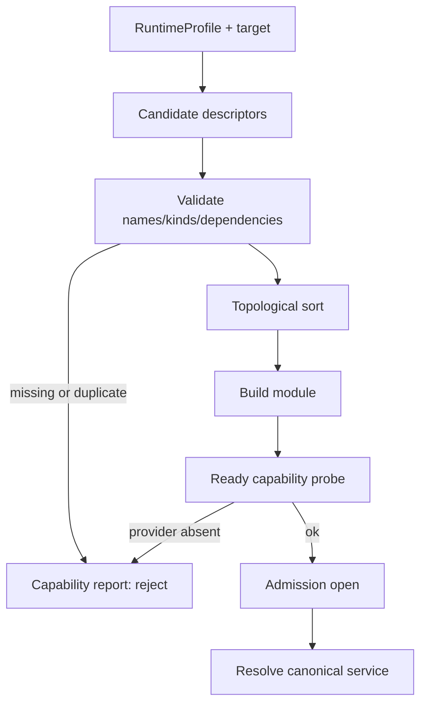

---
related_code:
  - zircon_runtime/src/core/runtime/descriptors/module_dependency_spec.rs
  - zircon_runtime/src/core/runtime/descriptors/module_order.rs
  - zircon_runtime/src/core/runtime/handle/resolution.rs
  - zircon_runtime/src/builtin/runtime_modules
implementation_files:
  - zircon_runtime/src/core/runtime/descriptors
  - zircon_runtime/src/core/runtime/handle/registration
plan_sources:
  - docs/wiki/core-runtime/service-registry-and-dependencies.md
tests:
  - zircon_runtime/src/core/runtime/tests/registration/behavior
  - zircon_runtime/src/core/runtime/tests/resolution/behavior
  - zircon_runtime/src/builtin/runtime_modules/tests
doc_type: mechanism-case-study
---

# 模块依赖与能力协商：从 descriptor 到可用服务

ZirconEngine 不把“某个类型存在”当作能力可用。能力必须由模块 descriptor、服务 kind、运行时 profile 和目标平台共同声明，再由注册阶段生成可重复的拓扑。这个案例适用于将可选 renderer、物理后端、编辑器工具或插件能力装配到同一 runtime。

## 场景与协商流程

假设 `Gameplay` 需要 `Physics.Driver`，但服务器 profile 只提供无图形的 deterministic driver。模块先声明抽象依赖，profile 选择满足约束的候选 descriptor，registry 冻结后按依赖顺序激活。调用方只解析 canonical service name，不感知实际 provider 的私有类型。



## Descriptor 契约

`ModuleDescriptor::new(name, description)` 建立稳定模块身份；`with_lifecycle` 附加 build/ready/finish/cleanup 回调。`ModuleDependencySpec` 表达硬依赖和匹配规则；排序器同时检查 module cycle 与 service cycle。descriptor 的名字是诊断、拓扑和 handle identity 的一部分，不能在运行时随意拼接。

能力报告应至少包含：module 名、required/optional、目标 target、候选 provider、拒绝原因、最终选择和 composition identity。builtin profile 组装入口在 `zircon_runtime/src/builtin/runtime_modules`，因此产品层应消费它的报告而不是自己重排模块。

## API 调用形状

```rust
use zircon_runtime::core::{CoreRuntime, ModuleDescriptor};
use std::time::Duration;

let runtime = CoreRuntime::try_new()?;
runtime.register_module(ModuleDescriptor::new("Gameplay", "simulation"))?;
runtime.activate_registered_modules_with_ready_timeout(Duration::from_secs(3))?;
let physics = runtime.resolve_manager::<MyPhysics>("Physics.Manager.Main")?;
```

示例中的名称必须与注册表中的 `RegistryName` 一致；没有 provider 时应返回结构化错误，不能用空实现伪造能力。跨线程长期使用时改用 `resolve_manager_handle`，每次 `enter` 都验证 generation。

## 硬依赖、软能力与降级

硬依赖缺失会拒绝整个 composition；软能力应由 profile 的 availability report 显式标记。降级路径必须改变行为契约，例如 renderer 缺失时选择 headless frame sink，而不是返回一个永远不 ready 的对象。optional provider 的缺失要在启动日志和 UI capability panel 中可见。

| 协商结果 | 运行时动作 | 业务层语义 |
| --- | --- | --- |
| `Required + selected` | 激活并打开 admission | 功能保证可用 |
| `Optional + selected` | 激活并标记 provider | 可启用高级路径 |
| `Optional + absent` | 不注册该服务 | 走明确 fallback |
| `Required + absent` | 拒绝 composition | 修复 profile/部署 |
| `duplicate canonical name` | 注册失败 | 解决所有权冲突 |

## 故障注入与恢复

- 删除依赖 descriptor：验证 `ModuleDependencyMissing`，确认没有 partial activation；修复 manifest 后重建 runtime。
- 添加 module cycle：验证 `ModuleDependencyCycle { path }`，按路径拆分基础模块。
- 添加 service cycle：验证 `ServiceDependencyCycle` 或 `DependencyCycle`，将 factory 依赖改为 lazy handle。
- 让 ready probe 永不成功：使用 `activate_module_with_ready_timeout`，记录模块和 budget，稍后以新 runtime 重试。
- 让 provider 在激活后被替换：旧 handle 必须返回 `StaleServiceHandle`，重新 resolve 新 identity。

恢复时不要在已冻结 registry 上追加 descriptor；这是为了保证拓扑和缓存仍然可复现。产品若需要热插拔，应走完整 deactivation/activation 事务。

## 不变量

1. 依赖节点先于使用者激活，关闭顺序严格相反。
2. canonical name + kind 唯一决定 service entry；类型 downcast 失败不能静默转换。
3. lifecycle callback 不持有 registry 锁执行，允许安全地解析已满足的依赖。
4. capability report 与最终 composition identity 一一对应，可用于缓存键。
5. provider 切换必然递增 generation，任何旧 handle 都不可重新 admission。

## 性能预算

注册阶段采用排序和索引缓存，常规 profile 的 descriptor 图应在 10 ms 量级完成。服务解析的缓存命中应为 O(1)；首次 factory 解析允许一次性初始化成本，但不得在每帧重新 downcast。能力报告可异步上报，不应阻塞首帧超过 ready budget。

## 生产检查清单

- [ ] profile、target、feature 三者已显式记录。
- [ ] required/optional 能力分组经过评审。
- [ ] canonical service name 无重复且包含 owner 前缀。
- [ ] 每个 factory 的依赖图无 cycle。
- [ ] ready timeout 使用绝对预算并输出报告。
- [ ] fallback 行为有集成测试，不是空 provider。
- [ ] provider 重载后旧 handle 会被拒绝。
- [ ] composition identity 纳入构建缓存和诊断。

## 参考与验证

- 源码：`descriptors/module_order.rs`、`handle/resolution.rs`、`builtin/runtime_modules/availability.rs`。
- 测试：`module_order_tests.rs`、`resolution/behavior/{dependency_cycles,exact_dependency_resolution,factory_panics}.rs`、`builtin/runtime_modules/tests/availability.rs`。
- 对照：Unreal ModuleManager 的 startup phases，Bevy plugin dependency ordering，Godot feature/server builds，Fyrox 的 renderer backend selection。

## 场景变体 A：图形客户端选择 renderer

客户端 profile 同时发现 WGPU、headless 和软件 fallback。能力协商顺序是：平台 adapter -> device features -> surface format -> renderer module ready。只有满足 required presentation capability 的候选才可标记 selected；adapter 不支持某个 texture format 时，不应等到首帧才报错。

## 场景变体 B：服务器选择物理 provider

服务器没有 renderer，但需要 deterministic physics。profile 将 `Physics.Driver` 标记为 required，将 `Physics.DebugDraw` 标记为 optional。协商报告应显示 debug draw absent，而不是让 gameplay 解析一个空 manager。若 deterministic provider 缺少 required SIMD capability，整个 server composition 拒绝启动。

## 候选评分与稳定性

候选选择必须先过滤硬约束，再按稳定排序键选择：provider priority、target、ABI major、build set hash。不能按动态库加载顺序或 HashMap 迭代顺序决定 provider，否则同一项目在不同机器上可能获得不同 composition identity。

| 约束层 | 示例 | 失败级别 |
| --- | --- | --- |
| Target | client/server/editor | reject candidate |
| ABI | major、size_bytes | reject plugin |
| Capability | `render.present`, `physics.deterministic` | required reject / optional fallback |
| Dependency | module/service prerequisite | graph reject |
| Resource | adapter memory、worker count | ready timeout or degrade |

## 能力报告消费规范

宿主应在启动日志保存完整 report，在 UI 中只投影稳定字段。报告中的 candidate path、动态库文件和 panic detail 属于诊断，不应作为业务分支字符串。业务代码应调用 typed capability query 或 resolver，避免解析日志文本。

## 迁移与升级

升级插件 ABI 时，先构建新 descriptor candidate，再在隔离 runtime 中执行 ready probe。旧 provider 正在运行时不应原地替换 descriptor；按“关闭 admission -> drain -> unload -> 重新冻结图”执行。若升级失败，恢复旧 build set 的新 runtime，而不是把旧实例重新插回已变化的 registry。

## 失败演练

1. 删除 required provider，确认 report 的缺失路径包含完整 dependency path。
2. 注册相同 canonical name，确认 commit 原子失败且旧 registry 不受影响。
3. 让 factory 递归解析自身，确认 `DependencyCycle` 带路径。
4. 让 optional provider ready 超时，确认功能被禁用而非阻塞主 runtime。
5. 在两个线程同时 resolve，同一 service 只执行一次 factory。

## 观测指标

记录 `candidate_count`、`rejected_count`、`selected_provider`、`topology_hash`、`ready_elapsed_us`、`factory_waiters`、`dependency_depth`、`capability_fallback_count`。将这些指标绑定到 composition identity，便于比较两个部署是否真正运行同一套模块图。

## 生产决策模板

- required 能力：缺失即拒绝，必须有部署告警。
- optional 能力：缺失有可接受 fallback，并在运行时可查询。
- experimental provider：只能在显式 profile 中出现，默认不参与排序。
- third-party plugin：隔离 factory、限制线程/内存、记录 ABI sidecar。

## 验证矩阵

| 测试 | 覆盖 |
| --- | --- |
| `module_order_tests.rs` | module/service 拓扑、cycle、稳定排序 |
| `registration/behavior/validation.rs` | duplicate、canonical name、commit 原子性 |
| `resolution/behavior/exact_dependency_resolution.rs` | provider 精确匹配 |
| `resolution/behavior/factory_panics.rs` | factory panic containment |
| `builtin/runtime_modules/tests/availability.rs` | profile capability report |

新能力上线前必须同时增加 required、optional、target mismatch 三种 profile 测试。

## API 参数审查

| API/值 | 用途 |
| --- | --- |
| `ModuleDescriptor::new` | 建立稳定 module identity |
| `with_lifecycle` | 绑定 build/ready/cleanup |
| `ModuleDependencySpec` | 声明硬依赖/匹配条件 |
| `RegistryName` | canonical service key |
| availability report | profile/provider 选择证据 |
| composition identity | 缓存与诊断关联键 |

descriptor 参数必须在 registry freeze 前完整设置；冻结后追加会破坏 topology hash。factory 只能解析已经满足的依赖，循环需求应改为 lazy handle 或拆分模块。

## 运维 runbook

当 client 与 server 行为不一致时，比较 profile id、target mode、selected provider 和 topology hash。若 hash 不同，先查 capability/fallback；若 hash 相同但 ready 超时，查资源和 worker budget。部署升级要保留旧 report，以确认 provider 是否真正变化。

## 反例对照

- 反例：按动态库加载顺序选 provider。后果：不可复现。
- 反例：optional 缺失返回空 manager。后果：错误成功。
- 反例：冻结后偷偷注册 descriptor。后果：排序缓存失效。
- 反例：把日志字符串当 capability API。后果：版本升级脆弱。
- 反例：provider 原地替换不递增 generation。后果：旧 handle 混入。

## 章节验收

- [ ] required/optional/experimental 规则明确。
- [ ] 候选过滤和稳定排序键可审计。
- [ ] capability report 与 composition identity 关联。
- [ ] profile、target、ABI 三类 mismatch 有测试。

## 交叉模块契约

profile availability 决定哪些 descriptor 进入 registry；registry 决定 service resolver 可见集合；editor/Hub 只读取 capability projection。渲染、脚本、插件和资产 importer 的可选能力不能各自维护一份 provider 真相。

## 版本升级注意

composition identity 变化必须使缓存失效；同名 provider 的 ABI 或 feature 变化也算 identity 变化。升级后先在隔离 runtime 验证 topology 和 ready，再替换生产 profile。
