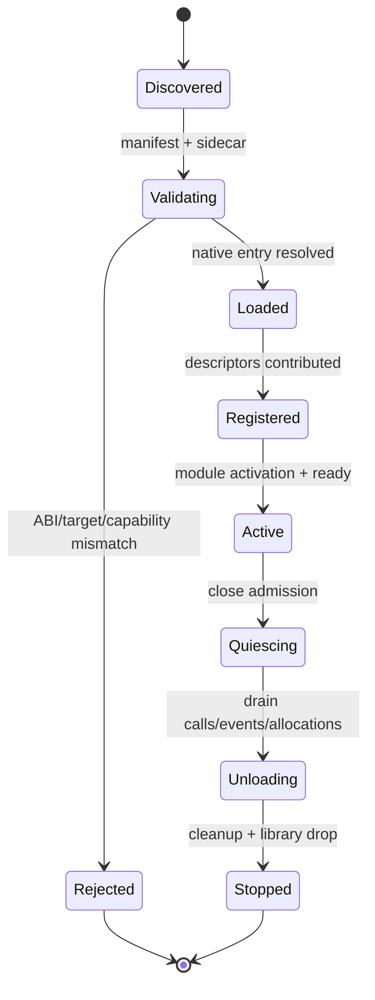

---
related_code:
  - zircon_plugins/plugin_sdk/src
  - zircon_runtime/src/plugin
  - zircon_runtime/src/dynamic_api
  - zircon_app/src/plugins
implementation_files:
  - zircon_plugins/plugin_sdk/src/lib.rs
  - zircon_runtime/src/plugin
  - zircon_runtime/src/dynamic_api/exports.rs
  - zircon_app/src/plugins/builder.rs
plan_sources:
  - docs/wiki/app-runtime-api/dynamic-runtime-abi.md
tests:
  - zircon_app/tests/plugin_group_error_contract.rs
  - zircon_runtime/src/dynamic_api/tests/api_table.rs
  - zircon_runtime/src/dynamic_api/tests/session_entry_points.rs
doc_type: mechanism-case-study
---

# 插件加载、卸载与 ABI：能力边界案例

插件同时跨越动态库边界、模块 registry 和 runtime session。安全流程必须先验证 manifest/ABI，再把插件贡献转成 descriptor，最后通过 runtime-owned service admission 使用。卸载时反向执行并等待所有调用与 allocation 归零。



## 加载前验证

插件 SDK 的 descriptor 应声明 plugin id、版本、target mode、required capabilities、ABI major/minor 和资源/服务贡献。宿主在加载 `native_dist_runtime_plugin_v3!` 或等价入口前校验 build set、平台、架构和 sidecar hash。`ZrRuntimeApiV8` 通过 `abi_version` 与 `size_bytes` 检查 required slots；optional slots 缺失时禁用能力而不是猜测布局。

```rust
// 插件侧示意：由 SDK 宏生成导出符号与 descriptor。
native_dist_runtime_plugin_v3!(MyPlugin);
```

这不是可复制的完整插件实现；插件应依赖 `zircon_plugin_sdk` 的稳定 re-export，不得引用 runtime 私有模块。

## capability 到 module descriptor

加载成功后，plugin builder 将贡献转换为 `ModuleDescriptor`、driver/manager/plugin factories 和 command/UI registration。所有 descriptor 必须在 registry freeze 前提交；重复 canonical name、缺依赖或 target mismatch 会让整个 plugin group 拒绝，而不是部分激活。

插件 runtime API 使用 opaque session handle、`ZrByteSlice`、`ZrOwnedByteBuffer` 和 allocation id。跨界字符串必须是受限 UTF-8；复杂对象使用版本化 JSON/DTO，禁止跨 allocator 释放 runtime 指针。

## FFI 调用与 panic containment

`exports.rs` 的 `*_ffi` wrapper 在入口处验证 null、长度、版本和上限，再通过 `catch_ffi_panic` 将 panic 转为 `ZrStatusCode::Panic`。输出采用 prepare/register/commit/rollback；`release_allocation` 必须由创建该 allocation 的 session 调用。

## 卸载顺序

1. 停止宿主 frame demand 与新 plugin event subscription。
2. 关闭 plugin module/service admission。
3. drain `ServiceCallGuard`、task scope、pending operation 和 owned allocations。
4. 调用 plugin cleanup，撤销 commands/UI contributions。
5. 释放动态库句柄并记录 unload report。

旧 plugin handle、event subscription 或 allocation 在新 generation 中均不可复用。

## 故障注入与恢复

- ABI major 不匹配：拒绝加载并报告 expected/actual。
- `size_bytes` 小于 required tail：禁用插件，不读取越界字段。
- plugin factory panic：wrapper 返回 Panic，group 保持未激活。
- callback 写入无效 slice：返回 invalid argument，不提交 output。
- allocation release 使用错误 session：拒绝释放并记录 owner mismatch。
- unload 时仍有 guard：进入 Quiescing，超时报告持有者，不强行 drop library。

## 不变量与预算

- ABI 结构字段顺序冻结，演进使用新版本结构。
- runtime-owned memory 只能由 runtime/session 释放。
- optional capability 缺失必须有显式 fallback。
- plugin activation 是原子 composition，不留下半激活服务。
- 每次 reload 产生新 plugin/module generation。

加载验证应在 100 ms 级完成；插件首个 factory 初始化不得阻塞 frame loop。卸载目标为 2 s 内完成 allocation/guard drain，超时保留 report 供进程级终止策略使用。监控 ABI reject、panic、allocation bytes、callback latency 和 stale handle 次数。

## 生产检查清单

- [ ] manifest、sidecar、target 和 build set 已校验。
- [ ] required/optional ABI slots 分开处理。
- [ ] 所有 FFI wrapper 有长度/null/panic 防护。
- [ ] output allocation 有对称 release。
- [ ] plugin group descriptor 冻结前无重复贡献。
- [ ] unload 有 admission、drain、cleanup 三阶段。
- [ ] reload 后旧 handle/event/allocation 全部失效。

## 参考与验证

- 源码：`zircon_plugins/plugin_sdk/src`、`zircon_app/src/plugins/builder.rs`、`zircon_runtime/src/dynamic_api/exports.rs`。
- 测试：`plugin_group_error_contract.rs`、`dynamic_api/tests/api_table.rs`、`session_entry_points.rs`、`abi_safety_contracts.rs`。
- 对照：Unreal Modules/PluginDescriptor、Godot GDExtension、Bevy dynamic plugin patterns；Zircon 通过 V8 table size 和 allocation ownership 约束跨 allocator 风险。

## 场景变体 A：首方 native plugin

首方插件可由 `native_dist_runtime_plugin_v3!` 宏生成导出入口，使用 SDK 声明 module/manager/command。宿主仍需按同样的 manifest、ABI、target 和 capability 规则验证；“首方”不等于可绕过边界。插件的 module lifecycle 与 builtin module 一起进入 composition graph。

## 场景变体 B：远程动态 session

远程工具通过 `ZrRuntimeApiV8` 创建 session，使用 `watch_world`、`drain_world_invalidations`、`capture_frame` 和 `release_allocation`。每个 session 有独立 allocation/awake/operation 状态；session 销毁前必须 drain 或 release 其全部 runtime-owned buffers。

## ABI 版本策略

| 变化 | 策略 |
| --- | --- |
| 增加 optional tail | 新结构/size_bytes，旧宿主可忽略 |
| 改变 required 字段语义 | 新 ABI major |
| 新增能力 | optional slot + capability report |
| DTO 字段扩展 | 新版本 DTO，旧 decoder 拒绝未知字段 |
| allocator 改变 | 新 release 函数，禁止跨版本 free |

ABI minor 不能改变已有字段布局和所有权。宿主应在加载日志记录 `abi_version`、`size_bytes`、build set、plugin hash 和 target。

## 事件与输出所有权

plugin events、world invalidations、profile response 和 operation harvest 都使用 bounded output。prepare/register/commit 失败时，runtime 队列保留；宿主应在修复 buffer 后重试。不得在回调里同步调用 release 自己尚未登记的 allocation。

## 卸载期间的事件处理

关闭 plugin admission 后，已有事件可以 drain 到 deadline；新 publish 返回 unavailable。未发送事件应在 unload report 中计数。宿主 UI 要把 plugin stopped 与 event queue drained 区分显示，避免用户以为所有消息都已处理。

## 故障演练

1. 旧宿主传入较小 `size_bytes`，确认 required tail 不被读取。
2. plugin callback panic，确认 ABI status 为 Panic 且 session 仍可销毁。
3. host output pointer 未对齐，确认 invalid argument。
4. session A 释放 session B allocation，确认 owner mismatch。
5. unload deadline 到期，确认 library 未被强行 drop，报告 remaining guards/allocations。

## 观测指标

记录 `plugin_id`、`load_elapsed_us`、`abi_reject_count`、`factory_panic_count`、`callback_latency_us`、`event_queue_depth`、`allocation_bytes`、`stale_handle_count`、`unload_elapsed_us`、`unload_timeout_count`。所有 FFI 错误包含 status code 和阶段，不把错误消息当作稳定机器键。

## 性能预算

FFI wrapper 的验证应为常数级；大 payload 采用 bounded decode，避免一次性无上限分配。plugin callback 不应阻塞 render/main thread；重工作提交 runtime task scope。动态 session 每帧输出 bytes 与 item count 都需配额。

## 验证矩阵

| 测试 | 事实 |
| --- | --- |
| `dynamic_api/tests/api_table.rs` | required/optional slot wiring |
| `session_entry_points.rs` | session/query/watch/output lifecycle |
| `profile_control.rs` | malformed/oversized payload |
| `plugin_group_error_contract.rs` | group atomicity and errors |
| `abi_safety_contracts.rs` | repr(C)、size、ownership |

新增 ABI slot 必须同时增加大小不足、optional 缺失、panic、allocation release 测试。

## API 前置条件与后置条件

| 边界 | 前置条件 | 成功后 | 失败处理 |
| --- | --- | --- | --- |
| plugin discovery | 文件/sidecar 可读 | candidate 列表 | 记录路径错误 |
| manifest validate | schema、target、hash 合法 | capability report | reject group |
| native entry | ABI symbol 存在 | plugin instance | unload library |
| descriptor commit | registry 未冻结 | module entries | 原子 rollback |
| session create | V3 config/paths 合法 | opaque session | status code |
| output drain | output buffer 足够 | allocation registered | queue rollback |
| release | allocation 属于 session | bytes 归还 | owner mismatch |

## ABI 调用生命周期

1. 宿主读取 plugin manifest，并验证路径不越界。
2. 宿主加载动态库，读取版本入口和 descriptor。
3. runtime 检查 ABI major、size、required slots 与 target。
4. builder 将 capability 转为 module/service/command contributions。
5. registry 冻结、拓扑排序、激活并等待 ready。
6. session 建立后，所有 FFI action 经过 bounded decode 和 activity admission。
7. 输出先登记 allocation，再写入宿主提供的结果描述。
8. session 销毁前释放 allocation、取消 watch/event、关闭 task scope。

## 两种部署变体

### 单进程编辑器

插件与 editor 共用 process，但仍使用 opaque handles 和 runtime-owned allocation。插件崩溃不应让 UI 直接解引用插件对象；panic 由 wrapper 截获并显示为 provider error。卸载时必须等待 editor command palette 移除 descriptor 后再释放 library。

### 外部运行时服务

Hub 或脚本宿主通过动态 API 创建独立 session。每个 session 具有独立 wake sink、world watch 和 allocation ledger。服务重启后旧 session handle 全部失效，客户端应重建连接，不得用旧数值 handle 猜测新 session。

## 安全与兼容策略

插件 manifest 中的 capabilities 仅用于候选声明，最终权限由 host policy 决定。未经允许的 filesystem、network 或 native window 能力应在验证阶段拒绝。ABI DTO 使用 `deny_unknown_fields` 或显式版本字段；不要让新字段静默改变旧宿主语义。

## 故障排查顺序

1. ABI reject：比较 expected/actual major、size 和 target。
2. descriptor reject：读取 duplicate/missing dependency path。
3. ready timeout：检查 factory waiters、资源队列和 worker census。
4. callback panic：定位 plugin id、operation path、frame/session。
5. unload timeout：列出 guard、task、event subscription、allocation ledger。

## 生产审查问题

- 插件是否声明了所有 required capability，而不是在 callback 中偷偷探测？
- optional slot 缺失时，宿主是否真正禁用了功能？
- 每个 output buffer 是否由创建它的 session 释放？
- 动态库卸载前是否撤销 command/UI/world watch？
- ABI 版本升级是否有隔离 runtime 的 ready probe？
- panic/status 是否携带稳定机器字段？

## 测试样例目录

应至少拥有：版本过旧、size 太小、未知字段、空指针、未对齐 slice、callback panic、重复释放、错误 session 释放、unload drain timeout、optional capability 缺失十类测试。每类都需要检查 runtime 状态没有被部分提交污染。

## 反例对照

- 反例：看到导出符号就调用，不校验 `size_bytes`。后果：越界读取。
- 反例：插件与宿主跨 allocator free。后果：内存破坏。
- 反例：callback panic 穿过 FFI。后果：未定义行为或进程退出。
- 反例：optional slot 缺失仍显示功能可用。后果：运行时崩溃。
- 反例：guard 未 drain 就 drop library。后果：执行已卸载代码。

## 章节验收

- [ ] 加载、激活、session、卸载状态完整。
- [ ] 首方与远程 session 两种变体覆盖。
- [ ] ABI version/size/slot/allocation 规则明确。
- [ ] panic、limit、owner mismatch 可恢复。
- [ ] unload report 包含 guards/tasks/events/allocations。

## 交叉模块契约

plugin descriptor 进入 module registry，plugin service 通过 resolver admission 使用，plugin events 通过 dynamic session 输出，plugin commands 进入 editor gateway。卸载必须同时撤销这四类贡献，否则某一层仍可能持有已卸载对象。

## 版本升级注意

ABI major 变化创建新入口和新测试集；不要在旧 symbol 上条件解释新结构。插件状态迁移应先导出 snapshot，再由新 generation 导入并验证 capability。
