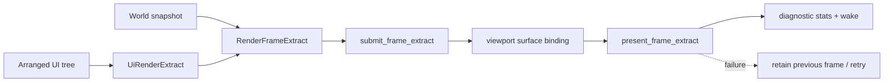

---
related_code:
  - zircon_runtime/src/core/framework/render
  - zircon_runtime/src/graphics
  - zircon_runtime/src/ui/surface/render
  - zircon_runtime/src/dynamic_api/runtime_loop.rs
implementation_files:
  - zircon_runtime/src/core/framework/render/frame_extract
  - zircon_runtime/src/graphics/runtime/render_framework/mod.rs
  - zircon_runtime/src/ui/surface/render/extract.rs
plan_sources:
  - docs/wiki/graphics/architecture.md
  - docs/wiki/ui/surface-rendering.md
tests:
  - zircon_runtime/src/core/framework/tests/framework_surfaces.rs
  - zircon_runtime/tests/runtime_ui_invalidation_transaction_contract.rs
  - zircon_app/src/entry/tests/runtime_entry_surface_present_guards
doc_type: mechanism-case-study
---

# Render Extract、Present 与 UI handoff

渲染路径把可变 world/UI authority 与 renderer 线程隔离。每帧先构造 owned `RenderFrameExtract`，再提交给 `RenderFramework`；viewport/surface 绑定和 UI extract 都有明确 owner，避免 renderer 反向修改场景树。



## extract ownership

World 更新阶段产生 generation-qualified snapshot；抽取阶段将 camera、mesh queue、lights、UI commands 和 timing 组成 packet。渲染阶段只读 packet，不访问可变 ECS/world/UI。`UiRenderExtract` 必须从 arranged tree 的 layout、clip、z-index 和 draw order 生成，不能回读 authored geometry 覆盖排布结果。

## RenderFramework 入口

公开 trait 入口包括 `create_viewport`、`destroy_viewport`、`submit_frame_extract`、`submit_frame_extract_with_ui`、`bind_viewport_surface`、`unbind_viewport_surface`、`present_frame_extract` 和 `query_stats`。`RenderFramework` 是跨模块边界；底层 WGPU encoder、swapchain 和 cache 仍归 renderer owner。

```rust
let viewport = renderer.create_viewport(ViewportDescriptor::default())?;
renderer.submit_frame_extract(viewport, extract)?;
renderer.present_frame_extract(viewport)?;
```

这是调用形状示例，具体 descriptor 由 profile/平台提供。surface 重建时先 unbind，再 bind 新 surface；禁止在旧 surface 上继续 present。

## UI handoff

UI dirty domain（layout、content、style、text、visibility）决定是否重建 arranged tree 和 extract。字体 atlas 未就绪时可提交 placeholder 与预热请求，不能阻塞整个 frame。UI command buffer 是 owned/immutable，宿主或 renderer 不得保存 UI 节点引用。

## 故障注入

- extract generation 与 world snapshot 不匹配：丢弃 packet，重新从最新 snapshot 抽取。
- bind surface 后窗口 resize：返回 surface mismatch，重新配置 viewport。
- present 时 GPU lost：保留上一帧诊断，重建 device/surface 后重试。
- UI layout 节点缺失：跳过节点并记录 diagnostic，继续提交其余命令。
- submit 队列超限：拒绝新 packet，唤醒 host 降低 frame demand。

## 不变量

- renderer 只消费 owned extract；不持有 world/UI mutable authority。
- 一个 viewport 在同一时刻只有一个 surface binding generation。
- present 成功才推进 last-presented receipt；失败不能伪造帧完成。
- UI draw order 与 arranged layout 同一 generation。
- extract 失败保持上一帧可消费 packet，不发布半成品。

## 性能预算

extract 应控制在 CPU frame budget 的 10% 到 20%；UI layout 未变时复用 `Arc` extract。submit/present 不应分配与实体数线性增长的临时对象，使用批量 queue。监控 extract bytes、command count、GPU upload bytes、surface reconfigure、present latency 和 dropped demand。

## 生产检查清单

- [ ] frame packet 带 world/UI generation。
- [ ] renderer 与 world/UI owner 线程边界清晰。
- [ ] surface bind/unbind 成对且有平台错误处理。
- [ ] present receipt 只在成功后写入。
- [ ] GPU lost/resize 有重建路径。
- [ ] UI placeholder 和字体预热不会阻塞关键帧。
- [ ] query_stats 被采样而非每 draw call 查询。

## 参考与验证

- 源码：`core/framework/render/frame_extract`、`graphics/framework.rs`、`ui/surface/render/extract.rs`、`dynamic_api/runtime_loop.rs`。
- 测试：`framework_surfaces.rs`、`runtime_ui_invalidation_transaction_contract.rs`、`runtime_entry_surface_present_guards`。
- 对照：Unreal Render Dependency Graph、Graphics/SRP frame graph、Fyrox scene renderer、Bevy render-world extract。

## 场景变体 A：窗口 resize 与 surface 重建

窗口系统报告尺寸变化后，host 暂停当前 viewport demand，读取新的 surface descriptor，调用 `unbind_viewport_surface`，再 bind 新 surface。旧 extract 可以保留用于诊断，但不能向旧 binding present。首个成功 present receipt 应包含新 surface generation，供 UI 和 telemetry 重新对齐。

## 场景变体 B：无窗口离线渲染

headless profile 使用 offscreen target 或 reference presenter，不创建 native window。extract 仍需经过同样的 ownership 和 generation 检查；present 结果写入受限 readback allocation。离线批处理不得调用仅 client profile 提供的 surface API。

## extract 分层

| 层 | owner | 可变性 | 失败处理 |
| --- | --- | --- | --- |
| World snapshot | world/runtime | immutable | 重新抽取 |
| UI arranged tree | UI owner | immutable during extract | 保留上次 tree |
| RenderFrameExtract | frame bridge | owned packet | 丢弃半成品 |
| GPU resources | renderer | renderer-private | rebuild cache |
| Present receipt | host/renderer | immutable DTO | retry/reconfigure |

## UI dirty 细分

layout dirty 会重建 geometry；content/style dirty 可能只重建 command；text dirty 触发 measure/cache/glyph prewarm；visibility dirty 更新可见索引。不同 dirty domain 可以共享 generation，但不能在一个 domain 已过期时复用另一个 domain 的 extract。

## 错误恢复顺序

1. `submit` 拒绝：检查 packet generation、viewport identity 和 capacity。
2. bind 失败：记录 adapter/surface capability，保持 unbound，不 present。
3. present 失败：读取 renderer stats，决定 retry、surface recreate 或 device recreate。
4. UI extract 失败：保留上一帧 command，标记 dirty，下一帧重建。
5. 连续失败超过阈值：降低 frame demand，通知 host 进入 degraded mode。

## 观测指标

记录 `extract_generation`、`extract_bytes`、`ui_command_count`、`layout_ms`、`text_cache_hit_rate`、`submit_latency_us`、`surface_generation`、`reconfigure_count`、`present_failures`、`gpu_recovery_count`。将 viewport id 和 frame index 写入每条 receipt，便于定位 resize 与 GPU lost 的关系。

## 性能预算

目标 60 FPS 时，UI layout + extract 建议小于 3 ms，submit 小于 1 ms；headless readback 以 bytes/帧限流。文本 atlas 预热放入 IO/worker scope，禁止在 render lock 内阻塞。extract packet 大于阈值时按 command domain 分批或降级细节。

## 失败演练

1. 提交旧 generation extract，确认被拒绝。
2. resize 与 present 并发，确认旧 surface 不会收到 present。
3. 注入字体 atlas 缺失，确认 placeholder 和 prewarm。
4. 模拟 GPU lost，确认 device/surface recreate 后 receipt 恢复。
5. 让 UI command count 超限，确认降级而非无限分配。

## 验证矩阵

| 测试 | 覆盖 |
| --- | --- |
| `framework_surfaces.rs` | viewport/surface lifecycle |
| `runtime_entry_surface_present_guards` | resize、fallback、dynamic API |
| `runtime_ui_invalidation_transaction_contract.rs` | dirty transaction |
| `ui/surface` text prewarm tests | glyph/layout readiness |

新增 renderer pass 必须说明 extract owner、surface generation、present failure 和 stats 字段。

## API 前置条件与后置条件

| API | 前置条件 | 成功后 | 典型失败 |
| --- | --- | --- | --- |
| `create_viewport` | renderer ready、descriptor 合法 | 返回 viewport identity | capability 缺失 |
| `bind_viewport_surface` | viewport 存活、surface owner 匹配 | 绑定 generation 递增 | format/size 不兼容 |
| `submit_frame_extract` | extract generation 新鲜 | packet 进入 renderer queue | stale、capacity |
| `submit_frame_extract_with_ui` | UI extract 与 frame 同 generation | 合并提交 | UI command invalid |
| `present_frame_extract` | queue 中有已验证 packet | 返回 present receipt | surface/GPU error |
| `unbind_viewport_surface` | viewport 存活 | admission 关闭 | unknown viewport |
| `query_stats` | renderer owner 可用 | 只读统计快照 | renderer stopped |

调用方应把前置条件写成断言或 capability check；不要依靠 renderer 内部 panic 作为流程控制。

## 抽取批次的生命周期

1. world owner 发布 snapshot generation。
2. UI owner 完成 arranged tree，固定 layout/clip/z-index。
3. extract builder 分配 packet，填充 camera、visibility、materials、UI commands。
4. builder 运行一致性检查：generation、entity id、resource state、command bounds。
5. bridge 将 packet 交给 renderer，成功后转移只读所有权。
6. renderer 仅在 GPU submission 完成后写入 stats/receipt。
7. host 消费 receipt 并决定下一帧 demand。

任何阶段失败都只能丢弃当前 packet，不得修改上一帧 packet 的内容。上一帧 packet 可作为 degraded fallback，但必须标记其 generation 与 age。

## 场景决策记录

当 viewport 有多个 surface（主窗口、thumbnail、远程 stream）时，每个 surface 都有独立 binding generation，不能共享一个全局“当前 surface”。当多个 UI view 共享 renderer 时，UI extract 仍按 view owner 分区，避免一个 view 的 dirty domain 触发全部 view 重排。

当 GPU memory 紧张时，优先降低 transient upload、阴影分辨率和 UI atlas prewarm，而不是破坏 extract ownership。降级动作写入 `degraded_reason`，恢复后清除该字段并生成新的 present receipt。

## 调试步骤

1. 从 present receipt 取得 frame index、viewport、surface generation。
2. 在 diagnostic snapshot 中比较 extract generation 与 world/UI generation。
3. 若 mismatch，检查 world replacement、asset reload 或 UI layout dirty 事件。
4. 若 generation 正常但 latency 升高，比较 submit queue 与 GPU stats。
5. 若连续三帧失败，停止 demand，执行 surface/device rebuild，再恢复。

## 测试设计

- 单元测试验证 packet 序列化、generation 校验和 command bounds。
- 集成测试验证 resize、surface unbind/bind、present fallback。
- 压力测试生成大量 UI command，确认 bytes/item 上限和降级策略。
- 故障测试模拟 GPU lost、字体缺失、旧 packet、重复 present。
- 回归测试确认 headless profile 不链接 window-only provider。

## 交付前审查问题

- extract 是否包含足够的 owner identity，能在日志中定位来源？
- renderer 是否可能从 callback 访问 mutable world/UI？
- present receipt 是否区分 queued、submitted、presented 三个阶段？
- resize 期间旧 surface 是否彻底 unbind？
- UI text artifact 是否有 cache generation 和 prewarm 失败字段？
- 失败 packet 是否会被误当成已呈现帧？
- stats 查询是否被限制频率并且不会阻塞 render thread？

## 运行手册片段

出现黑屏时先查看 `present_failures`、`surface_generation` 与 `gpu_recovery_count`。若 surface generation 停滞，检查 host resize 事件；若 GPU recovery 增长，检查 adapter/device lost；若 extract generation 停滞，检查 world tick 或 UI dirty dispatcher。恢复后保留一次完整 snapshot，方便比较修复前后。

## 反例对照

- 反例：renderer 直接读 mutable world。后果：更新与绘制竞态。
- 反例：UI 从 authored geometry 抽取。后果：布局与点击区域不一致。
- 反例：resize 后继续 present 旧 surface。后果：surface lost/黑屏。
- 反例：present 失败仍推进 frame receipt。后果：host 误判成功。
- 反例：字体缺失阻塞整个 render thread。后果：首帧停滞。

## 章节验收

- [ ] world/UI/extract/renderer owner 分层清楚。
- [ ] client resize 与 headless 两个场景齐全。
- [ ] API 前后置条件覆盖主要公开入口。
- [ ] GPU lost、stale packet、atlas miss 有恢复。
- [ ] 指标能够区分 extract、submit、present。

## 交叉模块契约

asset readiness 决定 extract 中是否允许真实 resource；world generation 决定 entity snapshot 是否新鲜；UI dirty generation 决定 command 是否可复用；dynamic ABI 只暴露 present receipt 和 owned output。renderer 不应自行重新查询这些 owner。

## 版本升级注意

新增 extract 字段优先扩展 owned DTO；改变 present receipt 语义则提升版本并更新 host guards。旧 packet 不得被新 renderer 当作当前 generation 使用。
