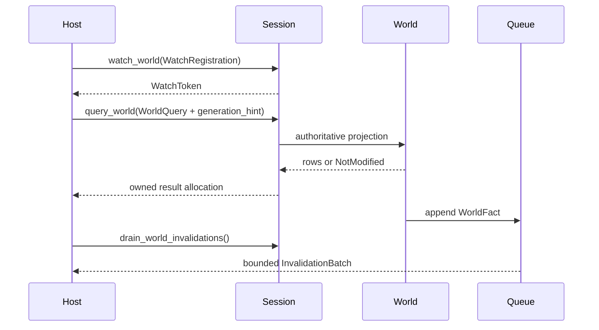

---
related_code:
  - zircon_runtime_interface/src/world_sync
  - zircon_runtime/src/dynamic_api/session/world_sync.rs
  - zircon_runtime/src/dynamic_api/session/ffi.rs
  - zircon_editor/src/core/gateway/session/world_sync.rs
implementation_files:
  - zircon_runtime_interface/src/world_sync/query.rs
  - zircon_runtime_interface/src/world_sync/invalidation.rs
  - zircon_runtime/src/dynamic_api/frame.rs
plan_sources:
  - docs/wiki/app-runtime-api/world-sync.md
tests:
  - zircon_runtime/src/dynamic_api/tests/session_entry_points.rs
  - zircon_runtime/tests/runtime_world_sync_subscription_table.rs
  - zircon_editor/tests/editor_world_sync_watch_map.rs
doc_type: mechanism-case-study
---

# World Sync：查询、失效与背压

World Sync 是 runtime 到 editor、Hub 或远程工具的 transport-neutral 边界。它通过 generation-qualified query、opaque watch token 和 bounded invalidation output，避免宿主持有 runtime 对象，也避免高频世界变化把 UI 队列无限撑大。



## 查询契约

公开 `WorldQuery` 包含 Components、Hierarchy、InspectionFields、TransformSnapshot 四类；输入使用 `deny_unknown_fields`，避免拼写错误被当成默认值。`generation_hint` 相同且 generation 不是 sentinel 时返回 `WorldQueryResult::NotModified`。组件行按 entity 排序，保证宿主缓存和测试稳定。

```rust
use zircon_runtime_interface::world_sync::{
    ComponentSelector, ComponentWorldQuery, QueryFilter, WorldQuery,
};

let query = WorldQuery::Components(ComponentWorldQuery {
    filter: QueryFilter { with: vec!["Transform".into()], without: vec![] },
    select: vec![ComponentSelector::new("Transform")],
    generation_hint: Some(last_generation),
});
```

宿主通过 ABI 将 JSON/bincode 编码的 query 交给 `query_world`，得到 runtime-owned allocation；必须由同一 session 调用 release。TransformSnapshot 还返回 `world_replacement_epoch`，跨 world replacement 的写入必须拒绝。

## watch 与 invalidation

`WatchRegistration::new(WatchKey)` 支持 subtree、component type、asset 和 world structure。runtime 返回 `WatchToken`，editor 不得把自身 view id 当 token。每帧变更被折叠为 `InvalidationBatch { generation, dirty, facts }`；dirty token 在 canonical 输出中严格递增。

`drain_world_invalidations` 遵循 prepare/register/commit：输出缓冲成功登记后才消费 queue；超限或登记失败执行 rollback，下一次 drain 继续读取相同事实。宿主消费慢时只看到 bounded batch，不应假设一条事实对应一次回调。

## 背压策略

| 压力 | 行为 | 宿主动作 |
| --- | --- | --- |
| 正常 | 增量 batch | 按 generation 应用 dirty token |
| batch 接近上限 | 合并事实、延迟 drain | 降低刷新频率，保留 cursor |
| 输出超限 | 返回 limit status，队列不消费 | 增大分片或请求 snapshot |
| 事件 gap | generation 不连续 | 丢弃局部投影，重新 query |
| world replaced | replacement epoch 变化 | 清空 entity 映射后重建 |

## 故障注入与恢复

- 发送未知 query 字段：验证 decode 返回 invalid argument。
- 使用过旧 generation hint：得到完整 rows，而不是错误地返回 NotModified。
- 让输出 allocation 注册失败：确认 batch 未消费，可安全重试。
- 伪造 token 或重复 unwatch：返回 removed=false，不影响其他订阅。
- 注入 world replacement：所有旧 entity 写请求拒绝，先 query hierarchy/transform。

## 不变量

- generation 是 runtime world 的唯一增量版本，宿主不得本地生成替代。
- watch token 不携带 editor 状态，且只能由所属 session 撤销。
- query result 和 invalidation output 的 allocation 必须由原 session 释放。
- bounded 输出超限时保持事实可重放，不静默丢失关键结构变化。
- `NotModified` 只在 generation 精确相等时返回。

## 性能预算

查询请求有 `ZR_RUNTIME_WORLD_QUERY_REQUEST_LIMIT_V1` 限制，宿主应按视图拆分 Components/Hierarchy/Inspector，而不是一次请求全世界。每帧 drain 应限制 item count 和 encoded bytes；大型 world 使用 subtree watch、generation hint 和分页 snapshot。监控 batch bytes、dirty count、queue age、rollback count、generation gap。

## 生产检查清单

- [ ] query 使用公开 DTO，未传 runtime 内部类型。
- [ ] 所有 session-owned allocation 对称 release。
- [ ] token 与 view id 分离存储。
- [ ] generation 不连续时触发完整重建。
- [ ] 输出超限有退避和分页策略。
- [ ] world replacement epoch 参与写入前校验。
- [ ] `has_canonical_dirty_tokens` 仅作为快路径，异常输入走诊断。

## 参考与验证

- 源码：`zircon_runtime_interface/src/world_sync`、`dynamic_api/session/ffi.rs`、`dynamic_api/frame.rs`。
- 测试：`dynamic_api/tests/session_entry_points.rs`、`runtime_world_sync_subscription_table.rs`、`editor_world_sync_watch_map.rs`。
- 对照：Unreal Live Coding/World Partition change streams、Godot editor remote scene、Bevy change ticks；Zircon 通过 bounded allocation 和 generation short-circuit 保证 ABI 可控。

## 场景变体 A：Inspector 单实体编辑

Inspector 先发送 `WorldQuery::inspection_fields(entity, generation_hint)`，收到字段行后根据 `writable`、`serializable` 和 `plugin_owned` 决定控件。提交前再次读取 transform/fields generation；若期间收到该 entity 的 dirty token，则丢弃旧输入并要求用户合并，而不是静默覆盖 runtime 最新值。

## 场景变体 B：Hierarchy 大批量变化

场景导入可能一次产生数千个 Spawned/Reparented facts。runtime 将事实折叠为一个 generation batch，dirty token 只列出受影响 watch。编辑器收到 batch 后优先刷新 hierarchy hash，只有 hash 变化的 subtree 才请求 rows；viewport 和 Inspector 通过独立 watch 避免互相抢占输出预算。

## 查询分页与缓存

World Sync DTO 没有隐式分页字段时，宿主应按 subtree、component type 或 entity 分片请求。缓存键至少包含 query shape、session identity、generation 和 replacement epoch。`NotModified` 只表示同一 generation 的相同 query，不表示 entity 仍存在于未来 generation。

## 背压级别

| 级别 | 队列动作 | UI 动作 |
| --- | --- | --- |
| L0 | 正常 append/drain | 增量刷新 |
| L1 | 合并相同 token/fact | 限制刷新频率 |
| L2 | 输出接近 bytes/items 上限 | 分片、延迟非关键视图 |
| L3 | register/commit 失败 | 保留 queue，重试 |
| L4 | generation gap/replacement | 全量 snapshot 重建 |

## 安全边界

所有 JSON 输入先执行 checked slice 和 item-count limit，再 decode；未知字段因 `deny_unknown_fields` 被拒绝。watch token、entity id、resource id 都是 opaque/稳定值，宿主不能把它们拼接成路径或 SQL。跨 session 的 token 必须返回 not found/owner mismatch。

## 失败演练

1. 让 hierarchy generation 在 response 前递增，确认返回 rows 而非错误缓存。
2. 重复 unwatch 已撤销 token，确认其他 token 不受影响。
3. 输出缓冲小于 encoded payload，确认 limit status 且 queue 保留。
4. 注入 malformed dirty token 顺序，确认慢诊断路径捕获 canonicality 破坏。
5. world replacement 后提交旧 entity 编辑，确认写入被拒绝。

## 观测指标

记录 `query_kind`、`request_items`、`response_bytes`、`generation`、`not_modified_count`、`watch_count`、`dirty_tokens`、`fact_count`、`queue_age_us`、`rollback_count`、`generation_gap_count`。编辑器还应记录每个 view 的 refresh latency 和 dropped/rebuilt 次数。

## 生产决策

- 高频 transform：使用 focused query + generation hint，不订阅全世界。
- hierarchy 结构：使用 subtree/world-structure watch，按 hash 短路。
- 关键审计事件：使用 lossless domain channel 或持久化日志，不依赖 bounded UI invalidation。
- 远程连接：将 bytes/item limits 调小并增加分页，避免网络突发占满 runtime。

## 验证矩阵

| 测试 | 事实 |
| --- | --- |
| `world_sync/query.rs` tests | generation short-circuit、排序、missing entity |
| `dynamic_api/tests/session_entry_points.rs` | query/watch/drain ABI wiring |
| `runtime_world_sync_subscription_table.rs` | token、dirty canonicality、batch |
| `editor_world_sync_watch_map.rs` | editor projection 与 token 映射 |

新增 WorldFact 必须补序列化、generation、bounded drain 和 editor projection 测试。

## API 前置条件与后置条件

| 接口 | 前置条件 | 后置条件 |
| --- | --- | --- |
| `query_world` | session 有效、payload 有界 | 返回 owned query result |
| `watch_world` | WatchKey 可解析 | 返回非零 WatchToken |
| `unwatch_world` | token 属于 session | removed bool |
| `drain_world_invalidations` | output 指针有效 | commit 后消费 batch |
| `release_allocation` | allocation/session 匹配 | runtime bytes 归还 |

所有 transport 调用都必须先校验 slice 长度和指针对齐；成功 status 只表示 output 已写入，不代表 editor 已应用 projection。

## 运维 runbook

视图停滞时比较 host last generation、runtime current generation 和 batch queue age。若 generation 相等但 UI 未刷新，检查 watch-token 映射；若 host 落后多代，放弃增量 batch并执行 snapshot rebuild；若 queue rollback 增长，检查 allocation/output bytes。

## 反例对照

- 反例：把 editor view id 直接当 watch token。后果：跨 session 冲突。
- 反例：每个 world fact 都立即刷新整棵树。后果：UI 背压。
- 反例：输出失败后仍消费 queue。后果：不可恢复的数据丢失。
- 反例：忽略 replacement epoch 写回旧 entity。后果：修改错误 world。
- 反例：未知 JSON 字段静默接受。后果：客户端拼写错误难发现。

## 章节验收

- [ ] query/watch/drain/release 生命周期完整。
- [ ] 至少两种视图场景覆盖。
- [ ] generation gap 与 world replacement 有恢复路径。
- [ ] bytes/item 背压和 rollback 可观测。
- [ ] editor token map 与 runtime token owner 分离。

## 交叉模块契约

World Sync 只传输反射值和事实，不拥有 editor transaction；editor gateway 在提交前再次校验 generation。asset reload、module reactivation、world replacement 都应映射为明确 WorldFact，而不是复用 Spawned/Despawned 伪装。

## 版本升级注意

增加 WorldQuery 变体时使用新 tagged DTO；旧宿主收到未知 kind 应返回 unsupported，而不是当作 Components。增加 InvalidationBatch 字段要保持 deny-unknown-fields 的兼容策略和输出上限。
