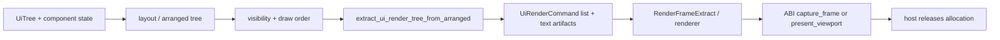

---
related_code:
  - zircon_runtime/src/ui/surface/render/extract.rs
  - zircon_runtime/src/ui/surface/surface.rs
  - zircon_runtime_interface/src/ui/surface/frame.rs
  - zircon_runtime/src/dynamic_api/exports.rs
  - zircon_runtime_interface/src/runtime_api/abi/api_table.rs
implementation_files:
  - zircon_runtime/src/ui/surface/render/extract.rs
  - zircon_runtime/src/ui/surface/render/cache.rs
  - zircon_runtime/src/dynamic_api/exports.rs
  - zircon_runtime_interface/src/runtime_api/abi/api_table.rs
plan_sources:
  - user: 2026-09-09 构建 ZirconEngine 机制 Wiki
  - docs/wiki/ui/surface-rendering.md
  - docs/wiki/app-runtime-api/dynamic-runtime-abi.md
tests:
  - zircon_runtime/src/ui/tests/surface_frame_authority.rs
  - zircon_runtime/src/ui/tests/surface_dirty_domains.rs
  - zircon_runtime/src/ui/tests/text_pipeline/render_extract_prewarm.rs
  - zircon_runtime_interface/src/tests/abi_safety_contracts.rs
  - zircon_runtime/src/dynamic_api/tests/api_table.rs
doc_type: mechanism-guide
---

# UI 渲染抽取与动态 ABI 交接

UI 表面和动态 runtime 都采用“先准备拥有的数据，再在边界提交”的策略。UI 把 authored tree 排布为 arranged tree，再抽取不可变 `UiRenderExtract`；ABI 则把 runtime-owned 结果登记为 allocation，宿主只持有 opaque handle 和固定布局 DTO。



## UI 抽取的 authority

`extract_ui_render_tree_from_arranged*` 以 arranged frame、clip frame、z-index 和 draw order 为几何权威；不会用旧 authored geometry 覆盖已排布结果。可见性索引先过滤不可见节点，popup anchor 未解析时跳过运行时弹层。组件 renderer 在 owner command 后追加 button、slider、dialog 等专用命令；文本路径复用 `UiTextMeasureCache`，必要时预热 glyph/layout。

```rust
use zircon_runtime::ui::surface::extract_ui_render_tree;

let extract = extract_ui_render_tree(&surface.tree);
```

这是源码公开的 one-shot 入口；保留式 `UiSurface` 应使用其自身 frame 生命周期，渲染线程不应直接修改 tree。

表面 dirty domain 变化时才重建 arranged tree 或 render extract；若几何未变，可复用旧 `Arc`。字体 atlas 尚未就绪时允许提交预热请求和占位图元，下一帧再刷新。

## 动态 ABI 的握手与结果所有权

宿主加载 `zircon_runtime_get_api_v8` 后必须校验 `ZrRuntimeApiV8` 的 `abi_version`、精确 `size_bytes`、指针对齐和 required slots。`capture_accessibility_tree`、native surface 三件套、`profile_control`、`drain_host_requests` 是 optional；缺失时宿主必须禁用对应能力或走 fallback，不得伪造成功。

```text
host: ZrHostApiV1 -> get_api_v8
runtime: validate host -> immutable ZrRuntimeApiV8
host: create_session -> opaque session handle
host: capture_frame / drain_* -> OwnedResultV2 + allocation id
host: release_allocation(session, id)
```

`drain_plugin_events`、`drain_world_invalidations` 和 `harvest_operation` 使用 prepare/register/commit 语义：只有 output allocation 成功登记后才消费 runtime 队列；登记失败会 rollback。跨 ABI 的输出指针必须由调用方提供有效、对齐、可写存储，panic 在 FFI wrapper 内转换为 `ZrStatusCode::Panic`。

## 错误与恢复

- arranged tree 缺节点或索引失配：跳过该节点并记录诊断，保留上一帧 extract。
- 文本/atlas 未就绪：预热并提交占位；不要阻塞整个 UI frame。
- ABI shape 不匹配：拒绝加载，重新选择匹配 BuildSet；没有旧 V7/V6 回退。
- optional slot 缺失：禁用能力或走 capture/fallback presenter；三件 native present 槽必须成组判断。
- allocation 登记失败：保留队列，修复宿主输出缓冲后重试 drain/harvest。
- session 销毁被未释放 allocation 阻止：逐一调用 `release_allocation` 后再 destroy。

### 排查清单

- render extract 是否来自 arranged tree，而不是 authored tree？
- dirty generation 是否在 layout、文本 cache 和 extract 之间一致？
- 宿主是否按 required/optional 槽分区检查 V8 表？
- 所有 runtime-owned 输出是否由原 session 释放？
- ABI 版本、BuildSet 摘要和动态库 sidecar 是否在加载前后都校验？

## 参考实现与测试

- 实现：`zircon_runtime/src/ui/surface/render/extract.rs`、`zircon_runtime/src/dynamic_api/exports.rs`、`zircon_runtime_interface/src/runtime_api/abi/api_table.rs`。
- 相关概念页：[表面与渲染](../ui/surface-rendering.md)、[动态运行时与 ABI V8](../app-runtime-api/dynamic-runtime-abi.md)。
- 测试覆盖 frame authority、dirty domain、文本预热、ABI shape 和 FFI panic containment。
