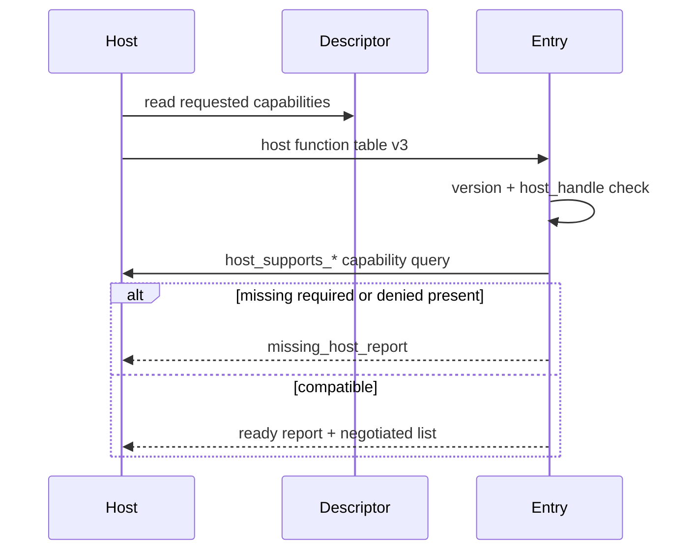

---
related_code:
  - zircon_plugins/plugin_sdk/src/declaration.rs
  - zircon_plugins/plugin_sdk/src/runtime.rs
  - zircon_plugins/plugin_sdk/src/native.rs
  - zircon_runtime/src/plugin
implementation_files:
  - zircon_runtime/src/plugin
plan_sources:
  - user: 2026-09-09 插件公开接口完整参考
tests:
  - zircon_plugins/plugin_sdk/src/native/tests.rs
  - zircon_app/tests/plugin_group_error_contract.rs
doc_type: mechanism-guide
title: Capability 协商与插件生命周期
status: source-audited
---

# Capability 协商与插件生命周期

能力声明回答“插件需要什么”和“宿主能给什么”，生命周期回答“何时可调用、何时必须撤销”。二者必须同时设计：未协商成功的插件不能进入 ready，已撤销 owner 的 bridge 不能继续调用。

## capability 角色

`PluginCapabilityRole` 将 capability 分为 runtime registration、editor registration、runtime+editor registration 和 requested-only。linked descriptor 只投影 runtime-provided 角色；native descriptor 还携带 requested list，供 entry point 协商。

|状态|含义|失败策略|
|---|---|---|
|requested|插件希望获得|可被宿主拒绝，插件应降级|
|required|没有它无法工作|返回 missing report|
|negotiated|本次实际授予|只在 ready report 中使用|
|denied|宿主明确禁止|命中即拒绝|

## native 协商时序



`host_supports_all_capabilities_v3` 对空列表返回 true；`host_supports_any_capability_v3` 对空列表返回 false。传入 null table、版本不等于 `ZIRCON_NATIVE_PLUGIN_ABI_VERSION` 或 `host_handle == 0` 时均视为不兼容。

## linked 生命周期

Runtime plugin 通常经历 descriptor catalog、selection、module build、module ready、scene registration、tick、shutdown。`RuntimePluginRegistrationBuilder` 的 owner 在注册时记录，卸载时由 registry 撤销 resource/component/event/system/interface。

```text
discovered -> selected -> activating -> ready -> running
                         |              |
                         +-> rejected  +-> draining -> revoked -> unloaded
```

shutdown 回调不得创建新对象；先停止系统调度，再撤销 bridge，最后释放 owner 资源。监听器 `owner_revocation_listener` 只能清索引和广播状态。

## 状态插件

`NativePluginBehaviorV4::is_stateless` 为 1 时可安全重复加载，不提供 save/restore。状态插件必须：

1. 声明 `state_schema_version`。
2. 在 unload 前由宿主调用 save_state，限制输出大小。
3. 在新实例 ready 后调用 restore_state。
4. 对未知 schema 返回 ERROR 或显式迁移结果，不能按旧布局解释。

## 诊断与重试

缺能力、版本不符、重复 ID、owner revoked、bridge unavailable 都应成为结构化诊断。重试只适用于 transient host unavailable；ABI mismatch、invalid manifest、duplicate command 属于永久失败，不能 busy-loop。

## 安全边界

- capability 是授权，不是字符串标签；宿主授予前应检查 target、签名和来源。
- denied capability 必须优先于 optional fallback，防止插件绕过策略。
- 卸载后使所有 `WeakBridge` 失效，避免悬空调用。
- 记录 descriptor hash、manifest schema、granted capability 集合，便于审计。

## 最佳实践检查表

- [ ] required 与 requested 分开列出。
- [ ] 每个 capability 有稳定命名空间和版本后缀。
- [ ] linked/native 对同一能力的语义一致。
- [ ] 缺能力时有用户可读 diagnostics。
- [ ] unload、revocation、state migration 均有测试。

## 参考

- [declaration.rs](https://github.com/He-Jiahui/ZirconEngine/blob/main/zircon_plugins/plugin_sdk/src/declaration.rs)
- [native.rs](https://github.com/He-Jiahui/ZirconEngine/blob/main/zircon_plugins/plugin_sdk/src/native.rs)
- [plugin runtime](https://github.com/He-Jiahui/ZirconEngine/tree/main/zircon_runtime/src/plugin)
