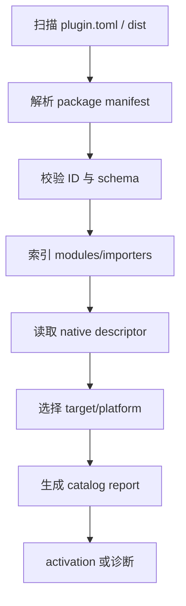

---
related_code:
  - zircon_plugins/first_party_editor_catalog/src/catalog.rs
  - zircon_runtime/src/plugin
  - zircon_plugins/*/plugin.toml
implementation_files:
  - zircon_plugins/first_party_editor_catalog/src
  - zircon_runtime/src/plugin
plan_sources:
  - user: 2026-09-09 插件公开接口完整参考
tests:
  - zircon_plugins/first_party_editor_catalog/src/tests.rs
  - zircon_app/tests/plugin_group_error_contract.rs
doc_type: mechanism-guide
title: 插件 Catalog 清单审计指南
status: source-audited
---

# 插件 Catalog 清单审计指南

Catalog 是插件从“磁盘上的包”变成“可选择 descriptor”的边界。审计目标不是只确认 TOML 能解析，而是确认 package ID、module graph、target/platform、capability、ABI 和实际制品彼此一致。

## 发现流程



## 审计字段

|类别|必查字段|典型问题|
|---|---|---|
|身份|id、display_name、category|ID 非 canonical、重复|
|兼容|sdk_api_version、engine_compat|宿主版本不在范围|
|部署|packaging、forms、dist_crate|声明 native 但无 DLL|
|模块|name、kind、crate_name、dependencies|依赖环、crate 缺失|
|能力|capabilities、status、roles|required 未授予|
|入口|descriptor_symbol、runtime_entry、editor_entry|符号缺失/重复|
|资产|importer id、extension、schema|匹配冲突|

## Report 解释

catalog report 应保留 discovered、selected、activated、rejected、disabled 等状态，以及每个状态的 diagnostics。报告排序要稳定（按 package ID、module name、system ID），便于 CI diff 和用户复现。

## Inventory 阅读方法

仓库插件目录通常包含：

```text
plugin.toml          # package metadata
runtime/Cargo.toml   # linked runtime crate
runtime/src/plugin.rs# RuntimePlugin implementation
editor/...           # EditorPlugin implementation
dist/...             # native/dist wrapper
```

先读 `plugin.toml` 确认 package intent，再读 runtime/editor `plugin.rs` 对照 descriptor 与 registration report，最后读 dist crate 验证 ABI 导出。只读 dist 会遗漏业务模块；只读 runtime 会遗漏 native 入口。

## 迁移与漂移

从手写 TOML 迁移到 SDK builder 时，先保留 snapshot 测试，比较旧/新 `PluginPackageManifest` 的序列化结果。字段顺序可变化，但语义字段不能丢失。迁移完成后删除第二份 metadata，避免下一次改动漂移。

## 负向案例

- 两个包声明同一 package ID：catalog 选中顺序不应决定结果，应直接报告 duplicate。
- module kind 为 `Editor` 却 target 包含 ServerRuntime：选择器拒绝该 module。
- descriptor plugin_id 与 manifest id 不同：禁止加载，记录 both values。
- registration report 声明 system，但 behavior manifest 没有实现 callback：native activation 失败并回滚。
- importer extension 同时匹配多个版本：报告 ambiguity，不随机选择。

## CI 审计脚本建议

```text
1. 扫描所有 plugin.toml，构造 package ID 集合并检查重复。
2. 对每个 manifest 运行 schema/unknown-field 校验。
3. 计算 module dependency 图并检测环。
4. 若 packaging 包含 native，检查 cdylib 与 descriptor symbol。
5. 运行 target/platform 矩阵，断言 unsupported 不进入 activation。
6. 将 diagnostics 归档为 JSON，供 Wiki 与发布报告链接。
```

## 与引擎参考的关系

Unreal Plugin Browser、Godot extension registry、Bevy feature graph 和 Fyrox plugin list 都把“发现”和“激活”分开。Zircon 的 catalog 还承担 ABI/capability 审计，因此 catalog report 应视为安全边界，不只是 UI 列表。

## 当前成熟度

`first_party_editor_catalog` 提供首方编辑器索引；运行时插件 catalog 与 native loader 仍有部分 `Beta/Experimental` 能力。发布说明中应链接具体 tests 和 manifest，而不是笼统写“支持插件”。

## 参考

- [first_party catalog](https://github.com/He-Jiahui/ZirconEngine/blob/main/zircon_plugins/first_party_editor_catalog/src/catalog.rs)
- [catalog tests](https://github.com/He-Jiahui/ZirconEngine/blob/main/zircon_plugins/first_party_editor_catalog/src/tests.rs)
- [runtime plugin model](https://github.com/He-Jiahui/ZirconEngine/tree/main/zircon_runtime/src/plugin)
