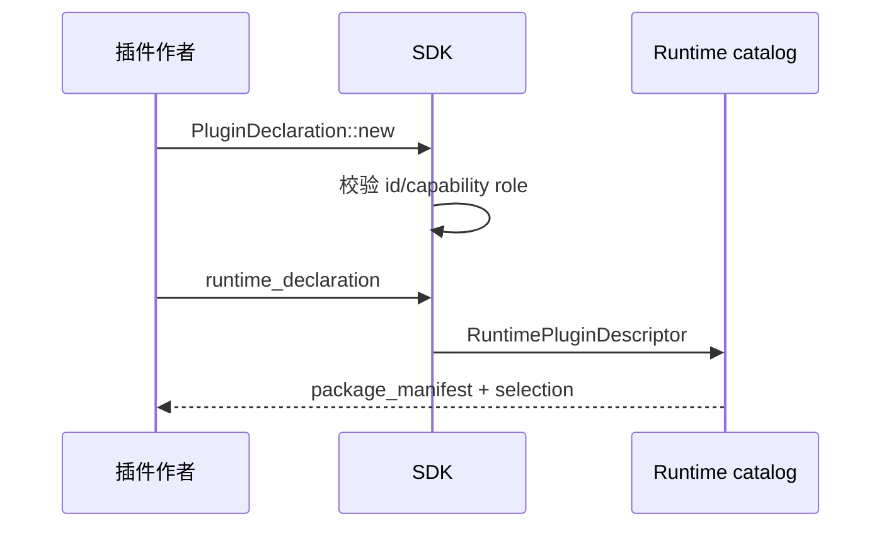

---
related_code:
  - zircon_plugins/plugin_sdk/src/declaration.rs
  - zircon_plugins/plugin_sdk/src/runtime.rs
  - zircon_plugins/plugin_sdk/src/declaration/macros.rs
implementation_files:
  - zircon_plugins/plugin_sdk/src/declaration.rs
plan_sources:
  - user: 2026-09-09 插件公开接口完整参考
tests:
  - zircon_plugins/plugin_sdk/src/declaration/tests.rs
doc_type: api-reference
title: 声明与运行时 Descriptor
status: source-audited
---

# 声明与运行时 Descriptor

`PluginDeclaration` 是 package 元数据的唯一来源。它不保存回调，也不执行注册；`runtime_declaration(crate_name)` 才把纯数据投影成 `RuntimePluginDeclaration`，最后由 `descriptor()` 或 `into_descriptor()` 生成 `RuntimePluginDescriptor`。

## 字段与枚举

|类型|取值|宿主用途|
|---|---|---|
|`PluginTarget`|`ClientRuntime`、`ServerRuntime`、`EditorHost`|选择运行上下文|
|`PluginPlatform`|Windows/Linux/Macos/Android/Ios/WebGpu/Wasm/Headless|导出过滤|
|`PluginMaturityLevel`|Core/Stable/Beta/Experimental/Externalized/Stub/Deprecated|显示风险和默认策略|
|`PluginPackaging`|SourceTemplate/LibraryEmbed/NativeDynamic|制品选择|
|`PluginCapabilityRole`|RuntimeRegistration/EditorRegistration/RuntimeEditorRegistration/RequestedOnly|哪些 capability 写入 runtime descriptor|
|`PluginPackageRole`|Production/DeveloperTool/Sample/TestFixture|发布与默认启用策略|

## 构造和读取

```rust
use zircon_plugin_sdk::{PluginDeclaration, PluginMaturityLevel, PluginPackaging,
    PluginPlatform, PluginTarget, PluginCapabilityRole};

const DECL: PluginDeclaration = PluginDeclaration::new(
    "navigation", "Navigation", "runtime", "navigation.runtime",
    "Navigation runtime module",
    &[PluginTarget::ClientRuntime, PluginTarget::ServerRuntime],
    &[PluginPlatform::Windows, PluginPlatform::Linux],
    &["runtime.plugin.navigation"],
    &[PluginCapabilityRole::RuntimeRegistration],
    PluginMaturityLevel::Beta,
    &[PluginPackaging::LibraryEmbed, PluginPackaging::NativeDynamic],
);
```

`id()`、`display_name()`、`category()`、`module_name()`、`declared_targets()`、`declared_platforms()`、`capabilities()`、`capability_roles()`、`declared_maturity()`、`declared_packaging()` 和 `package_role()` 都是 `const fn`，可用于生成静态清单。`with_package_role` 返回复制后的声明，不修改原静态值。

## 投影规则

`runtime_declaration` 会：

1. 用 `RuntimePluginId::new(id)` 校验 canonical key；不匹配会触发断言。
2. 将目标、成熟度、默认 packaging、package role 和 category 传给 runtime builder。
3. 只把 role 为 runtime-provided 的 capability 写入 descriptor；`RequestedOnly` 仍保留在声明中供 native 协商。
4. 检查 capability 与 role 数组长度一致；不一致立即 panic，防止错位元数据。

```rust
let descriptor = DECL.runtime_descriptor("zircon_plugin_navigation_runtime");
assert_eq!(descriptor.package_id(), "navigation");
let manifest = DECL.runtime_declaration("zircon_plugin_navigation_runtime").package_manifest();
```

## RuntimePluginDeclaration 链式 API

构造器 `new(package_id, display_name, runtime_id, crate_name)` 后可调用：

|方法|行为|
|---|---|
|`with_category`|设置分类|
|`with_enabled_by_default` / `with_required_by_default`|选择加载策略|
|`with_target_modes`|覆盖 runtime target|
|`with_init_level`|设置模块初始化级别|
|`with_module_descriptor`|绑定 `ModuleDescriptor`|
|`with_module_dependency`|加入模块依赖|
|`with_capability`|声明 runtime capability|
|`with_system_sets` / `with_system_anchors`|向调度器公开锚点|
|`with_maturity` / `with_capability_status`|状态与成熟度|
|`with_optional_feature`|挂接 feature bundle|
|`with_provided_interface(_id)`|声明桥接接口|
|`with_default_packaging` / `with_package_role`|选择制品和角色|
|`descriptor`|克隆 builder，保留 declaration|
|`into_descriptor`|消费 builder，避免额外 clone|

## 失败案例

- ID 使用大写、空格或非 builtin key：`RuntimePluginId::new` 断言失败。
- capability/role 数组长度不同：声明阶段 panic。
- 同一字段在 Rust 与 TOML 不一致：宿主以生成 manifest 为准，调试时应报告 drift。
- 将 editor-only capability 误标为 `RuntimeRegistration`：server target 可能加载不存在的符号。

## 最佳实践清单

- 每个 package 只维护一个 `PluginDeclaration` 静态值。
- 用 `PluginMaturityLevel::Experimental` 标记尚未有稳定 ABI 的插件。
- 目标和平台取交集后再发布，不要依赖宿主“猜测”。
- `descriptor()` 用于检查与日志，最终注册路径使用 `into_descriptor()`。
- 变更 ID 等同于新插件；保留旧 ID 会造成 catalog 重复。

## 生命周期图



## 相关源码与测试

- [declaration.rs](https://github.com/He-Jiahui/ZirconEngine/blob/main/zircon_plugins/plugin_sdk/src/declaration.rs)
- [runtime.rs](https://github.com/He-Jiahui/ZirconEngine/blob/main/zircon_plugins/plugin_sdk/src/runtime.rs)
- [declaration tests](https://github.com/He-Jiahui/ZirconEngine/blob/main/zircon_plugins/plugin_sdk/src/declaration/tests.rs)
