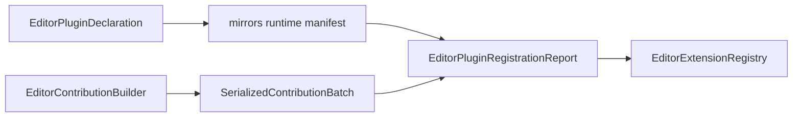

---
related_code:
  - zircon_plugins/plugin_sdk/src/editor.rs
  - zircon_plugins/plugin_sdk/src/editor_contribution.rs
implementation_files:
  - zircon_plugins/plugin_sdk/src/editor.rs
  - zircon_plugins/plugin_sdk/src/editor_contribution.rs
plan_sources:
  - user: 2026-09-09 插件公开接口完整参考
tests:
  - zircon_plugins/plugin_sdk/src/editor.rs
  - zircon_editor/tests/integration_contracts
doc_type: api-reference
title: 编辑器插件与贡献批次
status: source-audited
---

# 编辑器插件与贡献批次

编辑器扩展分成两层：`EditorPluginDeclaration` 描述插件包并镜像 runtime manifest；`EditorContributionBuilder` 生成可序列化的视图、抽屉、菜单、命令、资产类型、设置页、本地化和工具资源贡献。两层都通过 `EditorPluginRegistrationReport` 汇总诊断。

## EditorPluginDeclaration

`new(package_id, display_name, crate_name)` 默认 target 为 `EditorHost`。链式方法包括 `with_category`、`with_package_role`、`with_description`、`with_maturity`、`with_capability(_ies)`、`with_asset_root`、`with_content_root`、`mirrors_runtime`、`mirrors_runtime_manifest` 和 `with_runtime_event_consumer_registration`。

```rust
let declaration = zircon_plugin_sdk::EditorPluginDeclaration::new(
    "weather.editor", "Weather Tools", "weather_editor")
    .with_category("authoring")
    .with_description("Weather authoring panels")
    .with_capability("editor.weather.inspector")
    .with_asset_root("assets/weather")
    .mirrors_runtime(&runtime_declaration);
```

`mirrors_runtime` 会复制 package ID、targets、capabilities、modules 和 distribution，并把 editor capability/root 去重合并。调用后 `mirrored_runtime_package_id()` 可检查镜像目标；`base_manifest()` 返回未附加 editor descriptor 的 manifest，`package_manifest()` 返回最终包清单。

## EditorPlugin trait 与宏

`authoring_plugin!` 生成 `new`、`declaration`、`package_manifest`、`editor_capabilities`、`registration_report`，并实现 `EditorPlugin::descriptor`、`register_editor_extensions` 和 `runtime_event_consumers`。注册函数接收 `&mut EditorExtensionRegistry`，返回 `EditorExtensionRegistryError`。

```rust
fn register_extensions(
    registry: &mut zircon_editor::core::editor_extension::EditorExtensionRegistry,
) -> Result<(), zircon_editor::core::editor_extension::EditorExtensionRegistryError> {
    registry.register_view(zircon_editor::core::editor_extension::ViewDescriptor::new(
        "weather.inspector", "Weather Inspector", "Weather"))
}
```

宏适合固定 package 元数据；需要动态 manifest 或多个 runtime 镜像时，直接组合 `EditorPluginDeclaration`。

## EditorContributionBuilder

构造器 `new(package_id)` 后的方法：

|方法|贡献|
|---|---|
|`view`|可停靠或文档视图 descriptor|
|`drawer`|抽屉窗口|
|`menu`|菜单路径、排序键、命令项|
|`command`|命令 ID 和显示元数据|
|`command_with_execution_contract`|附加执行/撤销合同|
|`asset_type`|编辑器资产类型|
|`settings_page`|设置页面与字段|
|`localization_bundle`|本地化资源|
|`tool_resource_kind`|工具资源种类|
|`build`|`Result<SerializedContributionBatch, ...>`|

```rust
let batch = zircon_plugin_sdk::EditorContributionBuilder::new("weather.editor")
    .view("weather.inspector", "Weather Inspector", "Weather")
    .drawer("weather.timeline", "Weather Timeline")
    .command("weather.rebuild_cache", "Rebuild Weather Cache")
    .asset_type("weather.profile", "Weather Profile")
    .build()?;
```

生成 batch 后由 editor host 验证 ID 唯一性、schema 和 capability。`build()` 的错误不能忽略；错误 batch 不得注入 registry。

## 事件消费者

`with_runtime_event_consumer_registration` 注册 `EditorRuntimeEventConsumerRegistration`。重复 namespace/event 或无效 schema 会进入 declaration diagnostics，而不是 panic；`registration_report` 会把这些 diagnostics 与 plugin 自身报告合并。

## 图示与边界



编辑器扩展不能直接持有 runtime scene 的可变引用；跨边界使用事件消费者、bridge interface 或 editor service。资产根路径必须位于 package 允许的根目录，避免加载任意文件。

## 最佳实践与错误

- package ID 与 runtime 镜像 ID 不同会导致 catalog 分裂；优先 `mirrors_runtime`。
- 将 editor capability 放进 runtime-only manifest 会使 headless target 误加载。
- 命令必须提供稳定 ID 和 execution contract；没有 undo 语义的命令应明确声明不可撤销。
- 贡献批次应有集成测试，验证重复 ID、未知 menu path 和缺少 capability 的拒绝路径。

## 参考

- [editor.rs](https://github.com/He-Jiahui/ZirconEngine/blob/main/zircon_plugins/plugin_sdk/src/editor.rs)
- [editor_contribution.rs](https://github.com/He-Jiahui/ZirconEngine/blob/main/zircon_plugins/plugin_sdk/src/editor_contribution.rs)
