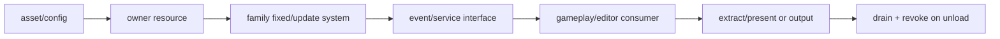

---
related_code:
  - zircon_plugins/rendering
  - zircon_plugins/animation
  - zircon_plugins/navigation
  - zircon_plugins/physics
  - zircon_plugins/sound
  - zircon_plugins/plugin_sdk/src/registration.rs
implementation_files:
  - zircon_plugins/rendering
  - zircon_plugins/animation
  - zircon_plugins/navigation
  - zircon_plugins/physics
  - zircon_plugins/sound
plan_sources:
  - user: 2026-09-09 插件公开接口完整参考
tests:
  - zircon_plugins/animation/runtime/tests
  - zircon_plugins/physics/runtime/tests
  - zircon_plugins/sound/runtime/src/tests.rs
doc_type: mechanism-guide
title: 渲染、动画、导航、物理与音频扩展模式
status: source-audited
---

# 五类运行时插件扩展模式

渲染、动画、导航、物理和音频共享同一插件骨架：声明 package/module，注册 owner 资源和系统，以 capability 暴露可选服务，再通过 bridge 或 runtime manager 提供跨模块查询。差异只在数据 ownership、tick stage 和线程亲和性。

## 对照矩阵

|家族|主要 owner 资源|推荐阶段|跨模块接口|典型失败|
|---|---|---|---|---|
|渲染|frame graph、GPU resource registry|Extract/Present|RenderFramework/viewport|surface lost、resource unavailable|
|动画|pose buffer、state machine|PostUpdate/Animation|animation target/query|target missing、cycle|
|导航|nav mesh、query service|Fixed/Update|path query bridge|mesh stale、no path|
|物理|world、contact/event queue|FixedUpdate|PhysicsManager|step overflow、invalid body|
|音频|mixer、timeline、listener|Audio/Update|sound service|device lost、asset missing|

## 共通注册形状

```rust
let mut module = RuntimePluginRegistrationBuilder::new(registry)
    .module("family.runtime")?;
module.resource(FamilyState::default)?;
module.runtime_scene_system("family.tick", stage, || {
    |ctx| { update_family(ctx)?; Ok(()) }
}).in_set("family.update").register()?;
```

每一类都应将 manager/service 作为 resource 或 exported interface，而不是让其他插件直接依赖内部结构体。事件使用 `PluginEventManifest`，配置使用 `PluginOptionManifest`。

## 渲染

渲染插件通常拥有 `RenderFramework` 实例或 viewport service。frame extract 与 present 必须分开；UI overlay 使用专门的 `submit_frame_extract_with_ui` 路径。GPU 资源句柄只在 owner 生命周期内有效，surface lost 时要撤销 viewport 并等待 in-flight frame drain。

## 动画

动画插件把编译后的 graph/state machine 作为 asset，把 pose buffer 和 target table 作为运行时资源。系统应在 transform sync 后执行，状态切换事件通过 manifest 发布。缓存失效、目标删除和循环依赖都要返回诊断，不应静默使用上一帧 pose。

## 导航

导航插件把 nav mesh 构建与 query service 分离：构建系统写入 immutable mesh artifact，查询接口只读取快照。动态障碍通过事件或增量 patch 更新，query 返回 `NoPath`、`StaleMesh`、`Cancelled` 等可区分错误。server target 可只启用 query，不加载 editor baking module。

## 物理

物理系统必须使用固定 timestep，系统 ordering 置于 gameplay 后、render extract 前。contact/event queue 在每个 tick 结束后交换 buffer；插件卸载前先停止 step，再清空事件队列，避免调用已撤销 listener。跨线程 worker 必须声明 `WorkerSafe` 并由宿主 capability 授权。

## 音频

音频插件将 device/mixer 作为 service，将 timeline/automation 作为数据资源。设备重连是可恢复错误，sample decode 失败是 asset failure。音频 callback 不得分配或阻塞；把重采样、解码放入 worker，在主线程只提交无锁命令。

## 生命周期图



## 线程与数据约束

- 主线程系统可访问 scene/context；worker-safe 系统只能处理 Send + Sync 快照。
- 句柄传递而非 `Arc<Mutex<Manager>>` 共享内部状态。
- event payload 版本化，消费方处理未知字段。
- 每个家族至少有一个“资源缺失/owner revoked/目标不存在”的负向测试。

## 与成熟引擎的映射

Unreal 的 Renderer/Physics/Audio modules、Godot 的 GDExtension servers、Bevy 的 schedule + resource、Fyrox 的 plugin services 都体现了“系统注册 + 服务边界”模式。Zircon 当前家族成熟度不一致：以各插件 manifest 的 `PluginMaturity` 和对应 tests 为准，不能因为 SDK API 稳定就宣称业务模块稳定。

## 参考

- [registration.rs](https://github.com/He-Jiahui/ZirconEngine/blob/main/zircon_plugins/plugin_sdk/src/registration.rs)
- [animation tests](https://github.com/He-Jiahui/ZirconEngine/tree/main/zircon_plugins/animation/runtime/tests)
- [physics tests](https://github.com/He-Jiahui/ZirconEngine/tree/main/zircon_plugins/physics/runtime/tests)
- [sound tests](https://github.com/He-Jiahui/ZirconEngine/blob/main/zircon_plugins/sound/runtime/src/tests.rs)
