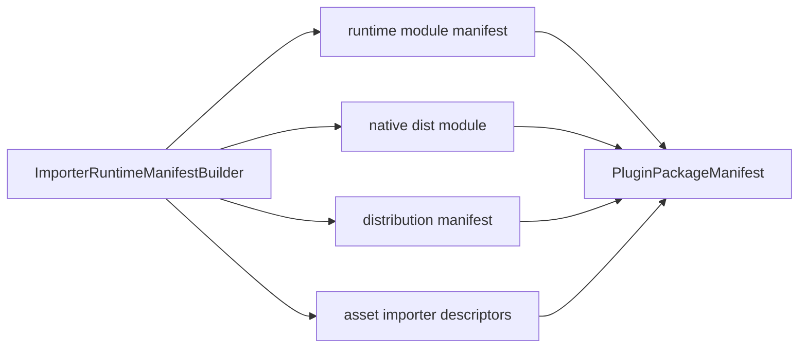

---
related_code:
  - zircon_plugins/plugin_sdk/src/manifest/importer_runtime.rs
  - zircon_runtime/src/asset
  - zircon_plugins/obj_importer/plugin.toml
  - zircon_plugins/audio_importer/plugin.toml
implementation_files:
  - zircon_plugins/plugin_sdk/src/manifest/importer_runtime.rs
plan_sources:
  - user: 2026-09-09 插件公开接口完整参考
tests:
  - zircon_plugins/plugin_sdk/src/manifest/tests.rs
  - zircon_runtime/tests/shader_import_dependency_contract.rs
doc_type: api-reference
title: Asset Importer 插件契约
status: source-audited
---

# Asset Importer 插件契约

Importer 插件同时提供 runtime module、native dist module 与 `AssetImporterDescriptor`。SDK 的 `ImporterRuntimeManifestBuilder` 保证三者使用同一 engine compatibility、capability 和 importer 列表。

## 构建器

```rust
let builder = zircon_plugin_sdk::ImporterRuntimeManifestBuilder::new(
    "texture.runtime", "texture_runtime",
    "texture.native", "texture_dist",
    "texture_runtime_entry_v3",
)
.with_engine_compat(">=0.1, <0.2")
.with_capabilities(["runtime.asset.import.texture"])
.with_asset_importers([zircon_runtime::asset::AssetImporterDescriptor::new(
    "texture.importer", "texture_importer",
    zircon_runtime::asset::AssetKind::Texture, 1,
).with_source_extensions(["png", "jpg"]) ]);
```

公开方法：`new`、`with_engine_compat`、`with_capabilities`、`with_asset_importers`、`runtime_module_manifest`、`dist_module_manifest`、`distribution_manifest`、`build_package_manifest`。后者消费 builder，将 native module、distribution 和 importer descriptors 合并到 descriptor package manifest。

默认 targets 是 `ClientRuntime + EditorHost`，默认 platforms 是 Windows/Linux/Macos，distribution packaging 是 `NativeDynamic`，descriptor symbol 是 `zircon_native_plugin_descriptor_v3`，ABI version 是 3。

## ImporterDescriptor 语义

`AssetImporterDescriptor::new(id, importer_name, asset_kind, version)` 定义稳定 importer ID、实现名、输出 `AssetKind` 和 importer schema version。`with_source_extensions` 只声明后缀匹配，不代表文件可信；宿主仍要检查内容、大小和依赖。

|阶段|责任|
|---|---|
|发现|catalog 读取 manifest，检查 engine compat|
|匹配|按扩展名和 importer priority 选 descriptor|
|导入|runtime importer 生成 artifact 与依赖|
|加载|ProjectAssetManager 检查 readiness/failure_reason|
|重导入|源文件 hash 改变后刷新 artifact 与下游依赖|

## Manifest 投影



`build_package_manifest` 会确保 `NativeDynamic` 在默认 packaging 中存在，并写入 `dist_crate`、`runtime_entry`、engine compat 和 descriptor symbol。导入器列表按输入顺序写入；重复 importer ID 应在 catalog 校验阶段拒绝。

## 错误与诊断

- engine compat 不满足：永久拒绝，不应尝试加载 DLL。
- source extension 冲突：报告 ambiguous importer，让用户选择或提高 priority。
- importer 输出 artifact schema 与 descriptor version 不匹配：标记 `failure_reason`，不要缓存半成品。
- runtime 可用但 dist 缺失：编辑器可显示 source-only 状态，导出时阻止。

## 负向测试建议

1. 空 extension、重复 extension、大小写变体。
2. 缺少 native descriptor symbol。
3. ABI 版本为 2 或未知 engine compat。
4. 导入过程中依赖失败后的回滚与重试。
5. 只提供 EditorHost target 时的 headless 拒绝。

## 当前家族实例

仓库内 `obj_importer`、`audio_importer`、`shader_wgsl_importer` 和 `asset_importers/texture` 使用 runtime/dist 双 crate 结构。它们的实现成熟度不同，新增 importer 应复制 manifest 形状而不是复制业务代码。

## 参考

- [importer_runtime.rs](https://github.com/He-Jiahui/ZirconEngine/blob/main/zircon_plugins/plugin_sdk/src/manifest/importer_runtime.rs)
- [asset API](https://github.com/He-Jiahui/ZirconEngine/tree/main/zircon_runtime/src/asset)
- [obj importer manifest](https://github.com/He-Jiahui/ZirconEngine/blob/main/zircon_plugins/obj_importer/plugin.toml)
