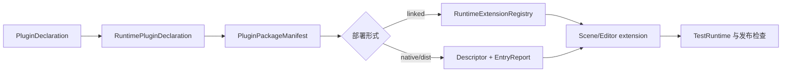

---
related_code:
  - zircon_plugins/plugin_sdk/src/lib.rs
  - zircon_plugins/plugin_sdk/src/declaration.rs
  - zircon_plugins/plugin_sdk/src/runtime.rs
  - zircon_plugins/plugin_sdk/src/editor.rs
  - zircon_plugins/plugin_sdk/src/native.rs
implementation_files:
  - zircon_plugins/plugin_sdk/src
plan_sources:
  - user: 2026-09-09 插件公开接口完整参考
tests:
  - zircon_plugins/plugin_sdk/src/declaration/tests.rs
  - zircon_plugins/plugin_sdk/src/native/tests.rs
doc_type: api-reference
title: 插件 API 参考手册
status: source-audited
---

# 插件 API 参考手册

本目录是 `zircon_plugin_sdk` 的逐符号参考。它把插件从声明、manifest、linked 注册、编辑器贡献、原生 ABI，到测试与发布的完整路径拆开说明。代码优先采用当前源码中的真实类型；标记为“形状”的片段说明调用顺序，需要由具体插件补全业务类型。

## 阅读顺序

|页面|回答的问题|
|---|---|
|声明与运行时|ID、目标、成熟度怎样投影到 descriptor？|
|manifest 与模块|package、module、feature bundle 如何组成？|
|注册与桥接|资源、系统、事件和接口怎样注册并撤销？|
|编辑器贡献|视图、菜单、命令、资产类型如何序列化？|
|原生 ABI|v3 descriptor、v4 behavior、字节所有权怎样跨 DLL？|
|能力与生命周期|required/requested/denied 的协商和卸载时序是什么？|
|导入器|ImporterRuntimeManifestBuilder 如何生成 runtime/dist 制品？|
|家族扩展|渲染、动画、导航、物理、音频插件沿用哪些边界？|
|测试与安全|如何用 TestRuntime、ABI fixture 和负向测试验收？|

## 版本与成熟度

SDK 的 `SDK_API_VERSION` 当前为 `0.2.0`；原生 descriptor ABI 是 v3，behavior ABI 是 v4，registration manifest 是 v3。它们是不同的兼容层，升级任一层都必须重新审查宿主和插件。插件成熟度 `Core/Stable/Beta/Experimental/Externalized/Stub/Deprecated` 应真实反映可用性，不能以 `Stable` 绕过未完成的能力检查。

## 与其他引擎的映射

|Zircon|Unreal|Godot|Bevy/Fyrox|
|---|---|---|---|
|package manifest|`.uplugin`|编辑器/模块注册|`Plugin` / crate feature|
|runtime module|Runtime module|GDNative/GDExtension 模块|`App::add_plugins`|
|editor module|Editor module|EditorPlugin|editor-only systems|
|capability|模块依赖/平台标签|extension API 版本|feature/resource 依赖|
|native descriptor|模块 DLL 导出|GDExtension entry|动态库加载器|

这些映射用于帮助熟悉其他引擎的读者定位概念，不表示 Zircon 兼容它们的 ABI。当前插件体系仍有 `Beta/Stub` 家族，生产项目应查看各页面的“当前成熟度”小节。

## 统一约定

- 所有字符串 ID 使用稳定、全局唯一的命名空间，例如 `runtime.plugin.navigation`。
- package 元数据只在 declaration/manifest builder 维护一份；不要把相同字段手写到 `plugin.toml` 和 Rust 两处。
- owner 是撤销边界。通过 `RuntimePluginRegistrationBuilder::module` 取得 owner 后，所有注册都必须归属该 owner。
- 跨 native 边界只传 `#[repr(C)]`、NUL 结尾字符串和 borrowed/owned byte buffer；Rust panic 不得越过 FFI。
- 示例中的 `?` 表示调用方处理 `Result`；加载器应把错误转换为可见诊断并阻止半注册状态。
