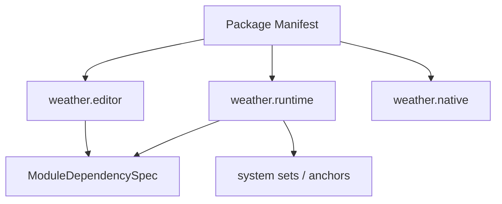

---
related_code:
  - zircon_plugins/plugin_sdk/src/manifest/mod.rs
  - zircon_plugins/plugin_sdk/src/manifest/package_builder.rs
  - zircon_plugins/plugin_sdk/src/manifest/plugin_module_builder.rs
  - zircon_plugins/plugin_sdk/src/manifest/feature_bundle_builder.rs
implementation_files:
  - zircon_plugins/plugin_sdk/src/manifest
plan_sources:
  - user: 2026-09-09 插件公开接口完整参考
tests:
  - zircon_plugins/plugin_sdk/src/manifest/tests.rs
  - zircon_plugins/plugin_sdk/src/manifest/plugin_module_builder.rs
doc_type: api-reference
title: Package Manifest、模块与 Feature Bundle
status: source-audited
---

# Package Manifest、模块与 Feature Bundle

manifest 描述“包是什么”，module 描述“包由哪些可加载单元组成”，feature bundle 描述“可选能力如何成组启用”。三者不要互相替代：module 依赖决定初始化顺序，capability 决定授权，feature bundle 决定选择。

## PluginManifestBuilder

`PluginManifestBuilder::new(id, display_name)` 自动填充 `SDK_API_VERSION`、`default_supported_platforms()`（Windows/Linux/Macos）和 `default_export_packaging()`（SourceTemplate/LibraryEmbed）。常用方法如下：

```rust
let manifest = zircon_plugin_sdk::PluginManifestBuilder::new("weather", "Weather")
    .with_category("runtime")
    .with_description("Weather simulation")
    .with_maturity(zircon_runtime::plugin::PluginMaturity::Experimental)
    .with_supported_targets([
        zircon_runtime::core::framework::platform::RuntimeTargetMode::ClientRuntime,
    ])
    .with_capabilities(["runtime.weather.v1"])
    .with_asset_root("assets/weather")
    .with_content_root("content/weather")
    .with_module(zircon_plugin_sdk::PluginModuleBuilder::runtime(
        "weather", "weather_runtime").build())
    .build();
```

`with_category`、`with_package_role`、`with_description`、`with_maturity`、`with_supported_targets`、`with_supported_platforms`、`with_capability(_ies)`、`with_default_packaging`、`with_asset_root`、`with_content_root`、`with_module` 都是 consuming builder；最后 `build()` 移出 `PluginPackageManifest`。

## PluginModuleBuilder

便利构造器保证命名约定：`runtime(package, crate)` 生成 `package.runtime`，`editor` 生成 `package.editor` 并默认限制到 `EditorHost`，`native` 生成 `package.native`，`vm` 生成 `package.vm`。通用 `new(name, kind, crate_name)` 适用于新模块种类。

|方法|作用|
|---|---|
|`with_description`|覆盖默认 `Plugin module <name>`|
|`with_init_level`|设置 `InitLevel`|
|`with_module_dependency(s)`|定义模块依赖图|
|`with_target_modes`|限制模块 target|
|`with_capabilities`|模块级 capability|
|`with_system_sets`|暴露调度集合|
|`with_system_anchors`|暴露排序锚点|
|`build`|得到 `PluginModuleManifest`|



依赖必须无环。把 editor module 依赖 runtime module 是常见布局；反向依赖会在激活阶段失败。`InitLevel` 只影响模块生命周期，不替代显式依赖。

## PluginFeatureBundleBuilder

`PluginFeatureBundleBuilder::new(id, display_name)` 支持：`with_dependency`、`with_primary_dependency`、`with_required_dependency`、`with_capability(_ies)`、`with_runtime_capability_module`、`with_editor_capability_module`、`with_runtime_module(_from_builder)`、`with_editor_module(_from_builder)`、`with_default_packaging`、`enabled_by_default` 和 `build()`。

```rust
let feature = zircon_plugin_sdk::PluginFeatureBundleBuilder::new(
    "weather.vfx", "Weather VFX")
    .with_primary_dependency("weather")
    .with_capability("runtime.weather.vfx")
    .with_runtime_module_from_builder(
        zircon_plugin_sdk::PluginModuleBuilder::runtime("weather.vfx", "weather_vfx_runtime"))
    .enabled_by_default(false)
    .build();
```

主依赖用于选择基包，required dependency 用于拒绝不完整环境，普通 dependency 记录可选关联。feature 的 runtime/editor module 应保持同一 ID 前缀，避免 catalog 无法关联。

## TOML 对齐

生成后的 `PluginPackageManifest` 才是宿主消费的事实来源。若仓库保留 `plugin.toml`，CI 应比较 `id`、`category`、`maturity`、targets、platforms、capabilities、modules、distribution 字段。不要手写 SDK API 版本、native descriptor symbol 或默认 packaging。

## 负向检查

- 空 module name 或 crate name：模块可被解析但无法加载，必须在发布前拒绝。
- module dependency 指向不存在的 module：catalog report 应显示 missing dependency。
- editor module 没有 `EditorHost` target：会被错误地送入 headless runtime。
- feature bundle 同时声明 conflicting primary dependency：选择器应标记冲突，不静默覆盖。

## 最佳实践

1. 先建 package，再建 modules，最后将 feature bundle 挂到 runtime declaration。
2. 只在模块级声明它实际消费的 capability；package 级 capability 表示整个制品的承诺。
3. 对 native 发布显式设置 `NativeDynamic`，不要依赖默认值。
4. 使用 builder 链式 API 生成 manifest，并在测试中断言生成字段。

## 源码与测试

- [manifest/mod.rs](https://github.com/He-Jiahui/ZirconEngine/blob/main/zircon_plugins/plugin_sdk/src/manifest/mod.rs)
- [package_builder.rs](https://github.com/He-Jiahui/ZirconEngine/blob/main/zircon_plugins/plugin_sdk/src/manifest/package_builder.rs)
- [plugin_module_builder.rs](https://github.com/He-Jiahui/ZirconEngine/blob/main/zircon_plugins/plugin_sdk/src/manifest/plugin_module_builder.rs)
- [feature_bundle_builder.rs](https://github.com/He-Jiahui/ZirconEngine/blob/main/zircon_plugins/plugin_sdk/src/manifest/feature_bundle_builder.rs)
