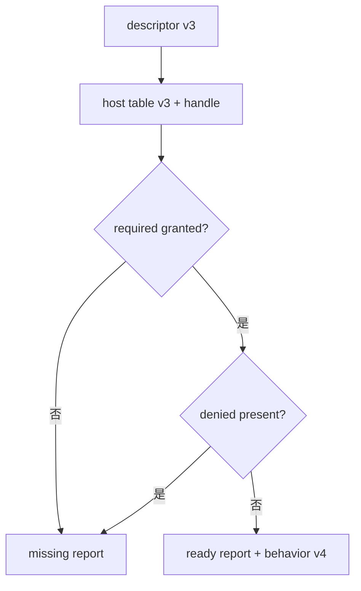

---
related_code:
  - zircon_plugins/plugin_sdk/src/native.rs
  - zircon_plugins/plugin_sdk/src/dist.rs
  - zircon_plugins/native_dynamic_fixture/native/src/lib.rs
implementation_files:
  - zircon_plugins/plugin_sdk/src/native.rs
  - zircon_plugins/plugin_sdk/src/dist.rs
plan_sources:
  - user: 2026-09-09 插件公开接口完整参考
tests:
  - zircon_plugins/plugin_sdk/src/native/tests.rs
  - zircon_plugins/native_dynamic_fixture
doc_type: abi-reference
title: Native ABI v3/v4 逐字段参考
status: source-audited
---

# Native ABI v3/v4 逐字段参考

native plugin 的边界由 `NativePluginAbiV3`、`NativePluginEntryReportV3` 和 `NativePluginBehaviorV4` 组成。descriptor 是静态身份，entry report 是本次宿主协商结果，behavior 是可调用能力；三者不可互换。

## descriptor

|字段|类型/约束|说明|
|---|---|---|
|`abi_version`|`u32`, 当前 3|descriptor 布局版本|
|`plugin_id`|`*const c_char`|canonical、NUL 结尾|
|`package_manifest_toml`|`*const c_char`|完整 package manifest|
|`runtime_entry_name`|`*const c_char`|runtime 入口符号，可空|
|`editor_entry_name`|`*const c_char`|editor 入口符号，可空|
|`requested_capabilities`|`*const c_char`|换行/逗号分隔能力|

导出符号由 `export_native_plugin_descriptor_v3!` 生成：

```rust
zircon_plugin_sdk::export_native_plugin_descriptor_v3!(DESCRIPTOR);
```

不要手写另一个同名 `#[no_mangle]` 函数；同一 DLL 只能有一个 descriptor。

## host function table

`NativePluginHostFunctionTableV3` 携带 `abi_version`、`host_handle`、`granted_capabilities`，以及可选 `host_abi_version`、`host_has_capability`、日志和诊断回调。SDK 的 `host_supports_capability_v3`、`host_supports_all_capabilities_v3` 和 `host_supports_any_capability_v3` 会先检查空指针、版本和非零 handle。

## entry report

`NativePluginEntryPointV3::entry_report(host_functions)` 返回 ready 或 missing report。required capability 全部满足且 denied capability 均不存在时触发 `on_host_ready`。缺失报告的 `behavior` 与 `bridge_methods` 必须为空，宿主应停止注册并显示 diagnostics。

```rust
let report = ENTRY_POINT.entry_report(host_functions);
if report.is_null() {
    return Err("entry report missing");
}
```

## behavior v4

`NativePluginBehaviorV4` 包含 `abi_version`、`is_stateless`、`NativePluginSchemaVersionsV3`、command/event/registration manifest 指针，以及 `invoke_command`、`save_state`、`restore_state`、`unload` 回调。stateless 插件应将 state callbacks 设为 `None`；有状态插件必须声明非零 schema version 并实现成对 save/restore。

`NativePluginCommandManifestV4` 的 command slot 必须从 0 稠密递增、name 唯一、payload schema 非空，`max_output_bytes` 不得超过 SDK 上限。`command_manifest_v4_is_current_and_dense` 可用于加载前检查。

## 字节所有权

|类型|所有者|规则|
|---|---|---|
|`NativePluginByteSliceV3`|调用方|borrowed，只在 callback 期间有效|
|`NativePluginOwnedByteBufferV3`|返回方|必须提供 `free` 与 owner token|
|`NativePluginOutputSinkV4`|宿主|插件只能调用写入回调|

`owned_bytes(Vec<u8>)` 转移 vector 所有权；宿主完成消费后调用 `free_owned_bytes_v3`。函数会拒绝 null/len-capacity 不一致或 owner token 不匹配的 buffer。

## panic 与状态

所有 extern callback 包在 `catch_native_callback_panic(diagnostics, callback)` 中。状态码由 `callback_status(code, diagnostics)` 构造，常见值为 OK、ERROR、DENIED、PANIC。panic 只能变成 PANIC status，不得 unwinding 穿越 DLL。

## bridge method

`NativePluginBridgeMethodTableV3` 是 interface/method 数组；调用参数 `NativePluginBridgeMethodCallV3` 携带 slot、payload、输出 sink 和 user data。字节协议的 schema、长度上限和错误码由 interface owner 定义，ABI 本身不解析业务对象。

## 兼容性检查



宿主 ABI 版本、behavior ABI、manifest schema 和 state schema 要分别记录。升级 manifest schema 不代表可以升级 descriptor 布局。

## 参考

- [native.rs](https://github.com/He-Jiahui/ZirconEngine/blob/main/zircon_plugins/plugin_sdk/src/native.rs)
- [dist.rs](https://github.com/He-Jiahui/ZirconEngine/blob/main/zircon_plugins/plugin_sdk/src/dist.rs)
- [native fixture](https://github.com/He-Jiahui/ZirconEngine/blob/main/zircon_plugins/native_dynamic_fixture/native/src/lib.rs)
