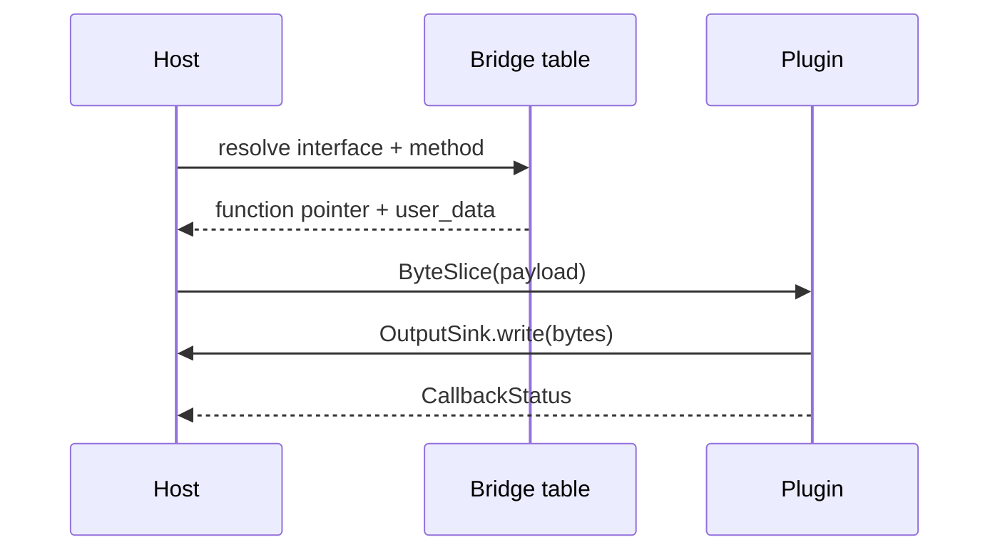

---
related_code:
  - zircon_plugins/plugin_sdk/src/native.rs
  - zircon_plugins/plugin_sdk/src/dist.rs
  - zircon_plugins/native_dynamic_fixture/native/src/lib.rs
implementation_files:
  - zircon_plugins/plugin_sdk/src/native.rs
plan_sources:
  - user: 2026-09-09 插件公开接口完整参考
tests:
  - zircon_plugins/plugin_sdk/src/native/tests.rs
  - zircon_plugins/native_dynamic_fixture
doc_type: api-reference
title: Native Command、Event 与 Bridge 字节协议
status: source-audited
---

# Native Command、Event 与 Bridge 字节协议

Native behavior v4 将可调用面拆为 command、event、registration 和 bridge method。command 是宿主主动调用的稠密 slot，event 是 schema 化通知，registration 是插件声明的模块/系统/资源投影，bridge 是跨插件接口。它们共享 byte transport，但所有权和时序不同。

## Command manifest

```rust
use zircon_plugin_sdk::native::{NativePluginCommandManifestV4, NativePluginCommandV4};

let manifest = NativePluginCommandManifestV4 {
    schema: "zircon.native.command-manifest/4".into(),
    commands: vec![NativePluginCommandV4 {
        name: "weather.rebuild".into(),
        slot: 0,
        payload_schema: "weather.rebuild.v1".into(),
        max_output_bytes: 4096,
    }],
};
assert!(zircon_plugin_sdk::native::command_manifest_v4_is_current_and_dense(&manifest));
```

`command_manifest_v4_to_toml` 与 `from_toml` 提供序列化；反序列化必须处理 `toml::de::Error`。`is_current_and_dense` 拒绝错误 schema、空名称/空 payload schema、稀疏 slot、重复名称和超限输出。

## invoke callback

`NativePluginBehaviorV4::invoke_command` 接收 command slot、`NativePluginByteSliceV3` payload 和 `NativePluginOutputSinkV4`。payload 是 borrowed，不能保存指针；输出只能经 sink 写入，达到 `max_output_bytes` 时返回 ERROR 或 TRUNCATED 诊断。

```text
host -> lookup command name -> slot
     -> validate payload length/schema
     -> invoke_command(slot, borrowed payload, sink)
     -> callback_status(OK|ERROR|DENIED|PANIC)
```

## Event manifest

`NativePluginEventManifestV3` 记录 namespace、name、stable hash 和 schema。stable hash 由事件 ID/schema 共同决定；修改 payload 语义时应升级 schema，不能只改文档。

## Registration manifest

`NativePluginRegistrationManifestV3` 的 modules、systems、resources、events、extensions 和 capabilities 对应 linked registry 的声明。system 项目含 `id`、`module`、`stage`、`order`、`sets`、`before`、`after`、`access`、`thread_affinity`、`bridge_interface`、`bridge_method`。`WorkerSafe` 仍需宿主授予对应 capability。

## Bridge method table

每个 `NativePluginBridgeMethodV3` 声明 interface ID、method name、slot/函数指针和 `user_data`。`NativePluginBridgeMethodCallV3` 携带 interface/method slot、payload slice、output sink 与 user data。宿主校验 interface ID 与 method schema 后再调用。



## 字节协议最佳实践

- 所有 payload 带版本 schema；首字段建议为协议版本和长度。
- 解析前限制最大长度，拒绝整数溢出和未消费尾部。
- 输出由宿主计数，插件不能绕过 sink 写任意内存。
- callback 返回诊断字符串时使用静态 NUL 结尾字节，避免悬空 Rust `String`。
- bridge method 不暴露 Rust trait object；trait 只存在 linked 路径。

## 错误恢复

unknown command 返回 DENIED/NOT_FOUND；schema mismatch 返回 ERROR/SCHEMA_MISMATCH；输出超限返回 ERROR/OUTPUT_LIMIT；panic 统一为 PANIC。宿主应区分可重试的设备/资源错误与永久的 schema/ABI 错误。

## 参考

- [native.rs](https://github.com/He-Jiahui/ZirconEngine/blob/main/zircon_plugins/plugin_sdk/src/native.rs)
- [dist.rs](https://github.com/He-Jiahui/ZirconEngine/blob/main/zircon_plugins/plugin_sdk/src/dist.rs)
- [native fixture](https://github.com/He-Jiahui/ZirconEngine/blob/main/zircon_plugins/native_dynamic_fixture/native/src/lib.rs)
