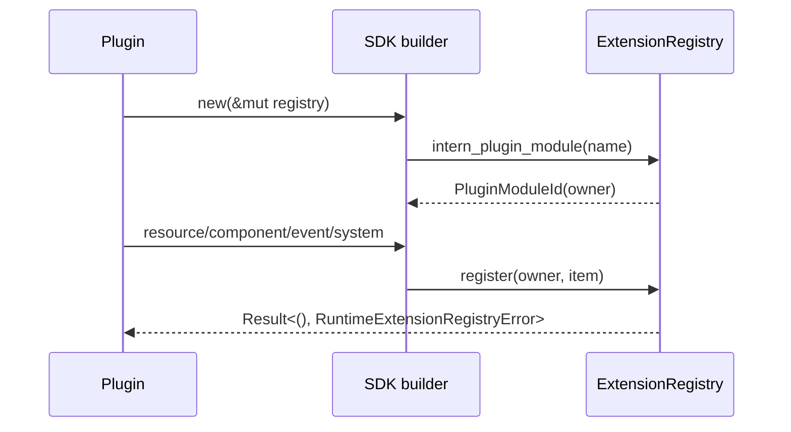

---
related_code:
  - zircon_plugins/plugin_sdk/src/registration.rs
  - zircon_runtime/src/plugin
  - zircon_runtime/src/core/framework/bridge
implementation_files:
  - zircon_plugins/plugin_sdk/src/registration.rs
plan_sources:
  - user: 2026-09-09 插件公开接口完整参考
tests:
  - zircon_plugins/plugin_sdk/src/registration.rs
  - zircon_runtime/src/plugin
doc_type: api-reference
title: 运行时注册、调度与桥接接口
status: source-audited
---

# 运行时注册、调度与桥接接口

`RuntimePluginRegistrationBuilder` 将注册操作集中到 `RuntimeExtensionRegistry`。先通过 `module(name)` 获得 `RuntimePluginModuleRegistration` 和 `PluginModuleId` owner，再添加系统、资源、组件、事件、选项或接口。owner 是撤销和诊断的最小单元。

## 基本流程



```rust
let mut module = zircon_plugin_sdk::RuntimePluginRegistrationBuilder::new(registry)
    .module("weather.runtime")?;
module.resource(WeatherState::default)?;
module.component(weather_component_descriptor())?;
module.event::<WeatherChanged>(event_manifest())?;
module.plugin_option(option_manifest())?;
module.plugin_event_catalog(catalog_manifest())?;
```

## Runtime scene system

`runtime_scene_system<S, F>(id, stage, factory)` 要求每个 scene-system 实例获得新鲜的 `FnMut(RuntimeSceneSystemContext<'_>) -> Result<(), CoreError>`。返回 builder 可继续设置：

|方法|语义|
|---|---|
|`in_set`|加入一个已 intern 的系统集合|
|`with_order`|同阶段内的整数排序键|
|`with_tick_policy`|覆盖 `SceneSystemTickPolicy::for_stage(stage)`|
|`before` / `after`|添加 `SystemOrderingConstraint`|
|`register`|解析 set、约束并提交到 registry|

```rust
module.runtime_scene_system("weather.tick", SystemStage::Update, || {
    |context| {
        let _delta = context.clock().delta_seconds();
        Ok::<_, zircon_runtime::core::CoreError>(())
    }
})
.in_set("weather.simulation")
.after(SystemRef::named("zircon.scene.world_transform"))
.with_order(20)
.register()?;
```

factory 必须是 `Send + Sync + 'static`，系统闭包是 `Send + 'static`。不要捕获 `Rc`, `RefCell` 或 editor-only 对象；需要共享状态时注册 `Resource` 并使用线程安全容器。

## 接口导出与导入

`PluginInterface` 要求静态 `INTERFACE_ID`。导出使用 `Arc<T>`，导入返回 `BridgeImport<T>`；导入失败为 `RuntimeExtensionRegistryError`。弱引用 `WeakBridge` 用于不阻止 owner 卸载的观察者。

```rust
trait WeatherQueries: Send + Sync {
    fn humidity(&self, entity: EntityId) -> f32;
}
impl zircon_runtime::core::framework::bridge::PluginInterface for dyn WeatherQueries {
    const INTERFACE_ID: &'static str = "weather.queries.v1";
}

module.export_interface::<dyn WeatherQueries>(Arc::new(WeatherQueriesImpl))?;
let weather = module.import_interface::<dyn WeatherQueries>()?;
```

接口 ID 是 ABI 合同的一部分。方法新增应使用新版本 ID 或显式兼容层；不要复用 ID 改变参数布局。

## owner 撤销

`owner_revocation_listener(callback)` 在 owner 资源被撤销时收到 `PluginModuleId`。回调只做无副作用的索引清理和日志；不要在回调中重新注册同一 owner。桥接调用方应处理 `BridgeError::Revoked`、`Unavailable` 和 `TypeMismatch` 等失败并降级。

## 常见错误

- 未先 `module()`：无法得到 owner，不能安全撤销。
- 重复 system ID、component ID 或 interface ID：registry 返回 duplicate 错误。
- `before/after` 引用不存在的 `SystemRef`：激活报告会包含 ordering resolution error。
- 在系统 callback 中 panic：linked 路径应转换为 `CoreError`；native 路径必须使用 `catch_native_callback_panic`。
- 保存 `BridgeImport` 跨卸载使用：先检测 weak handle 或处理 revoked error。

## 最佳实践

- 一个模块对应一组一致的 owner 生命周期，不要把不同家族的注册混在一个 owner。
- 系统 ID、set 和 anchor 使用同一命名空间。
- 对每个导出接口添加版本化 manifest 和负向测试。
- 测试中先卸载 owner，再验证 resource/system/interface 均不可见。

## 参考

- [registration.rs](https://github.com/He-Jiahui/ZirconEngine/blob/main/zircon_plugins/plugin_sdk/src/registration.rs)
- [bridge traits](https://github.com/He-Jiahui/ZirconEngine/tree/main/zircon_runtime/src/core/framework/bridge)
