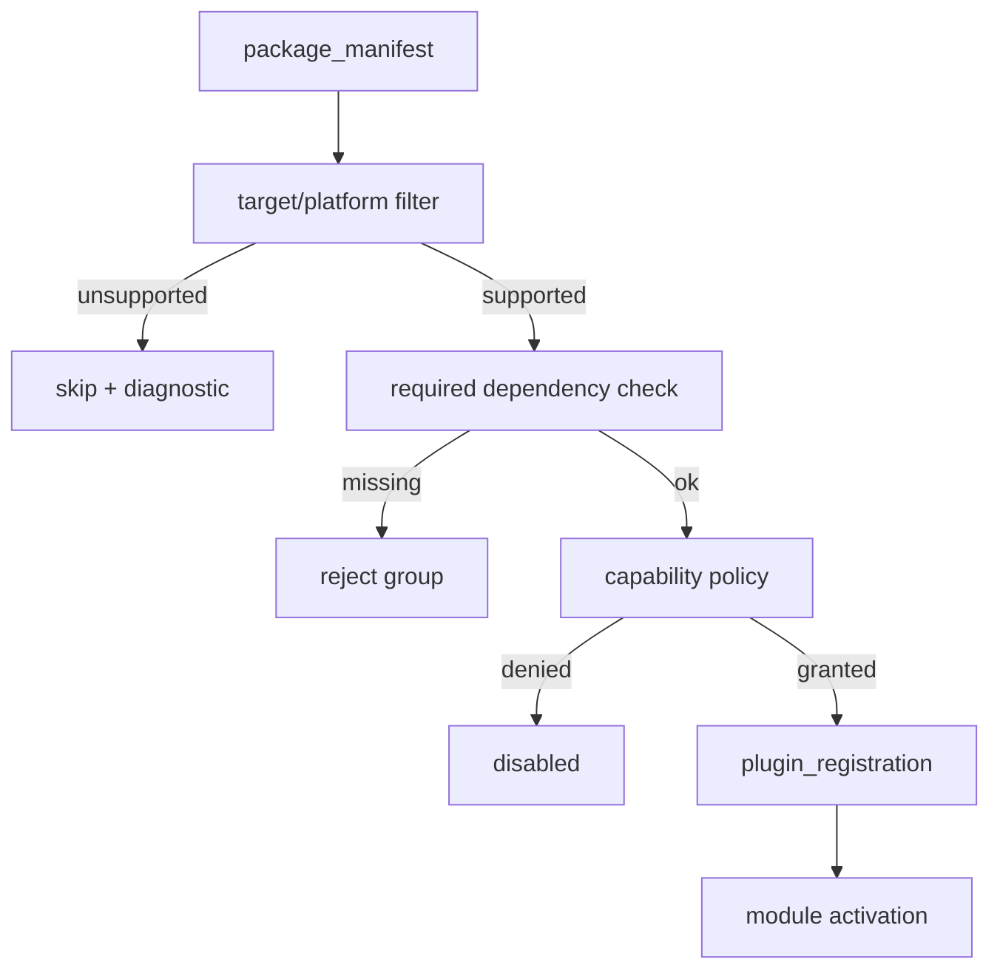

---
related_code:
  - zircon_plugins/plugin_sdk/src/runtime_exports.rs
  - zircon_plugins/plugin_sdk/src/prelude.rs
  - zircon_plugins/plugin_sdk/src/runtime.rs
implementation_files:
  - zircon_plugins/plugin_sdk/src/runtime_exports.rs
  - zircon_plugins/plugin_sdk/src/prelude.rs
plan_sources:
  - user: 2026-09-09 插件公开接口完整参考
tests:
  - zircon_plugins/plugin_sdk/src/runtime.rs
  - zircon_app/src/plugins/tests.rs
doc_type: api-reference
title: Runtime 导出宏与选择流程
status: source-audited
---

# Runtime 导出宏与选择流程

`runtime_exports.rs` 中的宏把 Rust plugin 类型投影成宿主可发现的函数：`runtime_plugin()`、`package_manifest()`、`runtime_selection()` 和 `plugin_registration()`。它们是 linked 入口，不是 native DLL 导出；native 请使用 `native_dist_*` 宏。

## 导出函数职责

|函数|返回值|调用时机|
|---|---|---|
|`runtime_plugin()`|插件实例|宿主创建 linked plugin 时|
|`package_manifest()`|`PluginPackageManifest`|catalog 构建、导出审计|
|`runtime_selection(...)`|target/platform 选择结果|启动前过滤|
|`plugin_registration()`|`RuntimePluginRegistrationReport`|扩展注册前|

宏生成的函数必须保持无副作用。宿主可以多次调用 `package_manifest()` 进行缓存和哈希；插件业务初始化应放入 module lifecycle，而不是 getter。

## 典型宏形状

```rust
zircon_plugin_sdk::runtime_plugin! {
    plugin: WeatherRuntimePlugin,
    declaration: WEATHER_DECLARATION,
    register: register_weather_extensions,
}
```

实际宏参数以 `runtime_exports.rs` 当前定义为准；该片段说明导出关系，若插件使用仓库已有导出宏，应直接复制同 crate 的调用形状。`prelude` 汇总 runtime plugin、descriptor、registry、bridge 和 scene ECS 常用类型，减少跨 crate 路径漂移。

## selection 规则

选择器将 package manifest 的 target、platform、成熟度、enabled/required 默认值和 capability status 组合为结果。常见结果包括 selected、disabled、unsupported target、missing capability、dependency conflict。unsupported 不应进入 activation 阶段。



## Registration report

`RuntimePluginRegistrationReport` 应记录 package ID、module descriptors、capabilities、provided interfaces、diagnostics 和 registration status。报告失败时宿主必须清理已创建的临时 registry 条目，再向 plugin group 返回错误。

## 错误恢复

- capability 缺失：若 capability optional，则构建降级 feature；required 则报告 missing。
- 模块 dependency 冲突：保留失败组的诊断，不能只加载部分模块。
- 注册 callback 返回错误：撤销该 owner 已写入的系统、资源和接口。
- 重复调用 registration：返回稳定报告或幂等复用，不得产生重复 system ID。

## 与 native 的边界

linked 入口可以使用 Rust trait、`Arc` 和 `Result`；native 入口只能通过 C ABI 报告 status 和 byte buffer。两条路径必须共享同一 package manifest 投影，避免“linked 成功、native 导出失败”。

## 最佳实践

1. 导出函数只做数据投影，业务注册集中在 `register_*_extensions`。
2. selection 结果写入启动日志，包含 target、platform 和 capability 决策。
3. 对 disabled 与 unsupported 区分用户提示：前者是策略，后者是制品缺失。
4. 在单测中连续调用 getter，断言不会重复注册或改变 manifest。

## 参考

- [runtime_exports.rs](https://github.com/He-Jiahui/ZirconEngine/blob/main/zircon_plugins/plugin_sdk/src/runtime_exports.rs)
- [prelude.rs](https://github.com/He-Jiahui/ZirconEngine/blob/main/zircon_plugins/plugin_sdk/src/prelude.rs)
- [runtime.rs](https://github.com/He-Jiahui/ZirconEngine/blob/main/zircon_plugins/plugin_sdk/src/runtime.rs)
