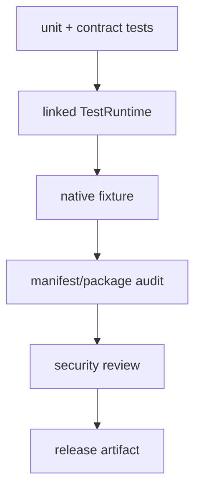

---
related_code:
  - zircon_plugins/plugin_sdk/src/test.rs
  - zircon_plugins/plugin_sdk/src/native.rs
  - zircon_plugins/native_dynamic_fixture
  - zircon_plugins/editor_contribution_fixture
implementation_files:
  - zircon_plugins/plugin_sdk/src/test.rs
  - zircon_plugins/plugin_sdk/src/native/tests.rs
plan_sources:
  - user: 2026-09-09 插件公开接口完整参考
tests:
  - zircon_plugins/plugin_sdk/src
  - zircon_app/src/plugins/tests.rs
  - zircon_plugins/native_dynamic_fixture
doc_type: best-practice
title: 插件测试、打包与安全验收
status: source-audited
---

# 插件测试、打包与安全验收

插件测试应覆盖声明投影、catalog 选择、linked 注册、native ABI、卸载和失败诊断。仅能编译 runtime crate 不足以证明插件可发布。

## TestRuntime

`TestRuntime::builder()` 返回 `TestRuntimeBuilder`。可配置 `with_fixed_timestep`、`without_fixed_timestep`、`with_max_fixed_steps`、`with_base_modules`、`without_base_modules`、`with_runtime_plugin(s)`、`with_registration_report`、`with_feature_registration_report`、`without_scene_runtime_extension_plan`、`without_base_module_activation`、`without_plugin_module_activation`，最后 `build() -> Result<TestRuntime, TestRuntimeError>`。

```rust
let test = zircon_plugin_sdk::TestRuntime::builder()
    .with_fixed_timestep(Duration::from_secs_f64(1.0 / 60.0))
    .with_runtime_plugin(&plugin)
    .build()?;
test.advance_time_by_seconds(1.0 / 60.0);
let manager: Arc<MyManager> = test.resolve_manager("weather.manager")?;
```

`extension_report()`、`activated_modules()`、`runtime()`、`handle()` 用于断言激活结果；`create_default_level` 和 `tick_level_seconds` 用于场景系统测试。时间推进应使用固定步长，避免测试依赖墙钟。

## 分层测试矩阵

|层|必须断言|
|---|---|
|声明|canonical ID、capability role 数量一致|
|manifest|module 名、target、packaging、compat|
|registry|owner 注册、重复 ID、撤销|
|运行时|system stage/order、resource 初始化、事件 schema|
|native|空 host、ABI mismatch、missing capability、panic status|
|分发|descriptor symbol、DLL 产物、manifest hash|
|回归|真实 fixture 加载、卸载后 bridge 不可用|

## Native fixture 验收

`native_dynamic_fixture` 用于验证 descriptor、entry report、command invoke、owned bytes 和 unload。每次 ABI 修改都应运行 fixture 与 SDK native tests；不要只测试 linked 路径，因为 Rust ABI 与 C ABI 的失败面不同。

## 打包检查

```text
cargo package --allow-dirty
检查: plugin.toml 与生成 manifest 一致
检查: cdylib 导出 zircon_native_plugin_descriptor_v3
检查: runtime_entry/editor_entry 符号存在且唯一
检查: engine_compat、targets、platforms 与制品匹配
检查: license、NOTICE、debug symbols 和 hash 已归档
```

`SourceTemplate` 适合源码交付，`LibraryEmbed` 适合宿主静态组合，`NativeDynamic` 适合独立 DLL。生产包不应包含 test fixture 或未审计 debug callback。

## 安全边界

- manifest 路径必须经过 canonicalization，禁止 `..` 越界和任意 DLL 加载。
- ABI 字符串和 byte slice 先验证 null、长度和 UTF-8，再解析 TOML。
- `max_output_bytes`、命令 slot、event schema 都要设上限。
- capability 授予基于签名、来源和 target，不以插件自报为准。
- callback 使用 `catch_native_callback_panic`；禁止 unwinding 穿过 extern "C"。
- owned buffer 只能由创建方提供的 `free` 释放，并校验 owner token。

## 失败注入清单

1. descriptor ABI 版本错误。
2. host table null、handle 为零或 capability 列表损坏。
3. manifest TOML 未知字段、重复 command、稀疏 slot。
4. callback 返回 ERROR/PANIC，宿主仍能清理 owner。
5. unload 期间并发 bridge 调用，调用方收到 Revoked 而非崩溃。

## 发布门禁



## 参考

- [test.rs](https://github.com/He-Jiahui/ZirconEngine/blob/main/zircon_plugins/plugin_sdk/src/test.rs)
- [native tests](https://github.com/He-Jiahui/ZirconEngine/blob/main/zircon_plugins/plugin_sdk/src/native/tests.rs)
- [native fixture](https://github.com/He-Jiahui/ZirconEngine/tree/main/zircon_plugins/native_dynamic_fixture)
