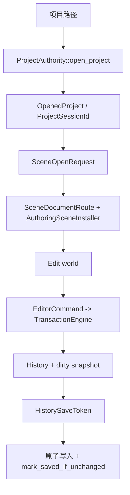

---
related_code:
  - zircon_editor/src/core/project/authority/open_project.rs
  - zircon_editor/src/core/project/scene_document.rs
  - zircon_editor/src/core/document/scene_route.rs
  - zircon_editor/src/ui/retained_host/run_config.rs
  - zircon_editor/src/ui/retained_host/app.rs
  - zircon_editor/src/core/editing/engine/transaction/scope.rs
  - zircon_editor/src/core/editing/engine/transaction/save_token.rs
  - zircon_editor/src/tests/editing/transaction_engine/history.rs
implementation_files:
  - zircon_editor/src/core/project/authority/open_project.rs
  - zircon_editor/src/core/project/scene_document.rs
  - zircon_editor/src/core/document/scene_route.rs
  - zircon_editor/src/ui/retained_host/run_config.rs
  - zircon_editor/src/core/editing/engine/transaction
plan_sources:
  - user: 2026-09-09 引擎用户场景配方：编辑器项目作者态会话
  - docs/wiki/editor/host-project-session.md
  - docs/wiki/editor/scene-authoring.md
tests:
  - zircon_editor/src/tests/editing/authoring_world.rs
  - zircon_editor/src/tests/editing/transaction_engine/history.rs
  - zircon_editor/src/tests/editing/node_ops/hierarchy.rs
  - zircon_editor/src/tests/host
doc_type: workflow-detail
---

# 开启编辑器项目并提交场景作者态修改

## 目标

从物理项目路径建立一次有身份的编辑器 session，打开 Scene 文档，通过命令/事务修改作者态世界，并在保存时防止并发编辑错误地清除 dirty 状态。

## 架构与数据流



## 前置条件

1. 项目根已存在且 manifest 可加载；`ProjectAuthority` 会执行 canonical path 验证与 preflight。
2. Scene URI 属于当前项目 catalog，且其父目录已存在。
3. 编辑器拥有 `CoreHandle` 与 `SharedEditorRuntimeGateway`；宿主配置由 `EditorHostRunConfig` 控制。
4. 若通过 `EditorGuiStartupRequest::Project` 启动项目，必须先由 App-preflight 提供 runtime build set；否则 `run_editor_with_config` 会拒绝该请求。

## 操作步骤

1. 调用 `ProjectAuthority::open_project(path)`，保存 `OpenedProject` 的 resolved identity；显示路径不作为身份键。
2. 用 `EditorHostRunConfig::new()` 配置启动布局、startup scene URI 或自动化首帧退出，再调用 `run_editor_with_config`。项目启动请求还要设置 `with_project_runtime_build_set`；已有 host 时不要自行构造第二个 `EditorManager`。
3. 将用户选择转换为 `SceneOpenRequest::new(scene_uri)`，通过项目/文档 route 打开 Scene；异步完成时重新验证 `ProjectSessionId` 与 activation identity。
4. 在 Hierarchy、Inspector 或 Viewport 中生成 typed `EditorIntent`/`EditCommand`，让 `EditorTransactionEngine` 在一个 scope 内应用多节点操作。禁止控件直接改裸 world。
5. 进入 Play 前让 `SelectionModel` 激活独立 Play domain；Play world 的成功修改默认不写回 Edit world。
6. 保存时先捕获 `HistorySaveToken`，序列化 authoring document，原子写入源文件；仅当 history 未变化时调用 `mark_saved_if_unchanged`。
7. 关闭项目时先处理 dirty/pending 编辑、结束 Play，再释放 endpoint、文档和 workspace。

### Rust 形状（入口 API；场景命令仍由编辑器内部路由生成）

```rust
use zircon_editor::{run_editor_with_config, EditorHostRunConfig};
use zircon_editor::core::project::ProjectAuthority;

fn launch(
    core: zircon_runtime::core::CoreHandle,
    gateway: zircon_editor::SharedEditorRuntimeGateway,
    project_root: &std::path::Path,
) -> Result<(), Box<dyn std::error::Error>> {
    let authority = ProjectAuthority::default();
    let _opened = authority.open_project(project_root)?;
    let config = EditorHostRunConfig::new()
        .with_startup_layout_preset("default")
        .with_exit_after_first_presented_frame(false);
    run_editor_with_config(core, gateway, config)?;
    Ok(())
}
```

代码只使用当前公开入口；具体 Scene route 和命令构造应通过 editor manager/operation registry 完成。

## 预期可观测性

- project preflight、Scene route、activation 和 close phase 都应产出带 session/activation identity 的日志。
- 事务提交返回 `TransactionId`；失败时世界与 selection 保持 before snapshot。
- history dirty 状态由 save token 与当前 history 比较决定；保存期间发生新编辑时 `mark_saved_if_unchanged` 必须拒绝清理。
- Play/Edit selection generation 与整体 revision 可用于发现跨域污染。

## 恢复路径

- 打开失败：根据 `ProjectAuthorityError` 修复 manifest、目录或迁移决策后重新 preflight。
- Scene 不存在或安装失败：不要覆盖当前文档，保留旧 activation，修复 catalog 后重试。
- 事务失败：显示命令错误并丢弃 batch；不要部分应用剩余操作。
- 保存 token 失效：保留 dirty 标记，重新捕获 token 并再次原子保存。
- 崩溃或关闭中断：使用 durable journal/autosave recovery 恢复作者态，再由用户确认写回源资产。

## 生产检查清单

- [ ] 项目、session、document、activation identity 在异步回调中逐层验证。
- [ ] 所有场景修改都经过 command/transaction，而非面板直接写 world。
- [ ] Play world 与 Edit world 使用独立 selection/domain。
- [ ] 保存采用 token + 原子写入 + unchanged 检查。
- [ ] 关闭顺序包含 dirty、Play、endpoint、document、workspace。
