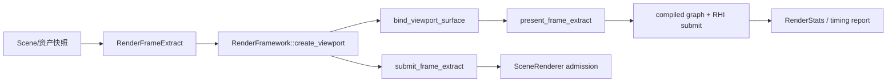

---
related_code:
  - zircon_runtime/src/core/framework/render/framework.rs
  - zircon_runtime/src/core/framework/render/frame_extract/frame.rs
  - zircon_runtime/src/graphics/scene/scene_renderer/mod.rs
  - zircon_runtime/src/graphics/tests/render_product_submit.rs
  - zircon_runtime/src/graphics/tests/render_product_sprite.rs
implementation_files:
  - zircon_runtime/src/core/framework/render/framework.rs
  - zircon_runtime/src/core/framework/render/frame_extract/frame.rs
  - zircon_runtime/src/graphics/scene/scene_renderer/core
plan_sources:
  - user: 2026-09-09 引擎用户场景配方：提交并呈现一个可渲染场景
  - docs/wiki/graphics/scene-renderer.md
tests:
  - zircon_runtime/src/graphics/tests/render_product_submit.rs
  - zircon_runtime/src/graphics/tests/render_product_submit/profiles.rs
  - zircon_runtime/src/graphics/tests/render_product_sprite.rs
doc_type: workflow-detail
---

# 提交并呈现一个可渲染场景帧

## 目标

把已经生成的 `RenderFrameExtract` 交给一个 viewport：离屏工具使用 `submit_frame_extract`，桌面窗口使用 `bind_viewport_surface` 后再调用 `present_frame_extract`。配方关注调用顺序、帧代际和失败可观测性，不把 `SceneRenderer` 的 crate-private 实现当作应用 API。

## 架构与数据流



## 前置条件

1. `zircon_runtime` 已启用图形 feature，并有一个实现 `RenderFramework` 的实例（通常由运行时服务解析；独立测试可使用 WGPU 实例）。
2. 已有有效的 `RenderViewportDescriptor`，以及由场景生产器生成的 `RenderFrameExtract`。`RenderFrameExtract::from_snapshot` 适合预览、回环和合成测试；它不能恢复 sprites、particles 等高级 sideband。
3. 若要呈现到窗口，准备匹配后端的 `RenderViewportSurfaceDescriptor`；若后端不支持 surface，接口会返回 `UnsupportedCapability`。

## 操作步骤

1. 创建 viewport 并保存 `RenderViewportHandle`。句柄销毁后不可复用。
2. 生成本帧的场景 payload、view 和 timing，组装 `RenderFrameExtract`。同一场景被多个视图使用时可通过 `from_shared_scene` 共享 `Arc` payload。
3. 离屏路径调用 `submit_frame_extract(viewport, extract)`；它接受帧并不等于 GPU 已完成。
4. 窗口路径先调用 `bind_viewport_surface(viewport, descriptor)`，然后每帧调用 `present_frame_extract(viewport, extract)`。需要 UI 时使用带 `_with_ui` 的对应方法。
5. 每个循环 tick 调用实现提供的非阻塞 poll；只有明确的 capture/wait API 才应等待。需要诊断时读取 `query_stats` 或 startup/timing report。
6. 关闭窗口或视图时调用 `destroy_viewport`，并在 surface 生命周期结束时 `unbind_viewport_surface`。

### Rust 形状（示意，类型值需由你的场景生产器提供）

```rust
use zircon_runtime::core::framework::render::{RenderFrameExtract, RenderFramework};

fn render_one_frame(
    framework: &dyn RenderFramework,
    viewport: zircon_runtime::core::framework::render::RenderViewportHandle,
    extract: RenderFrameExtract,
) -> Result<(), zircon_runtime::core::framework::render::RenderFrameworkError> {
    framework.submit_frame_extract(viewport, extract)
}
```

上例只展示稳定 trait 调用；不要从 `graphics::scene::scene_renderer` 直接构造内部录制上下文。测试中的 `RenderFrameExtract::from_snapshot(RenderWorldSnapshotHandle::new(...), snapshot)` 可作为合成 fixture 的参考。

## 预期可观测性

- viewport 创建、提交、呈现失败都返回 `RenderFrameworkError`，包括句柄无效、管线错误和能力不支持。
- `query_stats` 反映 renderer 状态快照；它不是 completion fence。
- `SceneRendererFrameTimingReport`、GPU timing report 和 startup report 可用于区分 admission、资源准备、图执行和提交阶段。
- 连续帧应保持递增的 `RenderFrameTiming::outer_frame_index`；异常 delta 会被归一化为非负有限值。

## 恢复路径

- `UnsupportedCapability`：回退到离屏 `submit_frame_extract`，或选择支持 surface 的后端；不要假设默认 trait 方法一定能 present。
- 提交前失败：修复 extract、资源或管线后重试同一 viewport。
- 提交后错误若带 receipt/提交上下文，先按报告处理已入队工作，再决定是否重建 viewport；不要把已提交帧当作未发生。
- viewport 句柄失效：销毁旧句柄并重新 `create_viewport`，不要缓存内部 renderer 指针。

## 生产检查清单

- [ ] 所有窗口 surface 都经过显式 bind/unbind。
- [ ] 离屏和窗口路径分别处理 `submit` 与 `present` 的错误。
- [ ] 没有把 `query_stats` 当作 GPU 完成信号。
- [ ] 自定义管线 revision 在资产变更时递增，并检查编译报告。
- [ ] 退出时销毁 viewport，且不跨设备/代际复用句柄。
