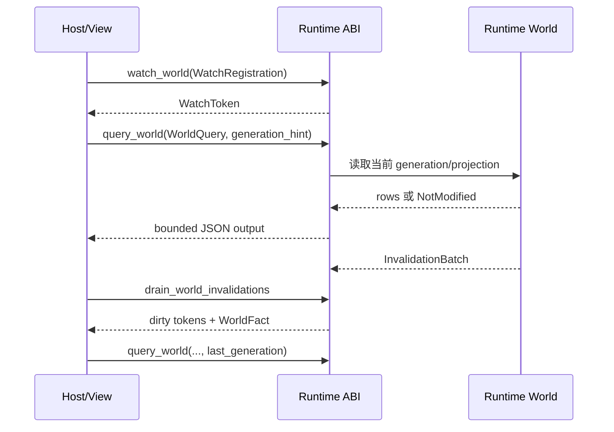

---
related_code:
  - zircon_runtime_interface/src/world_sync/query.rs
  - zircon_runtime_interface/src/world_sync/watch.rs
  - zircon_runtime_interface/src/world_sync/invalidation.rs
  - zircon_runtime/src/dynamic_api/session/world_sync.rs
  - zircon_runtime/src/dynamic_api/session/ffi.rs
  - zircon_runtime_interface/src/tests/world_sync_contracts.rs
implementation_files:
  - zircon_runtime_interface/src/world_sync/query.rs
  - zircon_runtime_interface/src/world_sync/watch.rs
  - zircon_runtime_interface/src/world_sync/invalidation.rs
  - zircon_runtime/src/dynamic_api/session/world_sync.rs
plan_sources:
  - user: 2026-09-09 引擎用户场景配方：宿主世界查询与增量同步
  - docs/wiki/app-runtime-api/world-sync.md
tests:
  - zircon_runtime_interface/src/tests/world_sync_contracts.rs
  - zircon_runtime/src/dynamic_api/tests/session_entry_points.rs
doc_type: workflow-detail
---

# 宿主中实现世界查询与增量同步

## 目标

让编辑器面板、远程工具或运行时宿主读取 runtime-owned world，并仅在收到失效批次时增量刷新。协议传输的是 DTO、generation 和 opaque token；它不是共享 ECS 借用，也不授予写权限。

## 架构与数据流



## 前置条件

1. 宿主持有有效 runtime session/foreign output 状态，能够按 ABI 规则释放返回 allocation。
2. 视图为每个 watch 保存自己的 `WatchToken`；runtime 永远不保存 editor view id。
3. 宿主能处理 `NotModified`、`EntityMissing`、预算错误和输出 fuse。

## 操作步骤

1. 为 Hierarchy、组件面板或单资源创建 `WatchRegistration::new(WatchKey::...)`，调用 `watch_world` 并保存非零 token。
2. 首次刷新发送 `WorldQuery::hierarchy(None)`、`WorldQuery::Components(...)` 或 `WorldQuery::inspection_fields(entity, None)`。组件查询通过 `QueryFilter` 与 `ComponentSelector` 指定反射字段。
3. 缓存响应 generation；再次查询时把它作为 `generation_hint`。相同 generation（且不是 `u64::MAX`）会得到 `WorldQueryResult::NotModified`，无需替换行数据。
4. 每帧或 wake 后调用 `drain_world_invalidations`，按 `WORLD_INVALIDATION_OUTPUT_BUDGET` 解码页面，并将 dirty token 映射到本地 projection。
5. 对受影响的 token 重新发起精确 query；收到 `EntityMissing` 时移除 selection/行，而不是继续读取旧实体。
6. view 销毁时逐个调用 `unwatch_world`。不要复用旧 token，也不要把 `serializable`/`writable` 字段当作自动写授权。

### Rust DTO 形状（可直接序列化；ABI 包装按宿主实现）

```rust
use zircon_runtime_interface::{
    ComponentSelector, ComponentWorldQuery, QueryFilter, WatchKey, WatchRegistration, WorldQuery,
};

fn requests(last_generation: Option<u64>) -> (WorldQuery, WatchRegistration) {
    let query = WorldQuery::Components(ComponentWorldQuery {
        filter: QueryFilter {
            with: vec!["zircon.transform.Transform".into()],
            without: vec!["gameplay.Disabled".into()],
        },
        select: vec![ComponentSelector::new("zircon.transform.Transform")],
        generation_hint: last_generation,
    });
    let watch = WatchRegistration::new(WatchKey::WorldStructure);
    (query, watch)
}
```

该片段只构造 transport DTO；调用 `query_world`/`watch_world` 时必须遵守动态 ABI 的 bounded JSON、allocation 保留与释放约定。

## 预期可观测性

- 每个 token、query generation 和 world replacement epoch 都写入 view 诊断上下文。
- `NotModified` 表示缓存仍然有效；`EntityMissing` 表示实体已不存在，应同步清理本地状态。
- invalidation batch 的 generation、dirty token 和 `WorldFact` 应保留顺序信息；非规范 token 顺序只能用于诊断，不应驱动依赖有序唯一性的快路径。
- `InvalidArgument`、`LimitExceeded`、foreign-output fuse 应计数并关联请求大小/耗时。

## 恢复路径

- token 无效或已撤销：重新注册 watch，再以当前 generation 做完整 query。
- 收到 gap 或 world replacement：丢弃局部 projection，重新查询 Hierarchy/Components，并更新 `world_replacement_epoch`。
- `NotModified` 但本地缓存缺失：将 hint 置为 `None` 强制拉取完整结果。
- 超过 1 MiB/16,384 items/25 ms：缩小过滤器与选择字段，分批查询；不要循环重试同一超限请求。
- 输出解码失败或 fuse 触发：释放 in-flight allocation，重建 foreign output 状态后再发起新请求。

## 生产检查清单

- [ ] 每个 view 独立保存并撤销所有 `WatchToken`。
- [ ] 所有可重复查询都携带并验证 generation hint。
- [ ] 处理 `NotModified`、`EntityMissing`、gap、world replacement 和 fuse。
- [ ] 遵守 query/watch/output 的字节、item、嵌套深度与处理时间预算。
- [ ] 写操作走事务化 operation/command 通道，不通过 world-sync DTO 伪造写入。
