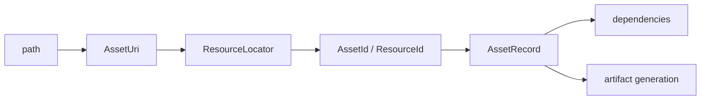

---
related_code:
  - zircon_runtime/src/asset/mod.rs
  - zircon_runtime/src/core/resource/mod.rs
  - zircon_runtime/src/asset/project/import_receipt.rs
  - zircon_runtime_interface/src/project
implementation_files:
  - zircon_runtime/src/asset/mod.rs
  - zircon_runtime/src/core/resource/mod.rs
plan_sources:
  - user: 2026-09-09 AssetUri、UUID、元数据与依赖公开接口详解
tests:
  - zircon_runtime/src/asset/tests
  - zircon_runtime/src/asset/project/manifest/save/borrowed_serialization_tests.rs
doc_type: module-detail
---

# AssetUri、UUID、元数据与依赖

Zircon 的资产身份分成三层：可读的 `AssetUri`、稳定的 `AssetId/ResourceId`、跨库持久化的 `AssetUuid`。URI 用于源码定位，ID 用于当前 registry 查询，UUID 用于重建后保持引用。



## URI 规范

`AssetUri` 应通过构造/解析 API 生成，并保持 scheme、规范相对路径和可选 sub-asset 标签。`ProjectManager::project_uri_for_source_path`、`source_path_for_uri` 是项目环境下的权威转换入口。

```rust
let uri = project.project_uri_for_source_path(Path::new("assets/hero.glb"))?;
let path = project.source_path_for_uri(&uri)?;
assert!(path.ends_with("hero.glb"));
```

不要把 artifact 路径、绝对 OS 路径或临时 cache 名称写入场景组件；这些在重新导入后会变化。

## UUID 与 ResourceId

`AssetUuid`/`AssetId` 通过 `core::resource` 重导出。`STABLE_UUID_ALGORITHM_VERSION` 记录稳定 UUID 算法版本；升级算法必须配套迁移而不能静默重算。`ResourceLocator` 封装 scheme、URI 和 UUID 解析错误，调用方应保留错误上下文。

| 身份 | 生命周期 | 适用场景 |
| --- | --- | --- |
| URI | 项目源码布局生命周期 | 编辑器、日志、导入器输入 |
| ResourceId | 当前 registry generation | 快速运行时查找 |
| AssetUuid | 跨 generation/机器 | 持久引用、网络同步、存档 |

## 元数据与 meta sidecar

每个可导入源可有 `.meta` sidecar，包含 importer id/version、设置、UUID、依赖声明和用户标签。`ProjectManager` 的 load-or-create-meta 逻辑会先匹配稳定身份，再生成缺失 meta；手工复制源文件时应同步处理 meta，避免 UUID 碰撞。

## 依赖图

依赖边由 importer 输出的 `AssetReference` 产生。直接依赖缺失会使资源处于 failed/not-ready；递归依赖状态可通过 ProjectAssetManager 的 dependency load-state API 读取。循环依赖应在导入阶段报告，而不是等运行时死锁。

## 引用修复

当 URI 移动、大小写变化或旧 UUID 找不到时，ProjectManager 会产生 `ReferenceRepair` 与 diagnostics。修复优先级应是 UUID -> 同目录规范 URI -> 用户确认，禁止按文件名静默替换同名资产。

## 版本控制建议

1. 提交源文件与 `.meta`，忽略可重建 artifact。
2. 将 UUID 冲突作为 CI 错误。
3. 导入器版本变化时增加 migration 或明确重导入。
4. 依赖声明排序稳定，减少无意义 diff。

## 负面案例

- 直接拼接 URI 导致 `..` 越界。
- 将 ResourceId 写入存档，重启后无法解析。
- 删除 meta 后重新生成，旧场景引用漂移。
- 依赖图只记录直接边，递归 readiness 误判为 ready。

## 检查清单

- [ ] 持久层只写 URI/UUID，不写临时 ResourceId。
- [ ] URI 由 ProjectPaths 规范化生成。
- [ ] `.meta` 与源文件原子提交。
- [ ] UUID 算法版本固定并可迁移。
- [ ] 依赖闭包和循环错误可观测。

## 源码与测试

- [Asset 模块](https://github.com/He-Jiahui/ZirconEngine/blob/main/zircon_runtime/src/asset/mod.rs)
- [Resource facade](https://github.com/He-Jiahui/ZirconEngine/blob/main/zircon_runtime/src/core/resource/mod.rs)
- [导入 receipt](https://github.com/He-Jiahui/ZirconEngine/blob/main/zircon_runtime/src/asset/project/import_receipt.rs)

## URI 字段语义

| 部分 | 说明 | 禁止事项 |
| --- | --- | --- |
| scheme | `project`/package 等资源域 | 不用 OS drive letter |
| path | 规范相对路径 | 不含 `..`、反斜杠 |
| sub-asset | glTF/material 等子资源键 | 不用临时数组下标 |
| UUID | 稳定源身份 | 不从文件名猜测 |

## 两个实践片段

```rust
let uri = AssetUri::parse("project://assets/hero.glb#mesh:Body")?;
let locator = ResourceLocator::from_uri(uri.clone())?;
tracing::debug!(scheme = ?locator.scheme(), "resolved asset locator");
```

```rust
let id = project.resolve_asset_id(&uri).ok_or(AssetImportError::Missing)?;
let stable = project.registry().record(id).map(|r| r.uuid);
```

## 身份状态机

```text
PathOnly -> MetaCreated(UUID minted) -> Registered(ResourceId)
Registered -> Imported(artifact identity)
Imported -> Moved(URI repair) -> Rebound(same UUID)
Registered -> Deleted -> Tombstone/diagnostic
```

移动文件时保持 UUID，删除并重新创建同名文件时必须生成新 UUID。引用修复器应输出候选和置信度，交由编辑器确认。

## 依赖状态

直接引用存在不代表 ready；递归闭包中任一节点 Failed/Loading 都会降低 consumer readiness。循环边应在构图阶段标记，并显示完整 URI 链。

## 测试矩阵

- URI parse/format、scheme 和 subasset。
- Windows/Unix 路径规范化与越界。
- UUID 算法版本固定性。
- meta 删除、复制、移动、冲突修复。
- 直接/递归/循环依赖诊断。

## API 边界

`AssetUri` 面向项目/插件 API，`ResourceLocator` 面向 registry，`ResourceId` 面向当前进程。边界转换应集中在 project/resource facade，避免每个调用方自行 parse。日志同时输出 URI 和 UUID，便于用户定位与机器关联。

## 缓存键

导入缓存键至少包括 source content hash、meta canonical bytes、importer id/version、recipe canonical bytes、engine build identity 和 dependency closure hash。仅使用 URI 会把旧 artifact 错误复用到新源文件。

## 引用案例

```rust
#[derive(Serialize, Deserialize)]
struct MaterialRef { shader: AssetUri, texture: AssetUuid }

fn resolve_material(project: &ProjectManager, reference: &MaterialRef) -> AssetResult<AssetId> {
    project.resolve_asset_id(&reference.shader)
        .ok_or(AssetImportError::Missing)
}
```

```rust
let locator = ResourceLocator::parse("project://assets/hero.glb#mesh:Body")?;
match locator.resolve(&registry) {
    Ok(record) => tracing::debug!(id = ?record.id, "resolved stable locator"),
    Err(error) => tracing::warn!(?error, "repair required"),
}
```

## 删除与墓碑

删除源文件后 registry 可保留 tombstone/diagnostic 一段时间，以便编辑器显示引用断裂。重新创建同名文件不能复用旧 UUID；用户确认 rebind 后才更新持久引用。

## 接受标准

- URI、UUID、ResourceId 的用途不混淆。
- 移动保留 UUID，删除重建生成新 UUID。
- cache key 包含 source/recipe/importer/dependency 版本。
- 引用修复不会按文件名静默替换。

## 发布前审计

发布构建前遍历所有 ResourceRecord，验证 URI scheme、UUID 唯一性、artifact hash、importer version 和依赖闭包。发现 dangling reference 时构建失败；不得用 placeholder 绕过持久层校验。

## API 调用顺序

`parse -> normalize -> resolve -> validate kind -> acquire -> release`。每一步都保留上一步的 diagnostic context，避免最终错误只剩 `Missing`。

## 审计测试

- 相同输入在两次 generation 中 UUID 不变。
- 不同输入即使同名也 UUID 不同。
- URI 大小写规范化结果跨平台一致。
- 依赖循环能输出完整路径。
