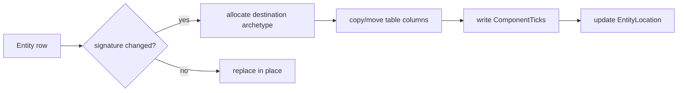

---
related_code:
  - zircon_runtime/src/scene/ecs/component/registry.rs
  - zircon_runtime/src/scene/ecs/storage/component_storage/mod.rs
  - zircon_runtime/src/scene/ecs/change_detection/mod.rs
  - zircon_runtime/src/scene/world/typed_api.rs
implementation_files:
  - zircon_runtime/src/scene/ecs/component/registry.rs
  - zircon_runtime/src/scene/ecs/storage/component_storage/mod.rs
plan_sources:
  - user: 2026-09-09 ECS 组件公开接口详解
tests:
  - zircon_runtime/src/scene/ecs/storage/component_storage/sparse/tests.rs
  - zircon_runtime/src/scene/world/typed_api/component_mutation_effects.rs
doc_type: module-detail
---

# 组件注册、存储与变更跟踪

Zircon ECS 将组件描述、archetype table、sparse set 和变更 tick 分开管理。组件注册决定 `ComponentId` 与 `StorageType`；组件存储决定访问布局；变更系统决定系统是否需要再次处理数据。

## 注册模型

`ComponentRegistry::component_id<T>()` 依据 `TypeId` 去重，并保存 `ComponentDescriptor { id, type_name, storage_type, source }`。`dynamic_component_id(type_id)` 为插件组件创建 sparse-set 描述；动态组件不会伪装成 Rust `TypeId`。

```rust
let transform_id = world.component_id::<LocalTransform>();
// 动态组件注册由 World 的动态组件 facade 完成；示意 type id 如下。
let script_type_id = "my.plugin.Health";
assert!(world.contains_component_id(entity, transform_id));
```

公开 `World` 查询接口：`component_id<T>`、`registered_component_id<T>`、`registered_dynamic_component_id`、`component_count_for_id`、`contains_component_id`、`contains_component<T>`。

| 存储 | 适合 | 代价 |
| --- | --- | --- |
| `StorageType::Table` | 高频、固定布局、批量查询组件 | 增删组件会触发 archetype row 迁移 |
| `StorageType::SparseSet` | 可选、动态插件、低密度组件 | 单组件索引访问更好，组合查询可能需要额外过滤 |

## Archetype 迁移



相同组件替换只更新 column value 和 tick；新增/删除组件会改变签名并更新 `EntityLocation`。因此批量 bundle 插入优于逐个 insert。`Bundle`/`BundleStaging` 用于预先计算组件集合，减少中间 archetype。

## 类型化访问

```rust
if let Some(name) = world.get::<Name>(entity) {
    println!("{}", name.as_str());
}
if let Some(transform) = world.get_mut::<LocalTransform>(entity) {
    transform.set_translation(Vec3::new(0.0, 1.0, 0.0));
}
```

`get_mut` 借用结束前不能再次借用同一 World 的结构；将引用转换为 `Mut<T>` 时会在可变解引用发生时标记 changed。`Ref<T>`/`Mut<T>` 的 `last_changed` 返回实际写入 tick。

## 动态组件

动态组件通过字符串 type id 和 JSON/反射字段表示，存储类型固定为 sparse set。调用方应先确保插件 schema 已注册，再写入字段；schema generation 改变后，编辑器/脚本缓存需要失效。

```rust
let id = world.registered_dynamic_component_id("game.Health");
if let Some(id) = id {
    assert_eq!(world.component_count_for_id(id), 0);
}
```

禁止使用 type name 猜测 Rust 组件 ID。Rust 类型应走 `component_id::<T>()`，动态类型应走显式字符串注册。

## ChangeTick 语义

`ChangeTickWindow::new(last_run, this_run)` 定义系统观察窗口。`ComponentTicks::is_added` 只在组件首次插入落入窗口时为真，`is_changed` 同时覆盖替换与显式 `set_changed`。tick 使用饱和/回绕安全比较，长时间运行系统不要自行比较裸 `u64`。

```rust
let before = world.last_change_tick();
// run systems...
let after = world.read_change_tick();
let window = ChangeTickWindow::new(before, after);
```

资源有独立的 `resource_change_ticks<T>`；移除组件由 `RemovedComponentEvents` 和 retention policy 管理，可通过 `configure_removed_component_retention<T>` 调整保留窗口。

## 观察者与生命周期事件

插入/移除可以产生 `ComponentLifecycleEvent`，观察者注册在 `ObserverStore`；高频事件应使用批量读取与 cursor，避免每个实体触发同步日志。移除事件 retention 太大将增加内存，太小则无法支持延迟消费。

## 失败案例

- `StorageError::ComponentTypeMismatch`：注册描述与实际 Rust 类型不一致。
- `SceneError::missing_entity`：实体已销毁或来自另一 World。
- sparse set 与 table 同时出现同一组件 ID：说明注册表被破坏，应立即停止写入。
- 组件 schema generation 落后：反射写入可能被拒绝，先重建动态组件描述。

## 最佳实践

1. 在启动阶段集中注册静态组件；运行时仅注册确实需要的动态插件类型。
2. 为查询所需组件建立稳定的 bundle，减少 archetype 数量。
3. 对写热点使用 table，对稀疏可选数据使用 sparse set。
4. 用 `Ref` 检测而不是无条件 clone 组件。
5. 每帧清理 tracker 前先让所有消费系统完成。
6. 对 removed-component retention 设置上限并采集 metrics。

## 验证清单

- [ ] `ComponentDescriptor` 的 source 与类型来源一致。
- [ ] table column layout 已为静态组件生成。
- [ ] 动态组件字符串 ID 全局唯一且带插件命名空间。
- [ ] 变更窗口与系统 last-run tick 对齐。
- [ ] 结构修改不发生在活跃 query borrow 内。

## 源码与测试

- [ComponentRegistry](https://github.com/He-Jiahui/ZirconEngine/blob/main/zircon_runtime/src/scene/ecs/component/registry.rs)
- [typed API](https://github.com/He-Jiahui/ZirconEngine/blob/main/zircon_runtime/src/scene/world/typed_api.rs)
- [change detection](https://github.com/He-Jiahui/ZirconEngine/blob/main/zircon_runtime/src/scene/ecs/change_detection/mod.rs)
- [sparse storage tests](https://github.com/He-Jiahui/ZirconEngine/blob/main/zircon_runtime/src/scene/ecs/storage/component_storage/sparse/tests.rs)

## 描述字段

`ComponentDescriptor` 的 `id` 是本 World 连续索引；`type_name` 用于诊断和动态反射；`storage_type` 决定 table/sparse；`source` 区分 `RustType { type_id }` 与 `DynamicPlugin { component_type_id }`。描述一旦分配不可重排，旧快照只可在相同 schema 或迁移器下恢复。

## API 级流程

```text
component_id<T>()
  -> TypeId lookup
  -> descriptor allocation (first call only)
  -> table layout registration (table only)
registered_component_id<T>()
  -> read-only lookup, None when absent
insert/remove
  -> validate entity + storage
  -> mutate row/sparse slot
  -> bump ComponentTicks
  -> rebuild archetype location when signature changes
```

## 第二个调用片段

```rust
fn ensure_mesh(world: &mut World, entity: EntityId, mesh: MeshRenderer) -> SceneResult<()> {
    let old = world.insert(entity, mesh)?;
    if old.is_some() {
        tracing::debug!(?entity, "mesh renderer replaced");
    }
    Ok(())
}
```

```rust
fn inspect_changes(world: &World, entity: EntityId) {
    if world.is_component_added::<LocalTransform>(entity) {
        tracing::trace!(?entity, "transform added");
    }
    if world.is_component_changed::<LocalTransform>(entity) {
        tracing::trace!(?entity, "transform changed");
    }
}
```

## 动态 schema 状态机

```text
Unknown type id
  -> dynamic_component_id(type_id)
  -> Registered sparse descriptor
  -> Inserted per-entity value
  -> Changed generation on mutation
  -> Removed / schema invalidated
```

动态 schema generation 变化后，反射系统必须重新生成 property descriptors；旧 `ComponentId` 可用于诊断但不得假设字段布局仍相同。

## 失败分类

| 阶段 | 典型错误 | 建议动作 |
| --- | --- | --- |
| 注册 | duplicate type/source mismatch | 停止插件注册，打印 descriptor |
| 插入 | missing entity / invalid hierarchy | 丢弃命令并保留 report |
| 迁移 | ComponentTypeMismatch | 视为内部一致性故障，禁止继续写 |
| 查询 | stale cached plan | 比较 registry generation 后重建 |
| 移除 | retention exhausted | 重新建立观察者基线 |

## 诊断字段

`ChangeDetectionScanStats` 记录 added/changed 扫描；`ComponentTicks.changed()` 记录最后写入 tick；`RemovedComponentRetentionMetrics` 记录保留量。生产监控至少导出 registry generation、archetype 数、每帧迁移数和 removed queue 长度。

## 测试矩阵

- Rust TypeId 去重与 descriptor source。
- table row 迁移保留其他组件。
- sparse set 插入/删除和空洞回收。
- `Mut::as_mut`、DerefMut、`set_changed` 的 tick 语义。
- changed window 跨 tick 回绕。
- dynamic component generation 与 schema 重建。

## 兼容性与迁移

组件 `type_name` 变化会影响动态序列化和调试工具；若只是 Rust module 重命名，应提供 schema alias/migrator，而不是重新注册一个新业务类型。table column layout 变化需要重新构建 archetype projection，不能在旧 column 上强转。

## 性能诊断

每帧记录 component count、archetype 数、迁移次数、sparse slot 数、added/changed 扫描量。若单个 bundle 造成大量 archetype，可合并可选字段为 sparse 组件，或固定 bundle 组合。

## 组件设计案例

```rust
#[derive(Component)]
struct Health { current: f32, max: f32 }

fn damage(world: &mut World, entity: EntityId, amount: f32) -> SceneResult<()> {
    let mut health = world
        .get_mut::<Health>(entity)
        .ok_or_else(|| SceneError::missing_component("damage", entity))?;
    health.current = (health.current - amount).max(0.0);
    health.set_changed();
    Ok(())
}
```

```rust
fn count_dynamic(world: &World, type_id: &str) -> usize {
    let Some(id) = world.registered_dynamic_component_id(type_id) else { return 0; };
    world.component_count_for_id(id)
}
```

## 注册和运行时顺序

1. 插件声明 type id、storage 和反射字段。
2. Scene module 启动时注册 ComponentDescriptor。
3. 查询缓存读取 registry generation。
4. 动态场景 decode 根据 type id 查找 descriptor。
5. World mutation 写入 storage 并推进 tick。
6. 观察者/inspection 收到生命周期事实。

顺序反转会导致“动态字段存在但组件 ID 未注册”的错误；不要以第一次场景加载作为隐式 schema 注册时机。

## 存储选择案例

| 组件 | 推荐存储 | 理由 |
| --- | --- | --- |
| `LocalTransform` | Table | 每个可渲染节点都有，查询密集 |
| `Name` | Table | 层级/编辑器经常组合查询 |
| `ScriptState` | SparseSet | 只有部分实体有脚本 |
| plugin metadata | SparseSet | 动态 schema、密度不确定 |
| removed event | Event store | 生命周期消费者异步读取 |

## 变更窗口案例

系统 A 在 tick 100 运行，系统 B 在 tick 102 运行；B 应用 `ChangeTickWindow::new(A_last_run, B_this_run)`，不能直接拿 `changed == 102` 判断。tick 回绕时使用 `ChangeTick::is_newer_than` 逻辑，禁止裸减法。

## 接受标准

- descriptor source、storage、TypeId 一致。
- table/sparse 迁移不丢失其他组件。
- `Mut` 只在真正写入时记录 changed。
- 动态 schema generation 变化使旧反射缓存失效。
- removed retention 达到上限后有 metrics 与明确丢弃语义。
