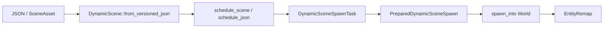

---
related_code:
  - zircon_runtime/src/scene/dynamic_scene/document/read.rs
  - zircon_runtime/src/scene/dynamic_scene/document/write.rs
  - zircon_runtime/src/scene/dynamic_scene/spawn_task/loader.rs
  - zircon_runtime/src/scene/dynamic_scene/spawn_task/prepared.rs
  - zircon_runtime/src/scene/dynamic_scene/scene_asset/dynamic_scene.rs
  - zircon_runtime/src/scene/dynamic_scene/session/slot/capture.rs
  - zircon_runtime/src/scene/dynamic_scene/session/slot/restore.rs
implementation_files:
  - zircon_runtime/src/scene/dynamic_scene/document
  - zircon_runtime/src/scene/dynamic_scene/spawn_task
plan_sources:
  - user: 2026-09-09 动态场景快照与实例化接口详解
tests:
  - zircon_runtime/src/scene/tests/dynamic_scene_session
  - zircon_runtime/src/scene/tests/component_structure/project_serialization.rs
doc_type: module-detail
---

# 动态场景、快照与实例化

动态场景是可序列化的实体/组件/资源描述，不绑定目标 World 的实体 ID。加载器把 JSON、`SceneAsset` 或内存 `DynamicScene` 变成 `PreparedDynamicSceneSpawn`，随后通过实体重映射安全地写入目标 World。



## 读写版本化文档

```rust
let json = dynamic_scene.to_versioned_json_pretty()?;
let decoded = DynamicScene::from_versioned_json(&json)?;
```

`to_versioned_json_pretty` 输出带版本字段的稳定 JSON；`from_versioned_json` 会拒绝未知/不兼容版本并返回 `DynamicSceneError`。生产工具应保留原始 JSON 以便错误诊断，不要把 pretty 输出当作二进制缓存。

## 异步加载

`DynamicSceneSpawnLoader` 暴露 `schedule_scene`、`schedule_json`、`schedule_json_from_path`、`schedule_scene_asset`、`schedule_scene_asset_uri`。返回的 `DynamicSceneSpawnTask` 具有 `status`、`status_snapshot`、`is_ready`、`wait`、`request_cancel`、`take_ready` 和 `wait_ready`。

```rust
let task = loader.schedule_scene_asset_uri(uri, &assets)?;
loop {
    if let Some(result) = task.take_ready() {
        let prepared = result?;
        let remap = prepared.spawn_into(&mut world)?;
        break remap;
    }
    std::thread::yield_now();
}
```

`wait_ready(self)` 会消费 task；编辑器交互应优先轮询 `take_ready`，并在取消按钮触发时调用 `request_cancel`。取消是协作式的，导入器已开始的不可中断阶段可能仍会完成。

## Prepared 统计

`PreparedDynamicSceneSpawn` 提供 `scene`、`into_scene`、`component_type_count`、`entity_count`、`resource_count`、`estimated_bytes`。在进入主线程前检查这些值，可拒绝超大快照或显示进度。

## 会话槽与恢复

`RuntimeSessionSlotCapture::from_world`/`from_world_with_metadata` 捕获快照，`RuntimeSessionSlotRestore::restore_to_empty_world` 创建新 World，`apply_to_world`/`apply_to_level` 应用到已有目标。`diff_world`、`diff_level` 可在写入前检查差异。

恢复必须处理实体重映射：保存的引用只在快照内部稳定，目标 World 的实体 ID 可能完全不同。跨槽引用应使用稳定资产 URI、命名路径或插件定义的业务键。

## 动态场景资产热重载

`DynamicSceneAssetReloadQueue` 接收 `AssetEvent<SceneAsset>`，将事件去重后创建 `DynamicSceneAssetReloadTask`。报告暴露 `applied_count`、`failed_count`、`stale_count`、`superseded_pending_count`、`skipped_count_for`。当 revision 落后时必须丢弃旧任务，不能覆盖较新的 World。

## 失败与恢复

| 错误 | 原因 | 恢复 |
| --- | --- | --- |
| `DynamicSceneError` 解析失败 | JSON 版本、字段或反射类型不匹配 | 保留原文，提示 schema 迁移 |
| spawn 失败 | component registry 未注册或字段校验失败 | 先加载插件/注册 schema |
| stale reload | 任务 revision 不是最新 | 丢弃并重新 schedule |
| canceled | 用户取消或退出会话 | 释放 task，保留旧 World |

## 性能与所有权

1. 在后台线程完成 JSON 解析和资源准备，在主线程执行 `spawn_into`。
2. 通过 `estimated_bytes` 设置内存门槛。
3. 同一帧合并多个小快照，减少 archetype rebuild。
4. 目标 World 替换时使用 LevelSystem replacement epoch。
5. 不跨线程共享 `&mut World`；只传 `DynamicScene`、prepared spawn 和不可变资源句柄。

## 检查清单

- [ ] JSON 具备版本字段并可回放。
- [ ] 动态组件 schema 在 schedule 前已注册。
- [ ] task 状态和取消路径有 UI/日志反馈。
- [ ] spawn 前检查实体、组件、资源计数。
- [ ] 热重载按 revision 丢弃 stale 结果。
- [ ] 恢复完成后验证 remap 与层级完整性。

## 源码与测试

- [动态场景读取](https://github.com/He-Jiahui/ZirconEngine/blob/main/zircon_runtime/src/scene/dynamic_scene/document/read.rs)
- [spawn task](https://github.com/He-Jiahui/ZirconEngine/blob/main/zircon_runtime/src/scene/dynamic_scene/spawn_task/loader.rs)
- [prepared spawn](https://github.com/He-Jiahui/ZirconEngine/blob/main/zircon_runtime/src/scene/dynamic_scene/spawn_task/prepared.rs)
- [会话恢复测试](https://github.com/He-Jiahui/ZirconEngine/tree/main/zircon_runtime/src/scene/tests/dynamic_scene_session)

## 文档字段与重映射

动态场景实体记录通常包含源实体键、NodeKind、组件 type path、字段值和资源引用。`EntityRemap` 将源键映射到目标实体；映射建立顺序应先创建所有实体，再写 Hierarchy，最后写引用型组件，避免前向引用失败。

```text
decode -> validate schema -> allocate target entities
       -> remap parent/entity refs -> insert components
       -> insert resources -> publish generation
```

## 第二个调用片段

```rust
let task = loader.schedule_json_from_path(path, task_pool.clone())?;
let prepared = task.wait_ready()?;
if prepared.entity_count() > 100_000 {
    anyhow::bail!("scene too large: {}", prepared.entity_count());
}
let remap = prepared.spawn_into(&mut world)?;
tracing::info!(mapped = remap.len(), "dynamic scene spawned");
```

```rust
let snapshot = RuntimeSessionSlotCapture::from_world(&world);
let restored = snapshot.restore_to_empty_world()?;
let diff = RuntimeSessionSlotDiff::diff_world(&world, &restored);
tracing::debug!(?diff, "roundtrip diff");
```

## Task 状态机

```text
Queued -> Preparing -> Ready -> Consumed
   |         |          |
 Cancelled  Failed     Cancelled
```

`take_ready` 不阻塞；`wait_ready` 消费 task 并返回错误。任务进入 `Ready` 后仍可能因目标 registry 缺少动态类型而在 `spawn_into` 失败。

## 热重载冲突策略

每个 `AssetEvent<SceneAsset>` 带 source revision。队列只允许最新 revision 进入 apply；旧任务标记 stale，正在执行的任务在提交前再次检查 replacement epoch。应用失败保留旧场景，不进行半成品替换。

## 资源所有权

DynamicScene 自身只拥有序列化值和引用，不拥有 GPU 资源。spawn 阶段通过 ProjectAssetManager acquire/handle 解析资源；目标 World 销毁时，lease 必须由组件或系统释放。

## 测试矩阵

- JSON 版本兼容、未知字段和 schema migration。
- entity remap、循环层级、外部引用。
- task cancel/wait/take_ready 竞态。
- 超大场景 estimated_bytes 门槛。
- 热重载 stale/superseded/failed/applied 报告。

## 版本迁移策略

动态场景版本迁移应是纯函数：输入旧 JSON，输出新 JSON 和 diagnostics。迁移完成后再调用 `from_versioned_json`，不要在 spawn 阶段悄悄修改字段。插件卸载时，若场景包含其 dynamic component，应进入只读/占位状态。

## 可观测性

记录 task descriptor、source URI、revision、estimated bytes、component/resource count、耗时、取消原因和最终 report。对 stale 任务计数可识别 watcher 风暴；对 failed 任务按 `DynamicSceneError` 分类聚合。

## 实例化策略

动态场景可作为 prefab、关卡片段或编辑器剪贴板。实例化时应为每个调用分配独立实体，资源句柄可共享，动态组件值必须深拷贝。不要把源实体 ID 直接写入实例外部引用。

```rust
let template = DynamicScene::from_versioned_json(template_json)?;
let prepared = PreparedDynamicSceneSpawn::new(template)?;
let first = prepared.clone().spawn_into(&mut world)?;
let second = prepared.spawn_into(&mut world)?;
assert_ne!(first, second);
```

## 片段覆盖规则

覆盖应按稳定 EntityPath/业务键定位，而不是按 dense row。组件覆盖顺序为：删除标记 -> 新增组件 -> 更新字段 -> 重新计算层级。覆盖失败时保留原实例，并生成局部错误，不回滚其他实例。

## 内存预算

`estimated_bytes` 只是准备阶段估算，实际 spawn 还会产生 archetype/table 临时分配。宿主应设置硬上限和软警告，并对 `resource_count`、`component_type_count` 设置单独门槛。超过门槛可取消 task，但应等待 worker 完成安全清理。

## 兼容性案例

旧 JSON 缺少新字段时由 migration 写入默认；旧插件 component type path 不存在时，迁移器可转为 `DynamicResource` 占位。未知字段必须保留 diagnostics，以便用户决定是否丢弃。

## 接受标准

- 同一 DynamicScene 可重复实例化且实体不碰撞。
- 父子引用全部 remap 后再发布。
- task cancel 不修改目标 World。
- stale reload 不覆盖较新 revision。
- decode/save roundtrip 只产生规范化差异。

## API 调用顺序

`decode -> validate -> prepare -> estimate -> schedule -> ready -> spawn -> remap -> publish`。任何阶段失败都不应改变目标 World；只有 `spawn_into` 成功后才发送场景已应用事件。

## 剪贴板案例

编辑器复制选区时使用 `subtree_records` 转为 DynamicScene，粘贴时生成新实体并重写 parent/path。剪贴板中的 AssetUri 保持稳定，禁止保存 ResourceId。

## 审计测试

- 选区复制/粘贴后实体 ID 全部不同。
- 资源引用和动态组件字段完整。
- task 取消没有半成品实体。
- stale reload report 可追踪源 revision。
