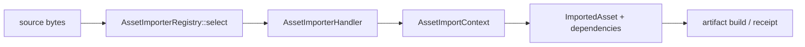

---
related_code:
  - zircon_runtime/src/asset/importer/contract.rs
  - zircon_runtime/src/asset/importer/registry.rs
  - zircon_runtime/src/asset/importer/error.rs
  - zircon_runtime/src/asset/importer/native.rs
  - zircon_runtime/src/asset/project/import_receipt.rs
implementation_files:
  - zircon_runtime/src/asset/importer/contract.rs
  - zircon_runtime/src/asset/importer/registry.rs
plan_sources:
  - user: 2026-09-09 资产导入器契约与插件扩展详解
tests:
  - zircon_runtime/src/asset/tests/assets/importer
  - zircon_runtime/src/asset/tests/assets/gltf_importer
doc_type: module-detail
---

# AssetImporter 契约与扩展

导入器把源字节转换为一个或多个 `ImportedAsset`，并声明输出 kind、依赖、artifact build identity 和 capability。注册表按 extension/suffix、priority 和 capability 选择唯一 handler。



## Descriptor

`AssetImporterDescriptor::new(id, plugin_id, output_kind, importer_version)` 创建描述；链式 API 包括 `with_priority`、`with_source_extensions`、`with_full_suffixes`、`with_required_capabilities`、`with_additional_output_kinds`。扩展名会被规范化，优先级越高越先选择。

```rust
let descriptor = AssetImporterDescriptor::new(
    "game.gltf", "game.assets", AssetKind::Model, 3,
)
.with_source_extensions(["gltf", "glb"])
.with_priority(100)
.with_required_capabilities(["mesh.decode"]);
```

## Registry

`AssetImporterRegistry::register`/`register_arc` 写入 handler；`select(uri, source)` 选择实现；`descriptor_for_source` 和 `capability_report_for_source` 用于诊断；`descriptors_for_plugin`、`remove_by_plugin_id` 用于插件卸载。重复 id、冲突 extension、缺失 capability 返回 `AssetImporterRegistryError`。

## Context 与 build identity

`AssetImportContext::new(source_path, uri, source_bytes, import_settings)` 保存源快照、legacy settings 转换出的 `AssetImportRecipe`、可选 `AssetImportBuildContext` 和 action key。导入器不得修改源文件； companion 文件必须通过受控 snapshot 读取。

`build_context()`、`build_action_key()` 为缓存键提供读取入口。相同 source hash、recipe canonical bytes 和 importer version 才能复用 artifact。

## Native importer

`NativeAssetImporterHandler` 通过 `NativeAssetImportCommandHost` 与外部进程/插件通信；`encode_request`、`decode_response` 负责 ABI framing。native callback 必须捕获 panic，报告 status/error，不得让 worker 线程崩溃。

## 错误与诊断

`AssetImportError` 应包含 source URI、importer id、阶段（decode/project/build/commit）和底层错误。`DiagnosticOnly` capability 表示可以列出但不能执行；UI 必须显式显示不可用原因。

## 多输出与依赖

一个源可产出主 kind 与 `additional_output_kinds`，例如 model -> mesh/material/animation。依赖记录必须使用稳定 AssetUri/UUID，不能写 worker 临时路径。导入 receipt 的 `committed_records` 是事务提交后的事实。

## 并发与性能

1. handler 应是 `Send + Sync`，避免共享可变全局状态。
2. 大文件解析在 worker pool，主线程只提交 registry mutation。
3. 利用 source snapshots 保证一次导入看到一致输入。
4. 用 capability report 在任务排队前快速失败。
5. 依赖图去重，避免重复解码同一子资产。

## 测试要求

- descriptor extension/suffix 规范化。
- priority 冲突和 registry error。
- 缺失 capability 的 DiagnosticOnly 报告。
- importer panic/超时/取消。
- 多场景、多 primitive、labeled subasset 与外部输入。
- 失败事务不污染旧 catalog。

## 检查清单

- [ ] importer id 与 plugin namespace 唯一。
- [ ] output kind 与 additional kinds 完整。
- [ ] recipe/build identity 可复现。
- [ ] 所有依赖可解析到稳定 URI/UUID。
- [ ] native ABI 错误不会 panic 穿透。
- [ ] import receipt 仅在 durable commit 后发布。

## 源码与测试

- [Importer contract](https://github.com/He-Jiahui/ZirconEngine/blob/main/zircon_runtime/src/asset/importer/contract.rs)
- [Registry](https://github.com/He-Jiahui/ZirconEngine/blob/main/zircon_runtime/src/asset/importer/registry.rs)
- [Native importer](https://github.com/He-Jiahui/ZirconEngine/blob/main/zircon_runtime/src/asset/importer/native.rs)
- [Importer tests](https://github.com/He-Jiahui/ZirconEngine/tree/main/zircon_runtime/src/asset/tests/assets/importer)

## Descriptor 字段矩阵

| 字段 | 语义 | 影响选择 |
| --- | --- | --- |
| `id` | importer 稳定标识 | 去重/receipt |
| `plugin_id` | 所属插件 | unload/remove |
| `priority` | 冲突时排序 | 越高越优先 |
| `source_extensions` | 简单后缀 | 匹配输入 |
| `full_suffixes` | 复合后缀 | 覆盖简单后缀 |
| `output_kind` | 主产物类型 | typed acquire |
| `additional_output_kinds` | 子产物 | 多记录输出 |
| `importer_version` | build identity | 缓存失效 |
| `required_capabilities` | 运行前条件 | capability report |

## 第二个调用片段

```rust
let report = registry.capability_report_for_source(&uri, &bytes);
if !report.status.is_available() {
    return Err(anyhow::anyhow!("importer unavailable: {:?}", report.status));
}
let importer = registry.select(&uri, &bytes)?;
let output = importer.import(AssetImportContext::new(path, uri, bytes, settings))?;
```

```rust
let removed = registry.remove_by_plugin_id("game.assets");
for descriptor in removed {
    tracing::info!(id = descriptor.id, "importer removed with plugin");
}
```

## 导入状态机

```text
Candidate -> Selected -> Decoding -> Projecting -> Building
          -> Failed(stage, diagnostic)
Building -> Committed(receipt)
```

只有 `Committed` 的 records 才能进入 ResourceRegistry。导入器不得直接写 registry；所有副作用交给 ProjectManager durable transaction。

## ABI 与并发边界

Native handler 的 request/response 必须带 protocol/version/byte length；decode 失败时丢弃整帧并返回 `AssetImportError`。handler 可被多个 worker 调用，内部缓存必须线程安全或按 task 隔离。

## 测试矩阵

- extension/full suffix/priority selection。
- capability unavailable diagnostic。
- importer version/build action key 缓存命中与失效。
- 多输出 kind 与依赖闭包。
- native malformed frame/panic/timeout。
- commit failure 后 registry 不变。

## API 兼容性

增加 descriptor 字段必须提供 serde default；修改 importer version 会主动失效旧 artifact。插件卸载前先停止新任务，再等待 in-flight handler 完成，最后调用 `remove_by_plugin_id`，否则 registry 可能保留悬空 handler。

## 运行时审计

每次导入记录 descriptor id/plugin/version、source URI/hash、recipe key、capability report、依赖数量、输出 kinds、耗时和错误阶段。审计记录与 `ProjectImportReceipt` 关联后，才能复现“同一源为何生成不同 artifact”。

## 自定义导入器案例

```rust
let descriptor = AssetImporterDescriptor::new(
    "game.data", "game.plugin", AssetKind::Data, 1,
)
.with_full_suffixes([".game.data"])
.with_required_capabilities(["game.decode"]);
registry.register(descriptor, Arc::new(GameDataImporter::new()))?;
```

```rust
let report = registry.capability_report_for_source(&uri, &source_bytes);
if !report.status.is_available() {
    tracing::error!(?report, "cannot schedule importer");
    return Ok(());
}
let selected = registry.select(&uri, &source_bytes)?;
let context = AssetImportContext::new(path, uri, source_bytes, settings);
let imported = selected.import(context)?;
```

## importer 线程模型

handler 可以在多个 worker 并发调用；context 中 `source_bytes` 属于当前任务，不能缓存到全局。外部工具的 stdout/stderr 应限制大小，超限进入 diagnostic；超时后终止子进程并释放临时目录。

## 接受标准

- descriptor id/plugin/version 稳定且可审计。
- capability 不满足时在排队前失败。
- source snapshots 保证导入输入一致。
- 多输出 records 依赖闭包完整。
- panic、超时、malformed response 不污染 registry。

## API 调用顺序

`descriptor -> capability_report -> select -> context -> import -> validate outputs -> stage records -> durable commit`。插件只能负责 import 输出，不能直接修改 ProjectManager 内部 registry。

## 资源导入案例

模型 importer 通常输出 Model 主记录及 Mesh、Material、Animation 子记录；每条子记录都应有稳定 sub-asset key，依赖图引用 URI/UUID 而不是输出数组下标。

## 审计测试

- 同一 descriptor 在不同 priority 下选择确定。
- 不满足 capability 时不创建 worker task。
- importer 输出空/重复 ID 被拒绝。
- commit 中断后旧 generation 可继续加载。
