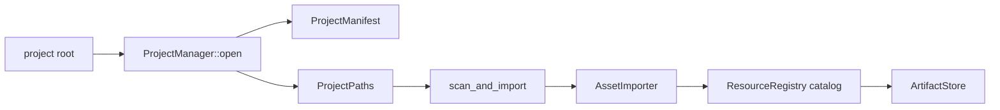

---
related_code:
  - zircon_runtime/src/asset/project/manifest/project_manifest.rs
  - zircon_runtime/src/asset/project/manager/mod.rs
  - zircon_runtime/src/asset/project/manager/open.rs
  - zircon_runtime/src/asset/project/manager/scan_and_import.rs
  - zircon_runtime/src/asset/project/manager/source_path_for_uri.rs
implementation_files:
  - zircon_runtime/src/asset/project/manifest/project_manifest.rs
  - zircon_runtime/src/asset/project/manager
plan_sources:
  - user: 2026-09-09 ProjectManifest 与 ProjectManager 公开接口详解
tests:
  - zircon_runtime/src/asset/tests/project/manager
  - zircon_runtime/src/asset/tests/project/example_vampire/manifest_scene_imports.rs
doc_type: module-detail
---

# ProjectManifest 与 ProjectManager

`ProjectManifest` 是项目格式的权威文档，`ProjectManager` 负责路径解析、资源注册、导入器、artifact store、包资源和可持久化生成。两者共同定义“源文件 -> AssetUri -> ResourceRecord -> artifact”的项目边界。



## Manifest 字段

`ProjectManifest::new(name, default_scene, library_version)` 初始化 `format_version`、`project_guid`、默认 `asset_roots` 与空插件/脚本/导出配置。公开字段包括 `name`、`format_version`、`project_guid`、`engine_version_req`、`template_receipt`、`default_scene`、`ui_roots`、`asset_roots`、`settings`、`asset_manifest`、`library_version`、`plugins`、`scripts`、`export_profiles`。

```rust
let manifest = ProjectManifest::new(
    "Example",
    AssetUri::project("scenes/main.zscene")?,
    1,
);
let summary = manifest.summary();
```

`format_version` 描述 manifest 结构，`library_version` 描述生成资产库；升级其中一个不能隐式升级另一个。`summary()` 用于宿主/编辑器展示，不替代完整 manifest。

## 打开项目

```rust
let mut project = ProjectManager::open("D:/work/game")?;
println!("{}", project.manifest().name);
let source = project.source_path_for_uri(&uri)?;
```

`open` 会解析 root、读取 manifest、初始化 ResourceRegistry 与 AssetRegistryIndex。使用 `open_resolved` 可复用已解析的 `ResolvedProjectPath`。打开失败常见于 manifest 缺失、格式版本不支持、asset root 越界或 catalog 损坏。

## 扫描与导入

`scan_and_import()` 执行完整 generation：扫描文件、加载/创建 `.meta`、选择 importer、解析依赖、写入 registry 和 artifacts。方法先在 clone candidate 上准备，再以 durable transaction 提交；失败时原 ProjectManager 保持旧状态。

```rust
let records = project.scan_and_import()?;
for record in records {
    tracing::info!(id = ?record.id, "imported resource");
}
```

`scan_and_import_watch_changes(changes)` 对单文件 added/modified/removed 优先走 targeted 路径；多文件、rename 或依赖不确定时自动回退 full generation。返回的是本次提交影响的 records。

## URI 与路径

`project_uri_for_source_path` 将项目内路径转换为规范 `AssetUri`；`resolve_source_path_for_uri`、`source_path_for_uri` 反向解析。`resolve_primary_project_source_path_for_uri` 忽略包资源，`resolve_existing_or_primary_project_source_path_for_uri` 在已有路径和 primary root 间选择。

URI 解析必须保持项目 root 约束；不要把绝对路径直接拼接为 URI，也不要依赖 Windows 大小写差异。跨平台工具应通过 `ProjectPaths` 的规范化方法。

## 引用与持久化

资源记录包含 AssetId、source URI、artifact identity、依赖和 diagnostics。`ProjectImportReceipt` 记录 source URI、generation sequence 与 committed records，可用于日志、回滚审计和增量构建缓存。

## 错误处理

所有公开导入方法返回 `AssetImportError`。处理策略：

1. `Parse`：报告源文件和 importer id，等待修复后重试。
2. `Io`/事务错误：检查 journal，确认 registry 与 artifact 是否仍是旧 generation。
3. `Unsupported`：检查 importer capability report，而不是盲目重试。
4. 引用解析错误：使用 `reference_diagnostics()` 定位 repair 建议。

## 最佳实践

- 将 manifest 提交到版本控制，生成 library 目录视为可重建产物。
- 每次导入记录 generation sequence 和 importer version。
- 批量变更使用一次 `scan_and_import_watch_changes`，避免逐文件事务。
- 通过 `asset_registry_shared()` 给只读后台任务，避免复制完整索引。
- 在 CI 中执行 full scan，开发机使用 watcher targeted scan。

## 检查清单

- [ ] `default_scene` URI 可解析且属于 asset roots。
- [ ] format/library version 分开迁移。
- [ ] importer priority 和 capability 已验证。
- [ ] 事务失败后旧 catalog 仍可加载。
- [ ] receipt 已记录并可关联日志。

## 源码与测试

- [ProjectManifest](https://github.com/He-Jiahui/ZirconEngine/blob/main/zircon_runtime/src/asset/project/manifest/project_manifest.rs)
- [ProjectManager](https://github.com/He-Jiahui/ZirconEngine/blob/main/zircon_runtime/src/asset/project/manager/mod.rs)
- [扫描导入](https://github.com/He-Jiahui/ZirconEngine/blob/main/zircon_runtime/src/asset/project/manager/scan_and_import.rs)
- [项目管理器测试](https://github.com/He-Jiahui/ZirconEngine/tree/main/zircon_runtime/src/asset/tests/project/manager)

## Manifest 字段表

| 字段 | 作用 | 迁移规则 |
| --- | --- | --- |
| `name` | 人类可读项目名 | 可改，不影响 UUID |
| `format_version` | manifest schema | 只能通过迁移升级 |
| `project_guid` | 项目稳定身份 | 禁止自动重生 |
| `default_scene` | 启动场景 URI | 必须可解析 |
| `asset_roots` | 源文件根目录 | 相对 project root |
| `library_version` | 生成库格式 | 可独立升级 |
| `plugins/scripts` | 运行时扩展选择 | 先验证 capability |

## 完整导入流水线

```text
open -> read manifest -> resolve roots -> load registry
scan -> collect files -> load/create meta -> select importer
      -> build dependency graph -> prepare artifacts
commit -> atomic files -> registry generation -> receipt
```

```rust
let mut project = ProjectManager::open(root)?;
let before = project.catalog_input_generation();
let records = project.scan_and_import()?;
let after = project.catalog_input_generation();
tracing::info!(before = before.sequence(), after = after.sequence(), count = records.len());
```

```rust
let changes = vec![AssetChange::modified(uri.clone())]; // 以构造器导出为准
match project.scan_and_import_watch_changes(&changes) {
    Ok(records) => tracing::info!(count = records.len(), "targeted import committed"),
    Err(error) => tracing::error!(?error, "import retained previous generation"),
}
```

## 事务状态机

```text
OldGeneration -> CandidatePrepared
CandidatePrepared -> Committing
Committing -> Durable(NewGeneration)
Committing -> Failed(OldGeneration retained)
```

只有 `ensure_durable` 成功后才允许下游加载新 records；日志和 `ProjectImportReceipt` 应绑定 generation sequence。

## 解析优先级

source path -> primary asset root -> package roots -> registry URI -> artifact path。任何一步发现路径越界、大小写冲突或多个候选，都应返回诊断而非静默选择。

## 测试矩阵

- manifest 默认字段与版本迁移。
- 缺失/损坏 meta 的生成与稳定 UUID。
- 单文件 targeted、rename/full fallback、多依赖变更。
- artifact/registry 原子提交故障注入。
- source URI 往返与 package asset 隔离。

## 运行时访问

导入完成后，使用 `registry()`/`asset_registry()` 做只读查找，使用 `load_artifact`/`load_artifact_by_id` 获取 CPU 产物；渲染和游戏代码应交给 ProjectAssetManager typed acquire，而不是直接读取 artifact 文件。

## 诊断字段

每次 scan 至少记录 project root、generation sequence、文件数、meta 新建数、importer 命中、失败 URI、依赖边数和 commit duration。这样可区分“没有扫描到源文件”和“扫描到但 importer 不可用”。

## 项目启动案例

```rust
let mut project = ProjectManager::open(project_root)?;
project.register_asset_importers_from_registry(plugin_registry)?;
let imported = project.scan_and_import()?;
let scene_uri = project.manifest().default_scene.clone();
let scene = project.load_artifact(&scene_uri)?;
```

## 资产路径迁移案例

```rust
let old_uri = AssetUri::parse("project://assets/old/hero.glb")?;
let old_path = project.source_path_for_uri(&old_uri)?;
let new_uri = project.project_uri_for_source_path(Path::new("assets/hero.glb"))?;
project.persist_runtime_reference(&old_uri, &new_uri)?; // 以当前引用 API 为准
```

路径迁移后要重新执行依赖闭包解析；仅修改文件名而不更新 registry 会留下 dangling references。

## 目录扫描阶段

| 阶段 | 输出 |
| --- | --- |
| collect files | 候选 source paths |
| meta precondition | `AssetMetaDocument` 或 repair |
| importer select | descriptor + capability |
| dependency resolution | direct/recursive edges |
| artifact build | immutable bytes + identity |
| registry stage | candidate records |
| durable commit | published generation/receipt |

## 维护规则

项目关闭前先停止 watcher 和 worker pool，再释放 ProjectManager。`catalog_input_generation()` 返回的 Arc generation 可供只读 UI 使用，但 UI 不应修改其中 records。

## 接受标准

- open 后 manifest、roots、registry 一致。
- full scan 失败不改变旧 generation。
- targeted scan 只更新受影响闭包。
- source URI 往返不改变规范路径。
- receipt 可关联每条 committed record。
