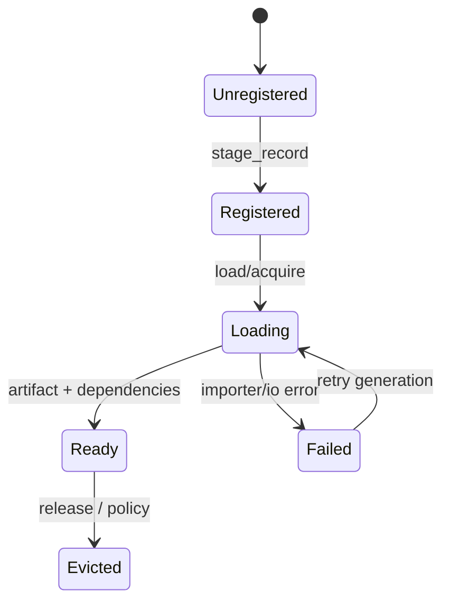

---
related_code:
  - zircon_runtime/src/core/resource/mod.rs
  - zircon_runtime/src/asset/pipeline/manager/project_asset_manager
  - zircon_runtime/src/asset/pipeline/manager/project_asset_manager/loading
  - zircon_runtime/src/core/framework/asset.rs
implementation_files:
  - zircon_runtime/src/core/resource/mod.rs
  - zircon_runtime/src/asset/pipeline/manager/project_asset_manager
plan_sources:
  - user: 2026-09-09 ResourceRegistry、句柄、加载状态与 readiness 详解
tests:
  - zircon_runtime/src/asset/tests/assets
  - zircon_runtime/src/ui/tests/v2_asset/asset_loading.rs
doc_type: module-detail
---

# ResourceRegistry、句柄与资源就绪

`ResourceRegistry` 是运行时资源目录，`ResourceHandle<T>`/`ResourceLease<T>` 是类型安全访问，`RuntimeResourceState` 与 `ResourceReadinessState` 描述“记录存在”和“可被依赖闭包消费”的区别。



## 句柄和租约

`ResourceHandle<T>` 可复制，表达轻量身份；`ResourceLease<T>` 表达持有运行时资源的引用，释放 lease 才允许回收。无类型句柄 `UntypedResourceHandle` 适合插件和反射，但消费前必须校验 `ResourceKind`。

```rust
let lease = assets.acquire_mesh_asset(mesh_id)?;
let mesh = lease.as_ref();
```

不要把 lease 长期存进全局缓存；长期缓存应存 handle/UUID，并在使用帧重新 acquire。

## 状态读取

ProjectAssetManager 暴露 `runtime_resource_state(id)`、`load_state(id)`、`failure_reason(id)`、`dependency_load_state(id)`、`is_loaded_with_dependencies(id)` 等查询。`Ready` 只代表本资源 payload 存在；渲染前通常要检查递归依赖 readiness。

| 状态 | 允许操作 | UI 表示 |
| --- | --- | --- |
| Unregistered | 仅请求导入/注册 | 未导入 |
| Loading | 显示进度，可取消 | 加载中 |
| Ready | acquire/渲染 | 可用 |
| Failed | 读取诊断、重试 | 错误 |
| Evicted | 重新 acquire | 缓存回收 |

## 事件流

`ResourceEvent`、`ResourceEventReceiver`、cursor 和 gap 错误构成事件消费 API。长时间未读可能收到 `ResourceEventGap`，此时必须重新读取 registry snapshot，而不是假设中间事件可补齐。

```rust
let mut rx = registry.subscribe_events();
while let Ok(event) = rx.try_recv() {
    tracing::debug!(kind = ?event.kind, "resource event");
}
```

## 生成与快照

`ResourceManagementGeneration` 和 `ResourceReadinessGeneration` 分别标识目录管理与就绪扫描。snapshot/row identity 可用于跨线程诊断；不要在 generation 变化后复用旧 row index。

## 线程与性能

ResourceRegistry 支持读 guard 和批量 mutation。导入 worker 产生 `ResourceMutationBatch`，主线程一次提交 `ResourceMutationReceipt`；频繁单记录 mutation 会放大锁竞争和事件量。渲染线程只持有只读 lease，不写 registry。

## 错误处理

`ResourceRegistryError` 常见原因：重复 ResourceId、kind 不匹配、generation 冲突、事件接收端断开、依赖未满足。恢复策略是重新 snapshot、重新 acquire 或触发 targeted import。

## 最佳实践

1. API 参数优先使用 typed marker（`MeshMarker`、`TextureMarker` 等）。
2. 进入渲染前检查 `is_loaded_with_dependencies`。
3. 监控 ref count 与 eviction，定位泄漏。
4. 对事件 gap 设计全量重建路径。
5. 将失败 reason 关联 source URI 和 importer version。

## 检查清单

- [ ] handle 与 lease 生命周期分离。
- [ ] readiness 检查包含递归依赖。
- [ ] generation 改变后刷新缓存。
- [ ] 事件 gap 可恢复。
- [ ] mutation 使用批处理并记录 receipt。

## 源码与测试

- [Resource facade](https://github.com/He-Jiahui/ZirconEngine/blob/main/zircon_runtime/src/core/resource/mod.rs)
- [ProjectAssetManager](https://github.com/He-Jiahui/ZirconEngine/tree/main/zircon_runtime/src/asset/pipeline/manager/project_asset_manager)
- [资产加载测试](https://github.com/He-Jiahui/ZirconEngine/blob/main/zircon_runtime/src/ui/tests/v2_asset/asset_loading.rs)

## 记录字段

`ResourceRecord` 至少关联 ResourceId、kind、locator、artifact identity 和 diagnostics；`ResourceRuntimeInfo` 记录加载引用/运行时状态；`ResourceReadinessRow` 记录依赖闭包扫描结果。管理 generation 与 readiness generation 必须分别展示。

## 两个实践片段

```rust
let id = assets.resolve_asset_id(&uri).ok_or(CoreError::MissingResource)?;
if !assets.is_loaded_with_dependencies(id) {
    assets.load(id)?;
    return Ok(Pending::Dependencies);
}
let mesh = assets.acquire_mesh_asset(id)?;
render.submit(mesh.as_ref());
```

```rust
match registry.try_recv_event() {
    Ok(event) => apply_resource_event(event),
    Err(ResourceEventTryRecvError::Gap(gap)) => {
        tracing::warn!(?gap, "rebuild from resource snapshot");
        rebuild_from_snapshot(registry.snapshot());
    }
    Err(_) => {}
}
```

## 状态转移规则

`Registered -> Loading` 只能由 load/acquire 触发；`Loading -> Ready` 需要 payload 和依赖闭包均成功；任何 importer/IO 错误进入 Failed 并保留 diagnostic；retry 必须推进或确认 generation，避免旧错误覆盖新结果；Evicted 后 handle 保留，lease 失效并需重新 acquire。

## 锁与所有权

读 guard 不可跨越 mutation commit；lease 不应在 registry 写锁期间创建；事件接收器断开不影响资源本体，但必须在宿主重连时做 snapshot reconciliation。

## 测试矩阵

- typed marker kind mismatch。
- dependency readiness 递归与循环。
- event cursor gap/reconnect。
- lease/ref count/eviction。
- mutation batch receipt 与 generation identity。

## 资源消费策略

启动关键资源可在 bootstrap 阶段批量 `load` 并等待 readiness；可选资源在 gameplay 请求后异步加载，渲染端使用占位材质。不要让每个实体重复请求同一 AssetId，按 ID 去重并共享 handle。

## 诊断页面

资源面板应展示 ID、kind、URI、runtime state、readiness state、ref count、generation、failure reason、直接依赖和递归阻塞节点。点击失败节点可跳转 importer diagnostics，而不是只显示“加载失败”。

## 启动加载案例

```rust
for id in critical_assets {
    assets.load(id)?;
}
while critical_assets.iter().any(|id| !assets.is_loaded_with_dependencies(*id)) {
    assets.maintain();
    std::thread::yield_now();
}
```

## 释放案例

```rust
let handle = assets.load(id)?;
let lease = assets.acquire_texture_asset(id)?;
render.bind_texture(&lease);
drop(lease); // 允许 eviction；handle 仍可用于重新 acquire
```

## 事件一致性

事件消费流程为 cursor -> event batch -> apply local cache -> ack/read cursor。收到 gap、receiver disconnected 或 generation mismatch 时，丢弃本地增量缓存并从 `ResourceSnapshot` 重建。

## readiness 阻塞诊断

将阻塞链表示为 `consumer -> direct dependency -> recursive dependency -> failure reason`。仅显示“纹理未 ready”无法帮助用户修复，应明确指出缺失源 URI、importer error 或被取消的 generation。

## 接受标准

- 关键资源等待递归 readiness，不只等待本资源。
- handle/lease 释放后 ref count 正确下降。
- event gap 能 snapshot reconcile。
- generation 过期的 ready 结果不能覆盖新记录。
