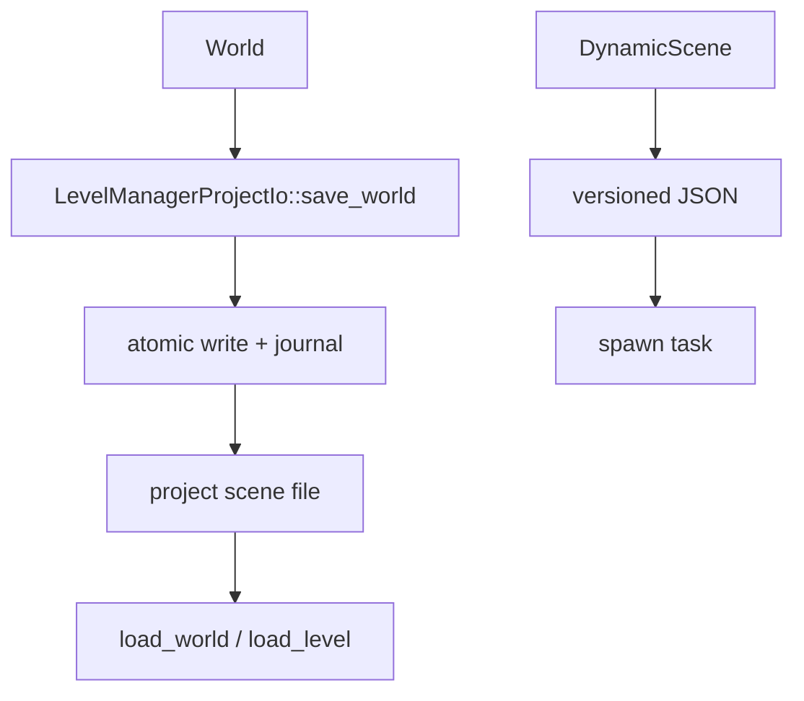

---
related_code:
  - zircon_runtime/src/scene/world/world.rs
  - zircon_runtime/src/scene/module/level_manager_project_io.rs
  - zircon_runtime/src/scene/dynamic_scene/document/read.rs
  - zircon_runtime/src/scene/dynamic_scene/document/write.rs
  - zircon_runtime/src/asset/project/manager/durable_transaction.rs
  - zircon_runtime/src/core/resource/io/mod.rs
implementation_files:
  - zircon_runtime/src/scene/module/level_manager_project_io.rs
  - zircon_runtime/src/asset/project/manager/durable_transaction.rs
plan_sources:
  - user: 2026-09-09 场景序列化、持久化与崩溃恢复详解
tests:
  - zircon_runtime/src/scene/tests/component_structure/project_serialization.rs
  - zircon_runtime/src/asset/project/manifest/save/borrowed_serialization_tests.rs
doc_type: workflow-detail
---

# 场景序列化、持久化与恢复

持久化分为三种用途：World/Level 项目文件、DynamicScene 交换文档、资源 catalog/artifact。它们共享稳定 URI/UUID 约定，但不能互相替代。



## Level IO

`LevelManagerProjectIo::save_world`、`save_level` 写入项目场景；`load_world`、`load_level` 返回 `LevelSystem`。写入前应确保 deferred commands 已应用、World generation 已稳定、所有资源引用可序列化。

```rust
project_io.save_world(&world, &path)?;
let level = project_io.load_world(&path)?;
```

示例为调用形状，实际参数以当前 trait/impl 导出为准；不要在渲染线程执行阻塞 IO。

## 原子写入

`core::resource::io::{atomic_write, atomic_write_new}` 提供写临时文件、flush、rename 的基础。ProjectManager durable transaction 额外维护 journal directory，使 registry、meta 和 artifact 一致提交。

## 版本与迁移

WorldPersistentState 使用 serde 默认字段兼容旧场景；DynamicScene JSON 由 `from_versioned_json` 检查版本。新增字段应提供默认值或显式迁移，删除字段应保留反序列化兼容窗口。

## 恢复流程

1. 启动时扫描 journal。
2. 校验每个临时文件 hash 和目标路径。
3. 完成所有写入或回滚到上一 generation。
4. 重新打开 registry，验证 artifact identity。
5. 发布恢复 diagnostics 并允许用户继续编辑。

## 数据完整性

实体 ID 不保证跨 World 稳定；序列化层应写稳定实体引用/路径或 snapshot remap 表。运行时 sink、subscriptions、缓存索引和 deferred queue 属于非持久状态，World clone/decode 后需要重建。

## 错误处理

- JSON/serde 错误：保留原文件，写入 `.failed` 诊断，不覆盖可恢复版本。
- atomic rename 失败：保留 journal，等待下一次启动恢复。
- UUID 冲突：停止导入，要求用户解决，而不是自动覆盖。
- 版本过高：以只读模式打开并提示升级引擎。

## 最佳实践

1. 保存操作使用 debounce，避免每次属性输入都写磁盘。
2. 大场景先写 DynamicScene staging，再由主线程 commit。
3. 将 source、meta、registry、artifact 的 generation 写入同一日志上下文。
4. CI 中进行 save -> load -> diff roundtrip。

## 检查清单

- [ ] 保存前无 deferred command。
- [ ] 所有持久引用使用 URI/UUID。
- [ ] 写入使用 atomic/journal API。
- [ ] 启动恢复可处理半写文件。
- [ ] 版本迁移有测试和回滚策略。

## 源码与测试

- [World 序列化](https://github.com/He-Jiahui/ZirconEngine/blob/main/zircon_runtime/src/scene/world/world.rs)
- [Level project IO](https://github.com/He-Jiahui/ZirconEngine/blob/main/zircon_runtime/src/scene/module/level_manager_project_io.rs)
- [资源原子写入](https://github.com/He-Jiahui/ZirconEngine/blob/main/zircon_runtime/src/core/resource/io/mod.rs)

## 持久格式边界

| 格式 | 内容 | 恢复入口 |
| --- | --- | --- |
| Level scene | WorldPersistentState | `load_world` |
| DynamicScene JSON | 版本化实体/组件值 | `from_versioned_json` |
| Manifest | 项目身份与 roots | `ProjectManager::open` |
| Catalog | ResourceRecord/index | registry open/rebuild |
| Artifact | 导入产物 bytes | ProjectAssetManager acquire |

## 第二个调用片段

```rust
let bytes = serde_json::to_vec_pretty(&world)?;
atomic_write_new(&scene_path, &bytes)?;
```

```rust
let dynamic = DynamicScene::from_versioned_json(&json)
    .map_err(|e| anyhow::anyhow!("scene decode failed: {e}"))?;
let prepared = PreparedDynamicSceneSpawn::new(dynamic)?;
prepared.spawn_into(&mut world)?;
```

## 恢复状态机

```text
Clean -> JournalFound -> Validate entries
      -> Complete commit -> Clean
      -> Rollback old generation -> Clean
      -> Corrupt/unknown -> ReadOnly + user repair
```

恢复期间禁止 watcher 和编辑器写入同一项目目录。完成后必须重新计算 catalog generation 和 world derived state。

## 一致性断言

- manifest project_guid 不变。
- 每个 record 的 artifact identity 与 bytes hash 匹配。
- 场景 URI 均能在当前 roots 解析。
- load 后 save 的规范化 diff 为空或仅包含版本默认字段。

## 测试矩阵

- serde roundtrip 与默认字段。
- atomic write 中断、journal recovery/rollback。
- 版本过高只读打开。
- UUID 冲突拒绝覆盖。
- scene save/load 后 query 与 hierarchy 一致。

## 存档兼容

游戏存档只应保存业务组件白名单和稳定资产引用，避免把编辑器诊断、archetype index、GPU handles、watch tokens 写入存档。加载时先建立空 World，再按组件 schema 顺序恢复，最后运行派生状态重建。

## 恢复演练

CI 应模拟写入中断点：临时文件未 flush、目标文件已替换、journal 只写一半、registry 新 generation 未发布。每种故障都要证明旧版本仍可打开，或系统明确进入只读修复模式。

## 编辑器保存案例

```rust
let snapshot = level.snapshot();
let json = serde_json::to_vec(&snapshot)?;
atomic_write(&scene_path, &json)?;
```

```rust
let reopened = level_manager.load_level(&scene_path)?;
reopened.with_world(|world| {
    assert!(world.stable_entity_ids().next().is_some());
});
```

## 恢复后的重建顺序

1. 读取 manifest 和 project GUID。
2. 恢复 registry/catalog generation。
3. 加载 WorldPersistentState。
4. 重建 entity/archetype/component indices。
5. 重建 hierarchy/derived state/compiled bindings。
6. 重新连接 subscriptions、watcher 和 render extraction。

## 接受标准

- 任意 journal 中断点均可完成或回滚。
- save/load roundtrip 保持 URI、层级、组件值。
- runtime-only state 不进入持久文件。
- 损坏或未知版本进入只读修复模式。
