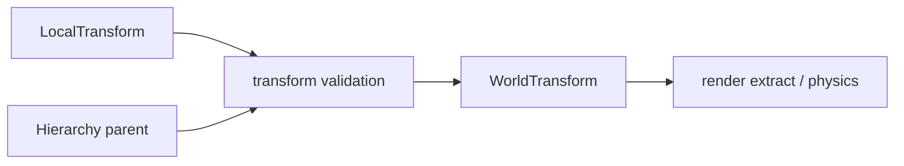

---
related_code:
  - zircon_runtime/src/scene/components/scene/transform.rs
  - zircon_runtime/src/core/math/mod.rs
  - zircon_runtime/src/scene/world/hierarchy.rs
  - zircon_runtime/src/scene/world/transform_validation.rs
implementation_files:
  - zircon_runtime/src/scene/components/scene/transform.rs
  - zircon_runtime/src/scene/world/hierarchy.rs
plan_sources:
  - user: 2026-09-09 变换、层级与数学 API 详解
tests:
  - zircon_runtime/src/scene/world/compiled_binding/tests.rs
  - zircon_runtime/src/graphics/tests/project_render/project_scenes
doc_type: module-detail
---

# Transform、层级与数学

场景变换由 `LocalTransform`、`WorldTransform`/`WorldMatrix` 和 `Hierarchy` 共同表示。Local 是持久输入，World 是由父子拓扑派生的运行态；修改父节点或 local transform 会使子树 dirty 并推进 binding/topology generation。



## LocalTransform

`LocalTransform` 保存 translation、rotation、scale（字段/构造器以源码为准），应通过组件写入而非直接修改派生矩阵。单位约定为米/弧度，矩阵乘法顺序必须与渲染 backend 一致。

```rust
let mut t = world.get_mut::<LocalTransform>(entity).unwrap();
t.set_translation(Vec3::new(1.0, 0.0, 0.0));
drop(t);
```

修改后让 scene schedule 计算 world transform；立即读取 `WorldMatrix` 可能仍是上一帧派生值。

## Hierarchy

父子关系通过 `Hierarchy` 组件和 World 层级 API 维护。设置父节点必须检查：不能把实体设为自身祖先、不能跨 World、不能形成环。层级修改会更新 `HierarchyTopology` 与 descendant name index。

## 数学稳定性

`core::math` 提供 Vec/Mat/Quat 等基础类型重导出。归一化四元数后再构造矩阵；scale 接近零或包含 NaN 时由 transform validation 拒绝或标记诊断。网络同步应传 local TRS，避免传输平台相关浮点矩阵。

## 插值与渲染

物理固定步和渲染帧之间使用 `FixedInterpolationContext`；渲染提取读取插值后的 world transform，游戏逻辑读取 simulation transform。不要在渲染提取阶段写回 World。

## 性能

1. 批量更新同一子树的 local transforms。
2. 只在拓扑或 local revision 改变时重算矩阵。
3. 避免每实体分配临时 Vec/Mat；使用栈值和批处理。
4. 大层级使用 stable entity order，减少缓存抖动。

## 错误案例

- 环形 Hierarchy 导致递归更新无法终止。
- 非均匀 scale 与物理 collider 不一致。
- 把 world matrix 当作持久格式，换平台后出现精度差异。
- 在旧 replacement epoch 上写变换，覆盖新场景。

## 检查清单

- [ ] local/world 责任分离。
- [ ] 父子修改通过校验 API。
- [ ] 四元数归一化、scale 有限性已验证。
- [ ] 插值只用于渲染读取。
- [ ] 矩阵派生 revision 与 topology generation 一致。

## 源码与测试

- [Transform components](https://github.com/He-Jiahui/ZirconEngine/blob/main/zircon_runtime/src/scene/components/scene/transform.rs)
- [Hierarchy](https://github.com/He-Jiahui/ZirconEngine/blob/main/zircon_runtime/src/scene/world/hierarchy.rs)
- [变换校验](https://github.com/He-Jiahui/ZirconEngine/blob/main/zircon_runtime/src/scene/world/transform_validation.rs)

## 公开接口速查

| API | 输入 | 输出/副作用 |
| --- | --- | --- |
| `World::update_transform` | `EntityId`, `Transform` | `SceneResult<bool>`，标记 dirty |
| `World::set_parent_checked` | child、optional parent | `SceneResult<bool>`，拒绝环 |
| `World::subtree_records` | root entity | 稳定 `Vec<NodeRecord>` |
| `World::get::<LocalTransform>` | entity | local 只读借用 |
| `FixedInterpolationContext` | simulation/render ticks | 插值读取上下文 |

## 编辑器拖拽案例

```rust
fn apply_gizmo(world: &mut World, entity: EntityId, translation: Vec3) -> SceneResult<()> {
    let current = world.get::<LocalTransform>(entity)
        .ok_or_else(|| SceneError::missing_component("gizmo", entity))?;
    let mut next = (*current).clone();
    next.translation = translation;
    world.insert(entity, next)?;
    Ok(())
}
```

拖拽结束时再提交一次编辑事务；拖拽中间值可留在 editor staging，避免每个鼠标事件触发持久化和全子树派生。

## 派生状态重建

```text
local revision changed
  -> mark entity dirty
  -> breadth/depth ordered hierarchy walk
  -> parent_world * local
  -> update WorldMatrix + bounds
  -> publish scene binding generation
```

当父节点发生变化时，所有 descendants 都必须重新计算；只更新 child 自身会产生渲染/物理错位。

## 错误恢复

变换校验失败时保留上一有效组件，向诊断写入 entity path、输入值和失败规则。层级环恢复需要解除最近一次 reparent，而不是清空整棵树；缺失父节点可转为 root 并记录修复。

## 测试矩阵补充

- gizmo 连续写入只在 commit 时持久化。
- 父节点平移使所有后代 bounds 更新。
- 负 scale/mirror 与 culling 一致。
- interpolation 在 pause/single-step 后无跳变。

## 变换字段

| 层 | 数据 | 生产者 | 消费者 |
| --- | --- | --- | --- |
| Local | translation/rotation/scale | gameplay/editor | hierarchy solver |
| Parent | parent EntityId | hierarchy API | topology index |
| World | matrix/derived TRS | solver | render/physics |
| Interpolated | previous/current blend | fixed-step runtime | render extract |

## 第二个调用片段

```rust
world.update_transform(entity, Transform::from_translation(Vec3::new(0.0, 2.0, 0.0)))?;
let changed = world.set_parent_checked(entity, Some(root))?;
tracing::debug!(changed, "hierarchy update");
```

```rust
let local = world.get::<LocalTransform>(entity).ok_or(SceneError::MissingRequiredComponent { operation: "read transform", entity })?;
let matrix = local.to_matrix(); // 以当前公开构造器为准
assert!(matrix.is_finite());
```

## 校验转移

```text
Input TRS -> finite check -> scale/rotation validation
         -> topology validation -> mark dirty
         -> derive WorldMatrix -> publish generation
```

非法输入不会静默夹紧；调用方应显示 `SceneError`/diagnostic 并保留上一有效值。层级环、缺失父节点和跨 World parent 均拒绝。

## 精度与网络

持久化写 local TRS 和稳定 parent key；网络同步写 quantized local state + revision；GPU 上传矩阵时才转换为 backend layout。大世界坐标应在 gameplay 层维护 origin rebasing，不要修改 core matrix 约定。

## 测试矩阵

- TRS finite/NaN/infinite/zero scale。
- parent cycle/self/missing parent。
- topology generation 与 descendant dirty。
- fixed-step interpolation continuity。
- save/load 与 render extract 矩阵一致。

## API 使用边界

编辑器属性面板优先写 `LocalTransform`；层级工具调用 `set_parent_checked`；物理系统读取派生 world transform；渲染提取读取插值结果。跨层直接修改 WorldMatrix 会破坏 dirty propagation，应视为内部错误。

## 调试策略

显示 entity path、local TRS、parent、world matrix、topology generation 和 transform revision。发现跳变时按 local -> parent -> interpolation -> render extract 顺序定位，不要先怀疑 GPU 矩阵布局。

## 变换工具案例

```rust
fn move_child(world: &mut World, child: EntityId, parent: EntityId, delta: Vec3) -> SceneResult<()> {
    world.set_parent_checked(child, Some(parent))?;
    world.update_transform(child, Transform::from_translation(delta))?;
    Ok(())
}
```

```rust
let root = world.spawn_node(NodeKind::Scene)?;
let camera = world.spawn_node(NodeKind::Camera)?;
world.set_parent_checked(camera, Some(root))?;
world.update_transform(camera, Transform::from_translation(Vec3::new(0.0, 2.0, 5.0)))?;
```

## 代数约束

父矩阵与 local 矩阵的乘法方向是引擎约定；不要按其他引擎的 row-major/column-major 习惯重排。旋转插值用 quaternion shortest-path，scale 插值需处理负 scale 和镜像节点。

## 接受标准

- parent cycle/self/missing parent 均拒绝。
- local 更新推进 component/world generation。
- derived matrix 在 schedule 后稳定。
- render interpolation 不写回 simulation World。
- save/load 后变换与层级保持一致。
