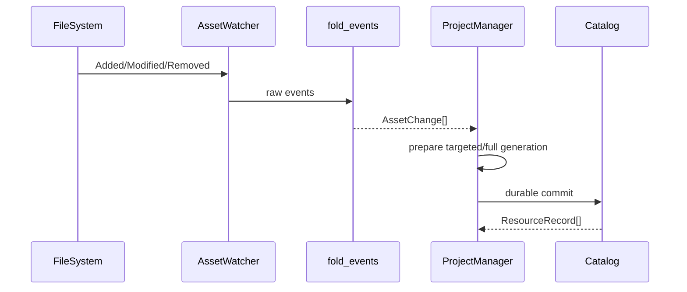

---
related_code:
  - zircon_runtime/src/asset/watch/asset_watcher.rs
  - zircon_runtime/src/asset/watch/fold_events.rs
  - zircon_runtime/src/asset/project/manager/scan_and_import.rs
  - zircon_runtime/src/asset/project/catalog_input_generation.rs
implementation_files:
  - zircon_runtime/src/asset/watch
  - zircon_runtime/src/asset/project/manager/scan_and_import
plan_sources:
  - user: 2026-09-09 watcher、增量导入与 generation 机制详解
tests:
  - zircon_runtime/src/asset/tests/watcher.rs
  - zircon_runtime/src/asset/tests/project/manager/targeted_import
doc_type: module-detail
---

# Watcher、增量导入与 Generation

文件 watcher 将 OS 事件折叠成稳定的 `AssetChange`，ProjectManager 再选择 targeted 或 full generation。generation 是原子提交边界：准备阶段可以失败，只有 commit 成功后新 catalog 才对运行时可见。



## 事件折叠

`fold_events(events)` 将同一路径的连续写入合并，并处理 rename 的 previous URI。`AssetChangeKind` 至少包含 Added、Modified、Removed；rename 通常需要 full generation，因为依赖和引用都可能改变。

## watcher 生命周期

`AssetWatcher` 由 `spawn`/`spawn_with_options` 创建，关闭时调用 `shutdown_until(deadline)`。关闭应发生在 ProjectAssetManager/编辑器退出阶段，并检查布尔返回值；超时意味着后台线程仍可能持有文件句柄。

## 增量选择规则

`ProjectManager::watch_changes_use_incremental_path` 仅在单个 added/modified/removed 且无 previous URI 时返回 true。否则调用 `prepare_full_generation(Some(changes))`。这是 correctness gate，不要通过配置强制 targeted。

```rust
let changes = fold_events(&raw_events);
let updated = project.scan_and_import_watch_changes(&changes)?;
```

## CatalogInputGeneration

`ProjectCatalogInputGeneration` 提供 `sequence`、`project_root`、`manifest`、`package_assets`、`records`、`record(id)`、`delta_since(previous)`。delta 可表示新增、删除、修改和 rename；`is_unchanged` 为 true 时不要触发渲染/脚本热重载。

## 原子性

准备阶段在 candidate clone 上执行，文件写入通过 durable journal；registry、meta 与 artifact 应按事务顺序提交。任何 commit 错误都必须保留旧 generation，重启时通过 journal recovery 完成或回滚。

## 性能建议

1. 高频保存事件先 debounce，再调用 fold_events。
2. targeted generation 只重建受影响依赖闭包。
3. 大批量外部生成文件直接走 full generation，避免重复 targeted。
4. 通过 generation sequence 作为日志 correlation id。
5. 监控 watcher queue depth 与 scan duration。

## 失败案例

- 编辑器保存产生临时文件 rename，却被误判为单 modified，导致引用未更新。
- 事件顺序颠倒，旧内容覆盖新内容；应比较 mtime/hash。
- watcher 关闭超时后立即删除项目目录，Windows 可能失败。
- catalog commit 成功但 artifact 写入失败，说明事务边界被破坏，应阻断发布。

## 检查清单

- [ ] raw OS 事件先折叠。
- [ ] rename/多文件依赖自动回退 full。
- [ ] generation sequence 已记录。
- [ ] commit 失败保留旧 catalog。
- [ ] watcher shutdown 有 deadline 和诊断。

## 源码与测试

- [watcher](https://github.com/He-Jiahui/ZirconEngine/blob/main/zircon_runtime/src/asset/watch/asset_watcher.rs)
- [事件折叠](https://github.com/He-Jiahui/ZirconEngine/blob/main/zircon_runtime/src/asset/watch/fold_events.rs)
- [扫描导入](https://github.com/He-Jiahui/ZirconEngine/blob/main/zircon_runtime/src/asset/project/manager/scan_and_import.rs)
- [增量导入测试](https://github.com/He-Jiahui/ZirconEngine/tree/main/zircon_runtime/src/asset/tests/project/manager/targeted_import)

## 事件字段

`AssetChange` 包含 `kind`、当前 URI 和可选 `previous_uri`。Added/Modified/Removed 在单路径无 previous URI 时允许 targeted；rename、批量事件和依赖索引不确定时必须 full。事件折叠后顺序应按规范 URI 稳定排序。

## 第二个调用片段

```rust
let watcher = AssetWatcher::spawn_with_options(root.clone(), options)?;
for batch in watcher.batches() {
    let changes = fold_events(batch.events());
    if !changes.is_empty() {
        project.scan_and_import_watch_changes(&changes)?;
    }
}
let closed = watcher.shutdown_until(Instant::now() + Duration::from_secs(2));
assert!(closed, "watcher did not stop before deadline");
```

```rust
let delta = current.delta_since(&previous);
if !delta.is_unchanged() {
    invalidate_asset_views(delta.changed_ids());
}
```

## 生成状态机

```text
Raw events -> Folded changes -> Targeted/Full prepare
           -> Candidate commit -> Durable generation
           -> Publish delta -> Consumers reconcile
```

消费者只应在 durable generation 发布后读取新 records；在 prepare 阶段读取 candidate 会造成竞态。

## 关闭与恢复

watcher shutdown 超时不等于进程安全退出；记录线程状态并延迟卸载项目目录。启动时先恢复 durable journal，再重新启动 watcher，避免恢复过程产生伪修改事件。

## 测试矩阵

- 多次 Modified 折叠为一次。
- Added+Removed 归并为 no-op。
- rename 触发 full generation。
- targeted 依赖闭包与 fallback。
- watcher shutdown deadline 和线程退出。

## 防抖与背压

watcher 输入必须有队列上限；超过上限时合并为 full rescan 标记，而不是无限积压。防抖窗口应短于编辑器交互可接受延迟，并按文件类型区分纹理/模型大文件与脚本小文件。

## 观测指标

导出 raw event count、folded change count、targeted/full ratio、prepare/commit duration、journal bytes、fallback reason、stale generation count 和 watcher shutdown timeout count。

## 编辑器保存案例

```rust
let events = watcher.drain_pending();
let changes = fold_events(&events);
if changes.len() <= 1 && ProjectManager::watch_changes_use_incremental_path(&changes) {
    project.scan_and_import_watch_changes(&changes)?;
} else {
    project.scan_and_import()?;
}
```

## 背压策略

当 pending events 超过容量，丢弃中间 raw events 并设置 `needs_full_rescan` 标志；不能只丢最旧事件后继续 targeted，因为依赖闭包可能已不完整。full rescan 完成前，UI 显示“索引重建中”。

## 接受标准

- repeated modified 事件只触发一次导入。
- rename/multi-file 自动 full。
- 队列溢出进入 full rescan，不静默丢资产。
- commit 失败保留旧 generation。
- shutdown deadline 有明确退出/超时诊断。
