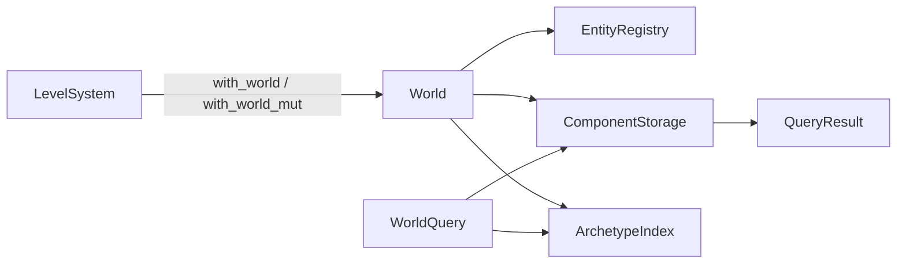

---
related_code:
  - zircon_runtime/src/scene/world/world.rs
  - zircon_runtime/src/scene/world/typed_api.rs
  - zircon_runtime/src/scene/ecs/query/mod.rs
  - zircon_runtime/src/scene/ecs/entity/mod.rs
  - zircon_runtime/src/scene/level_system.rs
implementation_files:
  - zircon_runtime/src/scene/world/world.rs
  - zircon_runtime/src/scene/world/typed_api.rs
plan_sources:
  - user: 2026-09-09 场景与资产公开接口详细 Wiki
tests:
  - zircon_runtime/src/scene/inspection/tests.rs
  - zircon_runtime/src/scene/world/generation/tests.rs
doc_type: module-detail
---

# World、Entity 与查询

`World` 是 ZirconEngine 场景运行时的持久状态容器。它保存实体、组件、资源、层级、事件、观察者、调度器和变更 tick；`LevelSystem` 在此之上提供可替换世界、生命周期和渲染提取边界。公开 API 的核心原则是：实体 ID 只在所属 World 内有意义，结构变更必须经过 World 的事务/命令入口，查询结果只在借用生命周期内有效。

## 心智模型



实线箭头表示拥有或同步借用，虚线表示查询计划读取。`World::clone` 会重建实体索引与组件投影，并清空运行时同步 sink；因此 clone 适合 staging，不等价于共享 live world。

## 创建与实体生命周期

```rust
use zircon_runtime::scene::{World, NodeKind};

let mut world = World::default();
let root = world.spawn_node(NodeKind::Scene).expect("spawn");
let child = world.spawn_node(NodeKind::Mesh).expect("spawn");
world.set_parent_checked(child, Some(root))?;
assert!(world.contains_entity(root));
```

常用生命周期操作包括 `contains_entity(EntityId)`、实体生成/销毁命令、`commands()`、`apply_deferred()` 和 `has_deferred_commands()`。工作线程只能写入 `WorkerCommandBuffer` 或 `Commands`，不能直接持有 `&mut World`；主线程在定义好的 schedule 阶段合并命令。

| 接口 | 契约 | 失败或边界 |
| --- | --- | --- |
| `World::component_id<T>()` | 惰性注册 Rust component，返回稳定的本 World `ComponentId` | 不要跨 World 缓存 ID |
| `World::registered_component_id<T>()` | 只查询，不注册 | 未注册返回 `None` |
| `World::insert<T>(entity, value)` | 插入或替换组件，返回旧值 `Option<T>` | entity 不存在返回 `SceneError` |
| `World::get<T>(entity)` | 只读借用 | 组件缺失返回 `None` |
| `World::get_mut<T>(entity)` | 可变借用并标记 changed | 借用冲突由 Rust 类型系统阻止 |
| `World::remove<T>(entity)` | 移除并返回旧值 | 未注册/未拥有组件返回 `None` 或错误 |

## 查询路径

缓存查询应使用 `QueryState`/`CachedQueryIter`（具体构造函数以 `scene::ecs::query` 导出为准），一次解析 archetype 计划后重复执行。临时诊断可直接使用 `WorldQuery` 与 `LevelSystem::query_world`。

```rust
use zircon_runtime_interface::world_sync::{ComponentSelector, QueryFilter, WorldQuery};

let query = WorldQuery {
    filters: vec![QueryFilter::with_components(vec![
        ComponentSelector::new("zircon_runtime::scene::components::Name"),
    ])],
    ..Default::default()
};
let result = level.query_world(&query);
for row in result.entities() {
    tracing::debug!(entity = row.entity_id(), "matched entity");
}
```

查询访问分为只读、单实体、many、组合和缓存路径。使用 `QueryState` 时，应在组件注册完成后建立缓存；新增组件类型会推进 registry generation，旧计划需要重新验证。查询的稳定顺序由 `StableQueryOrderIndex` 提供，不应依赖底层 table 的物理顺序。

## 结构变更与 deferred commands

`insert`、`remove`、spawn/despawn 会改变 archetype；系统正在迭代查询时应把结构修改排入 `Commands`。`World::apply_deferred` 返回 `DeferredCommandReport`，其中的错误应进入诊断，不应静默丢弃。

```rust
let mut commands = world.commands();
// commands.spawn(...); commands.entity(entity).insert(...); // 以当前 facade 导出为准
drop(commands);
let report = world.apply_deferred();
if report.error_count() > 0 {
    tracing::warn!(?report, "deferred scene commands failed");
}
```

## 变更检测

`World::read_change_tick`、`last_change_tick`、`clear_trackers` 和 `component_change_ticks<T>` 构成读取窗口。`Ref<T>` 提供 `is_added`、`is_changed`、`last_changed`；`Mut<T>` 在 `as_mut`、`into_inner`、DerefMut 或显式 `set_changed` 时记录变更。

不要为了读取而调用 `get_mut`，否则会产生假的 changed。跨帧系统应在 schedule 完成后消费变更，并在合适的帧边界调用 `clear_trackers`。

## LevelSystem 边界

`LevelSystem::with_world` 和 `with_world_mut` 是线程安全的闭包入口；`snapshot()` 返回持久世界副本；`replace` 替换世界但保留部分运行态，`replace_world_and_reset_runtime_state` 同时清理 runtime 状态。替换前可用 `capture_world_replacement_epoch`，再用 `with_world_mut_if_replacement_epoch` 防止旧任务覆盖新世界。

```rust
let epoch = level.capture_world_replacement_epoch();
let applied = level.with_world_mut_if_replacement_epoch(epoch, |world| {
    world.insert(entity, component).is_ok()
});
```

## 性能与线程

1. 缓存查询状态，避免每帧重新计算 archetype 过滤。
2. 批量结构修改，减少 table row 搬迁次数。
3. 工作线程写 command buffer，主线程统一 merge，避免锁住 World。
4. 使用 `EcsFramePerformanceDiagnostics` 观察 query、archetype 和 change detection 扫描量。
5. 大场景优先按稳定组件集合拆分查询，避免动态 component 的全量扫描。

## 常见错误

- 将另一个 World 的 `EntityId` 传入当前 World，结果通常是 missing entity。
- 在查询迭代中直接插入/移除组件，触发借用或 deferred 错误。
- 保存 `&T` 到下一帧，违反 World 借用生命周期。
- 把 `World::clone` 当作并发快照；clone 是 CPU 投影重建，且不携带 live subscriptions。
- 忽略 `DeferredCommandReport`，导致实体引用解析失败却没有可观测信号。

## 检查清单

- [ ] 所有 EntityId 都带所属 World/Level 上下文。
- [ ] 结构变更只发生在安全阶段。
- [ ] 查询缓存与 component registry generation 一致。
- [ ] changed/added 读取使用正确 ChangeTickWindow。
- [ ] 世界替换任务校验 replacement epoch。
- [ ] 性能诊断已采样并设置合理 archetype/query 上限。

## 源码与测试

- [World 实现](https://github.com/He-Jiahui/ZirconEngine/blob/main/zircon_runtime/src/scene/world/world.rs)
- [类型化组件 API](https://github.com/He-Jiahui/ZirconEngine/blob/main/zircon_runtime/src/scene/world/typed_api.rs)
- [查询模块](https://github.com/He-Jiahui/ZirconEngine/blob/main/zircon_runtime/src/scene/ecs/query/mod.rs)
- [World generation 测试](https://github.com/He-Jiahui/ZirconEngine/blob/main/zircon_runtime/src/scene/world/generation/tests.rs)

## 字段级契约

| 字段/索引 | 语义 | 是否持久化 |
| --- | --- | --- |
| `entities` | 稳定遍历顺序的实体 ID | 是（实体核心） |
| `entity_dense_rows` | ID 到 dense row 的运行时索引 | 否，解码后重建 |
| `component_registry` | Rust/dynamic 描述与 storage type | schema 部分持久化 |
| `component_storage` | sparse-set 数据与 ticks | 数据持久化，索引重建 |
| `archetype_index` | table 签名到 rows | 否 |
| `world_generation` | 派生状态代数 | 否，替换时推进 |
| `change_tick` | 当前写入 tick | 会话态 |
| `command_queue` | deferred 命令 | 不应持久化 |

## 查询选择指南

| 需求 | 首选 API | 原因 |
| --- | --- | --- |
| 单实体读 | `get::<T>` | 无查询计划开销 |
| 单实体写 | `get_mut::<T>` | 自动 changed 跟踪 |
| 每帧批量读 | `query::<D>` 缓存 `QueryState` | 复用 archetype 计划 |
| 动态类型检查 | `contains_component_id` | 不需要 Rust TypeId |
| 宿主检查 | `LevelSystem::query_world` | 跨线程闭包安全 |
| 结构批处理 | `commands()` | 延迟到安全阶段 |

## 两个完整调用片段

```rust
fn move_named(world: &mut World, name: &str, dx: f32) -> anyhow::Result<()> {
    let entity = world
        .stable_entity_ids()
        .find(|id| world.get::<Name>(*id).is_some_and(|n| n.as_str() == name))
        .ok_or_else(|| anyhow::anyhow!("entity not found"))?;
    let mut local = world
        .get_mut::<LocalTransform>(entity)
        .ok_or_else(|| anyhow::anyhow!("missing transform"))?;
    local.translation.x += dx;
    Ok(())
}
```

```rust
fn remove_expired(world: &mut World, expired: &[EntityId]) {
    let mut commands = world.commands();
    for entity in expired {
        commands.entity(*entity).despawn();
    }
    drop(commands);
    let report = world.apply_deferred();
    tracing::debug!(errors = report.error_count(), "despawn batch applied");
}
```

## 状态与错误转移

```text
Absent --spawn_node--> Alive
Alive --insert/remove--> Alive(new archetype)
Alive --commands--> Queued --apply_deferred--> Alive/Failed
Alive --remove_entity--> Despawned
Despawned --any direct access--> missing_entity
World clone --> StagingWorld (new indexes, no live sink)
```

`Failed` 只表示单条 deferred command 失败，不会自动回滚同一批次的其他命令；需要业务层读取 report 并决定补偿。

## 测试矩阵

- 实体 ID 分配、删除和 stable order。
- table/sparse 混合组件查询。
- 同一实体 insert 替换与 remove 返回旧值。
- deferred spawn token 解析和错误报告。
- World clone 后索引可用且 subscriptions 不泄漏。
- replacement epoch 拒绝旧任务写入。

## API 兼容性说明

`EntityId` 是 `u64` 类型别名，不携带 generation；销毁后复用 ID 的风险由 EntityRegistry 内部 stable location 约束。跨系统传递实体时同时传 world handle 或 replacement epoch。`NodeId` 当前等同于 `EntityId`，但文档和业务接口应使用语义更明确的别名。

`LevelSystem::snapshot` 是一致性快照入口；若需要 live 观察，请注册 `WatchRegistration` 并消费 `InvalidationBatch`。快照不包含订阅连接、worker task 和渲染 GPU 状态。

## 诊断与可观测性

把 `World::world_generation`、query cache hit/miss、deferred command count、archetype assignment count 和 `ChangeDetectionScanStats` 写入同一帧 trace。发现查询突然变慢时，先检查 component registry generation 是否频繁变化，再检查动态组件比例。

## 场景案例：运行时生成一组实体

以下是推荐的两阶段写法。第一阶段只创建实体和静态组件，第二阶段设置层级和资源引用；这样可以避免 forward reference 和重复 archetype 迁移。

```rust
let mut spawned = Vec::with_capacity(64);
for index in 0..64 {
    let entity = world.spawn_node(NodeKind::Mesh)?;
    world.insert(entity, Name::new(format!("Enemy_{index}")))?;
    world.insert(entity, LocalTransform::default())?;
    spawned.push(entity);
}
for (index, entity) in spawned.iter().copied().enumerate() {
    if index > 0 {
        world.set_parent_checked(entity, Some(spawned[0]))?;
    }
}
```

不要在第一轮循环中调用渲染提取或读取 world matrix；派生状态应在 scene schedule 完成后读取。

## 场景案例：查询并安全删除

查询阶段先收集 ID，删除阶段再提交 deferred 命令。这样不会使 query iterator 观察到正在移动的 table row。

```rust
let doomed: Vec<EntityId> = world
    .stable_entity_ids()
    .filter(|id| world.get::<ActiveSelf>(*id).is_some_and(|active| !active.get()))
    .collect();
let mut commands = world.commands();
for id in doomed {
    commands.entity(id).despawn();
}
drop(commands);
let report = world.apply_deferred();
if report.error_count() != 0 { tracing::warn!(?report); }
```

## API 约束详表

| 约束 | 解释 |
| --- | --- |
| World 借用不跨 await | `with_world_mut` 闭包内不能保存引用到异步任务 |
| QueryState 与 World 配套 | state 建立于一个 World，不能跨 World 复用 |
| EntityId 与 generation | ID 本身不含 generation，业务必须携带 World/epoch |
| snapshot 与 live world | snapshot 是 clone，不会转发后续 mutation |
| commands 合并顺序 | 由 schedule stage 和 plan_order 决定，不保证提交即刻可见 |

## 调试问答

**为什么 `get::<T>` 返回 None？** 先确认 entity 属于当前 World，再确认 `registered_component_id::<T>` 非 None，最后确认实体 archetype 是否含该组件。

**为什么 changed 每帧都为 true？** 检查系统是否无条件调用 `get_mut`、DerefMut 或 `set_changed`；只读逻辑改用 `get`/`Ref`。

**为什么删除后层级残留？** `remove_entity` 会使直接子节点 orphan；若需要整棵子树删除，必须先获取 `subtree_records` 或子树 ID，再按逆拓扑顺序提交命令。

## 接受标准

- 结构修改后下一查询能看到新 archetype。
- 销毁实体不会被后续查询返回。
- clone/snapshot 不会向 live subscription 发送事实。
- stale replacement epoch 写入返回 false。
- diagnostics 能定位 deferred 命令失败实体。
