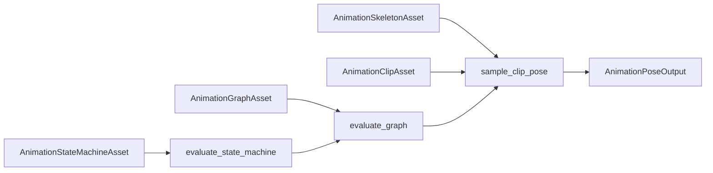

---
related_code:
  - zircon_runtime/src/animation/manager/mod.rs
  - zircon_runtime/src/animation/manager/graph.rs
  - zircon_runtime/src/animation/manager/state_machine.rs
  - zircon_runtime/src/core/framework/animation/mod.rs
implementation_files:
  - zircon_runtime/src/animation/manager
  - zircon_runtime/src/core/framework/animation
plan_sources:
  - user: 2026-09-09 扩展脚本、反射、动画与导航公开接口文档
tests:
  - zircon_runtime/src/animation/manager/pose/performance_tests.rs
  - zircon_runtime/src/animation/manager/graph.rs
  - zircon_runtime/src/animation/manager/state_machine.rs
doc_type: module-detail
---

# 动画 Asset、Graph 与 State Machine

## 数据模型

动画运行时消费四类资产：`AnimationSkeletonAsset` 定义骨骼与绑定姿态，`AnimationClipAsset` 保存轨道，`AnimationGraphAsset` 组合 clip/blend/additive/mask，`AnimationStateMachineAsset` 根据参数选择 graph。`DefaultAnimationManager` 实现 `AnimationManager` trait，负责参数默认值、图评估、状态机评估和 pose 采样。



## manager API

```rust
use zircon_runtime::animation::DefaultAnimationManager;
use zircon_runtime::core::framework::animation::AnimationManager;

let manager = DefaultAnimationManager::default();
let defaults = manager.parameter_defaults(&graph);
let evaluation = manager.evaluate_graph(&graph, &defaults);
let state = manager.evaluate_state_machine(&machine, Some("Locomotion"), &defaults);
let pose = manager.sample_clip_pose(&skeleton, &clip, 0.25, true)?;
```

`new(core)` 会尝试从 `animation.playback_settings` 加载配置；`store_playback_settings` 更新内存并在有 Core 时持久化。锁中毒会恢复内部值，但业务仍应避免在回调中递归调用 manager。

## Graph 语义

`evaluate_graph` 先合并 graph 参数默认值，再忽略非 finite override。Output 节点决定入口；循环引用通过 visited 集合截断。节点行为：

| 节点 | 规则 |
| --- | --- |
| Clip | 产生一个 `AnimationGraphClipInstance`，包含 speed、looping、weight=1 |
| Blend | scalar clamp 到 0..1，第一个输入权重为 `1-scalar`，其余平分 scalar |
| Additive | additive clip 的 blend mode 为 Additive，权重乘参数 |
| Mask | 将 target id 传递给子图 |
| Output | 只作为 source 选择，不产生 clip |

未知节点、缺少 output 或循环路径返回空 clip 列表，不 panic。mask target id 按首次出现顺序去重。

## State machine 语义

`evaluate_state_machine` 根据 `AnimationParameterMap` 检查 transition 条件：Equal/NotEqual/Greater/GreaterEqual/Less/LessEqual/Triggered。参数或条件值为 NaN/Infinity 时条件不匹配。有限 duration 产生 transition evaluation；零 duration 立即切换 active state。返回 `transitioned`、`active_state`、`graph` 和可选 transition。

## 采样约束

`sample_clip_pose` 要求 skeleton 与 clip 轨道可匹配；`time_seconds` 根据 looping 规则归一化。缺失轨道会返回 `AnimationResult` 错误或诊断，不能假定所有骨骼都有关键帧。四元数插值需保持单位长度，数值异常应回退到安全姿态。

## 设计取舍

- Unreal AnimGraph 依赖运行时节点对象；Zircon graph 使用资产 DTO，便于热重载和序列化。
- Godot AnimationTree 常在节点上写状态；Zircon 把参数和值快照分开，适合多 World 并行评估。
- Bevy 的 ECS 动画组件偏数据驱动；Zircon manager 通过 trait 保留插件替换点。

## 性能与线程

Graph evaluation 不修改资产，适合在 worker 线程执行；参数 map 由调用方独占。避免每帧重建大 graph，缓存 asset handle 和 normalized track path。大型 mask 目标使用预留 HashSet 路径；不要改回 O(n²) 的 Vec contains。pose 输出应在 render extract 前完成所有写入。

## 负例

```rust
// 错误：把 NaN 当作有效速度，导致图评估传播异常。
overrides.insert("speed".into(), AnimationParameterValue::Float(f32::NAN));
// manager 会忽略该 override，应由调用方先报告输入错误。
```

## 验收清单

- [ ] graph 具有唯一 Output 节点和无循环连接。
- [ ] 所有参数 override 先做 finite 校验。
- [ ] state transition 对 Triggered 与数值比较分开测试。
- [ ] clip、skeleton、轨道缺失可诊断且不 panic。
- [ ] 评估路径不修改共享资产。

## 源码与测试

- [manager](https://github.com/He-Jiahui/ZirconEngine/blob/main/zircon_runtime/src/animation/manager/mod.rs)
- [graph evaluation](https://github.com/He-Jiahui/ZirconEngine/blob/main/zircon_runtime/src/animation/manager/graph.rs)
- [state machine](https://github.com/He-Jiahui/ZirconEngine/blob/main/zircon_runtime/src/animation/manager/state_machine.rs)
- [framework contracts](https://github.com/He-Jiahui/ZirconEngine/blob/main/zircon_runtime/src/core/framework/animation/mod.rs)

## 资产字段与生命周期

| 资产 | 关键字段 | 加载后用途 | 失效条件 |
| --- | --- | --- | --- |
| skeleton | bones, bind pose, parent index | pose 输出 | skeleton revision 变化 |
| clip | tracks, duration, events | 时间采样 | clip revision 变化 |
| graph | nodes, output, parameters | 混合评估 | graph topology 变化 |
| state machine | states, transitions | graph 选择 | transition schema 变化 |

资产引用应通过 `AssetReference`/project asset manager 获取；不要把路径字符串当作已加载对象。加载失败时保留 locator 和错误原因，直到用户修复资产。

## 参数 API 细节

`parameter_defaults` 返回 graph 声明的初始 map；`parameter_value` 按名称读取；`set_parameter` 写入值。Float、Int、Bool、Trigger 等类型不可隐式互换；未知参数可以被忽略但必须产生日志。权重与速度在 evaluation 内 clamp/finite 校验。

## 状态迁移策略

保存 state machine 时记录 active state 名称和参数 map。reload 后若 state 不存在，回退默认 state；transition duration 取新资产值。Trigger 不跨 reload 保留，避免旧事件重复消费。

## 测试清单

| 类别 | 用例 |
| --- | --- |
| graph | 缺 output、循环节点、mask 去重 |
| blend | 0/1/中间权重、多输入 |
| additive | 缺参数、负权重、finite |
| state | 每个比较运算符、zero duration |
| pose | 缺轨道、四元数、loop 边界 |
| config | poisoned lock、持久化失败 |

## 调试视图

编辑器应展示 active state、transition、每个 clip 的 weight/speed/target ids，以及被忽略的非 finite 参数。调试输出引用 asset locator 和 revision，而不是内存地址。

## 生产发布

导出前预加载 skeleton/clip/graph 依赖并验证 track path；把缺失轨道作为构建警告或错误策略固定下来。服务器 profile 可保留参数评估但跳过 GPU pose upload。
