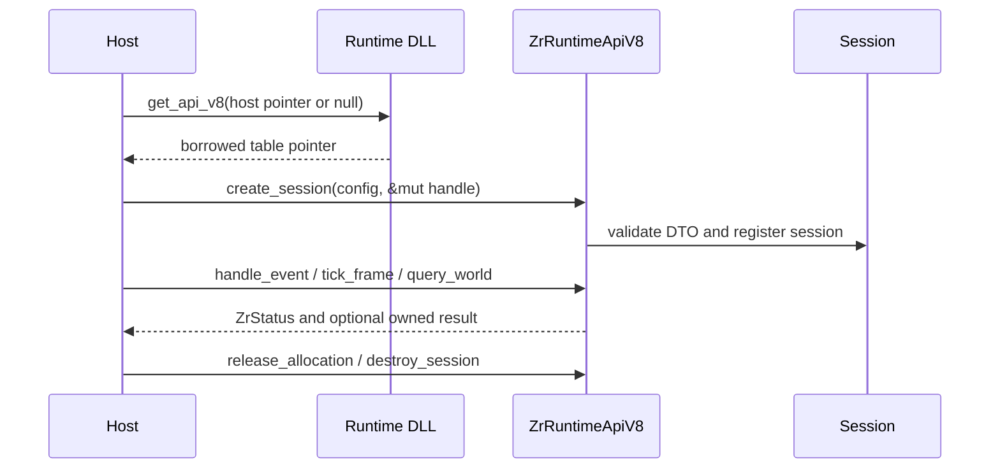

---
related_code:
  - zircon_runtime/src/dynamic_api/exports.rs
  - zircon_runtime/src/dynamic_api/session/ffi.rs
  - zircon_runtime/src/dynamic_api/session/linked_session.rs
  - zircon_runtime_interface/src/runtime_api/abi/api_table.rs
  - zircon_runtime_interface/src/runtime_api/abi/api_shape.rs
  - zircon_runtime_interface/src/runtime_api/abi/host_api_shape.rs
  - zircon_runtime_interface/src/runtime_api/session/session.rs
  - zircon_runtime_interface/src/runtime_api/frame/frame_demand.rs
  - zircon_runtime_interface/src/world_sync/query.rs
  - zircon_runtime_interface/src/world_sync/watch.rs
  - zircon_runtime_interface/src/buffer.rs
implementation_files:
  - zircon_runtime/src/dynamic_api
  - zircon_runtime_interface/src/runtime_api
  - zircon_runtime_interface/src/world_sync
plan_sources:
  - user: 2026-09-09 扩展脚本、反射、动画与导航公开接口文档
  - docs/plans/mvp/index.md
tests:
  - zircon_runtime/src/dynamic_api/tests/api_table.rs
  - zircon_runtime/src/dynamic_api/tests/session_entry_points.rs
  - zircon_runtime/src/dynamic_api/tests/session_lifecycle.rs
  - zircon_runtime_interface/src/runtime_api/abi/api_shape_tests.rs
doc_type: module-detail
---

# Dynamic API V8 与脚本调用边界

## 定位

`zircon_runtime_get_api_v8` 是 runtime 动态库的 C ABI 入口。它返回一张
`ZrRuntimeApiV8` 函数表；这张表是 `#[repr(C)]` 数据记录，不是带有 Rust
method 的对象。宿主、编辑器和脚本桥接层都必须通过表中的函数指针调用
runtime，不能把它当作 `RuntimeSession`、Rust trait 或高层 client。

当前边界是同一 BuildSet 内的 lockstep ABI，不是面向不相关第三方的长期
兼容协议。跨边界只能使用固定布局 DTO、opaque 整数句柄、`ZrByteSlice` 和
`ZrStatus`；Rust `String`、`Vec`、trait object、allocator 或 ECS/GPU 对象
不得直接穿过边界。



## 表头、握手与生命周期

表头只有两个元数据字段：

| 字段 | 约束 |
| --- | --- |
| `abi_version: u32` | 必须等于 `ZIRCON_RUNTIME_API_VERSION_V8` |
| `size_bytes: usize` | 必须精确等于 `size_of::<ZrRuntimeApiV8>()` |

V8 的字段顺序和尺寸已经冻结。当前实现不接受“较短表再读取已知前缀”，
也没有可供宿主读取的动态 feature-flags 字段；增加字段必须发布新的表版本
并协调 host/runtime 的 BuildSet。`validate_runtime_api_v8_shape` 只检查上述
版本和精确尺寸，不能替代以下检查：

- 在解引用外部表指针前检查空指针和对齐；
- 逐项确认 required function slot 非 `None`；
- 确认动态库 sidecar、架构和 BuildSet 身份；
- 在动态库 owner 存活期间使用所有函数指针。

入口的参数类型和返回类型是真实的 C ABI 签名：

```rust
pub type ZrRuntimeGetApiFnV8 = unsafe extern "C" fn(
    *const ZrHostApiV1,
) -> *const ZrRuntimeApiV8;
```

`host` 可以传 `null`，表示没有宿主回调；也可以传一个完整的
`ZrHostApiV1`。非空表必须满足 V1 的对齐、版本和精确尺寸约束。生产环境
应使用 `zircon_app::entry::runtime_library::LoadedRuntime`，它还负责保留
`libloading::Library` owner 和验证 required slots。

### C ABI 表的 Rust 调用形状

下面是宿主侧的最小调用形状。它是“如何调用字段”的示例，不是给
`ZrRuntimeApiV8` 添加方法；`HostError` 等工程错误包装被省略。`ptr::read`
前提是 loader 已证明该外部地址在本次调用期间可读，且复制出的函数指针
仍然由动态库 owner 保活。

```rust
use core::{mem::align_of, ptr};
use zircon_runtime_interface::runtime_api::{
    validate_runtime_api_v8_shape, ZrHostApiV1, ZrRuntimeApiV8, ZrRuntimeGetApiFnV8,
};
use zircon_runtime_interface::ZIRCON_RUNTIME_ABI_VERSION_V1;

fn acquire_api(get_api: ZrRuntimeGetApiFnV8) -> Result<ZrRuntimeApiV8, &'static str> {
    let host = ZrHostApiV1::empty(ZIRCON_RUNTIME_ABI_VERSION_V1);
    let foreign = unsafe { get_api(&host) };
    if foreign.is_null() {
        return Err("runtime rejected the host table");
    }
    if (foreign as usize) % align_of::<ZrRuntimeApiV8>() != 0 {
        return Err("runtime API table is misaligned");
    }

    // The dynamic library must remain loaded after this copy: function pointers
    // are code addresses, not self-contained Rust values.
    let api = unsafe { ptr::read(foreign) };
    validate_runtime_api_v8_shape(&api).map_err(|_| "runtime API V8 shape mismatch")?;
    if api.create_session.is_none() || api.destroy_session.is_none() {
        return Err("required session slot is missing");
    }
    Ok(api)
}
```

上例中的 `api.create_session` 是读取 `Option<extern "C" fn>` 字段；正确的
调用方式是先取出函数指针，再在 `unsafe` 块内传入 ABI DTO。不存在
`api.validate_version(...)`、`api.session_start(...)` 或
`api.create_linked_runtime_session(...)` 这类 Rust 方法。后者是另一个
仅供静态链接场景使用的 free function，见下节。

## `ZrRuntimeApiV8` 槽位

当前表包含 2 个表头字段和 26 个函数槽。required 槽位缺失时 loader 必须
拒绝整个表；optional 槽位缺失时只关闭对应能力。

### Required 槽位

| 槽位 | C ABI 签名摘要 | 作用 |
| --- | --- | --- |
| `create_session` | `(ZrRuntimeSessionConfigV3, *mut ZrRuntimeSessionHandle) -> ZrStatus` | 校验配置并创建会话 |
| `destroy_session` | `(ZrRuntimeSessionHandle) -> ZrStatus` | 关闭并回收会话 |
| `release_allocation` | `(SessionHandle, AllocationId) -> ZrStatus` | 释放 runtime-owned 输出 |
| `handle_event` | `(SessionHandle, ZrRuntimeEventV1) -> ZrStatus` | 输入、窗口和宿主结果事件 |
| `capture_frame` | `(SessionHandle, FrameRequestV1, *mut FrameV2) -> ZrStatus` | 受预算限制的离屏帧 |
| `submit_highlight_set` | `(SessionHandle, HighlightSetV1) -> ZrStatus` | 提交实体高亮集合 |
| `tick_frame` | `(SessionHandle, *mut FrameDemandV1) -> ZrStatus` | 推进 runtime schedule |
| `subscribe_plugin_event` | `(SessionHandle, ZrByteSlice, *mut SubscriptionHandle) -> ZrStatus` | 建立插件事件订阅 |
| `unsubscribe_plugin_event` | `(SessionHandle, SubscriptionHandle) -> ZrStatus` | 撤销插件事件订阅 |
| `drain_plugin_events` | `(SessionHandle, SubscriptionHandle, *mut OwnedResultV2) -> ZrStatus` | 取出一页事件 JSON |
| `submit_operation` | `(SessionHandle, ZrByteSlice, *mut OperationHandle) -> ZrStatus` | 提交有界长操作 |
| `poll_operation` | `(SessionHandle, OperationHandle, *mut OperationStatusV2) -> ZrStatus` | 读取无分配进度快照 |
| `harvest_operation` | `(SessionHandle, OperationHandle, *mut OwnedResultV2) -> ZrStatus` | 取回终态结果 |
| `query_world` | `(SessionHandle, ZrByteSlice, *mut OwnedResultV2) -> ZrStatus` | 查询 runtime world |
| `watch_world` | `(SessionHandle, ZrByteSlice, *mut WatchToken) -> ZrStatus` | 注册 world watch |
| `unwatch_world` | `(SessionHandle, WatchToken, *mut u8) -> ZrStatus` | 撤销 watch，写回是否移除 |
| `drain_world_invalidations` | `(SessionHandle, *mut OwnedResultV2) -> ZrStatus` | 取出失效批次 |
| `request_viewport_pick` | `(SessionHandle, PickRequestV1, *mut PickTicket) -> ZrStatus` | 排队视口拾取 |
| `poll_viewport_pick` | `(SessionHandle, PickTicket, *mut PickResultV1) -> ZrStatus` | 读取拾取结果 |
| `cancel_viewport_pick` | `(SessionHandle, PickTicket) -> ZrStatus` | 取消拾取 |

### Optional 槽位

| 槽位 | 能力规则 |
| --- | --- |
| `capture_accessibility_tree` | 缺失时不暴露 accessibility tree，不伪造成功空树 |
| `bind_viewport_surface`、`unbind_viewport_surface`、`present_viewport` | 三个槽必须同时存在才形成 native-present 能力，否则走 `capture_frame` 或软件 presenter |
| `profile_control` | 缺失时禁用 profiling/diagnostics 控件 |
| `drain_host_requests` | 缺失时不执行 runtime 到 host 的反向请求泵 |

`Option<fn>` 只是 C-compatible 的空槽表达。宿主只能在读取能力矩阵后
调用存在的 optional slot；不能把 `None` 当作成功结果，也不能在运行期间
替换表中的函数指针。

## 创建、推进与销毁 Session

### 配置 DTO

`create_session` 使用 `ZrRuntimeSessionConfigV3`，其字段不是 JSON：

```rust
#[repr(C)]
pub struct ZrRuntimeSessionConfigV3 {
    pub abi_version: u32,
    pub profile: ZrByteSlice,
    pub project_root: ZrByteSlice,
    pub play_scene: ZrByteSlice,
    pub play_report_pipe: ZrByteSlice,
    pub wake_sink: ZrRuntimeWakeSinkV1,
}
```

`profile` 支持 `runtime`（空 profile 也默认为它）、
`runtime-pipelined`、`editor`、`dev`、`minimal` 和 `headless`。路径字段是
项目启动配置：`project_root` 为物理根锚点，`play_scene` 和
`play_report_pipe` 需要项目根且按项目相对规则解析。`wake_sink` 要么完全
禁用（token 为 0 且 callback 为 `None`），要么完整注册；callback 必须快速
返回，不能在 callback 内同步销毁同一 session。

### 真实的字段调用示例

下例展示一个无项目、headless session 的创建、单帧推进和销毁。它使用的
每一个调用都对应表中的函数指针；`check_status` 只是宿主自己的错误包装。

```rust
use zircon_runtime_interface::{
    ZrByteSlice, ZrRuntimeApiV8, ZrRuntimeFrameDemandV1,
    ZrRuntimeSessionConfigV3, ZrRuntimeSessionHandle, ZrRuntimeWakeSinkV1,
    ZIRCON_RUNTIME_ABI_VERSION_V3,
};

fn slice(bytes: &[u8]) -> ZrByteSlice {
    ZrByteSlice { data: bytes.as_ptr(), len: bytes.len() }
}

fn check_status(status: zircon_runtime_interface::ZrStatus) -> Result<(), &'static str> {
    status.is_ok().then_some(()).ok_or("runtime call failed")
}

fn create_tick_destroy(api: &ZrRuntimeApiV8) -> Result<(), &'static str> {
    let create = api.create_session.ok_or("missing create_session slot")?;
    let config = ZrRuntimeSessionConfigV3 {
        abi_version: ZIRCON_RUNTIME_ABI_VERSION_V3,
        profile: slice(b"headless"),
        project_root: ZrByteSlice::empty(),
        play_scene: ZrByteSlice::empty(),
        play_report_pipe: ZrByteSlice::empty(),
        wake_sink: ZrRuntimeWakeSinkV1::disabled(),
    };

    let mut session = ZrRuntimeSessionHandle::invalid();
    check_status(unsafe { create(config, &mut session) })?;
    if !session.is_valid() {
        return Err("runtime returned an invalid session handle");
    }

    let tick = api.tick_frame.ok_or("missing tick_frame slot")?;
    let mut demand = ZrRuntimeFrameDemandV1::idle();
    check_status(unsafe { tick(session, &mut demand) })?;

    let destroy = api.destroy_session.ok_or("missing destroy_session slot")?;
    check_status(unsafe { destroy(session) })
}
```

`ZrRuntimeFrameDemandV1` 的 `kind` 由 runtime 写回，可表示 idle、immediate
或 after-delay；idle 是合法的“当前不要求下一帧”，不是错误。V8 没有单独
的 start/stop/status 槽：`create_session` 成功后即可把句柄交给
`tick_frame`、`handle_event` 等函数，结束时只调用 `destroy_session`。

销毁是有条件的：runtime 会等待活动调用和 wake callback 静止，且仍登记的
`ZrOwnedResultV2` allocation 会使销毁返回 `ZrStatusCode::Error`。宿主应先
撤销 watch、取消订阅/拾取、解绑 surface、释放所有 allocation，再重试
`destroy_session`。成功后再次使用该句柄或再次销毁通常得到
`ZrStatusCode::NotFound`；句柄数值是 opaque identity，宿主不得自行推断
其是否会复用。

### 仅静态链接可用的 Rust helper

`create_linked_runtime_session` 位于 `zircon_runtime::dynamic_api`，是 Rust
进程内 helper，不是 `ZrRuntimeApiV8` 的字段，也不经过动态库入口。它的真实
签名是：

```rust
pub fn create_linked_runtime_session(
    profile: &[u8],
    project_root: Option<&std::path::Path>,
    registrations: Vec<zircon_runtime::plugin::RuntimePluginRegistrationReport>,
) -> Result<zircon_runtime_interface::ZrRuntimeSessionHandle,
            zircon_runtime::dynamic_api::RuntimeDynamicSessionError>;
```

静态链接测试或同进程工具可以这样调用：

```rust
use std::path::Path;
use zircon_runtime::dynamic_api::create_linked_runtime_session;
use zircon_runtime::plugin::RuntimePluginRegistrationReport;

let project_root: Option<&Path> = None;
let registrations: Vec<RuntimePluginRegistrationReport> = collect_registrations();
let session = create_linked_runtime_session(b"headless", project_root, registrations)?;
```

这个 helper 的 `profile` 是字节串，`project_root` 是 `Option<&Path>`，第三
个参数是插件注册报告；它不是 `project_utf8/profile_json` 两个参数的组合。
helper 成功后返回可交给实际 API 函数字段的句柄，但仍需通过表中的
`tick_frame` 和 `destroy_session` 管理该句柄。动态 loader 不应依赖这个
helper 来替代 C ABI 握手。

## `ZrByteSlice`、JSON 与 owned result

### Borrowed 输入

`ZrByteSlice` 只有 `data: *const u8` 和 `len: usize`。非空 slice 的内存必须
在整个同步调用返回前保持可读；runtime 不会替宿主延长它的生命周期。`len`
为零时允许 `data == null`；非零长度的空指针、超过地址空间的长度或超过
该槽位固定上限的长度都会被拒绝。JSON 槽位需要非空、有效 JSON；事件等
非 JSON DTO 则按各自的 ABI 字段校验。

runtime 内部使用 bounded JSON 解码器，宿主不能通过 API 请求任意更大的
deadline、深度或 item 上限。当前重要上限包括：

| 数据族 | 输入/输出上限 | 处理/项目约束 |
| --- | --- | --- |
| session profile | 64 bytes | UTF-8 profile 名称 |
| project path fields | 32 KiB | 根、Play scene、report pipe |
| world query | 输入 1 MiB，输出 1 MiB | 最多 16,384 items，25,000 us |
| world watch | 输入 256 KiB | 最多 1,024 items，10,000 us |
| operation | 输入/输出各 1 MiB | 最多 16,384 items，25,000 us |
| JSON nesting | - | 最大深度 128 |

超限通常映射为 `ZrStatusCode::LimitExceeded`，形状错误或 JSON 解码错误
映射为 `InvalidArgument`；`BoundedJsonError` 本身不会穿过 C ABI。宿主应在
失败时记录 `ZrStatus.diagnostics` 的字节副本，但不能假定它 NUL 结尾或一定
是 UTF-8。

### Runtime-owned 输出

查询、profile、插件事件、host request、operation harvest 和 world
invalidation 的结果使用：

```rust
#[repr(C)]
pub struct ZrOwnedResultV2 {
    pub data: *const u8,
    pub len: u64,
    pub allocation: ZrRuntimeAllocationId,
}
```

成功返回后，宿主必须先验证 `(data, len, allocation)` 的一致形状，再在
allocation 仍归属该 session 时读取/解码。读取完成后必须调用同一张表、同一
session 的 `release_allocation(session, output.allocation)`；不能调用 Rust
`free`、跨 session 释放或把 `data` 指针保存到释放之后。空结果的规范形状
是 null data、len 0 和 invalid allocation。

推荐的同步消费顺序是：

```text
call slot
  -> validate status and output carrier
  -> copy/decode data while allocation is live
  -> release_allocation(origin_session, allocation)
  -> publish the decoded host value
```

销毁前仍有 allocation 会阻止 teardown；重复释放、伪造 allocation id 或用
其他 session 释放会返回 `NotFound`，不应改变真正 owner 的 allocation census。

## 脚本、插件与长操作

脚本 host 通过 `submit_operation` 发送 JSON，而不是拼接命令字符串。当前
`ZrRuntimeOperationSubmitRequestV1` 的 envelope 字段是：

```json
{
  "abi_version": 1,
  "operation_id": "scene.load",
  "payload": {"path": "Scenes/Main.zrscene"}
}
```

session handle 在 C 函数参数中单独传入；`session_id`、通用 `request_id` 或
idempotency key 不是 V8 envelope 的固定字段，若业务 payload 需要它们应由
业务 schema 自己定义。提交成功得到 opaque operation handle：

1. `poll_operation(session, operation, &mut status)` 只写固定布局的阶段、
   进度和 detail，不转移结果所有权。
2. 只有 operation 到达 terminal phase 后才能调用
   `harvest_operation(session, operation, &mut owned)`。
3. harvest 返回的 `ZrOwnedResultV2` 按上一节解码并释放。

插件事件遵循相同原则：先通过 `subscribe_plugin_event` 取得订阅句柄，使用
`drain_plugin_events` 消费 owned JSON，最后调用 `unsubscribe_plugin_event`。
所有 subscription、operation、allocation 句柄都绑定创建它们的 session。

## World 查询、Watch 与失效通知

World 通道没有 `session.world()` 这样的对象层入口；宿主应把 JSON 编码的
DTO 放进表字段。`WorldQuery` 是 tagged enum，当前四种 variant 为
`Components`、`Hierarchy`、`InspectionFields` 和 `TransformSnapshot`。
组件查询的 Rust DTO 构造形状如下：

```rust
use zircon_runtime_interface::world_sync::{
    ComponentSelector, ComponentWorldQuery, QueryFilter, WorldQuery,
};

let query = WorldQuery::Components(ComponentWorldQuery {
    filter: QueryFilter {
        with: vec!["zircon.transform.Transform".into()],
        without: vec![],
    },
    select: vec![ComponentSelector::new("zircon.transform.Transform")],
    generation_hint: Some(last_generation),
});
let request_json = serde_json::to_vec(&query)?;
```

`query_world` 的调用仍然是字段函数：

```rust
use zircon_runtime_interface::{ZrByteSlice, ZrOwnedResultV2};

let query_world = api.query_world.ok_or("missing query_world slot")?;
let mut output = ZrOwnedResultV2::empty();
let status = unsafe {
    query_world(
        session,
        ZrByteSlice { data: request_json.as_ptr(), len: request_json.len() },
        &mut output,
    )
};
check_status(status)?;
// validate/decode output.data and output.len, then release output.allocation.
```

`generation_hint` 命中当前 generation 时结果可以是 `NotModified`；generation
不保证连续，宿主必须以返回值为准。`WorldQuery` 的筛选结构是公开 DTO
字段，不要自行发明 `WorldQuery::new`、`QueryFilter::all` 或额外 selector
字段。

Watch 的 JSON DTO 是 `WatchRegistration { key: WatchKey }`，例如：

```rust
use zircon_runtime_interface::world_sync::{WatchKey, WatchRegistration};

let registration = serde_json::to_vec(&WatchRegistration::new(
    WatchKey::WorldStructure,
))?;
let watch = api.watch_world.ok_or("missing watch_world slot")?;
let mut token = zircon_runtime_interface::world_sync::WatchToken::new(0);
check_status(unsafe {
    watch(
        session,
        ZrByteSlice { data: registration.as_ptr(), len: registration.len() },
        &mut token,
    )
})?;
```

成功后 token 只在创建它的 session 内有效。撤销必须调用
`unwatch_world(session, token, &mut removed)`；`removed != 0` 表示本次确实
移除了 live watch。runtime 产生的失效批次通过
`drain_world_invalidations(session, &mut owned)` 取得，空批次是合法状态，
消费后仍需释放 allocation。销毁 session 会同时废弃其所有 watch，因此
宿主应在正常 teardown 中显式 unwatch 并删除本地 token 映射。

## 输入、Host request 与呈现

- `handle_event(session, ZrRuntimeEventV1)` 是同步输入/窗口/宿主结果通道；
  event payload 只在调用期间借用。
- `tick_frame` 推进 runtime-owned schedule，并把下一帧需求写入
  `ZrRuntimeFrameDemandV1`；它不负责向宿主对象发送任何 Rust callback。
- `drain_host_requests` 是 optional 的 runtime-to-host JSON 请求泵，可承载
  clipboard、IME 或 gamepad rumble 等请求。宿主执行平台操作后，再按事件
  DTO 回送结果。
- native present 只有在 `bind_viewport_surface`、`unbind_viewport_surface`
  和 `present_viewport` 三个 optional 槽同时存在时才启用。surface 重建或
  窗口销毁前先 unbind；没有该能力时使用 `capture_frame` 和宿主 presenter。

## 状态码与失败处理

`ZrStatus` 由 `code: u32` 和 borrowed `diagnostics: ZrByteSlice` 组成。
未知 raw code 按 `Error` 处理，同时保留原始数值用于诊断。

| `ZrStatusCode` | 典型原因 | 宿主动作 |
| --- | --- | --- |
| `Ok` | 调用完成；可能伴随 owned output | 校验并消费/释放 output |
| `UnsupportedVersion` | 表、config 或 DTO 版本不匹配 | 拒绝该 provider，不猜测布局 |
| `InvalidArgument` | 空输出指针、坏 slice、非法 JSON/DTO | 修正输入并同步记录 diagnostics |
| `NotFound` | 未知/已关闭 session、allocation、watch 或 operation | 丢弃本地句柄，不重试同一句柄 |
| `CapabilityDenied` | 当前 profile/权限不允许能力 | 隐藏命令或请求授权 |
| `BridgeNotEnabled` | 可选平台 bridge 未启用 | 使用 capture/software fallback |
| `LimitExceeded` | 输入、输出、item 或处理预算超限 | 缩小 query/operation/watch |
| `Panic` | runtime 在 FFI 边界捕获 panic | 熔断该 session，清理后销毁 |
| `Error` | runtime/teardown 的一般失败 | 依据 diagnostics 决定清理或重试 |

这些状态码没有“session not running”或“stopped”枚举。句柄失效、销毁已
开始或资源不可用时，应按实际返回的 `NotFound`/`Error` 处理，而不是等待
一个未提供的 start 状态转换。

## 并发与所有权规则

API 表本身是只读的，但函数指针和 session 资源仍受动态库 owner 与 runtime
同步规则约束：

- `tick_frame`、`handle_event`、`destroy_session` 以及同一个可写 output
  carrier 不应并发写入；宿主通常为每个 session 建立串行 guard。
- query、poll 等是否可并行由 runtime 实现决定，不能从 `Option<fn>` 推断。
- 不要从 wake callback 内同步销毁相同 session，也不要在 library unload 后
  调用已缓存函数指针。
- session、watch token、operation、pick ticket 和 allocation 都是 opaque
  identity；跨 session 混用属于协议错误。

## 负例与验收清单

实现 host wrapper 或脚本 binding 时至少覆盖：

- 空 API 指针、未对齐指针、错误版本、非精确 `size_bytes` 和缺失 required
  slot 都在第一次业务调用前被拒绝；
- 非空 `ZrByteSlice` 的指针/长度、JSON 深度和各族 item/byte 上限被验证；
- 每个非空 `ZrOwnedResultV2` 恰好由 origin session 的 release slot 释放，
  重复或跨 session 释放得到 `NotFound`；
- destroy 在 outstanding allocation 或未静止 callback 时返回失败，清理后
  可重试，成功后旧句柄不再调用；
- watch token、operation handle、pick ticket 和 plugin subscription 不被
  跨 session 复用；
- optional surface/accessibility/profiling/host-request 能力缺失时走明确
  fallback，而不是伪造成功；
- 动态库 owner 在最后一个 session 销毁、所有 allocation 释放且无函数调用
  后才卸载。

## 源码与相关页面

- [runtime API table](https://github.com/He-Jiahui/ZirconEngine/blob/main/zircon_runtime_interface/src/runtime_api/abi/api_table.rs)
- [API shape validator](https://github.com/He-Jiahui/ZirconEngine/blob/main/zircon_runtime_interface/src/runtime_api/abi/api_shape.rs)
- [runtime export](https://github.com/He-Jiahui/ZirconEngine/blob/main/zircon_runtime/src/dynamic_api/exports.rs)
- [session FFI entry points](https://github.com/He-Jiahui/ZirconEngine/blob/main/zircon_runtime/src/dynamic_api/session/ffi.rs)
- [linked-session helper](https://github.com/He-Jiahui/ZirconEngine/blob/main/zircon_runtime/src/dynamic_api/session/linked_session.rs)
- [world query/watch DTOs](https://github.com/He-Jiahui/ZirconEngine/tree/main/zircon_runtime_interface/src/world_sync)
- [Runtime API V8 overview](../../app-runtime-api/reference/runtime-api-v8.md)
- [world query and watch reference](../../app-runtime-api/reference/world-query-watch.md)
