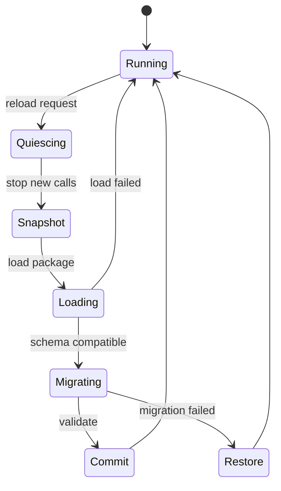

---
related_code:
  - zircon_runtime/src/script/vm/runtime/hot_reload_coordinator.rs
  - zircon_runtime/src/script/vm/plugin/state_migration.rs
  - zircon_runtime/src/script/vm/plugin/vm_state_blob.rs
  - zircon_runtime/src/script/vm/host_interface/registry.rs
implementation_files:
  - zircon_runtime/src/script/vm/runtime/hot_reload_coordinator
  - zircon_runtime/src/script/vm/plugin/state_migration.rs
  - zircon_runtime/src/script/vm/plugin/vm_state_blob.rs
plan_sources:
  - user: 2026-09-09 扩展脚本、反射、动画与导航公开接口文档
tests:
  - zircon_runtime/src/script/vm/runtime/hot_reload_coordinator/tests
  - zircon_runtime/src/script/vm/runtime/hot_reload_coordinator/tests/state_migration.rs
doc_type: workflow-detail
---

# 脚本热重载、状态迁移与诊断

## 生命周期

热重载必须在 frame 安全点完成：暂停新调用、保存旧 generation 的 callback/interface/reflection 快照、构建新 candidate、迁移状态、提交新 generation，失败时恢复旧快照。



## 状态 blob

`VmStateBlob` 以 `VM_STATE_SCHEMA_VERSION_V3` 标记格式，包含 `VmStateTypeIdentity`、`VmStateFieldValue` 和 `VmStateObject`。常用 API：`from_payload`、`from_json`、`to_json`、`from_reflected_objects`、`reflected_objects`、`validate_reflected`。`VmStateSchema` 通过 `from_json`/`to_json` 描述类型 hash 与字段。

```rust
let blob = VmStateBlob::from_reflected_objects(&objects)?;
blob.validate_reflected()?;
let json = blob.to_json()?;
// 新 generation 装载后：
let restored = VmStateBlob::from_json(&json)?;
```

示例展示调用形状；实际对象构造应来自 `VmReflectionCatalog` 当前 snapshot。不要手写 type hash，必须由 derive/schema 生成。

## 兼容性规则

迁移按 `ReflectTypePath` 和 `ReflectFieldId` 匹配，而不是 Rust 字段偏移。允许新增带默认值字段；删除/重命名字段需要显式迁移。type hash 改变且无迁移函数时返回 `VmStateMigrationError`。未知字段可保留在诊断中，但不能写入新对象。

## callback 与 host 恢复

`VmHostInterfaceRegistry::snapshot_generation` 保存某 slot/generation 的 callbacks、systems、behavior nodes、RPC 和 editor operations；`restore_generation` 在 reload 失败时恢复。新 generation 提交后，旧 `VmCallbackHandle` 必须通过 `resolve_callback(handle, active_generation)` 刷新。

## 诊断字段

每次 reload 记录 package name、slot、old/new generation、catalog revision、迁移对象数、丢弃字段数和失败阶段。用户可见错误应区分 load、reflection validation、state migration、commit conflict。日志中不要输出脚本 payload 或敏感参数。

## 并发约束

reload coordinator 只能在调度线程拥有执行权；后台线程可准备 bytes/schema，但不能直接修改 World、host registry 或 committed catalog。prepared reflection candidate 有 base epoch，commit 时若 epoch 已变化必须返回 stale 并重试。

## 安全策略

- 限制状态 blob 总字节、对象数和嵌套深度。
- 迁移函数禁止任意文件/网络访问。
- 失败默认回滚到旧 generation，而不是半应用新状态。
- GC 在 quiescing 后执行，避免回收仍被 callback 引用的对象。

## 负例

```text
错误流程：先 publish 新 reflection，再发现 state migration 失败。
结果：World 看到新类型但对象仍是旧布局，后续 callback 可能崩溃。
正确顺序：prepare -> validate -> migrate -> atomic commit。
```

## 验收清单

- [ ] reload 有 quiescing 安全点。
- [ ] state blob 校验版本、owner、type hash 和字段。
- [ ] commit conflict 会恢复旧 generation。
- [ ] 旧 callback handle 不可直接复用。
- [ ] 失败阶段和可恢复动作进入 diagnostics。

## 源码与测试

- [hot reload](https://github.com/He-Jiahui/ZirconEngine/blob/main/zircon_runtime/src/script/vm/runtime/hot_reload_coordinator.rs)
- [state blob](https://github.com/He-Jiahui/ZirconEngine/blob/main/zircon_runtime/src/script/vm/plugin/vm_state_blob.rs)
- [migration](https://github.com/He-Jiahui/ZirconEngine/blob/main/zircon_runtime/src/script/vm/plugin/state_migration.rs)
- [coordinator tests](https://github.com/He-Jiahui/ZirconEngine/tree/main/zircon_runtime/src/script/vm/runtime/hot_reload_coordinator/tests)

## 迁移字段规则

| 变化 | 默认动作 | 是否需人工 |
| --- | --- | --- |
| 新增可选字段 | 使用 default | 否 |
| 新增必填字段 | migration error | 是 |
| 字段重命名 | 依据旧 field id 映射 | 是 |
| 类型缩窄 | 拒绝或显式转换 | 是 |
| 类型扩宽 | 需检查溢出 | 通常是 |
| 删除字段 | 丢弃并记录 | 视业务 |
| plugin owner 改变 | 拒绝 | 是 |

## Coordinator 观测

`HotReloadCoordinator` 应暴露请求队列长度、当前阶段、最后成功 generation、GC 时间和 migration counters。开发工具可调用 `gc_step(VmGcBudget)` 获得 `VmGcStepReport`，生产环境使用固定预算并按帧采样。

## 回滚设计

回滚必须恢复：VM 实例、host callback table、systems/operations、reflection snapshot、state blob owner 和 active generation。只恢复其中一项会留下“类型已新、函数仍旧”的混合状态。

## 版本发布

插件 manifest 记录 schema version、backend selector、required capabilities 和 state migration version。升级前在 CI 用旧 blob fixtures 做 dry-run；无法迁移的版本应阻止发布，而不是运行时静默重置。

## 负面场景

- reload 请求在 quiescing 前重复到达：合并为一次并保留最新 payload。
- 新 package load 超时：取消 request，旧 generation 继续运行。
- GC budget 不足：报告 partial，下一帧继续，不强制完整回收。
- catalog commit stale：丢弃 candidate，重新 prepare。
